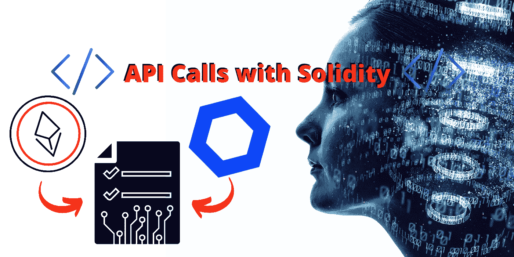
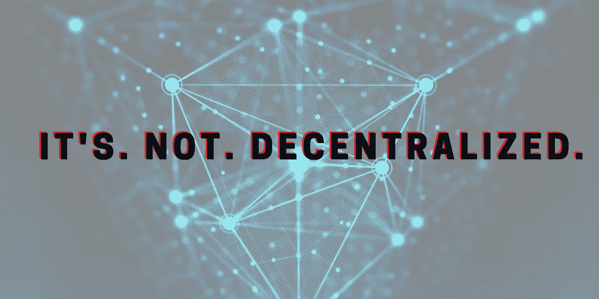
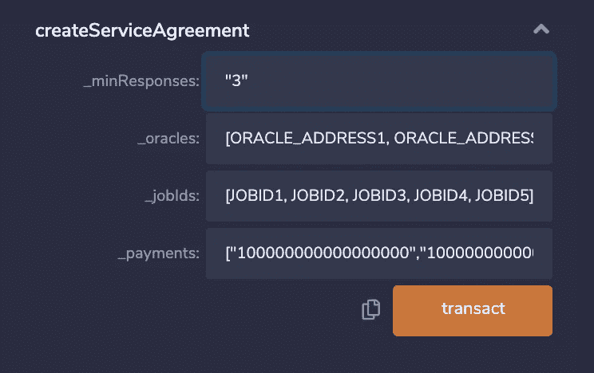
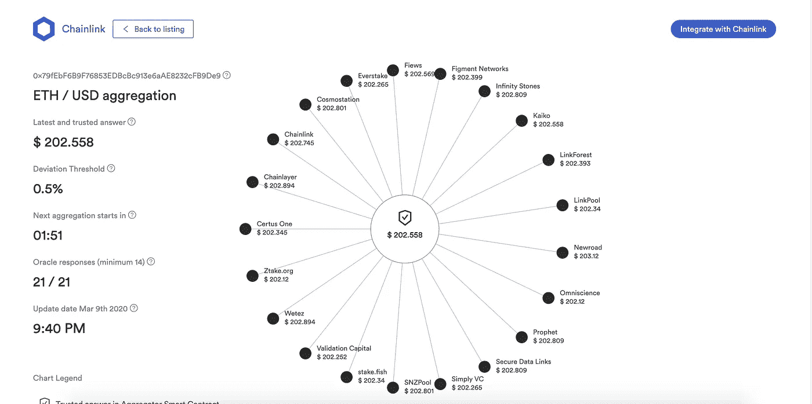
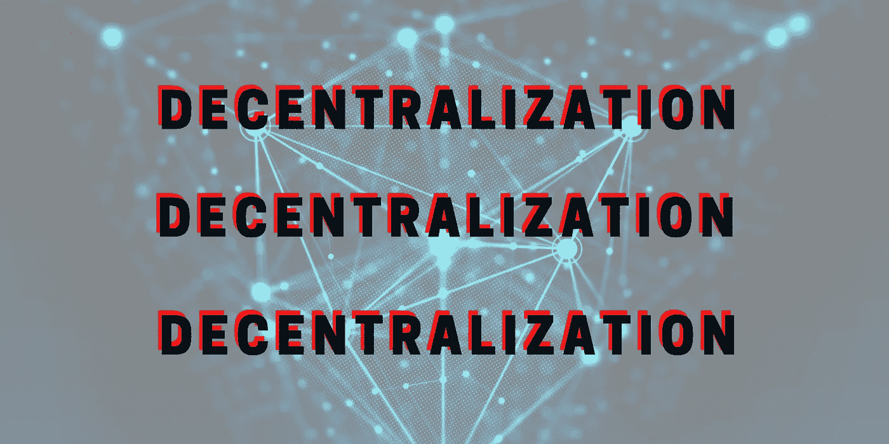

# 区块链上的 API 调用；数据收集的最佳实践

> 原文：<https://towardsdatascience.com/api-calls-on-blockchain-best-practice-for-data-collection-11f1fc86a2be?source=collection_archive---------10----------------------->

## 如何进行 API 调用，HTTP GET/POST 请求，获取外部数据，oracle 是什么，如何编码。以太坊/实体的例子。



[原图来自 metamorworks Getty Images Pro](https://www.canva.com/media/MADerI4Waos) 。

> *本文已过时。要了解更多最新信息，您可以查看关于进行 API 调用的 [Chainlink 文档](https://docs.chain.link/docs/any-api/get-request/introduction/)

大多数软件工程师在从他们的程序之外获取数据时，会从 [API 调用](https://blog.chain.link/apis-smart-contracts-and-how-to-connect-them/)或 [HTTP GET/POST](https://www.w3schools.com/tags/ref_httpmethods.asp) 请求中获取数据。类似地，在区块链上，人们也希望从外部 API 获取数据。本文将教你如何做到这一点！让我们开始吧，这是第一步:

# — — — — — —你不能— — —

抓住你了。

实际上，您不能像从普通软件应用程序中获取数据那样从 API 调用中获取数据。然而，为了让我们的智能合约做任何有价值的事情，我们希望它们与外部世界进行交互。那么是什么原因呢？

> 以太坊区块链被设计成完全确定性的。这意味着，如果我获取网络的全部历史，然后在我的计算机上重放它，我应该总是以正确的状态结束。
> 
> 由于互联网是不确定的，并且随着时间的推移而变化，所以每次我重放网络上的所有事务时，我都会收到不同的答案。
> 
> —[stack overflow 上的 Tjaden Hess](https://ethereum.stackexchange.com/questions/301/why-cant-contracts-make-api-calls)

代替契约直接调用 API，我们需要让它调用一个可以与外界交互的应用程序，并让它在链上记录它的发现。这些被称为 [**神谕**](https://medium.com/better-programming/what-is-a-blockchain-oracle-f5ccab8dbd72) 。Oracles 是与外部世界的数据交互并将其报告回链上的任何应用程序。

如果我们在没有 oracles 的情况下重放这个链，并使用常规的 API 调用，那么 API 调用可能已经改变，我们会得到不同的结果。

> 感谢技术上的定义更新，但是我如何将我的数据放入我的 solidity 应用程序？

好吧，好吧，让我们进入你来这里的真正目的。在我们的示例中，我们将只尝试获取 ETH 的美元价格。

## **对于初学者:**

现在，如果你对这个混音、可靠性、Chainlink 一窍不通，想要一步一步的指南，请随意查看我更深入的指南:[写你的第一个可靠性合同](https://medium.com/alpha-vantage/write-your-first-blockchain-application-in-minutes-with-alpha-vantage-c4e8dd662fc0)或 [Chainlink 的文档](https://docs.chain.link/docs/example-walkthrough)。我们都曾是骗子，:D

## 对于稍有经验或高级用户，包括混音:

如果您想跟随，只需按下按钮，而不必选择自己的 oracles，您可以跟随所有代码，并在 [Remix here](https://remix.ethereum.org/#version=soljson-v0.5.17+commit.d19bba13.js&optimize=false&gist=7cae2cc64026ea69073ee76a32dd0268&evmVersion=null) (代码包含在超链接中)中与我一起部署它。然而，该代码仅用于演示，您不应该将其用于生产。您应该将 JobIDs 和地址作为参数。你可以在[这里](https://remix.ethereum.org/#version=soljson-v0.5.17+commit.d19bba13.js&optimize=false&gist=7cae2cc64026ea69073ee76a32dd0268&evmVersion=null)和我们一起关注更多产品化的版本。你会注意到少了两个步骤。这是故意的；)

转到 gists 部分。请确保在部署后将 ROPSTEN 链接发送到您的合同，否则，您将得到一个气体估计错误。你可以在这里得到 [ropsten 链接](https://ropsten.chain.link/)。测试时不要发送实际的链接。求你了。求你了。求你了。如果不小心发送了链接，可以使用`withdrawLink`功能。

*另一个注意事项:我倾向于交替使用 oracle 和 node，虽然从技术上来说这是不正确的，但对于本文来说，这两者之间的区别可以忽略不计。*

# 1.天真的方法

大多数区块链工程师开始的第一种方法是找到一种 oracle 技术，给它我们 API 调用的 URL，然后让它报告链上的数据，让我们与之交互。我们可以使用许多神谕来做到这一点。我们将使用[链节](https://docs.chain.link/docs/getting-started)的原因你很快就会看到。

要使用 Chainlink，我们首先必须选择一个 Chainlink oracle/node。这些是区块链上独立运作的智能合约，让你与世界互动。要找到一个，我们可以去像 Linkpool 的[市场这样的节点列表服务。链接](https://market.link/)，选择一个节点即可。然后，我们必须确保该节点有一个“http Get > uint256”作业。不是每个节点都可以进行 URL 调用并返回一个 Uint256(基本上是一个 int)，但是大多数都可以！

我们选择的节点是位于 ORACLE 变量中的地址的一个连接池节点。所有的神奇都发生在`requestEthereumPrice`函数中。如果你以前学习过 Chainlink 的教程，你会知道这是使用 Chainlink 获取数据的最简单的方法。

这太棒了！我们可以得到数据。如果您只是测试并希望快速开发您的代码，这很好，但是请不要将它用于生产智能合同。为什么？它伴随着一个主要问题:



[原始图片来自 spainter_vfx Getty Images Pro](https://www.canva.com/media/MADesc75y2g)

您将从一个 oracle 和一个数据提供者那里获取数据。这不是[分散数据](https://docs.chain.link/docs/architecture-decentralized-model)吗！你需要在你的 solidity 智能合同中分散数据，否则你会失去应用程序的主要优势。

现在 Linkpool 是最受信任的链接节点服务之一，但是你的应用程序需要[无信任](https://medium.com/@preethikasireddy/eli5-what-do-we-mean-by-blockchains-are-trustless-aa420635d5f6)。不仅如此，您还从一个来源获取数据，现在您的应用程序中有两个故障点。CryptoCompare 和 LinkPool 都是很大的负担，很容易补救。这是一个值得大谈特谈的观点，我将不再赘述，但让我再重复一遍。

> 您的智能合约需要永远不会有单点故障，因为该点可能会被贿赂、被黑客攻击、在执行时停止服务，或者许多其他原因使您的智能合约变得一文不值。

那么我们如何解决这个问题呢？

# 2.自聚集方法

我们现在已经向前迈进了一步，选择了 3 个节点，我们将把我们的 API 调用路由到这 3 个节点，这大大减轻了这种幼稚方法带来的问题。现在为了得到价格，我们添加了一个`median`函数，它取所有提供的答案的中间值。这样，如果一个或两个给出完全不同的答案，我们更有可能得到 ETH 的真实值。您可以看到添加更多的节点会增加您对每个节点的信任。

理想情况下，我们也会选择不同的数据提供者，但是为了简单起见，我在示例中保留了相同的数据提供者。理想情况下，您甚至希望超过 3 个节点，但至少现在没有单点故障。目前，7 或 21 个节点似乎被认为是“体面的”。为什么是 7 和 21？不知道。

所以这要好得多！我们现在在 solidity 中有分散的数据！尽管有很多代码要处理这个问题，但是有没有更简单的方法将我的 API 调用路由到多个节点呢？

很高兴你问了。

# 3.使用预协调器

如果这一部分让你感到困惑，可以直接跳到 3.5

这需要一个额外的步骤。你会注意到在 remix 链接中，有一个只有两行代码的文件。

```
pragma solidity ^0.5.0;import "github.com/smartcontractkit/chainlink/evm-contracts/src/v0.5/PreCoordinator.sol";
```

就是这样。

这就产生了所谓的服务协议。这需要您给它一个 oracle 地址和作业 id 的列表，并将您的 API 调用分散到所有这些 Oracle，取中间值，并使用简单方法的语法为您处理一切！

部署`precoordinator.sol`，并在 GUI 中添加您的 oracle 地址、`jobID`payments(10000000000000 = 0.1 LINK)和`_minResponses`。这是每个 oracle 需要的最小响应数。

假设你有 5 个神谕，只有 2 个回应。如果您将最小响应设置为 3，这将否定您的智能合约的其余部分。这是很理想的，因为如果我们没有足够的神谕来回应，它就不会那么分散。



图片来自作者

启动服务协议后，您可以将服务协议的地址用作您的 Oracle 地址，将服务协议的 ID 用作`jobID`。您会注意到这一步的语法几乎与天真的方法相同。这样，一旦你用一个 oracle 完成了所有测试，并准备好进入生产阶段，你就可以启动一个服务协议，更改 oracle 和`jobID`，但保持**你的所有代码不变。**

如果您发现您正在使用的一些 Oracle 给了您很差的响应，那么使用不同的 Oracle 创建新的服务协议就很容易了。您可以做到这一点，而不必重写任何现有的代码，只需为新的服务协议交换 id。

我不知道你怎么想，但是我喜欢用更少的工作来完成更多的工作。

这一步是你对链式网络的最大控制。您可以选择您的节点、数据提供者，并轻松地集成和更改它们。

*关于数据提供者的注意:目前，precoordinator 只能向每个提供者发送相同的数据包，这意味着如果不同数据 API 的 JSON 输出不同，您必须发送不同的复制路径。使用不同的数据提供者发送相同信息的方法是将它们都包装在一个* [*外部适配器*](https://docs.chain.link/docs/external-adapters) *中，该适配器将它们的输出格式化为相同的格式。请继续关注如何做到这一点的更新！*

# 3.5 使用他人的预协调器合同

有时你必须先学习困难的方法，然后才能学会简单的方法，对吗？
`address PreCoordinator= 0x11db7845a757041F5Dad3fAf81d70ebAd394e9A2;`

`bytes32 constant patrick_service_agreement = 0xcb08d1dbcc1b0621b4e8d4aea6bafc79f456e12332c782b4258c7e83bcedb74c;`

您可以在 Ropsten 上使用上面的`PreCoordinator`地址来部署任意服务协议。您可以用这个地址向我挑选的几个节点发送 httpget 请求。

理想情况下，不要在代码中存储`PreCoordinator` `patrick_service_agreement`或`payment`，而是接受它们作为函数的**参数。**

如果这让你困惑，我希望在底部得到问题。

# 4.使用参考合同

许多 oracles 技术也有现成的解决方案。Chainlink 也不例外。他们花时间审查多个节点和数据提供商，以提供大量高使用价格的数据馈送，供任何人使用。

我以前在[构建智能合同，聪明地](https://medium.com/coinmonks/building-smart-contracts-smartly-b33dded92b37)中写过关于它们的文章，它们是简单和去中心化的顶峰。

你可以在他们的[订阅页面](https://feeds.chain.link/)上找到他们的参考合同列表。唯一使它更集中的部分是 Chainlink 选择了节点列表，这意味着你必须相信 Chainlink 团队的节点选择能力。然而，如果你想要一个预先准备好的答案，去中心化的维护外包给 Chainlink 团队，这是一个巨大的优势。否则，你总是可以建立你自己的链式节点网络来获得你的分散数据！



图片来自[链节馈送。](https://feeds.chain.link/eth-usd)您甚至可以查看节点正在响应什么，以获得它们的响应。

另一个最好的部分是，它目前是免费的，由像 T2 合成技术公司 T4 这样的优秀公司赞助。我相信未来这种情况会改变，因为这不是一种可持续的模式。

# 摘要



类似“位置，位置，位置”[原图来自 spainter_vfx Getty Images Pro](https://www.canva.com/media/MADesc75y2g)

咻。这里涉及的内容很多。希望我钻了分权点。区块链的主要优势之一是我们可以拥有不可信的应用程序。

> 用集中式数据源和 oracles 构建区块链应用程序就像买了一辆自行车，这样你就不必再步行去上班，然后继续骑着自行车步行去上班。
> 
> 你在一个解决方案上投入了时间，但是仍然没有解决原来的问题，即使你已经有了解决方案。

现在，您已经有了工具并理解了这里的重要性，让我们看看您构建了什么吧！对于所有新的和有经验的区块链工程师来说，有很多方法可以加入。AlphaVHack 是一个面向新工程师的黑客马拉松。你可以[加入 Chainlink discord](https://twitter.com/chainlink/status/1171450674497765381?lang=en) ，用 Udemy 的这个[牛逼类构建你的第一个端到端区块链解决方案。或者在下面给我留言，询问如何找到更多关于上面的信息，下次再聊！](https://www.udemy.com/course/ethereum-and-solidity-the-complete-developers-guide/)

觉得我错过了什么吗？你能听懂混音代码吗？什么都不懂？请在下面留下您的问题、评论或见解！

*此处所有观点均为本人观点。*

*关注我上* [*推特*](https://twitter.com/PatrickAlphaC) *，* [*中*](https://medium.com/@patrick.collins_58673) *，*[*github*](https://github.com/PatrickAlphaC)*，*[*LinkedIn*](https://www.linkedin.com/in/patrickalphac/)*，* [*不和*](https://discord.gg/bf6FxwT) *，获取更多内容和见解。在这里查看我关于* [*介质的最新文章*](https://medium.com/@patrick.collins_58673/stock-api-landscape-5c6e054ee631) *！*

*# financer evolution #区块链# ETH # chain link # smart contracts*