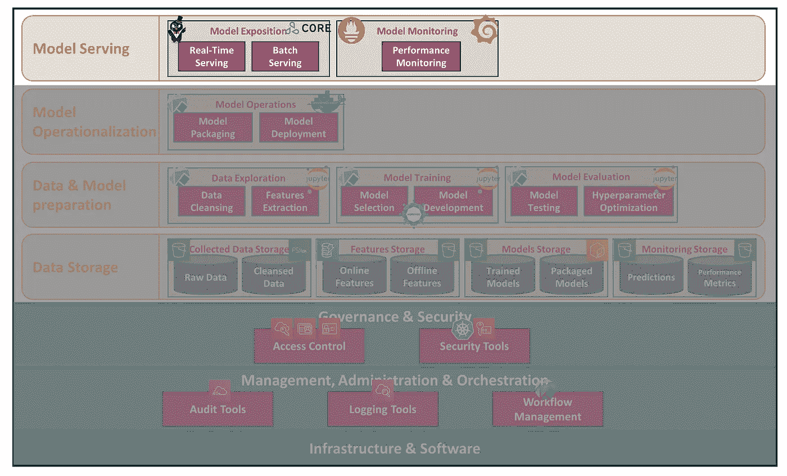
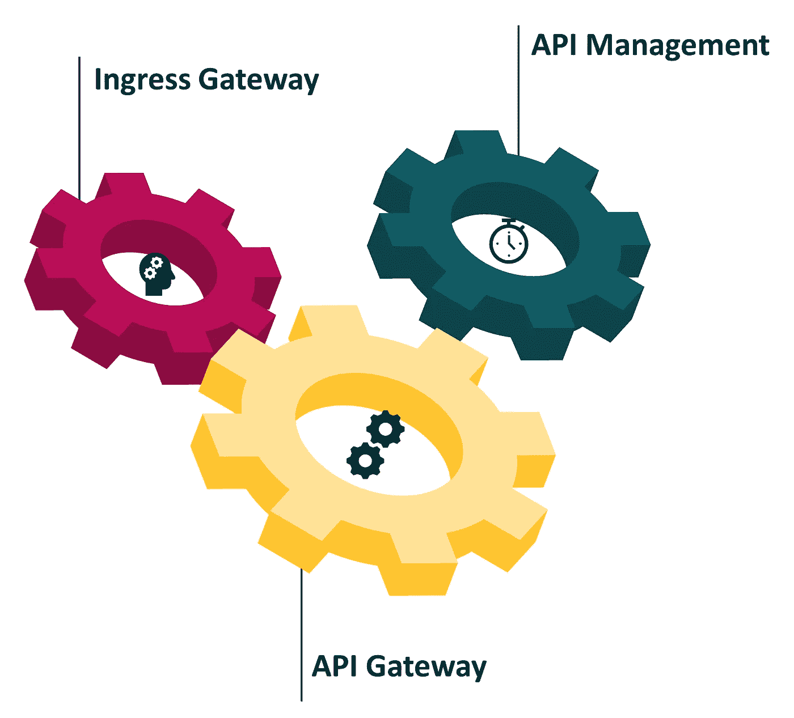
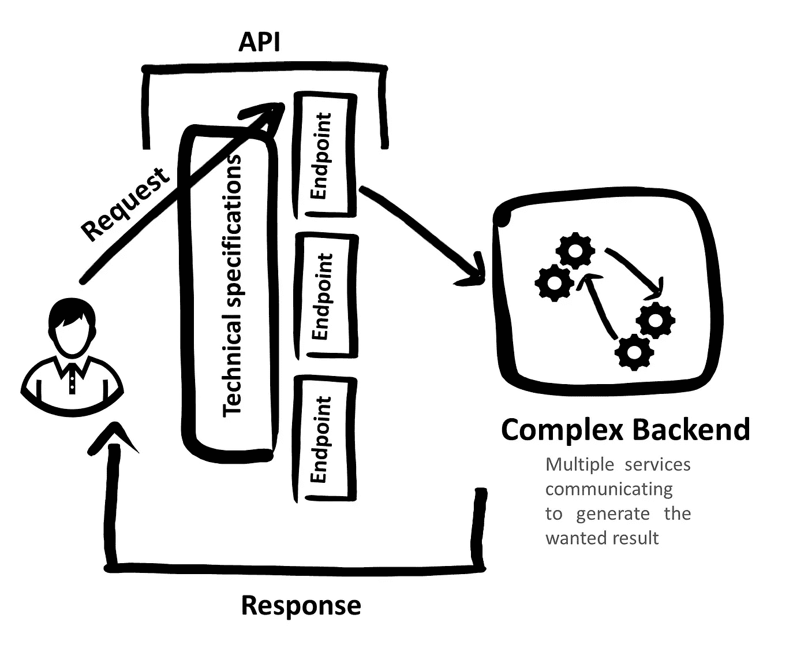
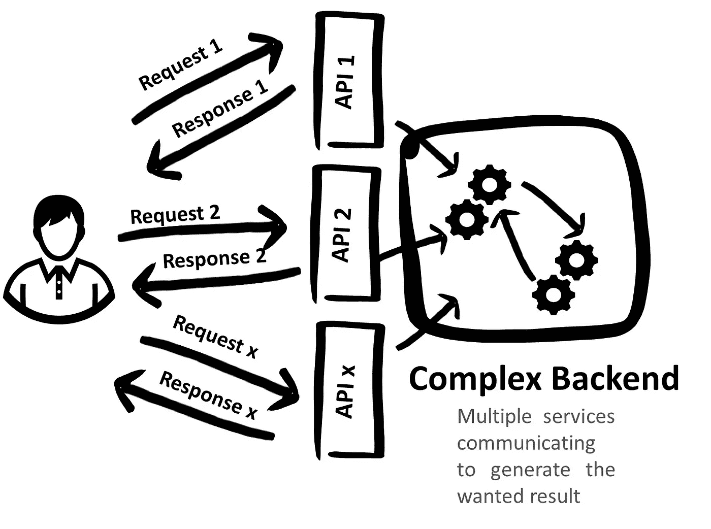
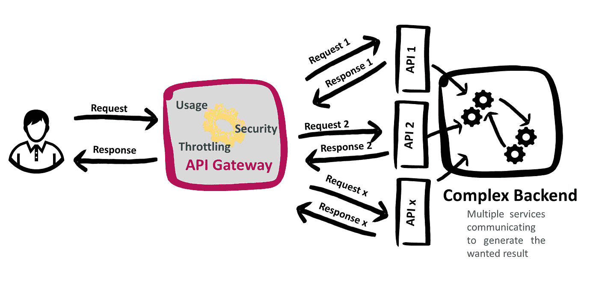
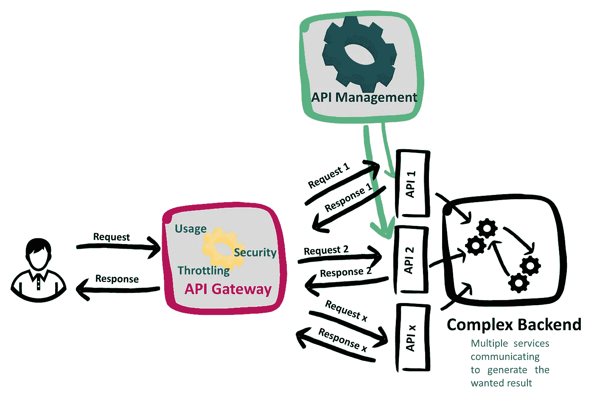
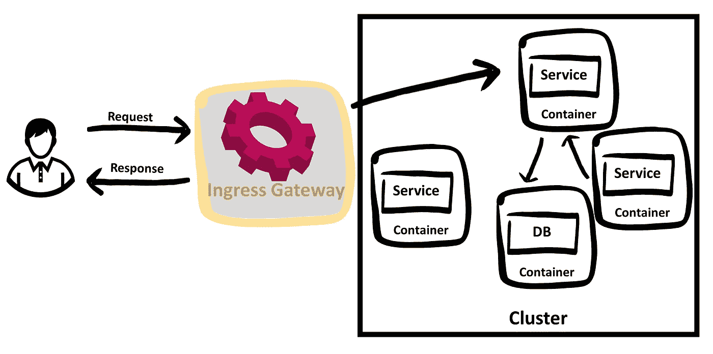
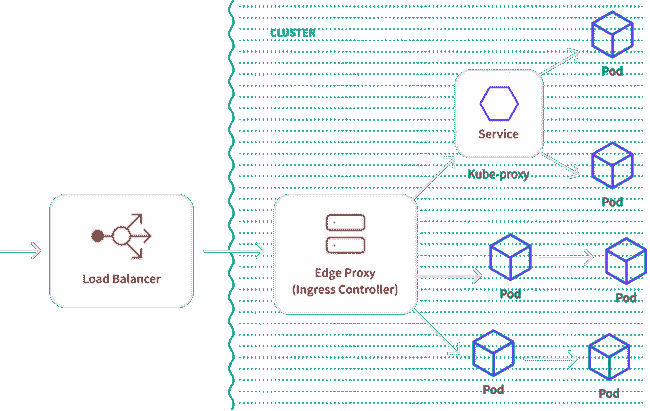

# 用于机器学习平台的 API 网关

> 原文：<https://towardsdatascience.com/api-gateway-for-a-machine-learning-platform-d66bdfe07192?source=collection_archive---------40----------------------->

## “不要根据封面来判断一本书”…或者他们是这么说的…在现实世界中，有着神圣的生产环境和截止日期，每个人都根据封面来判断你的平台，也就是它的 API…

斯坦纳·恩格兰在 [Unsplash](https://unsplash.com?utm_source=medium&utm_medium=referral) 上拍摄的照片

定义了 AWS 上一个自定义机器学习(ML)平台的 [**框架层**](https://medium.com/@salah.rekik/i-built-a-machine-learning-platform-on-aws-after-passing-sap-c01-exam-framework-layer-4c38084c81a) 之后，就该详细说说这个层的一些具体范围了。

本系列文章的范围是框架的模型服务层。换句话说，它的“ **API 网关”**。

本系列文章范围，由[作者](https://www.linkedin.com/in/salah-rekik)

这一层包含 4 个解决方案:大使、谢顿核心、普罗米修斯和格拉夫纳。在这个新的系列文章中，我将深入探讨这些解决方案中的每一个。

这将是一次伟大的旅程，所以请和我在一起吧！

## 1 |等等！你刚才是说“API 网关”吗！你确定不是“集群入口”网关！也可能是“API 管理层”！

这是揭开这个话题神秘面纱的第一步。

当在 Kubernetes 集群(在我的例子中是 EKS)中拥有服务时，在某个时间点，我们希望向外部世界公开其中的一些服务，以便我们的客户端可以与我们的服务进行交互。

公开这些服务意味着两件事:

*   **将外部流量路由到 Kubernetes 集群内部的服务**:为了实现这一点，我们需要某种“网关”来接收外部流量，知道这个流量涉及哪个服务，然后将流量定向到那个服务。
*   **管理该流量的路由**:在某些情况下，仅仅重定向流量是不够的。我们可能希望通过添加一些身份验证来保护对服务的访问，或者限制对流量所涉及的服务的授权请求的数量(速率限制)，或者可能缓存来自该服务的一些响应，以避免为已经看到的请求召回它。

为了正确管理这种流量，出现了三个术语:API 网关、API 管理和入口网关。

我将从定义这些术语开始。

管理 API 流量的新兴术语，作者[作者](https://www.linkedin.com/in/salah-rekik)

## 1.1 |在此之前，什么是 API？

"应用编程接口(API)是一个计算接口，它定义了多个软件中介之间的交互."**T1。开发人员使用这个接口以一种**定义的、稳定的、文档化的方式**访问其背后的服务。**

一个 API 的简化视图，作者[作者](https://www.linkedin.com/in/salah-rekik)

## 1.2 | API 网关

面对大量的微服务，每个微服务都有其粒度 API，对于希望与这些微服务交互以获取一些数据的最终客户来说，有两种可能的方式可供选择:

**1。** **按照正确的顺序使用 API 向每个服务发送请求:**每个请求必须遵守每个微服务的适当规范。毫无疑问，这是离用户友好应用程序最远的解决方案，并且只有一个结果:**由于这种复杂性，客户永远不会使用我们面向微服务的应用程序。**

用于访问数据的多个 API，由[作者](https://www.linkedin.com/in/salah-rekik)

**2-** **在我们所有的微服务前面放一层:**这一层将只接收客户的一个请求，并负责处理其余的，以便返回最终的数据。这一层是“ **API 网关**”。
**在这种情况下，API Gateway 就变成了最终客户使用的 API。**

API 网关除了能够将客户与面向微服务的应用交互的复杂性隔离开来之外，还可以提供更多高级功能，例如:

*   **安全性** : API 网关提供了一个集中的代理服务器来管理速率限制、僵尸工具检测、认证、CORS 等等。许多 API 网关允许建立一个数据存储库(如 Redis)来存储会话信息。
*   **速率限制和计费:**该功能可以是基于配额或使用量的。
*   **减少往返行程**:某些 API 端点可能需要跨多个服务连接数据。API 网关可以执行这种聚合，这样客户端就不需要复杂的调用链，减少了往返次数。

更多 API 网关功能[在这里](https://www.moesif.com/blog/technical/api-gateways/How-to-Choose-The-Right-API-Gateway-For-Your-Platform-Comparison-Of-Kong-Tyk-Apigee-And-Alternatives/)。

API 网关的简化视图，作者[作者](https://www.linkedin.com/in/salah-rekik)

我强烈推荐克里斯·理查森的这篇简短但非常有趣的文章:

## *1.3 | API 管理*

***“API 管理与 API 生命周期相关”**。它只是创建和发布 web 应用程序编程接口(API)的**过程**，执行它们的使用策略，控制访问，培育订户社区，收集和分析使用统计数据，并报告性能。
我会说这是与 API 网关共存的另一块。*

**

*API 管理的简化视图，作者[作者](https://www.linkedin.com/in/salah-rekik)*

## *1.4 |集群入口网关*

*简而言之，集群入口网关是一个具有某些规范的 API 网关:*

*   *这是一个**集群级** API 网关:每个集群都有自己的入口网关*
*   *它不仅抽象了对底层 API(由微服务公开)的访问，还抽象了任何“gRPC 服务、缓存、消息队列、数据库等”*

*有些人也称之为 API 网关。引入“集群”这个词使它更接近其底层技术:**集群、容器、主机、端口等。***

**

*集群入口网关的简化视图，作者[作者](https://www.linkedin.com/in/salah-rekik)*

*在基于 EKS 的机器学习平台的情况下，集群入口网关可能是 API 网关层的完美候选。
让我们更加关注这种类型的网关。*

## *2 |从技术上讲，Kubernetes 集群的集群入口网关是什么*

*大使团队将其称为“Kubernetes ingress”，并对其进行了如下定义:“Kubernetes ingress 是一组路由规则，用于管理外部用户如何访问 Kubernetes 集群中运行的服务**。****⁴***

*这个网关由两部分组成:*

*   ***负载平衡器**:这是一个**外部**负载平衡器。它的作用是将外部流量重定向到 Kubernetes 集群。在云环境中，这个负载平衡器是特定于云的(例如 AWS 网络负载平衡器)。*
*   ***边缘代理**:当处理 Kubernetes 的入口资源时，也称为**入口控制器**。这是大脑，它接收来自负载均衡器的流量，并知道调用哪个服务、API、数据库…来响应这个流量。*

**

*来自[https://www.getambassador.io/learn/kubernetes-ingress/](https://www.getambassador.io/learn/kubernetes-ingress/)的入口网关*

*在本系列文章的其余部分，我将互换使用术语 API 网关和入口网关。*

***结论***

*在这篇文章中，我试图为下一篇文章做准备。我首先介绍了这一系列文章的范围。然后，我试图定义我在研究 API 网关的主题时遇到的不同术语，如果没有很好地理解，这些术语可能会产生误导:API 网关、API 管理、入口网关。*

*在下一篇文章中，我将讨论这个 API 网关层与 AWS 服务和开源解决方案的不同设置。*

*如果您有任何问题，请通过 [LinkedIn](https://www.linkedin.com/in/salah-rekik) 联系我。*

*[1][https://en.wikipedia.org/wiki/API](https://en.wikipedia.org/wiki/API)*

*[2][https://nordicapis . com/understanding-API-management-API-gateway-and-API-manager/](https://nordicapis.com/understanding-api-management-api-gateway-and-api-manager/)*

*[3][https://blog . Christian posta . com/micro services/API-gateways-are-go-through-an-identity-crisis/](https://blog.christianposta.com/microservices/api-gateways-are-going-through-an-identity-crisis/)*

*[https://www.getambassador.io/learn/kubernetes-ingress/](https://www.getambassador.io/learn/kubernetes-ingress/)*