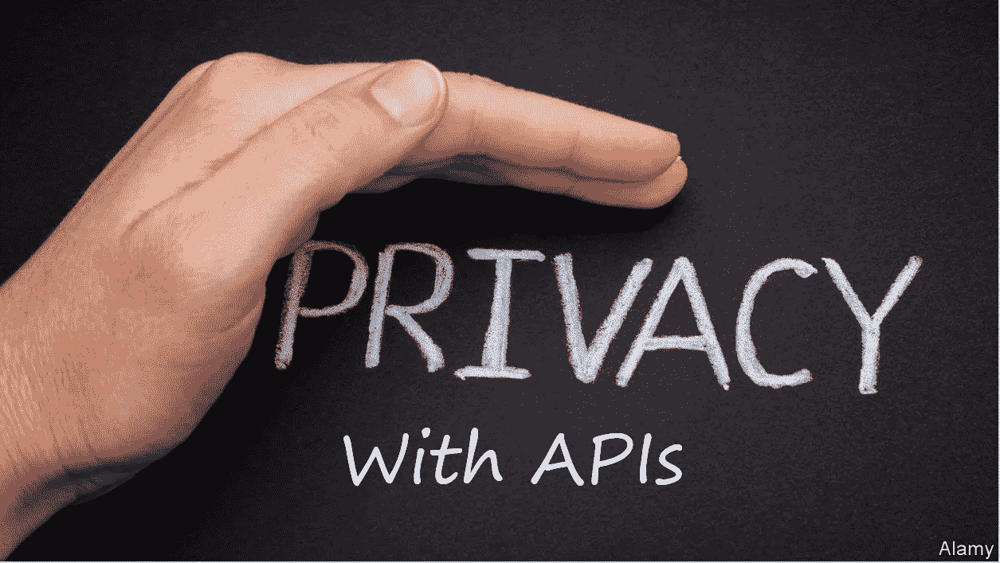

# API 私有信息分析器

> 原文：<https://towardsdatascience.com/api-private-information-analyzer-b4e5bdc3f793?source=collection_archive---------81----------------------->

## 如何识别 API 中的私有信息

隐私就是数据管理。您需要知道您正在处理哪种类型的信息，以及它在后端究竟发生了什么。数据目录可以帮助您了解实际情况，并直观显示数据的变化。详情请阅读我就该主题发表的[故事](https://medium.com/@manu.cohenyashar/data-catalogs-as-enablers-for-software-certification-based-on-data-intelligence-1ecfcab5d393)。今天，我想讨论在 API 的环境中如何识别 pii。

基于[经济学家](https://www.economist.com/open-future/2018/08/16/toward-defining-privacy-expectations-in-an-age-of-oversharing)

API 来回传递信息，所以您想知道部分信息是否应该被视为私有。为了帮助你完成这项任务，我开发了一个 [API 私有信息分析器](https://github.com/manucohenyashar/APIPrivateInformationAnalyzer)，你可以用它来分析你完整的 API 负载。该工具将告诉您它在何处识别 pii，并解释它如何将它们分类。

# PIIs 如何分类

这是我在设计[工具](https://github.com/manucohenyashar/APIPrivateInformationAnalyzer)之前必须回答的第一个问题。我应该使用文本分类器，或者命名实体识别(NER)是我们需要的任务吗？我看到了很多用 NLU 方法实现这种分类的尝试，比如 LSTM 或伯特。嗯，通过一个比较 NLU 技术(使用库，如 [huggingface/transformers](https://github.com/huggingface/transformers) 、LSTM 和基于 BERT 的模型)与传统文本处理方法的性能的简短实验，我能够证明一个显而易见的事实:**隐私信息主要按模式分类，较少按上下文分类。**因此，基于简单正则表达式操作的解决方案比任何 NLU 分类模型都提供了更好的结果，而且它们显然做得更快。

# 简单第一

这个简单的实验是一个典型的例子，它表明有时简单、不重要的解决方案胜过最先进的技术。尽管在过去的几年中，随着 transformer 的引入，NLU 空间发生了革命性的变化，我们现在可以做以前从来没有做过的事情，但我们仍然应该小心，只有在传统的文本操作方法无法实现时才使用 NLU 方法。对于 PII 识别，NLU 方法优于传统正则表达式的唯一任务是名称实体识别(比如识别人名)。毫不奇怪，像 [BigId](https://bigid.com/) 这样的专业工具使用正则表达式作为分类私人信息的第一种方法，聚类和其他花哨的 AI 紧随其后。

# 隐私 NER

在工具中，我选择使用斯坦福命名实体识别器。可以在这里[下载](http://nlp.stanford.edu/software/CRF-NER.shtml)或者在这里解压[提供的 Stanford-ner-2018–10–16 . zip。这个 zip 文件包含 NER jar 文件(Stanford-ner.jar)和模型文件(English . all . 3 class . dist sim . CRF . ser . gz)。使用 NER 发动机不需要其他安装。这不是一个新的模型，它基于条件随机场(CRF)序列模型，但对于在隐私环境中识别人们姓名的任务来说，它表现得很好，并且比其他基于现代 BERT 的实现要轻得多。如果你想深入了解命名实体识别领域，我推荐下面的](https://nlp.stanford.edu/software/CRF-NER.html#Download)[帖子](/named-entity-recognition-ner-with-bert-in-spark-nlp-874df20d1d77)作为起点。

# API 私有信息分析器

[工具](https://github.com/manucohenyashar/APIPrivateInformationAnalyzer)收集输入条目；每个都包含 API 调用的所有数据元素(即请求和响应的 URI、头、有效负载)。它通过使用正则表达式、可疑属性名称黑名单和命名实体识别(NER)引擎来分析数据并搜索可能的私人信息(PII)。结果是一个 CSV 或 JSON 文件，其中包含每个 API 的调用分析，突出显示了所有可能的私有字段及其值。您可以从命令行使用该工具，也可以从 python 代码中调用它。

# 结论

并非所有的文本操作都需要 NLU 重炮。通常，简单就是胜利。如果您需要快速分析 API 的隐私问题，请查看 [API 隐私信息分析器](https://github.com/manucohenyashar/APIPrivateInformationAnalyzer)。它将告诉您您的 API 是否涉及应该被视为私有数据的数据，这意味着您必须确保您拥有管理此类私有数据的相关工具/功能。