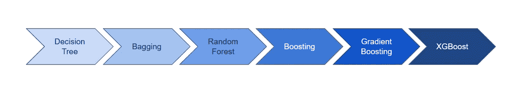

# 苹果数据科学家面试问答！

> 原文：<https://towardsdatascience.com/apple-data-scientist-interview-questions-and-answers-c178c61a9bb3?source=collection_archive---------24----------------------->

## 一些苹果面试问题的演练！

[Unsplash](https://unsplash.com/?utm_source=unsplash&utm_medium=referral&utm_content=creditCopyText) 上 [iabzd](https://unsplash.com/@iabzd?utm_source=unsplash&utm_medium=referral&utm_content=creditCopyText) 的照片

# 介绍

苹果是世界上最大的科技公司之一，已经建立了当今时代最具标志性的品牌之一。iPods 和智能手机的先驱处于创新技术、卓越营销，当然还有大数据的最前沿。

苹果公司的数据科学家似乎也戴着软件工程师的帽子，所以我只能找到这么多专注于数据科学的面试问题。话虽如此，我还是为你提供了五个面试问题以及相应的答案。

# 数据科学面试问题

## 问:描述 L1 和 L2 正则化之间的区别，特别是关于它们对模型训练过程的影响的区别。

L1 和 L2 正则化都是用于减少训练数据过拟合的方法。最小二乘法使残差平方和最小，这可能导致低偏差但高方差。

L2 正则化，也称为岭回归，最小化残差平方和**加上λ乘以斜率平方**。这个附加项被称为**岭回归损失**。这增加了模型的偏差，使得对训练数据的拟合更差，但是也减少了方差。

如果采用岭回归罚分并用斜率的绝对**值替换，则得到套索回归或 L1 正则化。**

L2 不太稳健，但有一个稳定的解决方案，而且总是一个解决方案。L1 更稳健，但是具有不稳定的解，并且可能具有多个解。

## 问:ACF 和 PACF 的含义是什么？

要理解 ACF 和 PACF，首先需要知道什么是**自相关**或**序列相关**。自相关着眼于给定时间序列与其自身滞后版本之间的相似程度。

因此，**自相关函数(ACF)** 是一种工具，用于发现数据中的模式，具体来说，是指由各种时间滞后分隔的点之间的相关性。例如，ACF(0)=1 意味着所有数据点都与自身完美相关，ACF(1)=0.9 意味着一个点与下一个点之间的相关性为 0.9。

**PACF** 是**偏自相关函数**的简称。引用 StackExchange 中的一段文字，“它可以被认为是由若干个周期 n 分隔的两个点之间的相关性，但中间相关性的影响已被消除。”比如说。如果 T1 与 T2 直接相关，而 T2 与 T3 直接相关，则似乎 T1 与 T3 相关。PACF 将消除与 T2 之间的关联。

*这里对 ACF 和 PACF* [*这里*](https://stats.stackexchange.com/questions/77248/what-is-autocorrelation-function) *有很大的解释。*

## 问:什么是偏差-方差权衡？

估计值的**偏差**是期望值和真实值之间的差值。具有高偏差的模型往往过于简单，导致拟合不足。方差表示模型对数据和噪声的敏感度。具有高**方差**的模型导致过度拟合。

因此，**偏差-方差权衡**是机器学习模型的一个属性，其中较低的方差导致较高的偏差，反之亦然。一般来说，可以找到两者的最佳平衡，使误差最小化。

作者创建的图像

## 问:XGBoost 如何处理偏差-方差权衡？

作者创建的图像

[XGBoost](https://xgboost.ai/) 是一种利用梯度推进算法的集成机器学习算法。本质上，XGBoost 就像是类固醇上的**装袋**和**助推**技术。因此，可以说 XGBoost 处理偏差和方差的方式类似于任何 boosting 技术。Boosting 是一种集成元算法，通过对许多弱模型进行加权平均来减少偏差和方差。通过关注弱预测和迭代模型，误差(从而偏差)减少了。类似地，因为它对许多弱模型进行了加权平均，所以最终模型比每个弱模型本身具有更低的方差。

## 问:什么是随机森林？为什么朴素贝叶斯更好？

随机森林是一种建立在决策树基础上的[集成学习](https://en.wikipedia.org/wiki/Ensemble_learning)技术。随机森林包括使用原始数据的[自举数据集](https://machinelearningmastery.com/a-gentle-introduction-to-the-bootstrap-method/)创建多个决策树，并在决策树的每一步随机选择一个变量子集。然后，该模型选择每个决策树的所有预测的模式。依靠“多数获胜”模型，它降低了单个树出错的风险。

作者创建的图像

例如，如果我们创建一个决策树，第三个，它会预测 0。但是如果我们依赖所有 4 个决策树的模式，预测值将是 1。这就是随机森林的力量。

随机森林提供了其他几个好处，包括强大的性能，可以模拟非线性边界，不需要交叉验证，并赋予功能重要性。

从过程和结果易于训练和理解的意义上来说，朴素贝叶斯更好。一个随机的森林看起来就像一个黑盒。因此，在实现和理解方面，朴素贝叶斯算法可能更好。但是，就性能而言，随机森林通常更强，因为它是一种集合技术。

# 编程面试问题

这里有六个关于编程的额外面试问题，如果你想自己回答的话！

*   *假设您有 100，000 个文件分布在多台服务器上，您想处理所有这些文件？在 Hadoop 中你会怎么做呢？*
*   给定一个整数列表，找出数组左半部分之和等于右半部分的索引。
*   *写一个函数来检测一棵二叉树是否是左右子树的镜像。*
*   *给定一个字符串列表，用 Python 写一个函数，返回所有是变位词的字符串。*
*   *Python 和 Scala 有什么区别？*
*   *解释 LRU 缓存。*
*   *如果客户端每分钟都发送位置数据，您会如何设计客户端-服务器模型？*

# 感谢阅读！

如果你喜欢我的工作并想支持我，我会非常感谢你在我的社交媒体频道上关注我:

1.  支持我的最好方式就是在**媒体**T20【这里】T21【关注我。
2.  在**推特**这里关注我。
3.  点击这里订阅我的新 **YouTube 频道** [。](https://www.youtube.com/channel/UCmy1ox7bo7zsLlDo8pOEEhA?view_as=subscriber)
4.  在 **LinkedIn** [这里](https://www.linkedin.com/in/terenceshin/)关注我。
5.  在我的**邮箱列表** [这里](https://forms.gle/UGdTom9G6aFGHzPD9)注册。
6.  查看我的网站[**terenceshin.com**](https://terenceshin.com/)。

# 相关文章

 [## 谷歌的数据科学面试脑筋急转弯

### 作为谷歌数据科学面试的一部分，他们喜欢问一些他们称为“解决问题”的问题…

towardsdatascience.com](/googles-data-science-interview-brain-teasers-7f3c1dc4ea7f)  [## 亚马逊的数据科学家面试实践问题

### 一些亚马逊面试问题的演练！

towardsdatascience.com](/amazon-data-scientist-interview-practice-problems-15b9b86e86c6)  [## 脸书的数据科学面试实践问题

### 一些脸书面试问题的预演！

towardsdatascience.com](/facebooks-data-science-interview-practice-problems-46c7263709bf)