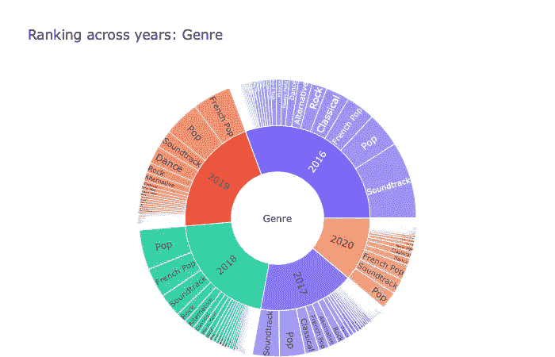
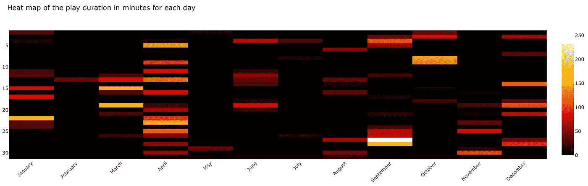
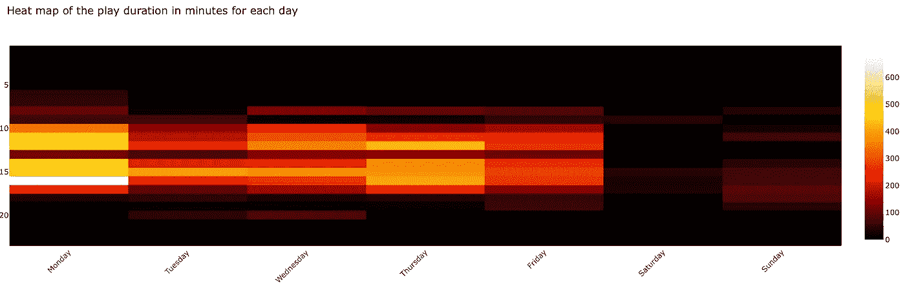
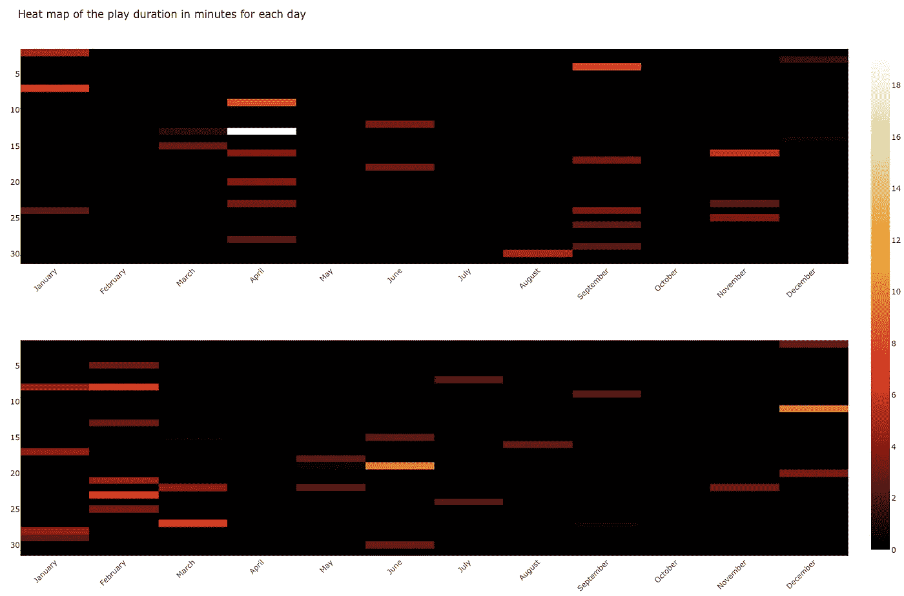
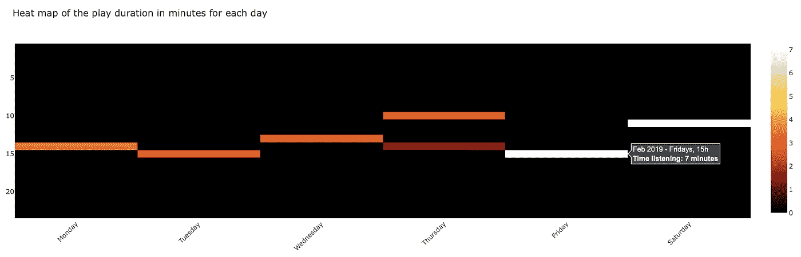

# apple Music activity analyser——软件包使用入门

> 原文：<https://towardsdatascience.com/apple-music-activity-analyser-part-2-3a62c6284eb0?source=collection_archive---------68----------------------->


丹尼尔·科尔派在 [Unsplash](https://unsplash.com/?utm_source=unsplash&utm_medium=referral&utm_content=creditCopyText) 上拍摄的照片

在另一篇文章中([见此](https://medium.com/@mozart38/apple-music-activity-analyser-part-1-dd02173f095f))，我们看了看我对自己的数据所做的分析。现在是我向您展示如何使用 apple_music_analyser 软件包的时候了，这样您就可以对自己的数据进行类似的数据分析了！

*注意:您应该向 Apple 请求您的数据，请参见 Apple 的数据和隐私页面。*

*另一个注意事项(编辑自 2020 年 10 月 12 日):一个* [*web 界面*](https://www.acoullandreau.com/dashboard/#) *现在可供您浏览您的数据！而且你可以在这里* *阅读一下* [*。*](https://medium.com/@mozart38/apple-music-dashboard-an-introduction-4a99295217f9)

# 安装软件包

首先，安装软件包

```
pip install apple-music-analyser
```

所有依赖项都是自动安装的。有一个文件夹文档和一个文件夹示例，可以包含对你有用的内容！可以从 [GitHub 库](https://github.com/acoullandreau/apple_music_analyser)看一下。

# 导入和数据输入

当然可以用自己的数据！但是如果您愿意，您可以使用软件包附带的测试数据(用于测试)。拿过来[这里](https://github.com/acoullandreau/apple_music_analyser/blob/master/apple_music_analyser/tests/test_df.zip)。

第一步，我们导入所有我们需要的模块。

```
# import to parse an archive, save and load a pickle file
from apple_music_analyser.Utility import Utility

# import to actually parse and process the data
from apple_music_analyser.VisualizationDataframe import VisualizationDataframe

# import to filter the df
from apple_music_analyser.Query import QueryFactory

# import to build visualizations
from apple_music_analyser.DataVisualization import SunburstVisualization, RankingListVisualization, HeatMapVisualization, PieChartVisualization, BarChartVisualization
```

第二步，我们只提取我们想要构建可视化的文件。假设苹果提供给你的档案在一个名为 data 的文件夹里。

```
path_to_archive = 'data/Apple_Media_Services.zip'
input_df = Utility.get_df_from_archive(path_to_archive)
```

现在，如果您使用 test_df.zip，请注意归档文件的结构与 Apple 归档文件的结构略有不同。正因为如此，我们需要向 *get_df_from_archive* 方法传递一个额外的参数，其中包含归档的结构。像这样:

```
path_to_archive = 'data/test_df.zip'target_files = {
 'identifier_infos_path' : 'test_df/Apple Music Activity/Identifier Information.json.zip',
 'library_tracks_path' : 'test_df/Apple Music Activity/Apple Music Library Tracks.json.zip',
 'library_activity_path': 'test_df/Apple Music Activity/Apple Music Library Activity.json.zip',
 'likes_dislikes_path' : 'test_df/Apple Music Activity/Apple Music Likes and Dislikes.csv',
 'play_activity_path': 'test_df/Apple Music Activity/Apple Music Play Activity.csv'
 }input_df = Utility.get_df_from_archive(path_to_archive, target_files)
```

就是这样！ *input_df* 是一个如下结构的字典:

```
{  
"identifier_infos_df" : identifier_infos_df,
"library_tracks_df" : library_tracks_df,
"library_activity_df" : library_activity_df,
"likes_dislikes_df" : likes_dislikes_df,
"play_activity_df" : play_activity_df    
}
```

# 可视化数据帧结构

这个包定义了一个名为 VisualizationDataframe 的类来构建我们稍后将用于分析和可视化的所有对象。因此，让我们使用之前得到的 *input_df* 对象实例化这个类。

```
viz_df_instance = VisualizationDataframe(input_df)
```

好了，基本上这个库就这样了:)现在你有了一个干净的、经过解析和处理的数据结构，还有一些你想用于分析的对象(见下面的更多细节)。

现在让我们暂停一下。实例化 VisualizationDataframe 类的这一步可能需要几秒钟的时间，这取决于数据的大小(对于我的数万行数据来说，只需要不到 30 秒的时间)。您可能不希望每次查看数据时都进行清理、解析和处理，除非归档中的文件发生了变化！所以这里来了两个方便的函数:**保存和加载**泡菜。

您可以将 VisualizationDataframe 类的实例保存为 pickle 文件，并在以后需要再次分析/可视化数据时加载它。

```
# we want to save viz_df_instance, but we could decide to save only the visualization dataframe, or any other object really....
 Utility.save_to_pickle(viz_df_instance, 'visualization_structure.pkl')

 # we want to load the file that was saved
 saved_visualization_structure = Utility.load_from_pickle('visualization_structure.pkl')
```

好的，假设我们在内存中有 viz_df_instance，要么是因为我们刚刚实例化了它，要么是因为我们从 pickle 文件中加载了它。让我们访问它的一些属性！

首先，我认为最有用的是我称之为**可视化数据框架**。这个 pandas 数据帧包含每个播放活动的一行，尽可能多的关于每个曲目的信息，例如它的等级、所有与之相关的流派、它是否在库中、它是否被部分播放等等。

```
# this returns the df_visualization property of the instance
df_viz = viz_df_instance.get_df_viz()
```

这是一个熊猫数据帧，所以你可以像操作任何熊猫数据帧一样操作它(获得它的形状，过滤一些值等等)！

您可能想要访问其他对象，这些对象位于实例的 **track_summary_objects** 中:

```
# the list of genres
genres_list = viz_df_instance.track_summary_objects.genres_list

# the list of titles for each artist
artist_titles = viz_df_instance.track_summary_objects.artist_tracks_titles
```

和计数字典(每年和流派，或年份和艺术家的歌曲计数):

```
# build a dictionary of counts per genre for each year
genre_counts_dict = viz_df_instance.track_summary_objects.build_ranking_dict_per_year(df_viz, 'Genres')

# or the same dictionary but with a count per artist
 artist_counts_dict  = viz_df_instance.track_summary_objects.build_ranking_dict_per_year(df_viz, 'Artist')
```

# 使用查询模块

现在，假设您不想查看整个数据帧。而且假设你和熊猫在一起不是超级舒服。别担心！查询模块就是来帮你的！

基本上，您用您的查询参数构建一个字典，并创建查询模块的一个实例，这将为您提供一个经过**过滤的数据框架**。让我们看一个例子:

```
# we define the conditions of the filter
# so we want only songs played in 2017, 2018, 2019, that have a rating of 'LOVE' and were listened to completely
query_params = {
 'year':[2017, 2018, 2019],
 'rating':['LOVE'],
 'skippe':False
}# we get the visualization dataframe
df_viz = viz_df_instance.get_df_viz()# define the query
query_instance = QueryFactory().create_query(df_viz, query_params)# get the filtered df
filtered_df = query_instance.get_filtered_df()
```

query_parameters 字典接受以下结构:

```
params_dict = {
   'year':list of int,
   'genre':list of str,
   'artist':list of str,
   'title':list of str,
   'rating':list of str,
   'origin':list of str,
   'offline':bool,
   'library':bool,
   'skipped':bool
}
```

这个过滤后的数据帧又是一个熊猫数据帧，你可以像往常一样操作熊猫。

# 玩可视化

现在有趣的来了！我不会在这里一一列举所有可能的例子，我邀请您执行来自 [GitHub 库](https://github.com/acoullandreau/apple_music_analyser)的示例脚本，您将立即看到可视化效果。

在这里，我将向你们展示我最喜欢的两个可视化效果，因为我认为它们最有意义:旭日和热图。

**重要提示**:我们这里要使用的包中的模块是使用 Plotly 构建的，实际上只是一个**包装器**来快速获得**简单的可视化效果**，而不是 Plotly 的替代品。这个模块的每个类都有一个属性 *figure* ，你会想和它交互，就像你想用 Plotly 来获得更好的可视化效果一样！

## 旭日

这是表示排名的一种很好的方式。



流派的旭日可视化

有四种类型的数据，你将能够使用这种可视化排名:流派，艺术家，标题和曲目来源。

因为 sunburst 实际上提供了排名信息，我们要传递给这个类的不是数据帧，而是一个使用这个数据帧构建的排名字典:

```
# we get the ranking dictionary
ranking_dict =  viz_df_instance.track_summary_objects.build_ranking_dict_per_year(df_viz, 'Genres')
```

您可以将“流派”替换为“标题”、“艺术家”或“曲目来源”。

```
# we create an instance of the SunburstVisualization class
# the second argument is the title we want to use for the plot, you can set it to whatever you want!
sunburst = SunburstVisualization(ranking_dict, 'Genre')# we render the plot - note that the graph will appear in your browser automatically
sunburst.render_sunburst_plot()
```

## 热图

热图是我非常喜欢的可视化工具，因为它有助于突出活跃的日子。基本上，有两种类型的热图:

*   x 轴是月份，y 轴是日期，



一年中每月的热图

*   另一个在 x 轴上画出星期几，在 y 轴上画出一天中的小时。



一年中一周内每天的热图

在第一种情况下，我们将能够计算出哪一天我们听音乐更多。第二种是白天的时候。

*注意:如果组合 month/DOM 或 DOW/HOD 在输入数据帧中出现多次，将在每个单元格中累加收听时间。*

您可以绘制多个支线剧情，这意味着您可以比较年份(通过绘制第一种类型的热图每年的一个支线剧情)，或比较月份。

在本例中，我们绘制两张热图:

*   案例 1-在两个不同的支线图上，在 x 轴上绘制 2018 年和 2019 年的月份，在 y 轴上绘制月份的日期
*   案例 2-在 x 轴上绘制 2019 年 2 月的星期几，在 y 轴上绘制一天中的小时

**案例 1**

我们使用一个查询字典定义我们想要绘制热图的年份(我们实际上需要每年的 filtered_df)。

然后我们创建一个 HeatMapVisualization 的实例，其中 visualization dataframe 没有被过滤(后面你会明白为什么)，还有两个子图，一个对应一年(2018，2019)。

```
query_params = {
     'year':[2018, 2019]
}
heat_map = HeatMapVisualization(df_viz, 2)
```

对于我们想要绘制的每一年，我们将得到一个只包含该年元素的 filtered_df(这就是为什么我们传递整个数据帧来实例化 HeatMapVisualization)

```
for year in query_params['year']:

   # we create a query parameters dictionary with a single year, and     all the other parameters that we had in the query_params dict    defined above
   year_query_params = query_params
   year_query_params['year'] = [year]

   # we get a filtered df
   query_instance = QueryFactory().create_query(df_viz, year_query_params) # get the filtered df
   filtered_df = query_instance.get_filtered_df()

   # we replace the dataframe initially passed by the year filtered df
   heat_map.df = filtered_df

   # we render a single trace, in this case for month on x-axis, and day of the month (DOM) on y-axis
   heat_map.render_heat_map('DOM', str(year))
```

最后我们渲染情节

```
# we render the whole figure that will contain 2 subplots, one per year, and on each the data just for that yearheat_map.figure.show()
```

情节会是这样的:



2018 年和 2019 年每月每天的热图

**案例二**

我们将使用 2019 年 2 月筛选的数据帧创建一个热图实例。快速说明我们为什么这样执行过滤，仅仅是因为目前没有办法使用查询模块来查询月份…但是如果有足够多的人评论说拥有它会很棒，我可能会添加它！

```
# first we get a filtered dataframe on February 2019
df_viz_feb_2019 = df_viz[(df_viz['Play_Year']==2019)&(df_viz['Play_Month']==2)]# we create the HeatMap instance
heat_map = HeatMapVisualization(df_viz_feb_2019)
```

然后，我们构建并呈现“DOW”(星期几)类型的绘图，图例为 2020。

```
# generate the plot, the second argument is used as a legend
heat_map.render_heat_map('DOW', 'Feb 2019')# display the plot rendered
heat_map.figure.show()
```

情节会是这样的:



2019 年 2 月一周每天的热图

# 最后一件事

我希望这个介绍给了你一个使用这个包的好的起点！它的目的实际上是尽可能地抽象，以便您将大部分时间花在数据分析上。

我构建了一个全面的文档，其中包含了关于这个包的结构的更多细节，还有几个包含很多例子的文件。请随意在 GitHub 库上查看它们！

此外，我很乐意协助，如果你有任何问题，并知道你对这个项目的想法，请联系！