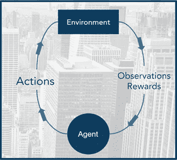
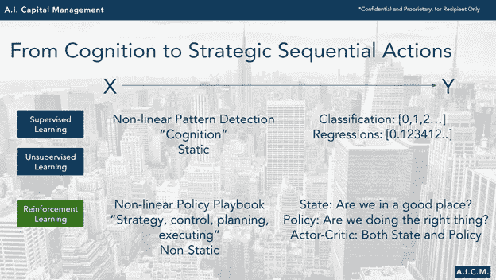

# 在量化交易中应用深度强化学习(动量交易和市场中性交易)

> 原文：<https://towardsdatascience.com/applied-deep-reinforcement-learning-in-quantitative-trading-both-momentum-and-market-neutral-c0eef522ea11?source=collection_archive---------37----------------------->

## 人工智能资本管理研究系列文章

克里斯·利维拉尼在 [Unsplash](https://unsplash.com/s/photos/finance?utm_source=unsplash&utm_medium=referral&utm_content=creditCopyText) 上的照片

**摘要:**机器学习和人工智能在量化交易中变得无处不在。在基金或交易公司的日常运营中利用深度学习模型不再只是一个概念。与更著名和历史悠久的监督和非监督学习算法相比，强化学习(RL)似乎是一个新的领域，但有着惊人的记录，在游戏空间(AlphaGo，OpenAI Five 等)中解决了一个又一个问题。)，逐渐走向贸易世界，越来越多的人工智能专家认为它是 AGI 的未来(人工通用智能)。本文是众多文章中的一篇，讲述了如何开发和部署强化学习交易算法，以及深度强化学习在交易环境中的优势和挑战。

**作者:** Marshall Chang 是 A.I. Capital Management 的创始人兼首席信息官，这是一家定量交易公司，建立在深度强化学习对动量和市场中性交易策略的端到端应用之上。该公司主要以中高频交易外汇市场。

**强化学习与无监督学习有什么不同？**

这篇开篇文章将讨论强化学习与无监督学习相比是如何工作的。目标是用理论的方式解释 RL，在交易中使用外行的术语和例子。目标受众将是具有良好机器学习知识的从业者和量化研究人员，以及没有计算机科学背景但非常了解市场、风险/回报和交易业务的交易者。对于想要系统学习 RL 的从业者，我推荐 youtube 上大卫·西尔弗的 UCL 课程，以及萨顿&巴尔托的书:《强化学习》。

从根本上说，机器学习的任务是使用函数/模型来映射 2 个数据集之间的相关关系，这可以像 1 个变量的线性回归一样简单，也可以像具有数百万个参数的深度神经网络一样复杂。在交易的世界中，我们自然希望找到 X 数据集和 Y 目标之间的任何可概括的关系，Y 目标是未来的价格运动，无论距离未来多近或多远。

对于监督和非监督学习方法，这两个数据集是在我们训练模型之前准备的，或者换句话说，它们是静态的。因此，无论模型发现的关系有多复杂，它都是一个静态关系，因为它表示一个预设的数据集。尽管我们在训练和验证无监督的深度模型方面拥有丰富的知识和经验，但这种静态关系在金融界很少出现。更不用说像神经网络这样的训练模型是一个全局优化过程，这意味着 10 年前和昨天的数据对于时间序列中的“人工智能”模型来说同样重要，尽管真正重要的是下个月的表现。

首先，RL 不同于无监督/监督学习，因为它的模型是在动态数据集上**训练的，以找到动态策略，而不是在静态数据集上找到关系**。为了理解这是如何工作的，我们需要理解 RL 是如何被设计成环境中基于代理的问题的。该模型由一个代理表示，该代理根据设计观察环境状态，通过动作与环境交互，并接收奖励和状态转换形式的反馈(如果我们现在做这个动作，我们将结束)。

来自 AICM 演示幻灯片

RL 模型的训练数据 X 是代理人遇到的经验，以[观察/状态，行动]的形式，而目标数据 Y 是在这种情况下这种行动的结果奖励/惩罚，以[奖励，下一次观察/状态]的形式。**在更高的层次上，代理人根据其经验接受训练，以学习与环境互动的最佳行动集，从而获得最大的回报。**

这个训练过程是动态的，在 RL 中被称为策略学习，因为随着代理训练，它继续与环境交互并积累新的经验，迭代地加强好的行为并减少坏的行为，并最终解决环境问题。因此，经过训练和验证的 RL 模型是针对特定环境通过反复试验学习的动态策略规则书。这意味着在目前广泛使用的已经复杂的神经网络模型的基础上增加了一层额外的非线性，但如果做得正确，结果是 AlphaGo 能够解决平均 150 步的棋盘游戏围棋，游戏的总可能变化超过了宇宙中的原子数量(10 ⁶⁰).

无监督学习中的静态关系映射在认知任务中取得了重大进展。图像识别(Imagenet 竞赛，iPhone 面部识别等。)和语音/文字(siri、alexa 等。)认知是我们近年来突破的两个主要认知领域。RL 正在突破的是**顺序决策领域，以战略性地计划、执行和学习**，这也是以前智慧生物所独有的。

来自 AICM 演示幻灯片

对于围棋来说，简单地识别和记住无限数量的棋盘排列并不重要，除非玩家知道在哪里放置下一个筹码，以及之后的数百个筹码，以最终赢得比赛。这对于交易来说也是一样的，知道过去并不重要，除非交易者能够安排他/她的交易，并依次分配适当的风险，最终实现正的 NAV。这，其实就是 RL 算法完美设计的目的，用无/监督学习实现超人认知能力后的下一步。

在这篇文章中，我们已经提到了强化学习在交易中的潜在优势:

**首先，**环境和基于代理的设计输出动态策略，而不是静态关系。在接下来的文章中，我们将讨论相对于无监督/监督学习而言固有的**鲁棒性**，这将有助于克服深度学习的头号敌人，过度拟合。

**第二，****顺序任务设计**，使受训代理成为环境中的单个**端到端参与者。对于交易，我们可以设计这样的环境，它不仅可以按顺序安排和管理交易，还可以根据投资组合 NAV 通过资本分配来权衡近期和未来的风险/回报。我们将在以后的文章中具体讨论我们在 RL 环境、代理行为和奖励设计中有哪些工具。**

**第三个**也可能是最重要的，强化设计和政策学习，使**代理能够不断学习并适应不断变化的环境**。交易中最难的任务不是找到一个有效的策略，而是当策略失效时该怎么办，因为没有什么是永远有效的。通过深度神经网络，我们可以找到历史数据中的任何关系，并通过传统的机器学习方式进行验证。然而，一旦部署，事情开始改变，我们就剩下一个无法解释的黑盒，它仍然是一门艺术而不是科学来训练。这也是深度学习还不是主流的部分原因。RL 通过设计解决了其中一些缺点，但它远不是一个简单的解决方案，需要大量的艰苦工作和反复试验才能实现。

在以后的文章中，我们将深入讨论这些优势的细节，以及各自的挑战。

***来自《走向数据科学》编辑的提示:*** *虽然我们允许独立作者根据我们的* [*规则和指导方针*](/questions-96667b06af5) *发表文章，但我们并不认可每个作者的贡献。你不应该在没有寻求专业建议的情况下依赖一个作者的作品。详见我们的* [*读者术语*](/readers-terms-b5d780a700a4) *。*