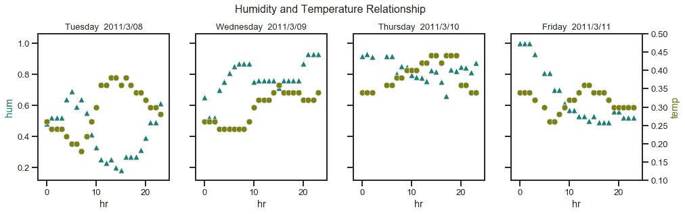

# 应用探索性数据分析，自行车共享。可视化的力量，Python。

> 原文：<https://towardsdatascience.com/applied-exploratory-data-analysis-the-power-of-visualization-bike-sharing-python-c5b2645c3595?source=collection_archive---------7----------------------->

# 1.介绍

这项研究分析了一个修改后的自行车共享数据集。与原始数据集不同，这个“修改”版本包括空值、零和异常值，这为详细的探索性数据分析 **EDA** 打开了大门。许多关于自行车共享的公共研究包括基础 EDA，然后直接进入建模。该分析的总体目标是执行广泛的 EDA，该 EDA 考虑了现象的物理性质，并为自行车共享租赁建模提供了见解。读完这篇文章后，你会知道:

*   利用人类大脑的视觉能力可以了解拥挤地块的模式或趋势..
*   使包含空值和非空值单元格的行在绘图中可见的技巧。
*   可疑模式的识别和解决它们的建议步骤。
*   在 EDA 过程中揭开数据背后故事的连续步骤。
*   在进行插补之前，考虑解释现象的物理学的重要性。
*   影响自行车租赁数量的变量的初步评估。
*   Python 代码以直观对比的方式在绘图上呈现数据，这有助于揭示模式并理解数据背后的“谜题”。

请注意，数据探索是使用 Python(版本 3.7.4)和数据科学库执行的，例如`NumPy`、`Pandas`、`SciKit-Learn`、`Seaborn`、`category_encoders`、`scipy`和`date time`等等。

**目录**
1…..简介
2…..属性信息
3…..空值、零和异常值
4…..相关结构
5…..响应变量的单变量行为
6…..带有时间变量的响应变量的行为
7…..结论
8…..参考

# 2.属性信息

数据集包含六个与时间相关的变量，四个连续变量，以及自行车的响应变量计数' *cnt'* 。

# 2.1.特征工程和编码

为了 a)促进数据过滤，b)从数据中提取隐藏信息，c)分析图中的趋势，以及 d)对自行车共享租赁进行建模，可以方便地推导和编码如下一些特征:

请注意*‘季节’*变量携带排序(即，夏季之后是秋季)。Sci-Kit-learn 的`*LabelEncoder()*`等编码算法不会考虑季节的顺序，因为它是按字母顺序编码的。相反，`*category_encoders*`库允许使用字典映射来建立定制的顺序。

# 3.空值、零和异常值

数据表包含标识特征或变量的列，以及包含每个特征数据的单元格的行。如果某一行恰好有一个包含空值的单元格，即使该行中的其余单元格都是非空值，整行也会导致一些算法出错。另一方面，如果零点和异常值代表误差源，它们将对模型产生负面影响。因此，首要任务是识别、分析并解决空值、零和异常值。标签的使用促进了这一过程；本节分析描述了这一过程。

# 3.1.从标记空值开始。

`*df.isna().sum()*` 的执行识别数据集中具有空值的特征。 *temp'* 和' *hum'* 是仅有的两个具有空值的特征。名为' *outlr_miss'* 的列将存储具有以下值的标记:(注意 Python 中的 NaN 表示非数字，这就是后缀' *_nan'* )的原因

一旦包含空值的行被标记，应该正好有 23 行显示*‘temp _ nan*或*‘hum _ nan’*标记。观察下面的熊猫数据帧输出。

# 3.2.标记零

旁边的图显示的是`*df.isin([0]).sum()*` *的输出。*诸如“小时”*小时“*之类的序数特征或诸如“*假日”*或“*工作日”*之类的布尔特征应该有零。但连续特征中的零如' *atemp'* 有 2 个零值' *hum'* 有 22 个零值' *windspeed'* 有 2180 个零值就可疑了。请注意，标签带有后缀“_zero ”,表示该行有零。下面是编码空值和零的 Python 代码片段。

# 3.3.散点图或配对图显示了零值、零和异常值

散点图对于评估要素间的共线性以及识别空值、零和异常值非常有用。乍一看，矩阵图看起来像一堆小的单色图，有时非常小，以至于让我们怀疑它们的用途。但是，当这些图以正确的颜色对比显示数据时，它们会触发人类的大脑。记住，人类的大脑天生是视觉的，它通过图像和颜色更好地处理信息。这就是标签有用的地方，它们变成了一个给空值、零和离群值着色的类别。
在分析的这一点上，自行车共享数据表包括具有包含空值的单元格的行。这是一个隐含的问题，因为大多数绘图和机器学习 ML 算法在出现空值时会咳嗽。默认情况下，这些算法通过排除具有空值的行来解决这个问题。默认设置的结果是，具有空值和非空值的行在绘图中完全不可见。下一节解释了一个**零-零替换**技巧，该技巧使用标签使具有空值和非空值的行在绘图中可见。

## 3.3.1.绘图的代码

Python 库 seaborn 方便了各种情节的构建；然而，当出现空值时，`*pairplot(..)*`等算法会咳嗽。这个分析提出了两个技巧来克服这个问题。

*   **归零替换绝招**。Plots 以类似表格的格式接收数据；它们有代表特性或变量的列和代表实际数据的行。当表中的行为空时，绘图算法会产生错误。为了解决这个问题，用户和统计应用程序会自动排除具有空值的行。因此，位于相同行中的非空值在图上变得“不可见”。
    这个分析提出了**一个零-零替换技巧**，使用零来替换零。这种转换发生在运行时，同时数据被提供给 Python 绘图算法；因此，空值在原始数据集中保持不变。
*   **标签的自定义调色板**。Python 绘图算法遵循预定义的调色板，许多时候颜色之间的对比度会对人眼产生阴影数据模式。自定义调色板的定义解决了这个问题，观察下一个 Python 代码。

## 3.3.2.空值、零点和异常值的分析

本节重点介绍帮助识别和分析图中的空值、零和异常值的技巧。

**(1)揭示具有空值和非空值的行**。 ***零-零替换技巧*** 允许在散点图中呈现具有空值和非空值的行。观察对应于*‘temp _ nan’*标签的橙色圆点；每个橙色点代表数据表中某一行的单元格值。请记住，这些橙色点代表空值或非空值，具体取决于图。一方面，橙色点代表温度*‘temp’*为变量之一的那些图中的空值；在散点图中，这些图被橙色矩形包围。注意，在这些图中，零表示空值；这就是为什么橙色圆点在' *temp=0'* 处遵循线性模式。另一方面，橙色点表示温度' *temp'* **不是**变量之一的那些图上的非零值。
橙色和蓝色圆点遵循相同的解释。请注意，这些点的标签带有相同的后缀 *'_nan* '。该工作流的下一步将在建模之前处理这些空值。

> 注意:对 ***零-零替换技巧*** 的一个改进是对那些代表空值的点使用透明颜色。这需要额外的编码来在运行时操作数据和分配颜色。

**(2)** **显示真零值的异常值**。观察对应于' *hum_zero'* 标签的黑点；它们用零值表示湿度'*哼'*。这些零值确实存在于数据表中。这些黑点形成了一个突出的线性图案。带有*‘atemp-zero’*和*‘wind speed _ zero’*标签的点的解释与黑点类似。这些零值代表异常值，需要在执行进一步分析之前解决。

**(3)离群值**。以温度'*、温度'*'和'感觉样'温度' atemp '为变量的散点图显示了一系列形成线性模式的灰点。这些点应被标记为异常值，因为:1)它们从形成 45 度趋势的大多数点中脱颖而出，2)它们显示' *atemp'* 的常量值，这是可疑的，3)它们都发生在 2012 年 8 月 17 日的某一天，这也是可疑的。同样，这是一个被修改的数据集，可能是手工修改的，这些异常值需要在建模前处理。以下是将这些异常值标记为' *atemp_outlr* '的 Python 代码片段:

# 3.4.处理空值、零和异常值

使用均值、中值或众数等指标进行插补的策略似乎适用于单变量分析。自行车共享数据集是一个多元数据集，解决空值、零和异常值的第一次尝试应该包括探索数据集中各要素之间的相关性或相似性。

## 3.4.1.处理温度的零值、零和异常值

我们都经历过这一点，在高温‘temp’下，‘感觉上’的温度高于实际温度；相反，在低温下，“感觉”温度低于实际温度。这些变量之间的线性关系有助于解决和校正温度的零值、零点和异常值。
下图显示了温度*、【temp】、*和*、【atemp】、*之间的线性关系。一个变量告诉另一个变量。因此，在建模期间，可以从分析中删除这些变量中的一个。然而，我们将使用这种关系来强调这样一个事实，即在处理空值、零值或异常值时，寻找变量之间的关系或相似性应该是列表中的第一个选项。

左边的散点图显示了所有的原始数据。代表标签的颜色揭示了三种可疑的模式(观察每个标签的后缀):异常值(浅蓝色点)、零(洋红色点)和空值(橙色点)。记住，橙色的点代表被零代替的空值；**调零技巧**使零点在图上显示为零，我们可以直观地评估它们的数量以及对这些零值的修正是否有意义。这就是标签变得方便的地方；它们允许在数据从 *Sci-Kit-learn* 输入线性回归模型之前过滤可疑趋势。一旦模型被训练，它就被用来校正温度中的可疑模式。

## 3.4.2.湿度的零位和零点寻址

[湿度](https://en.wikipedia.org/wiki/Humidity)或空气中的水蒸气量通常在天气报告中被称为相对湿度。相对湿度与露点和温度有关；因此，试图解决湿度零值和零值的第一次尝试应该包括识别与温度和露点的相关性或相似性。
自行车共享数据集提供了湿度和温度值，但该数据集中缺少露点值。下图调查了湿度与数据集中可用变量的可能关系或相关性。请记住，在这些图中，蓝点表示以零表示的空值(这些点在数据表中不存在)。

这些图显示了湿度缺乏一个确定的模式；然而，模式是存在的。人类的大脑是一个视觉学习者，数据需要以块和颜色的形式呈现，以揭示可能的模式。更详细地研究数据应该有助于确定湿度的可能关系。想想看，早上的温度很低，然后在下午逐渐升高，最后在一天结束时降低。由于温度与湿度相关，这表明白天可能存在湿度关系。下一张图显示了每天的温度和湿度。

前面的图显示了湿度、温度和风速的每日值缺乏定义的模式。然而，下一张图展示了一幅不同的画面；它显示了湿度和温度在一天的几个小时中相互作用的模式。第三个图，从左到右，显示湿度值为零；这些值存在于数据集中，它们**不是**的结果**零零替换技巧**。

> 请注意，用颜色和块(按天)表示的数据允许大脑了解温度和湿度之间的相反模式；用平均值代替湿度中的零是没有意义的。

下图证实了这一点，黑点有一个*‘哼 _ 零’*标签。后缀 *'_zero'* 表示实际上那些在原始数据集中是零。

观察湿度和温度遵循相反的趋势，这与[天气报告](http://www.fao.org/3/X0490E/x0490e07.htm)描述的行为一致。湿度不仅与温度有关，还与露点有关；因此，要计算一个值，[需要另外两个值](http://www.dpcalc.org/)。自行车共享数据集中没有露点；因此，不能从自行车共享数据集推导出直接的关系来计算湿度的空值和零值。

任何处理零湿度值的关系都需要考虑湿度、温度和露点的日常关系。随机森林是解决湿度零值和零值的一个很好的起点，因为:

1)湿度、温度和露点之间的关系不是线性的
2)随机森林在预测其训练值范围内的值方面做得很好。
3)缺乏与露点相关的信息使得直接得出湿度值变得困难。

用于训练随机森林回归的数据集具有非空的湿度值。一旦训练了随机森林回归量，就可以用它来预测湿度的空值。下面是 Python 代码的一个片段。

下图显示了随机森林回归的结果。观察 2011/3/10 周四的情节；在应用随机森林之前，该地块在*‘hum = 0’*处具有水平趋势。在应用随机森林树回归器后，该图显示了一个湿度趋势:a)与[天气预报](http://www.fao.org/3/X0490E/x0490e07.htm)中报告的每日湿度趋势相匹配，b)正好在星期三结束时开始，并与星期五的开始趋势相匹配。

> 因此，在这种情况下，Random Forest Regressor 不仅很好地处理了空值和零值，而且还考虑了湿度、温度和露点的物理特性。

## 3.4.3.风速中的零地址

下图显示了不同特征的风速行为。观察绿点；它们代表湿度的零值。这些点不仅在散点图中形成分离的模式，而且在分布图中形成双峰行为。随机森林回归器是解决这种可疑湿度模式的良好起点。

下图显示了随机森林回归的结果。分布图显示了单峰行为，绿点在*风速= 0’*不再形成水平趋势。

# 4.相关结构

识别特征间共线性的一种方法是使用相关矩阵，它提供了[皮尔逊相关系数](https://en.wikipedia.org/wiki/Pearson_correlation_coefficient)。直观地说，自行车数量不仅取决于与天气条件有关的变量，还取决于时间。因此，相关矩阵包括天气和时间变量。
温度' *temp'* 和类感觉温度' *atemp'* 之间的共线性是明显的。因此，从' *temp* '获得的类似感觉的温度将在建模过程中被排除。总的来说，自行车数量与温度呈正相关，与湿度呈负相关。散点图矩阵的底行显示了这些趋势。另外，请注意，一些时间变量与自行车数量有很高的相关性；小时更是如此。接下来的部分将以图表的方式探索自行车数量与时间变量之间的关系。

# 5.响应变量的单变量行为

自行车数量的分布*【CNT】*是右偏的，需要进行对数变换来修正该行为。即使对数变换不能完全校正偏斜度，结果也接近正态分布。这种转变将对一些机器学习算法产生积极影响。

# 6.具有时间变量的响应变量的行为

观察下图中箱线图的中值(高于数据的 50%);它显示了自行车租赁数量的四个一般特征。1)租金逐年增加，2)趋势最初随着时间的推移而增加，然后减少，3)趋势随着时间的推移而循环，以及 4)异常值的存在。更详细地说，可以得出以下陈述:

*   前两个方框图表明，从一月份开始，租金逐渐增加，并在整个春季持续增长，在夏季达到峰值。然后，租金在秋季和冬季下降，以适应第二年 1 月和春季的趋势，这是周期性行为的一个迹象。自行车租赁发生在夏季。
*   左中框图示出工作日期间自行车租赁需求较高。这一现象更加明显，连续第二年增长了近 50%。这一行为标志着自行车租赁的流行程度正在增加，至少在该数据集的城市来源中是这样。
*   右中框图示出了人们在假日出行减少的情况。然而，这个情节也揭示了这些年来自行车租赁的普及程度的增加。
*   底部方框图也类似于流行度的增加和周期性行为。这一次在一天的短时间内进行两次循环。对自行车的需求出现在上午 7-9 点和下午 5-6 点之间。这些模式匹配上班和下班的工人；工人们实际上使用自行车作为工作的交通工具。请注意，需求在采摘时间之间保持相对稳定，这可以用“普通人”、游客和使用自行车的学生来解释。

我们来考察下一组地块。观察大脑如何轻松消化多种趋势，得益于图上不同的排序和颜色。连续趋势线的拐点描绘了一天中每小时租赁自行车的平均数量。这些趋势线与我们刚才解释的模式和特征相似。这些图给了我们额外的信息。虚线表示一天中几个小时平均温度的变化。这种趋势有助于我们确定，至少是部分确定(记住这是多变量分析，湿度、风速和露点不在这些图中)，一天中几个小时内温度对租赁自行车数量的影响。

上面的图揭示了有趣的趋势。秋季显示全天最高的平均温度；相比之下，春天全天平均温度最低。春天最低的平均温度似乎与最低的平均自行车数量相关，这也发生在春天。我们可以说人们在春天不怎么骑自行车；也许人们想远离花粉、灰尘等。在这些时期，人们不想染上过敏症。

趋势的重叠告诉我们夏天、秋天和冬天的平均自行车数量。人们可能认为这可能与温度有关；然而，告诉我们同一季节平均温度的趋势并不重叠。换句话说，平均温度趋势的分离与夏季、秋季和冬季的平均计数趋势的分离不匹配。

> **(*)** 因此，夏季、秋季和冬季的平均温度不会改变自行车的平均需求趋势。然而，由于温度不是控制天气状况的唯一因素，似乎在夏天、秋天和冬天有一个相对恒定的自行车需求的可变因素的混合。
> **(*)** 此外，与春季相比，夏季、秋季和冬季的平均自行车需求更高。

最后的情节也揭示了一个有趣的趋势。平均温度在一周的几天里保持不变。你可能会问:当前面的图显示平均温度在一天的同一时间变化时，这怎么可能呢？这个图显示了所有周一和所有季节的平均温度，比如说在 23 点整。这个平均温度碰巧在星期二、星期三等相对相同。您可以手动运行计算，比如在 23 小时后进行确认。注意温度趋势的曲折性；尽管这是一个平均趋势，但它遵循[天气报告](http://www.fao.org/3/X0490E/x0490e07.htm)中报告的趋势。

在这最后一个情节中还有另一个有趣的趋势。想象一下，平均自行车数的选择不在最后一个图中。然后，在周末，尤其是上午晚些时候和下午早些时候，对自行车的平均需求更高。

# 1.1.结论

总的来说:

*   显示所有变量的所有数据的单色图欺骗了人脑。人类是视觉学习者，图中的颜色影响很大。当图用引用不同类别、标签或短时间范围的颜色显示数据时，它们揭示了探索性数据分析过程中有价值的模式和见解。
*   解决空值、零点和异常值的第一步是识别可用变量之间的相关性或相似性。使用均值或中值等指标估算值的策略适用于单变量分析，应该是最后的行动。
*   随机森林回归器是解决空值、零和异常值的良好起点；它提供的结果尊重这个数据集中的物理现象。
*   描述周末平均自行车数量的趋势不同于周一至周五(工作日)的趋势。在工作日，高峰时间上午 6:30-8:530，下午 5:00-7:00 的自行车需求。
*   描述春季平均自行车数量的趋势不同于夏季、秋季和冬季的趋势。夏季、秋季和冬季的平均自行车需求保持相对稳定(观察这些趋势重叠)。
*   还不能 100%确定温度是否是自行车需求不同趋势的唯一原因。记住温度不是天气状况的唯一因素。
*   自行车数量的趋势是日复一日、年复一年循环往复的。

# 8.参考

*   在天气预报中，空气中的湿度或水蒸气含量通常被称为相对湿度。
*   [天气报告](http://www.fao.org/3/X0490E/x0490e07.htm)描述了相对湿度、温度和露点之间的相互作用。
*   [相对湿度、温度、露点计算器](http://www.dpcalc.org/)。
*   修改后的自行车共享数据集和本出版物的 Python 代码源位于我的 [GitHub 账户](https://github.com/mRamAries/ModifiedBikeSharing)中。

👉联系我: [LinkedIn](https://www.linkedin.com/in/misael-uribe/)