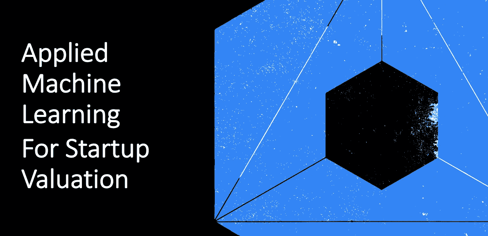
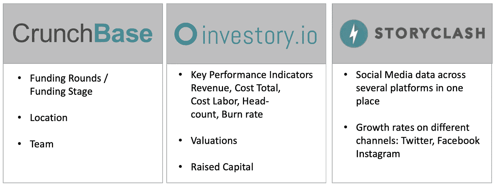
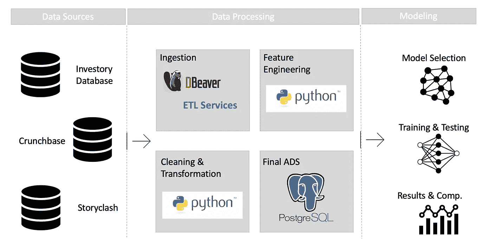
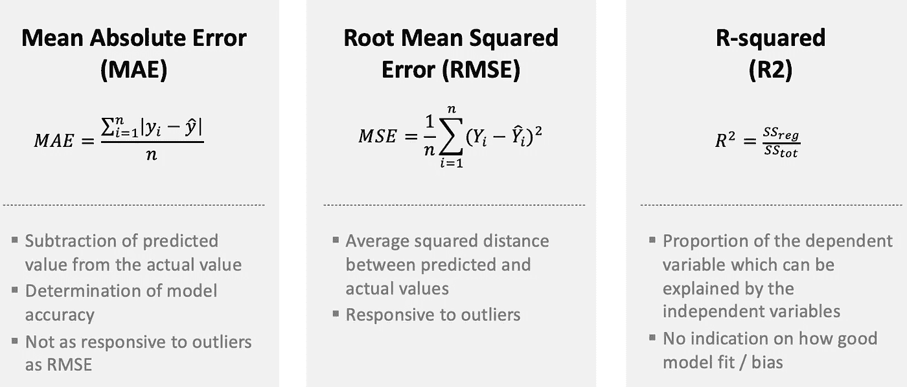
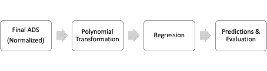
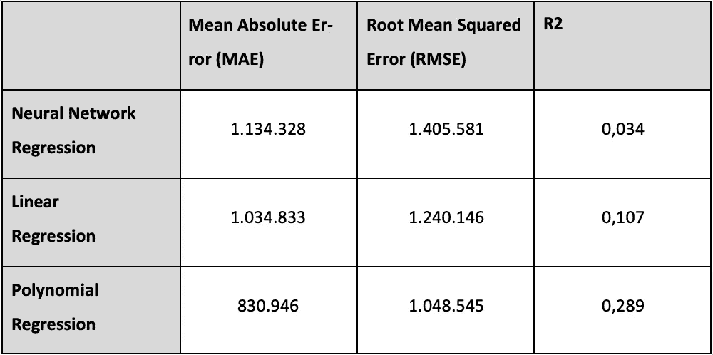
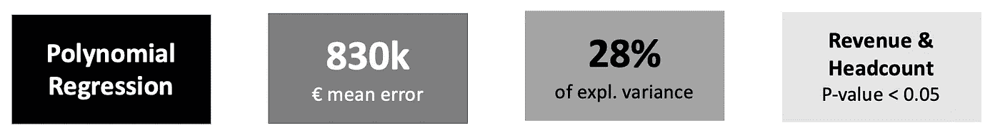

# 应用机器学习模型提高初创企业估值

> 原文：<https://towardsdatascience.com/applied-machine-learning-models-for-improved-startup-valuation-a7b180fee127?source=collection_archive---------20----------------------->

由于历史数据有限、现有收入很少甚至没有、市场不确定性等等，在大多数情况下，确定早期创业公司的估值非常具有挑战性。因此，传统的估值技术，如贴现现金流(DCF)或倍数(CCA)，往往会导致不适当的结果。另一方面，替代估价方法仍然受制于个人的主观评估，对其他人来说是一个黑箱。

*因此，基础研究利用机器学习算法来预测公平、数据驱动和可理解的初创公司估值。三个不同的数据源被合并并应用于三个回归模型。回归模型的性能根据定义的度量进行比较，最终结果是一个连续的数值——预测的启动估值。*



应用机器学习进行初创企业估值(图片由作者提供)

# 最重要的是:获得正确的数据

为了建立机器学习模型并获得显著的结果，拥有坚实的数据库是必不可少的。在这种情况下，最终的分析数据集是公共和私有、匿名数据源的组合。这项研究是通过与 [investory.io](https://investory.io/) 合作来获得匿名的关键绩效指标，以及初创公司的统计表数据。结合 Crunchbase，可以将这些数据映射到融资阶段、融资轮次、地点和团队规模。最后但并非最不重要的是，我们使用了社交媒体数据，因为之前的一项研究(“社交是新金融”，金等人 2017 年)发现了完成投资轮的可能性与 Twitter 活动之间的关系。在这一点上，大声喊出来 [Storyclash](https://www.storyclash.com/) 访问他们惊人的社交媒体分析平台。



数据源概述(图片由作者提供)

# 数据预处理

大部分工作都必须花在将不同的数据源合并在一起并清理它们上。虽然 [investory.io](https://investory.io/) 数据已经是一种干净的数字格式，但是 [Crunchbase](https://www.crunchbase.com/) 数据并没有通过他们的 API，因此格式非常不干净。



数据处理概述(图片由作者提供)

一开始，不同表和信息的概述是由一个简单的数据库客户机 DBEAVER 生成的。之后，主要在 Python 编程的帮助下提取、转换和加载相关信息。

由于这产生了无数行代码，我们不会深入每个细节，但选择一些例子作为下面的数据规范化。但让你简单了解一下:有来自 50 多个国家的公司，有各种不同的货币和地方特色。人们常说，数据准备、清理和转换消耗了一个数据科学家 80%的时间。在这种情况下，这种说法也证明了自己是正确的。

**标准化&缩放**

为我们的机器学习算法准备数据集的一个重要步骤是归一化。这个想法是把数字值放在一个共同的范围内。这是必要的，因为我们有人数和收入两个特征。虽然收入可能是一个 6 位数的数值，但人数不太可能超过 100。这些功能具有非常不同的范围，收入只会因其更高的价值而对我们的模型产生更大的影响。

```
#Data Normalization
from sklearn.preprocessing import MinMaxScaler#Select numerical columns which needs to be normalized
train_norm = x_train
test_norm = x_test# Normalize Training Data 
scaler = MinMaxScaler(feature_range=(0, 1))
x_train_norm = scaler.fit_transform(train_norm)#Converting numpy array to dataframe
training_norm_col = pd.DataFrame(x_train_norm, index=train_norm.index, columns=train_norm.columns) 
x_train.update(training_norm_col)
print (x_train.head())# Normalize Testing Data by using mean and SD of training set
x_test_norm = scaler.transform(test_norm)
testing_norm_col = pd.DataFrame(x_test_norm, index=test_norm.index, columns=test_norm.columns) 
x_test.update(testing_norm_col)
print (x_train.head())
```

最小最大值缩放器对异常值非常敏感。如果您的数据有一些严重的异常值，请事先处理好。规范化数据的范围通常在 0 到 1 之间，如上面的代码所示。

# 应用回归模型

在该项目中，有三个回归模型应用于数据集。它们是根据它们的特性和通常的应用目的来选择的。每个回归模型都借助三个指标进行评估:平均绝对误差、均方根误差和 R 平方。



评估指标(图片由作者提供)

**线性回归**
线性回归描述了寻找尽可能接近给定数据点的直线的过程。该模型然后试图最小化平方误差。由于假设公司估值随着业绩逐渐改善而增加，因此对给定数据集应用线性回归。此外，由于本项目的数据集中给出了多个特征，因此这不是简单的多元线性回归。由于该项目是使用 Python 建立的，因此 statsmodels 模块用于执行回归和评估预测结果。虽然有几个类可用，但选择了普通最小二乘法，因为它主要用于训练数据中的线性关系。

```
# Linear Regression
import pandas as pd
from sklearn import linear_model
import statsmodels.api as sm# with sklearn
regr = linear_model.LinearRegression()
regr.fit(x_train, y_train)print('Intercept: \n', regr.intercept_)
print('Coefficients: \n', regr.coef_)# with statsmodels
x_train = sm.add_constant(x_train) # adding a constant

model_OLS = sm.OLS(y_train, x_train).fit()
#predictions = model.predict(x_test) 

print_model = model_OLS.summary()
print(print_model)
```

第一行中的常数(const)表示所有其他变量为零时的估计值。这个常数被计算为 986.000 €。此外，该模型的收益系数的 p 值为 0.003，具有统计学意义。在移除一个又一个系数(总是具有最不重要值的一个)后，就有了明显驱动模型的系数:p 值为 0.000 和 0.004 的收入和员工人数。

**多元回归** 多项式回归分两步进行。首先，数据必须转换成多项式。1 度将产生简单的线性回归。要创建多项式回归，次数必须大于 1，并且要小心选择，因为如果值选得太高，模型可能会过度拟合。



(图片由作者提供)

多项式回归的最终代码如下所示:

```
# Poly Regression
import operator
import pandas as pd
import matplotlib.pyplot as pltfrom sklearn.linear_model import LinearRegression
from sklearn.metrics import mean_squared_error, r2_score, mean_absolute_error
from sklearn.preprocessing import PolynomialFeatures# with sklearn
polynomial_features= PolynomialFeatures(degree=2)
x_poly = polynomial_features.fit_transform(x_train)model = LinearRegression()
model.fit(x_poly, y_train)
y_poly_pred = model.predict(x_poly)MAE = mean_absolute_error(y_train,y_poly_pred)
rmse = np.sqrt(mean_squared_error(y_train,y_poly_pred))
r2 = r2_score(y_train,y_poly_pred)
print(MAE)
print(rmse)
print(r2)
```

**神经网络回归**

众所周知，神经网络优于传统的学习算法，尤其是在图像识别或分类问题上。将神经网络应用于回归问题在现有文献中并不常见。这可能是由于用于回归的神经网络可能被认为对于回归来说过于工程化，这在许多情况下更简单并且不需要那么多计算能力。但另一方面，也有人认为，深度神经网络模仿人脑，因此在复杂任务中表现更好。鉴于当前数据集非常复杂且具有许多特征的事实，其思想是应用神经网络来提高性能，与之前应用的传统模型竞争。

```
## Neural Networkmodel = Sequential()
model.add(Dense(256, input_dim=10, kernel_initializer='normal', activation='relu'))
model.add(Dense(512, activation='relu'))
model.add(Dense(512, activation='relu'))
model.add(Dense(1, activation='relu'))
model.summary()model.compile(loss='mse', optimizer='adam', metrics=['mse','mae'])
```

在这种特定情况下，模型具有一个输入层、两个具有 512 个节点的隐藏层和一个输出层。选择的激活函数是校正线性单位函数(ReLU)。该函数被广泛使用，由于其在低计算能力下的良好性能及其不同时激活所有神经元的能力，该函数通常是良好的首选。最后一层是输出层，只有一个节点负责最终输出。在这种情况下，私人公司估值。在这种情况下，使用均方误差作为损失测量和优化器 adam 获得了最佳结果。与随机梯度下降优化相反，adam 优化器管理网络中每个参数(权重)的学习速率，并单独调整它们。最终的神经网络模型如下所示:

**评估车型性能** R2、梅和 RMSE 用于确定各车型的整体性能并进行比较。解释系数有助于找到模型的驱动因素。在解释结果之前，可以看出多项式回归优于神经网络回归和线性回归。



此外，该模型的收益系数的 p 值为 0.003，具有统计学意义。在移除一个又一个系数(总是具有最不重要的值)后，有两个系数明显地驱动了该模型:p 值为 0.000 和 0.004 的收入和员工人数

# 预测初创企业估值的结果



表现最好的机器学习模型是多项式回归模型。它有一个 28%的解释偏差，这是模仿人类行为可以接受的。此外，平均误差为 830，000 欧元，KPI 特征“收入”和“人数”对模型有显著的统计影响。

底层的应用机器学习模型只考虑结构化的性能数据。通常会极大推动初创公司估值的重要因素，如管理团队经验、技术优势、运营市场增长等，尚未得到考虑。这也解释了适度的 r 平方值。需要说明的是，当涉及到 r 平方时，特别是当模型模拟人类行为时，没有定义接受水平的标准指南。

研究表明，利用少量结构化的私营和上市公司数据，一个简单的回归模型就能得出有用的估值。为了进一步开发机器学习模型并提高其性能，强烈建议下一步考虑更多的功能。来自上述领域的非结构化数据与其他增长指标相结合，很可能会显著提升模型性能。

***************************************************************

特别感谢 investory.io 的 Guillermo Falco 和 SRH 海德堡的 Barbara Sprick 教授博士支持这项研究。

***************************************************************

您可能也喜欢阅读的文章:

[学习如何预测客户流失](/hands-on-predict-customer-churn-5c2a42806266)

[生成样本数据集——数据科学家的必备技能。](/generate-your-sample-dataset-a-must-have-skill-for-data-scientists-36ded8600b79)

[使用 Docker](/hands-on-setup-your-data-environment-with-docker-dca629607148) 设置您的数据环境

[消除流失是增长黑客 2.0](https://blog.markgrowth.com/eliminating-churn-is-growth-hacking-2-0-47a380194a06)

[数据误导&统计](/misleading-with-data-statistics-c6d506bdb9cf)