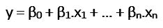
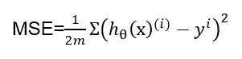
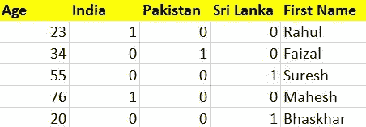
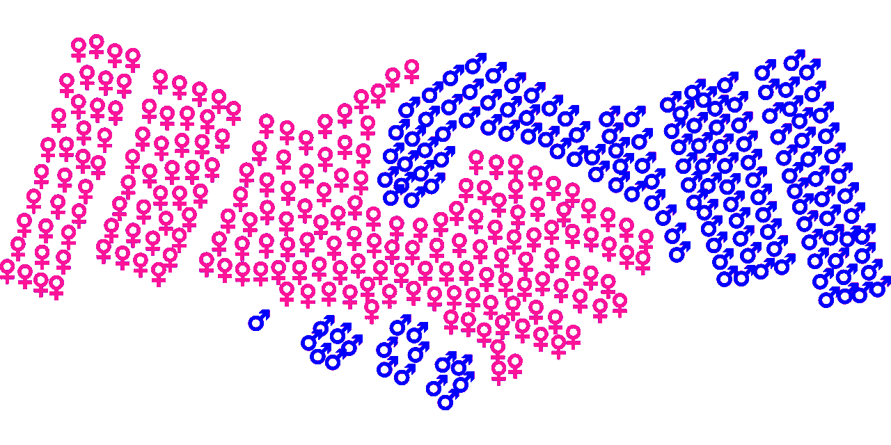

# 应用多元回归

> 原文：<https://towardsdatascience.com/applied-multivariate-regression-faef8ddbf807?source=collection_archive---------19----------------------->


图片由[皮克斯拜](https://pixabay.com/?utm_source=link-attribution&utm_medium=referral&utm_campaign=image&utm_content=3502291)的[米尔科·格里森迪](https://pixabay.com/users/Hurca-8968775/?utm_source=link-attribution&utm_medium=referral&utm_campaign=image&utm_content=3502291)拍摄

## 机器学习系列的第 4 篇

在本文中，我们将了解多元回归的概念。我们还将讨论与算法相关的一个常见问题，即虚拟变量陷阱。

首先，我们将熟悉多元回归的概念，然后我们将建立自己的多元回归模型。然而，在开始之前，我建议你看一下我关于[简单线性回归](https://medium.com/analytics-vidhya/linear-regression-5100fe32993a)的文章，以便更好地理解这些概念。

# **什么是多元回归？**

多元回归是简单线性回归的扩展。当我们希望根据两个或更多不同变量的值来预测一个变量的值时，就会用到它。我们要预测的变量叫做**因变量**，而那些用来计算因变量的叫做**自变量**。

多元回归的数学函数/假设具有以下形式:



其中，n 代表自变量的个数，β0~ βn 代表系数，x1~xn 为自变量


图片由[弗兰奇](https://wiki.cdot.senecacollege.ca/wiki/DPS921/Franky)提供，来自 [CDOT 维基](https://wiki.cdot.senecacollege.ca/wiki/Main_Page)

使用多元模型有助于我们比较不同结果的系数。使多元或多元线性回归成为更好模型的是一个小的成本函数。

# **成本函数**

简而言之，它是一个为模型偏离观测数据的情况分配成本的函数。在这种情况下，我们的成本是**误差平方和**。多元线性回归的成本函数由下式给出:



我们可以把这个方程理解为我们的预测值和实际值之差的平方和除以数据集长度的两倍。较小的均方误差意味着更好的性能。通常，成本函数与梯度下降算法一起使用，以找到最佳参数。


图片来自[Pixabay](https://pixabay.com/?utm_source=link-attribution&utm_medium=referral&utm_campaign=image&utm_content=2724235)Nattanan Kanchanaprat

现在，我们将通过构建多元线性回归来实际应用我们所学的知识。

> *你可以在我的* [*GitHub*](https://github.com/ashwinraj-in/MediumArticles/blob/master/Multivariate_Regression.ipynb) *手柄上访问这个回归模型的完整代码和其他资源。*

在这个例子中，我们将预测一所房子的价值，给定的特征有中等收入、平均房龄、房间数、家庭数、平均面积、卧室数和地区人口。

## **步骤 1:导入库并加载数据**

我们的第一步是导入构建模型所需的库。没有必要在一个地方导入所有的库。Python 允许我们在任何地方导入任何库。首先，我们将导入 Pandas、Numpy、Matplotlib 和 Seaborn 库。

```
#Importing the libraries and and reading the data into a Pandas DataFrameimport pandas as pd
import numpy as np
import matplotlib.pyplot as plt
import seaborn as snstest=pd.read_csv("california_housing_test.csv")
train=pd.read_csv("california_housing_train.csv")
```

一旦导入了这些库，我们的下一步将是获取数据集并将数据加载到我们的笔记本中。对于这个例子，我采用了加州住房数据集。

## **第二步:可视化数据**

成功加载数据后，我们的下一步是可视化这些数据。Matplotlib 和**search**是优秀的库，可以用来可视化我们在各种不同地块上的数据。

```
#Visuaising our data using Seaborn Libraryplt.figure()
sns.heatmap(data.corr(), cmap='coolwarm')
plt.show()sns.lmplot(x='median_income', y='median_house_value', data=train)
sns.lmplot(x='housing_median_age', y='median_house_value', data=train)
```

## 步骤 3:特征工程

特征工程是利用领域知识通过数据挖掘技术从原始数据中提取特征的过程。我只选择了几列来处理这个模型的连续数值。

```
data = data[[‘total_rooms’, ‘total_bedrooms’, ‘housing_median_age’, ‘median_income’, ‘population’, ‘households’]]
data.info()data['total_rooms'] = data['total_rooms'].fillna(data['total_rooms'].mean())
data['total_bedrooms'] = data['total_bedrooms'].fillna(data['total_bedrooms'].mean())
```

当特征数量非常大时，特征工程变得更加重要。特征工程最重要的用途之一是减少过度拟合，提高模型的准确性。

## **第四步:拟合模型**

选择所需参数后，下一步是从 sklearn 库中导入 train_test_split，该库用于将数据集拆分为训练和测试数据。

```
#Splitting training and testing datafrom sklearn.model_selection import train_test_split
X_train, X_test, y_train, y_test = train_test_split(train, y, test_size = 0.2, random_state = 0)
y_train = y_train.reshape(-1,1)
y_test = y_test.reshape(-1,1)
```

在此之后，从**sk learn . model _ selection**导入**线性回归**，并且模型适合训练数据集。我们模型的截距和系数可以计算如下:

```
#Fitting the model on training datafrom sklearn.linear_model import LinearRegression
regressor = LinearRegression()
regressor.fit(X_train, y_train)#Calculating the Intercept and Coefficientprint(regressor.intercept_)
print(regressor.coef_)
```

可以通过找到模型的均方根误差来评估模型的性能。

```
predictions = regressor.predict(X_test)
predictions = predictions.reshape(-1,1)#Calculate RMSE of the modelfrom sklearn.metrics import mean_squared_error
print(‘MSE:’, mean_squared_error(y_test,predictions))
print(‘RMSE:’, np.sqrt(mean_squared_error(y_test,predictions)))
```

我们模型的 RMSE 是 0.6628934048044981。计算值与预测值的曲线图如下所示:

# **虚拟变量陷阱**

使用多元模型时，处理定量或数值数据很容易。然而，这对于分类数据来说是不一样的。它们不能直接使用，需要改造。

虚拟变量是用来代替分类数据的“代理”变量，分类数据有时出现在我们用来建立回归模型的数据集中。将所有哑变量用于回归模型导致哑变量陷阱。



作者图片

**虚拟变量陷阱**是独立变量多重共线的情况，即两个或更多变量高度相关。为了避免这种情况，建议在设计回归模型时排除一个虚拟变量。

## **这里有一个例子来理解这是如何工作的:**

让我们考虑性别的情况，它可以有两个值男性(0)或女性(1)。在使用标签编码程序将这些分类特征转换为数字属性后，如果我们包含两个虚拟变量，则会导致冗余，从而导致虚拟变量陷阱。



图片来自 [Pixabay](https://pixabay.com/?utm_source=link-attribution&utm_medium=referral&utm_campaign=image&utm_content=3773756) 的[戈登·约翰逊](https://pixabay.com/users/GDJ-1086657/?utm_source=link-attribution&utm_medium=referral&utm_campaign=image&utm_content=3773756)

这样的问题是可以避免的，如果我们在回归模型中不使用这两个变量，就好像一个人不是男性，那么预计这个人是女性。这样可以避免虚拟变量陷阱

# 资源

这里有一些资源，您可以使用它们来更深入地理解多元回归的概念。

1.  [Geeksforgeeks](https://www.geeksforgeeks.org/)
2.  [多元线性回归——初学者指南](/multiple-linear-regression-beginners-guide-5b602d716aa3)
3.  [从头开始编写多元线性回归](https://medium.com/data-science-101/writing-multivariate-linear-regression-from-scratch-19e32eeb6ab0)

现在我们已经到了这篇文章的结尾，我希望你会发现这篇文章真的很有启发性。我希望你发现它内容丰富！如果你有任何问题或者我做错了什么，请联系我！你可以通过[邮箱](http://rajashwin812@gmail.com)或 [LinkedIn](http://linkedin.com/in/rajashwin/) 与我联系