# 使用 Python 的应用图形网络分析

> 原文：<https://towardsdatascience.com/applied-network-analysis-using-python-25021633a702?source=collection_archive---------10----------------------->

## 让我们试着理解如何使用图形数据结构来分析使用 NetworkX 库的网络。

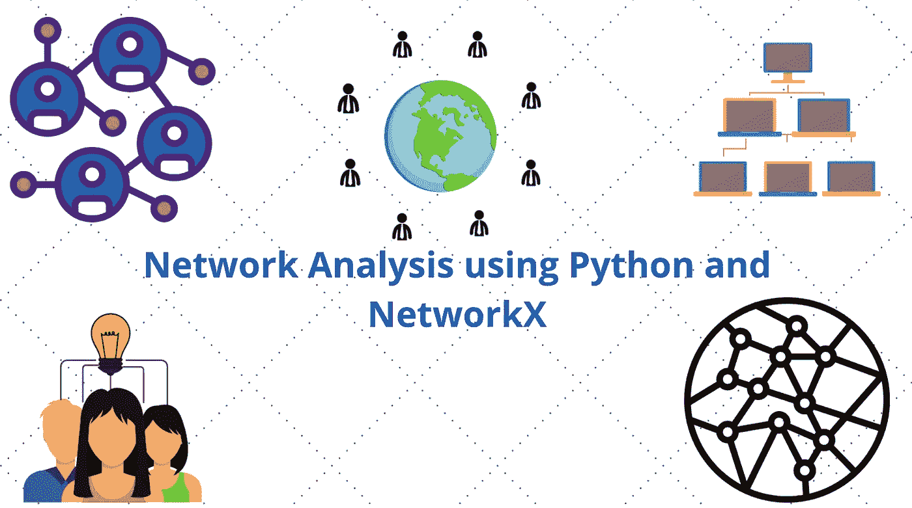

使用 Canva 设计。

**网络无处不在**。网络或图形是一组彼此有某种关系(称为边)的对象(称为节点)。但是图表如何用于我们的日常分析呢？我将使用两个示例来解释网络分析的实时用法。不要错过最后的案例研究！我向你保证，这是一个有趣的！

首先，考虑一下我们的世界目前面临的挑战。是**新冠肺炎·疫情。**让我们假设我们有一个由全球各机场组成的网络，如下图所示。我们可以找到连接数量更多的机场，并将它们识别为热点。

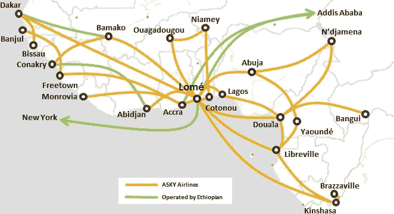

[大圆映射器/公共域](https://commons.wikimedia.org/wiki/File:ASKY_Network_effective_Nov_2016.png)

其次，让我们考虑一个 twitter 网络。我们可以通过使用网络分析识别重要节点来找出最有影响力的人。如今，这是大多数营销机构处理可达性和传播问题的方式。

我们可以清楚地注意到，网络分析在社会网络、金融网络、生物网络、交通网络等各个领域都有很多应用。在这一系列文章中，我们将使用 NetworkX 库来创建图表。在这一部分，让我们试着理解网络分析的基础知识。

# NetworkX API 的基础

正如我已经提到的，网络(数学上称为“图”)由节点和边组成。这些节点和边也可以有元数据。让我们考虑两个朋友 A 和 B 在 2020 年 5 月 31 日相遇的例子。让我们现在创建一个网络。

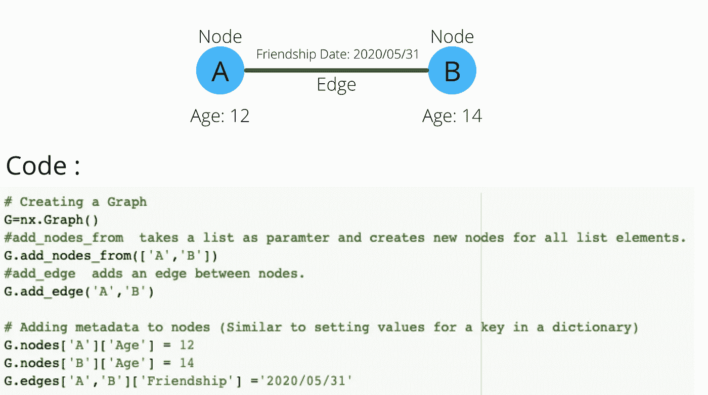

## **查询数据**

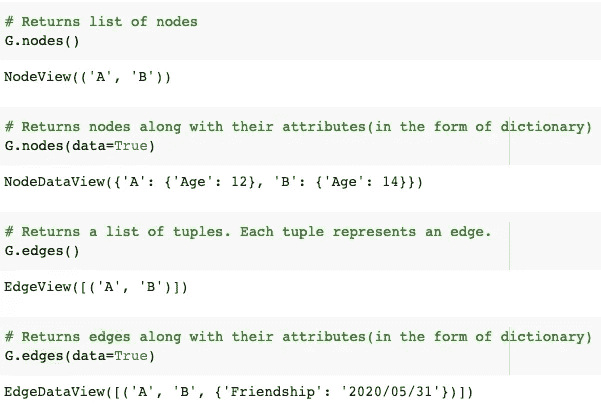

# 图形的类型

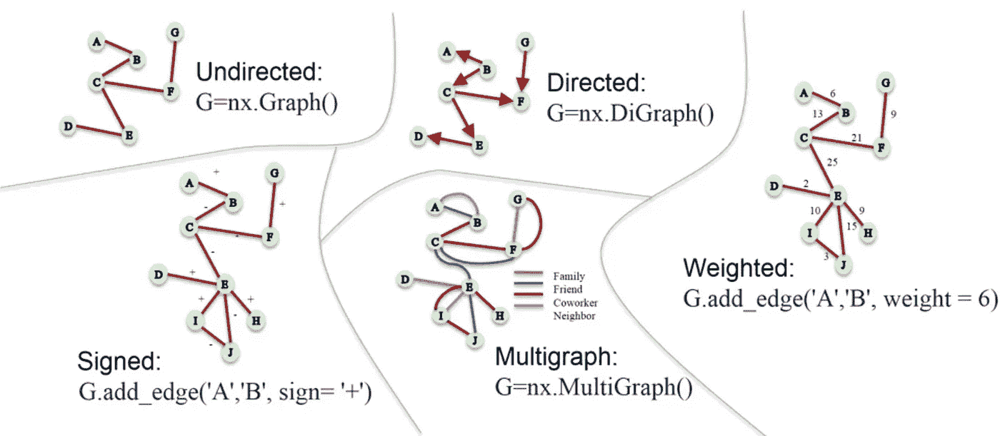

**无向网络** 边没有方向。例如——脸书社交图。(A 向 B 发送好友请求，两人成为好友)

**有向网络** 边有方向。例如，一个 Twitter 社交图。(A 跟随 B，但 B 不一定跟随 A)

**加权网络** 不是所有的关系(边)都是相等的。有些更有分量。
示例—让我们考虑一个组织中的员工网络，边上的权重表示发送给彼此的电子邮件数量。上图中，A 给 B 发了 6 封邮件，以此类推。

**签名网络** 一些网络携带关于友谊和敌意的信息，这些信息作为属性被描绘在关系上。例如——在一个名为“Epinions”的网站上，人们可以声明一个关系是朋友还是敌人。

**多网络** 在一些网络中，节点之间可能存在不止一条边。示例—考虑图像中显示的关系网络。

# **重要节点**

考虑以下网络？你觉得哪个节点重要？

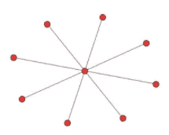

你可能会回答，中心节点很重要。你是如何得出这个答案的？您会看到中心节点比任何其他节点都有更多的邻居。

## **度中心性**

它是用于评估节点重要性的众多指标之一，简单定义为—

具有高度中心性的节点的例子是
1。Twitter 广播公司—(有许多追随者)2。疾病超级传播者
3。机场枢纽(阿布扎比、纽约和伦敦)

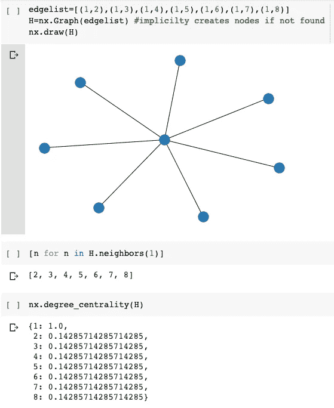

正如所料，我们可以注意到，节点 1 的度中心性是最大的。`neighbors()`方法返回该特定节点的邻居。

## 中间中心性

所有最短路径是给定网络中所有节点对之间的一组最短路径。节点的介数中心性被定义为—

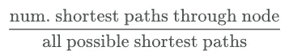

该指标从不同的角度反映了节点的重要性。它不是寻找具有更多邻居的节点，而是寻找网络中的瓶颈节点。我们可以使用`nx.betweenness_centrlality(G)`方法找到图 G 的节点的介数中心性。考虑下图所示的海得拉巴市地铁地图。具有较高介数中心性的节点被圈起来。

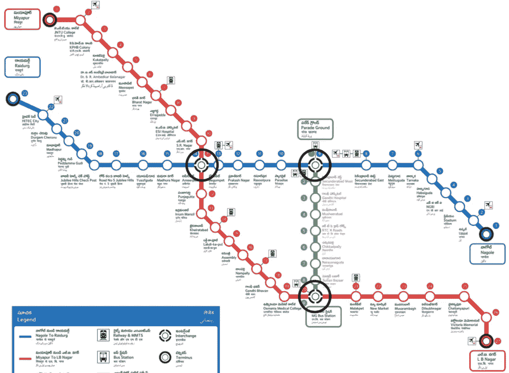

我猜你理解中间中心性背后的直觉。它假设以最短的可能方式连接大多数其他节点的节点是最重要的。

# 个案研究

阅读这篇文章时，你的脑海中可能会突然冒出一个问题。数据集将如何帮助我们建立一个网络？到目前为止，我们已经明确地创建了节点，并在它们之间添加了边。但现实生活中并非如此。让我们拿一个边缘文件，尝试建立一个网络。

马克·萨格曼研究了汉堡分部(911 袭击的幕后黑手)的一些恐怖分子的生活。他发现驱动它们的最常见因素是它们细胞内的社会联系。他创造了一种分析，其中包括恐怖分子之间的社会联系。数据不是 100%完整和准确的。

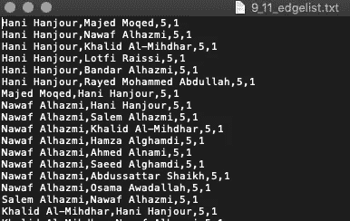

前两列表示有联系的人，后面两个数字表示联系的强度(5 =强联系，1 =弱联系)；最后一列表示政府官员已经验证的连接级别(1 =确认，3 =可能和未确认的连接)。最后两列将不会在我们的分析中使用。

我们可以使用下面的代码将上面的 edge 文件转换成图形。

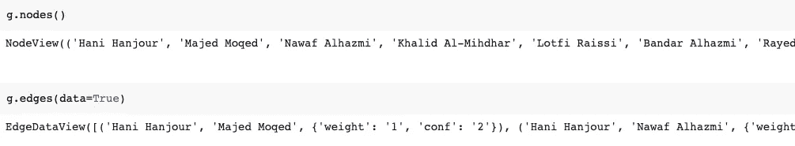

现在让我们找出具有最高程度中心性和中间中心性的前三个节点。

类似地，我们也可以找到前 3 个中间中心节点。我们可以在下面显示的陷阱中看到中间性中心值最高的三个节点。很明显，如果没有这些节点，网络将会断开。

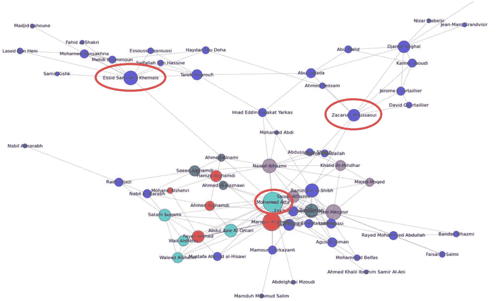

你可能会想，如果没有两个红色的圈起来的节点(紫色的),这个图也是非常连通的。即。名为 **Imad Eddin 巴拉卡特亚尔卡斯**的节点仍然连接着该图。但是如果没有用红色圈出的节点，从中心部分到每个节点的消息传输时间会更长。具有高介数中心性的节点充当以最短可能路径传递消息的连接。因此，与所有其他节点相比，用红色圈出的节点具有最高的介数中心性。

# 结论

在本文中，我们试图了解网络分析在各个领域的重要性以及`networkx` API 的基础知识。我们还了解了许多应用网络分析的实际情况。接下来，我们将讨论网络的连通性和健壮性。敬请期待！

感谢阅读。请随时分享反馈。

# 参考

1.  [https://www . oreilly . com/library/view/social-network-analysis/9781449311377/ch04 . html](https://www.oreilly.com/library/view/social-network-analysis/9781449311377/ch04.html)