# 应用时间序列预测:美国住宅市场

> 原文：<https://towardsdatascience.com/applied-time-series-forecasting-residential-housing-in-the-us-f8ab68e63f94?source=collection_archive---------39----------------------->


照片由[晨酿](https://unsplash.com/@morningbrew?utm_source=medium&utm_medium=referral)在 [Unsplash](https://unsplash.com?utm_source=medium&utm_medium=referral) 拍摄

## 现实世界的时间序列预测与解释

# 1.介绍

在这 19 个月中，房地产行业在经历了年初以来的停工期后，正在迅速反弹。4 月份，新住宅建筑数量下降至约 100 万套。截至 7 月，有 150 万套新房正在建设中(相比之下，2019 年 7 月为 130 万套)。8 月 18 日发布的人口普查局报告显示了房地产市场的一些非常好的指标。

新房建设在经济中起着重要的作用。除了创造就业机会，它还同时影响木材、家具和家电市场。这也是经济整体健康状况的一个重要指标。

因此，有人可能会问，在 COVID19 冲击之后，这一至关重要的经济指标在未来几个月和几年将如何表现？

回答这些问题需要一些预测。

本文的目的是利用流行的时间序列预测模型 ARIMA 对住宅建设进行中短期预测。

即使您对房地产市场不太感兴趣，但对数据科学感兴趣，这也是一个实用的预测示例，可能会帮助您理解预测如何工作以及如何在现实世界的应用案例中实现模型。

# **2。方法总结**

目标是利用从[census.gov](https://bit.ly/2Sp1ALz)数据库中获得的历史数据，预测短期和中期住宅单元的建设。请注意，在人口普查局的数据库中，您会看到有几个关于住房指标的数据集，包括“住房单元开始”和“住房单元完成”；本文中我使用的是后者。

人口普查局是大量社会、经济和商业指标的各种时间序列数据的重要来源。因此，如果你对时间序列分析和建模感兴趣，并希望避免玩具数据集，人口普查局是一个很好的去处。

我在 R 编程环境中做建模。Python 有很棒的[库](https://www.statsmodels.org/)用于数据科学和机器学习建模，但在我看来，R 有最好的包，叫做`fpp2`，由 Rob J Hyndman 开发，用于时间序列预测。

时间序列预测的方法有很多种，我之前也在几篇文章中写过(你可以查看[这个](https://medium.com/towards-artificial-intelligence/the-universe-of-time-series-forecasting-techniques-a-primer-f73011e18570)和[这个](/multivariate-time-series-forecasting-653372b3db36))，但是这次分析我打算用 ARIMA。在选择 ARIMA 之前，我运行了其他几个模型——Holt-Winter 和 ETS——但发现 ARIMA 在这个特定的数据集上有更好的表现。

# 3.数据准备

我唯一使用的库是`fpp2`。如果您安装此库，所有必需的依赖项将随之而来。

在 R 编程环境(RStudio)中导入数据后，我调用 head()函数。

```
# import library
library(fpp2)# import data
df = read.csv("../housecons.csv", skip=6)# check out first few rows
head(df)
```

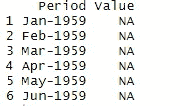

我注意到前几行是空的，所以我在 R 之外打开 CSV 文件，手动检查丢失的值，发现第一个数据直到 1968 年 1 月才出现。所以我用一个简单的函数`na.omit()`去掉了丢失的值。

```
# remove missing values
df = na.omit(df)# check out the rows again
head(df)
```

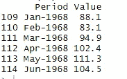

正如您在上面的数据帧中注意到的，它有两列——时间戳和相应的值。您可能认为这已经是一个时间序列数据，所以让我们继续建立模型。没有这么快，数据帧可能看起来像一个时间序列，但它的格式与建模包不兼容。

所以我们需要做一些数据处理。

顺便提一下，不仅仅是这个数据集，*任何*任何*包中用于这种分析的任何*数据集，都需要进行预处理。这是额外的一步，但也是必要的一步。毕竟，这不是一个干净的，你通常在互联网上找到的玩具数据集！

```
# keep only `Value` column
df = df[, c(2)]# convert  values into a time series object
series = ts(df, start = 1968, frequency = 12)# now check out the series
print(series)
```

上面的代码不言自明。因为我们去掉了“Period”列，所以我必须告诉程序这些值从 1968 年开始，这是一个以 12 个月为频率的年度时间序列。

原始数据是长格式的，现在经过处理后被转换成宽格式，所以你现在可以在一个小窗口中看到大量数据。

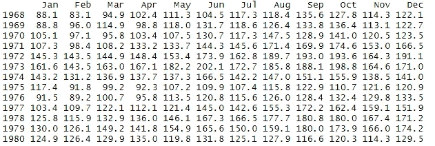

我们现在完成了数据处理。与其他机器学习算法相比，处理时间序列的数据容易吗？我打赌是的。

现在我们已经有了我们需要的数据，我们可以继续建立模型吗？

没那么快！

# 4.探索性分析

探索性数据分析(EDA)可能看起来不像是一个先决条件，但在我看来它是！这有两个原因。首先，没有 EDA，你就完全被蒙住了，你不知道模型中会有什么。你需要知道最终产品的原材料是什么，不是吗？

第二个原因很重要。正如您将在后面看到的，我必须在两个不同的输入数据序列上测试模型的性能。我只在发现时间序列不平滑后做了这个额外的步骤*，它有一个结构突变，影响了模型性能(查看下图，你看到结构突变了吗？).*

**可视化系列**

关于`fpp2`包的好处是你不必单独安装可视化库，它已经是内置的了。

```
# plot the series
autoplot(series) + 
  xlab(" ") + 
  ylab("New residential construction '000") + 
  ggtitle(" New residential construction") + 
  theme(plot.title = element_text(size=8))
```

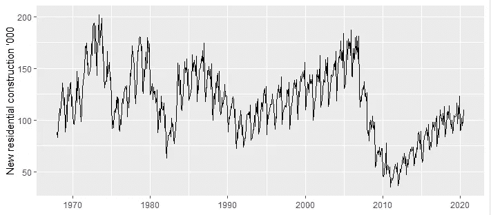

1968 年至 2020 年间每月完成的住宅建设

这只是上面的一个单独的情节，但有这么多正在发生的事情。如果你是一名数据科学家，你可以停下来仔细看看，看看你能从这个图中提取多少信息。

以下是我的解释:

*   数据具有很强的季节性；
*   它也显示了一些循环行为，直到 1990 年左右，然后消失了；
*   该系列自 1992 年以来一直保持相对稳定，直到住房危机；
*   2008 年前后，市场震荡导致的结构性断裂清晰可见；
*   自 2011 年以来，市场正在复苏并稳步增长；
*   2020 年来自 COVID19 的又一次冲击。在这张图上看不清楚，但如果你放大就能发现。

你可以从一个简单的图形中提取如此多的信息，这些都是在建立模型之前建立直觉的有用信息。这就是 EDA 在数据科学中如此重要的原因。

**趋势**

在第一张图中已经可以看到该系列的总体趋势，但是如果您想要更好地了解趋势，可以通过去除季节性来实现。

```
# remove seasonality (monthly variation) to see yearly changesseries_ma = ma(series, 12)
autoplot(series_ma) + 
  xlab("Time") + ylab("New residential construction '000")+
  ggtitle("Series after removing seasonality" )+
  theme(plot.title = element_text(size=8))
```

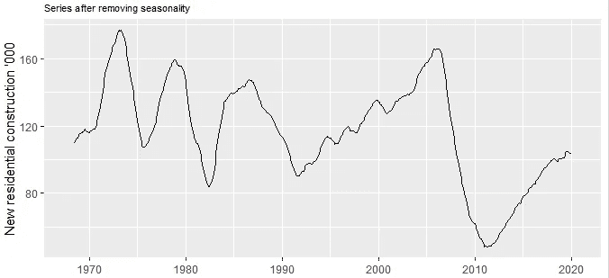

去除季节性后的系列

**季节性**

在看到一般的年度趋势后，如果你想只关注季节性，你也可以用季节性子系列图来做。

```
# Seasonal sub-series plot 
series_season = window(series, start=c(1968,1), end=c(2020,7))
ggsubseriesplot(series_season) + 
  ylab(" ") +
  ggtitle("Seasonal subseries plot") +
  theme(plot.title = element_text(size=10))
```

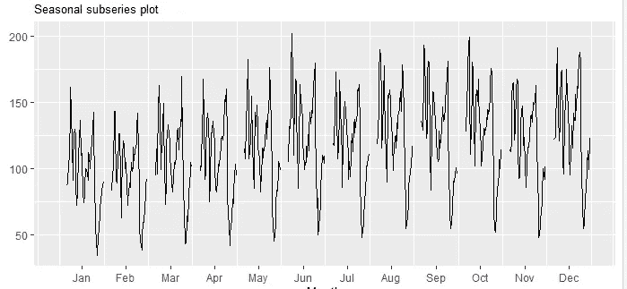

季节性子系列图

**时间序列分解**

有一种很好的方法可以在一个图中显示所有的东西——它被称为分解图。基本上，它是四种信息的组合:

*   原始系列(即数据)
*   趋势
*   季节性
*   随机分量

```
# time series decomposition
autoplot(decompose(predictor_series)) + 
ggtitle("Decomposition of the predictor series")+
theme(plot.title = element_text(size=8))
```

这个分解图中的随机数据部分是我最感兴趣的，因为这个部分实际上决定了预测的不确定性。这个随机成分越小越好。

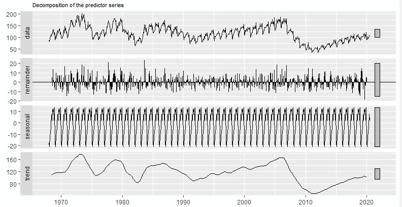

时间序列分解

**放大**

我们还可以放大数据系列的特定部分。例如，下面我放大了房地产市场的好时光(1995-2005)和坏时光(2006-2016)。

```
# zooming in on high time
series_downtime = window(series, start=c(1993,1), end=c(2005,12))
autoplot(series_downtime) + 
  xlab("Time") + ylab("New residential construction '000")+
  ggtitle(" New residential construction high time")+
  theme(plot.title = element_text(size=8))# zooming in on down time
series_downtime = window(series, start=c(2005,1), end=c(2015,12))
autoplot(series_downtime) + 
  xlab("Time") + ylab("New residential construction '000")+
  ggtitle(" New residential construction down time")+
  theme(plot.title = element_text(size=8))
```

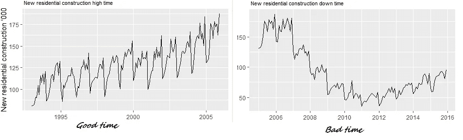

房地产市场时好时坏

探索性分析到此为止，现在让我们进入模型构建的有趣部分，好吗？

# 5.用 ARIMA 预测

我已经提到了选择 ARIMA 进行预测的理由，这是因为我用另外两个模型测试了数据，但 ARIMA 的表现更好。

一旦您对数据进行了预处理并准备好使用，构建实际的模型就非常容易了。顺便说一句，这也是大多数建模练习中的情况；编写代码和执行模型是您需要经历的整个过程的一小部分——从数据收集和清理，到建立直觉，再到找到正确的模型。

我遵循 5 个简单的步骤来实现 ARIMA:

1)确定预测值系列

2)模型参数化

3)绘制预测值

4)对特定年份进行点预测

5)模型评估/准确性测试

下面是模型实现所需的所有代码。

```
# determine the predictor series (in case you choose a subset of the series)
predictor_series = window(series, start=c(2011,1), end=c(2020,7))
autoplot(predictor_series) + labs(caption = " ")+ xlab("Time") + ylab("New residential construction '000")+
  ggtitle(" Predictor series")+
  theme(plot.title = element_text(size=8))# decomposition
 options(repr.plot.width = 6, repr.plot.height = 3)
 autoplot(decompose(predictor_series)) + ggtitle("Decomposition of the predictor series")+
 theme(plot.title = element_text(size=8))# model
forecast_arima = auto.arima(predictor_series, seasonal=TRUE, stepwise = FALSE, approximation = FALSE) 
forecast_arima = forecast(forecast_arima, h=60)# plot
autoplot(series, series=" Whole series") +
  autolayer(predictor_series, series=" Predictor series") +
  autolayer(forecast_arima, series=" ARIMA Forecast") +
  ggtitle(" ARIMA forecasting") +
  theme(plot.title = element_text(size=8))# point forecast
point_forecast_arima=tail(forecast_arima$mean, n=12)
point_forecast_arima = sum(point_forecast_arima)
cat("Forecast value ('000): ", round(point_forecast_arima))print('')
cat(" Current value ('000): ", sum(tail(predictor_series, n=12))) # current value# model description
forecast_arima['model']# accuracy
accuracy(forecast_arima)
```

就像我之前说的，我用两个不同的数据序列来分析 ARIMA，第一个是从 1968 年到 2020 年的整个数据序列。如下图所示，预测值有些平缓(红色系列),并带有许多不确定性。

鉴于过去 10 年的趋势，这个预测在我看来有点不现实。你可能会认为这是由于 COVID19 的影响？我不这么认为，因为这个模型还不应该接收到这个信号，因为 COVID impact 只是整个系列的一小部分。

然后我意识到，这种不确定性是因为该系列中的历史特征，包括不均匀的周期和趋势以及结构性断裂。所以我决定使用过去 10 年的数据作为预测。

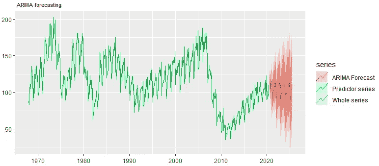

全时间序列预测

下图是我们使用序列的子集作为预测值时的样子。您可以直观地比较两个数字之间的预测区域和相关的不确定性(红色)。

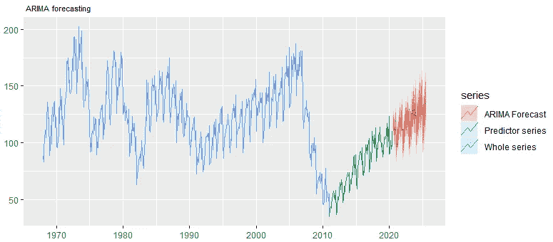

用序列的最近数据进行预测

下面是基于两个输入序列比较两个模型性能的定量方法。正如你所看到的，AIC 和 RMSE 都戏剧性地拒绝给第二个模型一个稳定的性能。

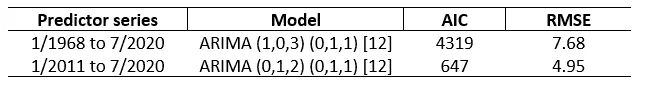

## 预测值

关于模型构建过程已经说得够多了，但是本文是关于使用真实世界的数据集进行实际预测的。以下是美国新住宅建设的预测值。

*   **当前值(' 000 单位):1248**
*   **1 年预测(' 000 单位):1310**
*   **5 年预测(' 000 台):1558**

# 6.结论

如果住宅建设继续保持这一趋势，预计在未来 5 年内将建成 30 万套新住宅。但这需要密切关注，因为 COVID19 冲击的影响可能在未来几个月更加明显。

通过调整参数或找到另一个模型，我可能会得到一个更好的模型，但我想保持简单。事实上，正如谚语所说，所有的模型都是错误的，但有些是有用的。希望这个 AIMA 模型有助于理解一些市场动态。