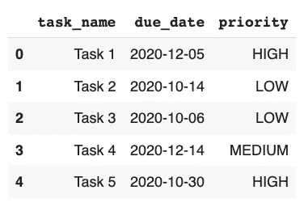
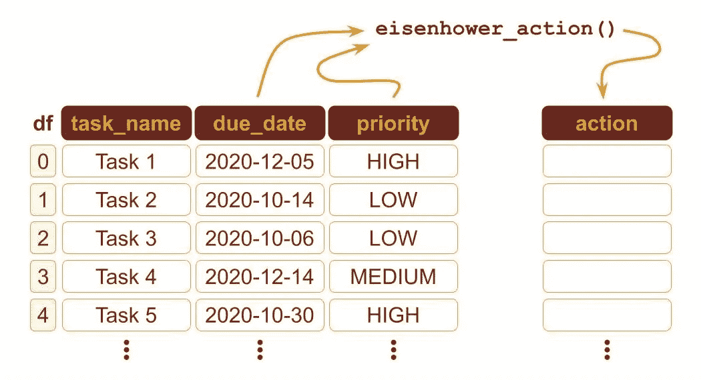
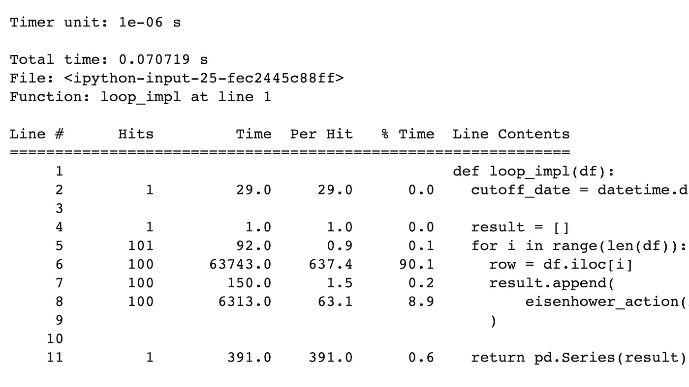
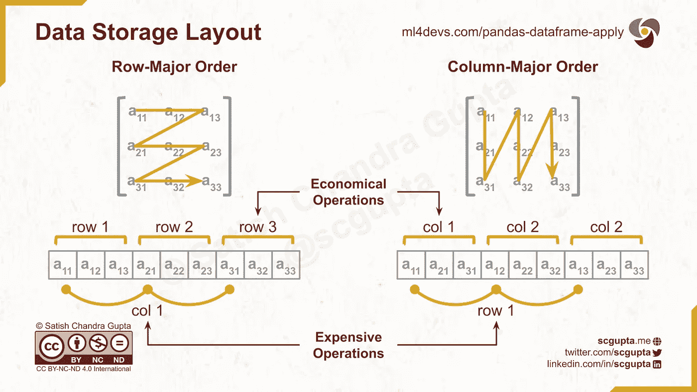
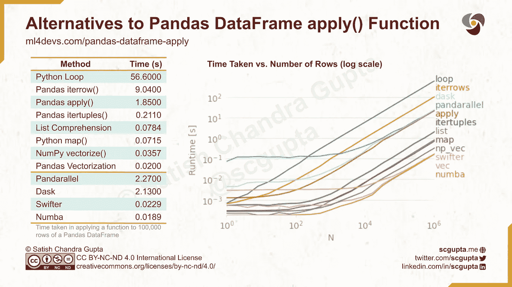
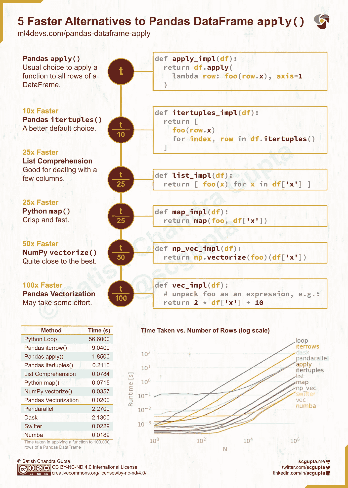

# 熊猫数据框中每行应用函数的 12 种方法

> 原文：<https://towardsdatascience.com/apply-function-to-pandas-dataframe-rows-76df74165ee4?source=collection_archive---------0----------------------->


来自 [Pexels](https://www.pexels.com/photo/person-holding-cup-of-coffees-on-table-832823/) 的 [Victor Freitas](https://www.pexels.com/@victorfreitas)

## 编程技巧

## 如何有效地遍历 Pandas 数据帧中的行，并对每一行应用一个函数。

在[数据争论](https://en.wikipedia.org/wiki/Data_wrangling)期间，对 [Pandas](https://pandas.pydata.org/) 和[数据帧](https://pandas.pydata.org/docs/reference/frame.html)中的所有行应用函数是最常见的操作之一。熊猫 DataFrame `[apply](https://pandas.pydata.org/pandas-docs/stable/reference/api/pandas.DataFrame.apply.html)`函数是做这件事最明显的选择。它将一个函数作为参数，并沿着数据帧的轴应用它。然而，它并不总是最好的选择。

在本文中，您将测量 12 个备选方案的性能。有了配套的代码实验室，你可以在你的浏览器中全部尝试。不需要在你的机器上安装任何东西。

# 问题

最近，我在为一个电子商务应用程序分析用户行为数据。根据用户进行文本和语音搜索的次数，我将每个用户分为四组:

*   **没有搜索:**根本没有搜索的用户
*   **仅文本:**仅进行文本搜索的用户
*   **仅语音:**仅进行语音搜索的用户
*   **Both:** 同时进行文本和语音搜索的用户

这是一个巨大的数据集，根据选择的时间片，有 10 万到 100 万用户。用 Pandas `apply`函数计算它非常慢，所以我评估了其他选择。这篇文章是从中提炼出来的经验教训。

我不能分享那个数据集。所以我挑选了另一个类似的问题来展示解决方案:艾森豪威尔方法。


艾森豪威尔方法:根据重要性和紧急程度将任务分成 4 个部分。

根据任务的重要性和紧迫性，艾森豪威尔方法将其分配到 4 个箱中的一个。每个框都有一个关联的操作:

*   重要而紧急的事情:马上做
*   重要但不紧急:**安排**留待以后
*   不重要但紧急:**委派**给别人
*   既不重要也不紧急:**删除**浪费时间。

我们将使用下图所示的布尔矩阵。重要性和紧急性布尔值为每个动作生成二进制整数值:DO(3)，SCHEDULE(2)，DELEGATE(1)，DELETE(0)。

我们将**分析**将任务映射到某个操作的**性能**。我们将测量 12 个选项中哪一个花费的时间最少。我们将为**多达一百万个任务**绘制性能图。

在 [**Google Colab**](https://colab.research.google.com/github/scgupta/ml4devs-notebooks/blob/master/ml/pandas/pandas_apply_fn_on_dataframe.ipynb) 或 [**Kaggle**](https://www.kaggle.com/scgupta/efficient-alternatives-to-pandas-dataframe-apply) 打开**伴侣笔记本**正是时候。如果您想查看运行中的代码，可以在阅读时执行代码实验室中的单元格。继续执行设置部分中的所有单元格。

# 测试数据

Faker 是一个方便的生成数据的库。在代码实验室中，它用于生成包含一百万个任务的数据帧。每个任务都是数据帧中的一行。它由任务名称(`str`)、截止日期(`datetime.date`)和优先级(`str`)组成。优先级可以是以下三个值之一:低、中、高。



生成的数据帧中的前 5 个任务

## 优化数据帧存储

我们将最小化存储大小，以消除其对任何替代方案的影响。大约 200 万行的数据帧占用 48MB:

```
**>>>** test_data_set.info()<class 'pandas.core.frame.DataFrame'>
RangeIndex: 2097153 entries, 0 to 2097152
Data columns (total 3 columns):
 #   Column     Dtype 
---  ------     ----- 
 0   task_name  object
 1   due_date   object
 2   priority   object
dtypes: object(3)
memory usage: 48.0+ MB
```

代替`str`，优先级可以存储为熊猫`categorical`类型:

```
priority_dtype = pd.api.types.CategoricalDtype(
  categories=['LOW', 'MEDIUM', 'HIGH'],
  ordered=True
)test_data_set['priority'] = test_data_set['priority'].astype(priority_dtype)
```

现在让我们来看看数据帧的大小:

```
**>>>** test_data_set.info()<class 'pandas.core.frame.DataFrame'>
RangeIndex: 2097153 entries, 0 to 2097152
Data columns (total 3 columns):
 #   Column     Dtype   
---  ------     -----   
 0   task_name  object  
 1   due_date   object  
 2   priority   category
dtypes: category(1), object(2)
memory usage: 34.0+MB
```

大小减少到 34MB。

## 艾森豪威尔行动函数

给定重要性和紧急程度，`eisenhower_action`计算 0 到 3 之间的整数值。

```
def eisenhower_action(is_important: bool, is_urgent: bool) -> int:
  return 2 * is_important + is_urgent
```

在本练习中，我们将假设**优先级高的任务**是**重要的任务**。如果**截止日期**在**接下来的两天**内，那么任务就是**紧急**。

通过使用`due_date`和`priority`列计算任务(即数据帧中的一行)的艾森豪威尔行动:

```
**>>>** cutoff_date = datetime.date.today() + datetime.timedelta(days=2)**>>>** eisenhower_action(
  test_data_set.loc[0].priority == 'HIGH',
  test_data_set.loc[0].due_date <= cutoff_date
)2
```

整数 2 表示需要的动作是调度。

在本文的其余部分，我们将评估将`eisenhower_action`函数应用于数据帧行的 12 种备选方案。首先，我们将测量 100k 行样本的时间。然后，我们将测量和绘制多达一百万行的时间。



Pandas DataFrame:对每一行应用一个函数来计算一个新列

# 方法一。循环遍历数据帧的所有行

在传统的 Python 循环中处理每一行的最简单方法。这显然是最糟糕的方法，任何头脑正常的人都不会这么做。

```
def loop_impl(df):
  cutoff_date = datetime.date.today() + datetime.timedelta(days=2) result = []
  for i in range(len(df)):
    row = df.iloc[i]
    result.append(
      eisenhower_action(
        row.priority == 'HIGH', row.due_date <= cutoff_date)
    ) return pd.Series(result)
```

不出所料，这花费了惊人的时间:56.6 秒。

```
%timeit data_sample['action_loop'] = loop_impl(data_sample)1 loop, best of 5: 56.6 s per loop
```

它建立了最坏情况下的性能上限。由于其成本是线性的，即 O(n ),因此它为比较其他替代方案提供了一个很好的基线。

## 线级剖析

让我们使用 [line_profiler](https://github.com/pyutils/line_profiler) 来看看是什么花费了这么长时间，但是对于一个 100 行的小样本:

```
%lprun -f loop_impl  loop_impl(test_data_sample(100))
```

其输出如下图所示:



用于在 Python 循环中处理 100 行数据帧的行级探查器的输出。

从数据帧中提取一行(第 6 行)需要 90%的时间。这是可以理解的，因为 Pandas DataFrame 的存储是[](https://en.wikipedia.org/wiki/Row-_and_column-major_order)**【column-major】:一列中的连续元素按顺序存储在内存中。因此，将一行中的元素放在一起是非常昂贵的。**

**即使我们从 100k 行的 56.6 秒中去掉 90%的成本，也需要 5.66 秒。这仍然很多。**

****

**行为主和列为主的数据存储布局。Pandas Dataframe 使用以列为主的存储，因此获取一行是一项开销很大的操作。图片由作者根据[Creative Commons BY-NC-ND 4.0 International](https://creativecommons.org/licenses/by-nc-nd/4.0/)许可发布。**

# **方法二。用`iterrows`函数遍历行**

**让我们试试 Pandas `[iterrows](https://pandas.pydata.org/pandas-docs/stable/reference/api/pandas.DataFrame.iterrows.html)`函数，而不是在 Python 循环中处理每一行。**

```
def iterrows_impl(df):
  cutoff_date = datetime.date.today() + datetime.timedelta(days=2) return pd.Series(
    eisenhower_action(
      row.priority == 'HIGH', row.due_date <= cutoff_date)
    for index, row in df.iterrows()
  )
```

**大约需要 9.04 秒。循环所用时间的四分之一:**

```
%timeit data_sample['action_iterrow'] = iterrows_impl(data_sample)1 loop, best of 5: 9.04 s per loop
```

# **方法三。用`itertuples`函数遍历行**

**Pandas 有另一种方法，`[itertuples](https://pandas.pydata.org/pandas-docs/stable/reference/api/pandas.DataFrame.itertuples.html)`，它将行作为元组来处理。**

```
def itertuples_impl(df):
  cutoff_date = datetime.date.today() + datetime.timedelta(days=2) return pd.Series(
    eisenhower_action(
      row.priority == 'HIGH', row.due_date <= cutoff_date)
    for row in df.itertuples()
  )
```

**它的表现令人惊讶，只用了 211 毫秒。**

```
%timeit data_sample['action_itertuples'] = itertuples_impl(data_sample)1 loops, best of 5: 211 ms per loop
```

# **方法四。熊猫`apply`作用于每一排**

**Pandas DataFrame `[apply](https://pandas.pydata.org/pandas-docs/stable/reference/api/pandas.DataFrame.apply.html)`功能相当多才多艺，是热门选择。要让它处理这些行，您必须传递`axis=1`参数。**

```
def apply_impl(df):
  cutoff_date = datetime.date.today() + datetime.timedelta(days=2)
  return df.apply(
      lambda row:
        eisenhower_action(
          row.priority == 'HIGH', row.due_date <= cutoff_date),
      axis=1
  )
```

**这也给了我一个惊喜。用了 1.85 秒。比`itertuples`差 10 倍！**

```
%timeit data_sample['action_impl'] = apply_impl(data_sample)1 loop, best of 5: 1.85 s per loop
```

# **方法五。Python 列表理解**

**DataFrame 中的列是一个系列，可用作[列表理解](https://docs.python.org/3/tutorial/datastructures.html#list-comprehensions)表达式中的列表:**

```
[ foo(x) for x in df['x'] ]
```

**如果需要多个列，那么可以用`zip`来做一个元组列表。**

```
def list_impl(df):
  cutoff_date = datetime.date.today() + datetime.timedelta(days=2)
  return pd.Series([
    eisenhower_action(priority == 'HIGH', due_date <= cutoff_date)
    for (priority, due_date) in zip(df['priority'], df['due_date'])
  ])
```

**这也抛出了一个惊喜。只用了 78.4 毫秒，甚至比`itertuples`还要好！**

```
%timeit data_sample['action_list'] = list_impl(data_sample)10 loops, best of 5: 78.4 ms per loop
```

# **方法六。Python 地图函数**

**Python 的`[map](https://docs.python.org/3/library/functions.html#map)`函数接受函数和可迭代的参数，并产生结果。**

```
**def** map_impl(df):
  cutoff_date = datetime.date.today() + datetime.timedelta(days=2)
  **return** pd.Series(
    map(eisenhower_action,
      df['priority'] == 'HIGH',
      df['due_date'] <= cutoff_date)
  )
```

**这比列表理解稍微好一点。**

```
%timeit data_sample['action_map'] = map_impl(data_sample)10 loops, best of 5: 71.5 ms per loop
```

# **方法七。…向量化…**

**熊猫的真正力量体现在矢量化上。但是它需要将函数解包为向量表达式。**

```
def vec_impl(df):
  cutoff_date = datetime.date.today() + datetime.timedelta(days=2)
  return (
    2*(df['priority'] == 'HIGH') + (df['due_date'] <= cutoff_date))
```

**它提供了最好的性能:只有 20 毫秒。**

```
%timeit data_sample['action_vec'] = vec_impl(data_sample)10 loops, best of 5: 20 ms per loop
```

**根据函数的复杂程度，向量化可能需要很大的努力。有时候，甚至可能不可行。**

# **方法八。NumPy `vectorize`功能**

**Numpy 为通过向量化从 Python 迁移到 NumPy 提供了替代方案[。例如，它有一个`vectorize()`函数，可以向量化任何标量函数来接受和返回 NumPy 数组。](https://www.labri.fr/perso/nrougier/from-python-to-numpy/)**

```
def np_vec_impl(df):
  cutoff_date = datetime.date.today() + datetime.timedelta(days=2)
  return np.vectorize(eisenhower_action)(
    df['priority'] == 'HIGH',
    df['due_date'] <= cutoff_date
  )
```

**毫不奇怪，它的性能仅次于熊猫矢量化:35.7 毫秒。**

```
%timeit data_sample['action_np_vec'] = np_vec_impl(data_sample)10 loops, best of 5: 35.7 ms per loop
```

# **方法九。Numba 装饰公司**

**到目前为止，只使用了熊猫和 NumPy 包。但是如果你愿意接受额外的包依赖，还有更多选择。**

**[Numba](https://numba.pydata.org/) 常用于加速应用数学函数。它有各种用于 JIT 编译和矢量化的装饰器。**

```
import numba[@numba](http://twitter.com/numba).vectorize
def eisenhower_action(is_important: bool, is_urgent: bool) -> int:
  return 2 * is_important + is_urgentdef numba_impl(df):
  cutoff_date = datetime.date.today() + datetime.timedelta(days=2)
  return eisenhower_action(
    (df['priority'] == 'HIGH').to_numpy(),
    (df['due_date'] <= cutoff_date).to_numpy()
  )
```

**它的`vectorize`装饰器类似于 NumPy `vectorize`函数，但是提供了更好的性能:18.9 毫秒(类似于熊猫矢量化)。但是它也会给出缓存警告。**

```
%timeit data_sample['action_numba'] = numba_impl(data_sample)The slowest run took 11.66 times longer than the fastest. This could mean that an intermediate result is being cached.
1 loop, best of 5: 18.9 ms per loop
```

# **方法 10。使用`pandarallel`进行多重处理**

**`pandarallel`包使用多个 CPU，并将工作分成多个线程。**

```
from pandarallel import pandarallelpandarallel.initialize()def pandarallel_impl(df):
  cutoff_date = datetime.date.today() + datetime.timedelta(days=2)
  return df.parallel_apply(
    lambda row: eisenhower_action(
      row.priority == 'HIGH', row.due_date <= cutoff_date),
    axis=1
  )
```

**在 2 个 CPU 的机器上，用了 2.27 秒。对于 100k 条记录和 2 个 CPU，拆分和簿记开销似乎没有回报。**

```
%timeit data_sample['action_pandarallel'] = pandarallel_impl(data_sample)1 loop, best of 5: 2.27 s per loop
```

# **方法 11。使用 Dask 并行化**

**Dask 是一个并行计算库，支持扩展 NumPy、Pandas、Scikit-learn 和许多其他 Python 库。它为在多节点集群上处理大量数据提供了高效的基础设施。**

```
import dask.dataframe as dddef dask_impl(df):
  cutoff_date = datetime.date.today() + datetime.timedelta(days=2)
  return dd.from_pandas(df, npartitions=CPU_COUNT).apply(
    lambda row: eisenhower_action(
      row.priority == 'HIGH', row.due_date <= cutoff_date),
    axis=1,
    meta=(int)
  ).compute()
```

**在 2 个 CPU 的机器上，用了 2.13 秒。像`pandarallel`一样，只有在许多机器上处理大量数据时，收益才有意义。**

```
%timeit data_sample['action_dask'] = dask_impl(data_sample)1 loop, best of 5: 2.13 s per loop
```

# **方法 12。利用 Swifter 实现机会并行化**

**[Swifter](https://github.com/jmcarpenter2/swifter) 自动决定哪个更快:使用 Dask 并行处理还是简单的 Pandas 应用。使用起来非常简单:只需一个词就能说明熊猫的功能:`df.**swifter**.apply`。**

```
import swifterdef swifter_impl(df):
  cutoff_date = datetime.date.today() + datetime.timedelta(days=2)
  return df.**swifter**.apply(
    lambda row: eisenhower_action(
      row.priority == 'HIGH', row.due_date <= cutoff_date),
    axis=1
  )
```

**它在这个用例中的性能预计非常接近熊猫矢量化。**

```
%timeit data_sample['action_swifter'] = swifter_impl(data_sample)10 loops, best of 5: 22.9 ms per loop+
```

# **Pandas 数据帧行的迭代性能比较**

**绘图有助于理解备选方案相对于输入大小的相对性能。Perfplot 是一个方便的工具。它需要一个设置来生成给定大小的输入和一个要比较的实现列表。**

```
kernels = [
  loop_impl,
  iterrows_impl,
  itertuples_impl,
  apply_impl,
  list_impl,
  vec_impl,
  np_vec_impl,
  numba_impl,
  pandarallel_impl,
  dask_impl,
  swifter_impl
]labels = [str(k.__name__)[:-5] for k in kernels]perfplot.show(
  setup=lambda n: test_data_sample(n),
  kernels=kernels,
  labels=labels,
  n_range=[2**k for k in range(K_MAX)],
  xlabel='N',
  logx=True,
  logy=True,
  #equality_check=None
)
```

**它生成如下所示的图。**

****

**熊猫数据框应用功能的替代方案。左图:对熊猫数据帧的 100，000 行应用函数所用的时间。右图:在 Pandas 数据框架中，以对数比例绘制多达一百万行。图片由作者根据[Creative Commons BY-NC-ND 4.0 International](https://creativecommons.org/licenses/by-nc-nd/4.0/)许可发布。**

**以下是对该地块的一些观察:**

*   **对于这个用例，渐近性能顺序稳定在数据帧中大约 10k 行。**
*   **由于图中的所有线条都变得平行，性能差异在双对数标度图中可能不明显。**
*   **`itertuples`和`apply`一样简单易用，但性能却提升了 10 倍。**
*   **列表理解比`itertuples`好 2.5 倍，尽管对于一个复杂的函数来说写起来有些冗长。**
*   **NumPy `vectorize`比 List 理解力强 2 倍，使用起来和`itertuples`和`apply`函数一样简单。**
*   **Pandas 矢量化比 NumPy `vectorize`要好大约 2 倍。**
*   **只有在许多机器上处理大量数据时，并行处理的开销才有回报。**

# **高效迭代 Pandas 数据帧行的建议**

**对所有熊猫行独立执行操作是一种常见的需求。以下是我的建议:**

1.  ****向量化数据帧表达式:**尽可能这样做。**
2.  ****NumPy** `**vectorize**` **:** 它的 API 不是很复杂。它不需要额外的软件包。它提供了几乎最好的性能。如果矢量化数据框架并非不可行，请选择此项。**
3.  ****列表理解:**当只需要 2-3 个数据帧列，并且数据帧向量化和 NumPy 向量化由于某种原因不可行时，选择此选项。**
4.  ****熊猫** `**itertuples**` **功能:**其 API 类似`apply`功能，但性能比`apply`高 10 倍。这是最简单、可读性最强的选择。它提供了合理的性能。如果前面三个都不行，就这么做。**
5.  ****Numba 或 Swift:** 使用它来开发并行化而不增加代码复杂性。**

**了解各种替代方案的成本对于做出明智的选择至关重要。使用`timeit`、`line_profiler`和`perfplot`来测量这些备选方案的性能。平衡性能和易用性，为您的使用案例确定最佳替代方案。**

**如果你喜欢这个，请:**

**[](https://ml4devs.substack.com/subscribe)****[](https://twitter.com/intent/follow?user_id=29633907)****[](http://www.linkedin.com/comm/mynetwork/discovery-see-all?usecase=PEOPLE_FOLLOWS&followMember=scgupta)****[](https://twitter.com/intent/follow?user_id=29633907)****[](https://www.linkedin.com/in/scgupta/)**

****与此信息图分享:****

****

**熊猫 DataFrame apply()函数的 5 个简单快速的替代方法。不需要脂肪库。图片由作者提供，并在[Creative Commons BY-NC-ND 4.0 International](https://creativecommons.org/licenses/by-nc-nd/4.0/)许可下发布。**

***原载于*[*ML4Devs.com*](https://www.ml4devs.com/articles/pandas-dataframe-apply-function-iterate-over-rows/)*。***