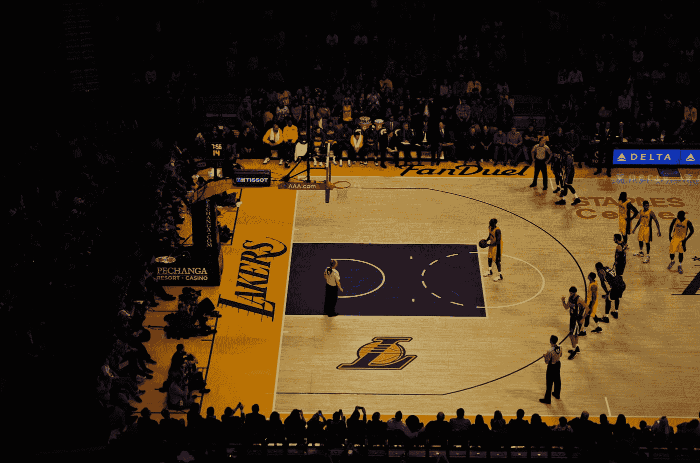
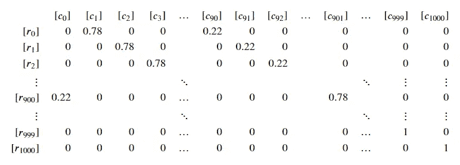
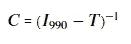
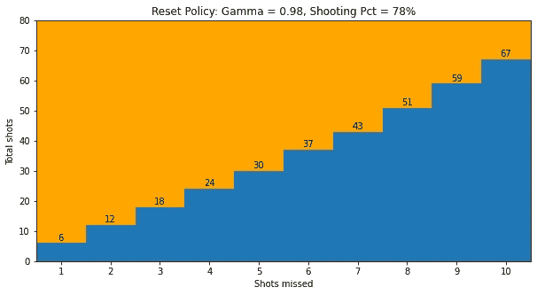
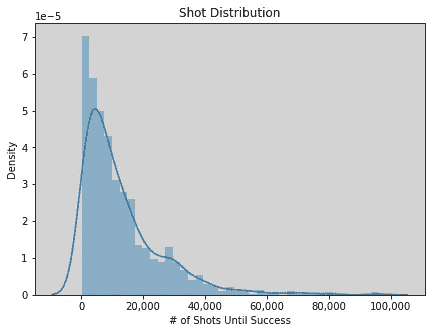

# 一个简单的强化学习问题

> 原文：<https://towardsdatascience.com/apply-reinforcement-learning-to-win-a-free-throw-bet-f555b8adc0de?source=collection_archive---------30----------------------->

## [入门](https://towardsdatascience.com/tagged/getting-started)

## 通过将一次罚球赌注建模为马尔可夫链并使用值迭代，开始强化学习

与[麦克斯·奇西克](https://medium.com/u/98505f8c082?source=post_page-----f555b8adc0de--------------------------------)合著

照片由[拉米罗·皮亚诺罗萨](https://unsplash.com/@rapiana?utm_source=medium&utm_medium=referral)在 [Unsplash](https://unsplash.com?utm_source=medium&utm_medium=referral) 拍摄

*本文假设读者熟悉基本的强化学习(RL)概念。这篇* [*文章*](/reinforcement-learning-101-e24b50e1d292) *提供了一个很好的高层次概述。这里的目的是解决一个简单的问题，以便说明 RL 问题是如何设置的，这样您就能够开始编写自己的项目了。*

你需要在 100 次罚球中投进 90 次才能赢得赌注。您可以在一年内无限制尝试，并且您需要指定每次尝试的开始时间。你应该如何决定是继续目前的尝试还是重新开始？在成功完成赌注之前，您预计要打多少杆？你的重置策略对这个数字有什么影响？强化学习可以回答这些问题。

根据二项式分布，78%的射手一次尝试成功的概率为 0.14%，这相当于 365 次尝试成功的概率为 40%。让我们假设 78%是你的命中率，因为这给出了赢得或输掉赌注的合理概率(高于 80%几乎保证成功，低于 70%几乎保证失败)。

**方法 1:强化学习—马尔可夫链**
如果从一个状态转移到下一个状态的概率完全基于当前状态(即先前的状态不影响概率)，则随机过程是一个[马尔可夫链](https://en.wikipedia.org/wiki/Markov_chain)。这个赌注可以被建模为一个马尔可夫链，以投篮次数和失误次数作为状态。

有 1001 种不同的可能状态(0 到 10 次未命中，0 到 90 次成功)⟹11 * 91 = 1001。因此，赌注可以由 1，001×1，001 矩阵来表示，其中行表示当前状态，列表示未来状态，元素𝑋𝑖𝑗 {∀ 𝑖,𝑗∈[0,1000]}表示从𝑖状态转移到𝑗.状态的概率

首先，让我们假设你一直投篮直到失败或成功(投中 90 篮或错过 11 篮)。然后将矩阵 P 的状态 0 到 1000 定义为[篮子已做，篮子未做]。先列出所有不完整的状态，然后在最后列出代表赢得赌注的状态:
0，1，…，89 = [0，0]，[0，1]，…，[0，89]；
90，91，…，179 = [1，0]，[1，1]，…，[1，89]；
⋮
900，901，…，989 = [10，0]，[10，1]，…，[10，89]；
990，991，…，1000 =[0，90]，[1，90]，…，[10，90]；

概率矩阵 P 的图解(图片由作者提供)

吸收态是一旦进入就不会离开的状态。然后，让矩阵𝑇是矩阵𝑃的子集，只包括跃迁(非吸收)状态。𝑇 = 𝑃₀:₉₉₀,₀:₉₉₀，因为最后十个状态代表成功，所以一旦进入其中一个状态就不会再尝试*(这就是我们将最后十个状态设置为成功状态的原因，这样可以很容易地删除它们)。*

定义矩阵𝐶，使得每个元素𝑋𝑖𝑗都是在进入一个吸收态之前，在任何时间点从𝑖态到𝑗态的预期跃迁数(即使中间进入了其它态)。可以看出，矩阵𝐶计算如下:

那么第 0 行的总和就是成功所需的预期总发射数。当拍摄到失败或成功时，预期拍摄到成功的次数为 **35，418** 。当基于二项式分布重置时(如果当前状态比新尝试成功的可能性低，则重置)，总拍摄次数减少到 **13，262:**

使用二项式重置策略射击失败/成功时的预期射击次数

**方法 2a:强化学习—值迭代:确定最佳策略** 我们能够直接计算重置策略和预期投篮次数，因为我们知道投篮次数是一个二项分布的随机变量。然而，许多强化学习问题的底层分布是未知的，例如预测库存管理问题的客户订单或预测扑克游戏中对手的行动。因此，我们将使用值迭代来计算最优重置策略，以说明如何处理未知分布。

首先，我们定义给定环境中代理可用的状态、动作和奖励:

*   定义每个状态对(投篮命中，投篮未中)的奖励为 0，除了设置状态中的赌注是赢，[90，0]，[90，1]，…，[90，10]。将获胜州的值设置为 100(任意选择)。
*   每种状态下可能的 2 个动作:继续射击或重置赌注。

然后将每个状态/动作对的初始值设置为 0，并重复迭代每个对，以使用[贝尔曼方程](https://en.wikipedia.org/wiki/Bellman_equation)求解更新的值估计，直到连续迭代之间的最大差异变得任意小。
V(s)=R(s，a)+γ÷V(s′)，其中:

*   V(s)是当前状态的值
*   R(s，a)是状态 s(射击或重置)下动作 a 的回报
*   γ是贴现因子
*   v(s′)是下一个状态的值

每个状态都有两个值，一个是继续出手，等于出手后的预期奖励值加上下一个状态的值，每个状态都有一个重置下注的值，这个值简单来说就是等于起始状态的值(因为重置时永远不会有奖励)。国家的价值是这两个价值中最高的。例如，89 时的值 makes，10 次未中(下一次出手的结果不是赢得赌注就是重置赌注)等于:
v[89，10] = max(动作[出手]: 78% * 100 + 22% * 0.98 * v[0，0]，动作[重置]: v[0，0])；
= max(动作[拍摄]:78.0047，动作[复位]:0.0217)；
=动作【拍】:78.0047。

不出所料，这种状态下的最佳政策是继续当前的尝试。这也证明了状态是如何相互依赖的:v[0，0]依赖于 v[89，10]，但是 v[89，10]也依赖于 v[0，0]，因此，为什么需要继续迭代计算，直到从一次迭代到下一次迭代的值变化几乎为 0。

值迭代代码:

作者提供的图像:使用值迭代的最佳重置策略(例如，如果第 5 次失误发生在第 30 次拍摄时或之前，则尝试重置)

从马尔可夫链代码来看，这种重置策略总共有 13，026 个预期镜头，与二项式方法相比提高了 1.7%。

**方法 2b:模拟——计算预期射击次数**

由于分布并不总是已知的，我们还将使用数值迭代确定的最佳策略，通过模拟来计算预期的射击次数。

我们模拟大量尝试，取成功前的平均出手次数来估计期望值。为此，我们生成一个足够大的 0 到 1 之间的均匀随机数列表，低于投篮命中率的值表示投篮命中，高于投篮命中率的值表示投篮不中。然后，我们确定是否达到了代表失败的任何重置阈值。如果没有达到重置阈值，那么至少进行了 90 次罚球，结果是成功的。然后计算每次尝试成功所需的击球次数，并取这些值的平均值。

模拟代码:

上述代码 10 次迭代的平均结果是 13，145 个预期镜头，比上面直接计算的值高 0.9%。

运行模拟还有一个额外的好处，那就是我们可以估计直到成功的射击次数的分布:

1217 次模拟成功尝试的模拟镜头分布(图片由作者提供)

**结论**

我们能够找到我们问题的封闭形式的解决方案，因为它是一个马尔可夫链。然而，许多强化学习问题更加复杂，需要迭代方法。我们展示了这样一种方法，值迭代，也可以解决这个问题。策略迭代是本文没有涉及的另一种有用的方法。

感谢您的阅读，并祝您好运解决自己的强化学习问题！

**补充阅读**

*   [https://www . Dartmouth . edu/~ chance/teaching _ AIDS/books _ articles/probability _ book/chapter 11 . pdf](https://www.dartmouth.edu/~chance/teaching_aids/books_articles/probability_book/Chapter11.pdf)
*   [https://www . cis . upenn . edu/~ cis 519/fall 2015/lections/14 _ reinforcement learning . pdf](https://www.cis.upenn.edu/~cis519/fall2015/lectures/14_ReinforcementLearning.pdf)