# 应用向量误差修正模型看商品价格的变化如何推动工业生产

> 原文：<https://towardsdatascience.com/apply-vecm-to-see-how-changes-in-commodity-price-drive-industrial-production-in-the-united-states-e3c1b2da932d?source=collection_archive---------48----------------------->

## 不同商品的影响程度和方向不同！

安特·罗泽茨基在 [Unsplash](https://unsplash.com?utm_source=medium&utm_medium=referral) 上的照片

新冠肺炎的爆发给各行各业带来了前所未有的负面影响，制造业首当其冲。2020 年第二季度，美国工业生产指数同比下降 14.4%。工业生产的萎缩可能会对投入资源造成负面需求冲击，进而压低大宗商品价格，尤其是能源和金属价格。

同时，商品价格的变化也会影响供应、生产成本，从而影响生产决策。例如，石油输出国组织(石油输出国组织)、俄国和其他国家在 2020 年 4 月达成的延长石油减产的临时协议旨在在冠状病毒封锁导致需求暴跌后支撑油价。

然而，能源和金属价格之间的关系可能更加复杂，这不仅是因为它们之间的多向联系，还因为存在时滞效应、短期和长期均衡。在本文中，我将尝试应用**向量误差修正模型(VECM)**(1)**调查美国商品价格与工业生产之间的关系**(2)**预测近期工业生产和商品价格的变动**。以下所有代码，请参考我的 Github 链接[这里](https://github.com/ngaiyin1760/VECM-on-industrial-production-and-commodity-prices)。

# 数据

## 时间范围

这项工作将侧重于 1990 年 1 月至 2020 年 7 月期间。

## 商品价格数据

从世界银行的商品市场网站上，我们可以下载不同商品的月度价格数据。其中，以下是能源、工业金属和贵金属的代表。

**能源** —原油(布伦特)、煤炭(南非)、天然气(美国)

**工业金属** —铝、铁矿石、铜

**贵金属** —铂金、白银

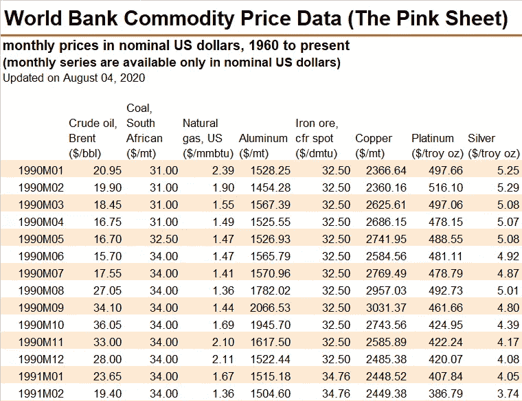

顺便提一下，**2019 年，石油和天然气这两种传统能源仍然占美国工业部门总能源使用量的 74.0%，这是自 1950 年有数据以来的最高纪录**。相比之下，**总共只有 9.5%是由可再生能源贡献的，比 2011 年 10.1%的峰值略有下降**。多么可悲的情况！！！

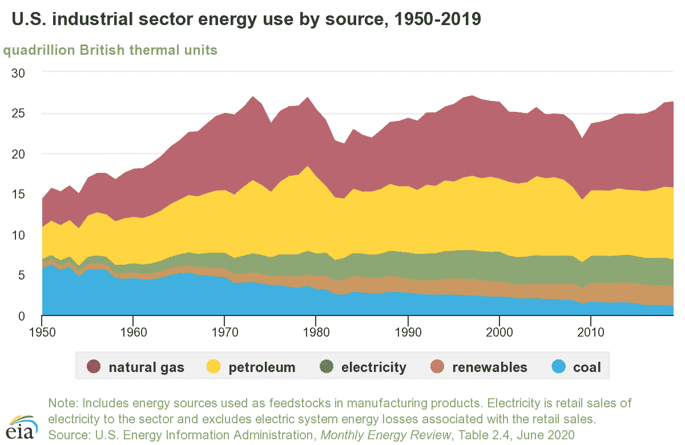

## 工业生产指数数据

美国工业生产指数的数据可以从美联储银行的[网站](https://fred.stlouisfed.org/series/INDPRO)下载。

根据定义，**工业生产指数是一项经济指标，衡量位于美国制造、采矿、电力和天然气公用事业(不包括美国境内的公用事业)的所有设施的实际产出**。

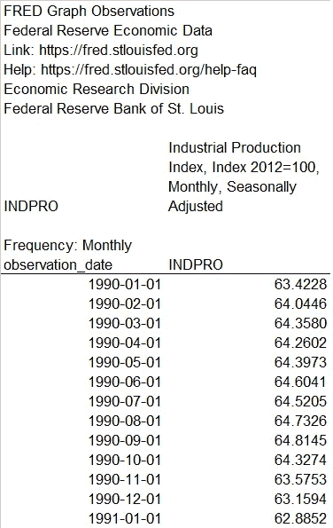

# 向量误差修正模型

## 介绍

E 经济理论认为，经济变量之间在其水平上存在长期均衡，这可以使这些变量保持平稳而不取差异，这就是所谓的**协整**。

**向量误差修正模型(VECM)** 是一种在短期关系(差异)之上捕捉此类长期均衡关系(水平)的方法。关于 VECM 及其与向量自回归(VAR)模型的差异的更详细的解释可以在[这里](https://www.r-econometrics.com/timeseries/vecintro/)找到。

在应用 VECM 之前，让我们研究一下原始时间序列数据是否是**平稳的**，这意味着时间序列的方差不依赖于时间。如果时间序列是稳定的，那么绘制的图形看起来就像白噪声。

从下面的非差分时间序列和相关矩阵的线图来看，它们很可能是非平稳的，并且它们之间存在协整关系。

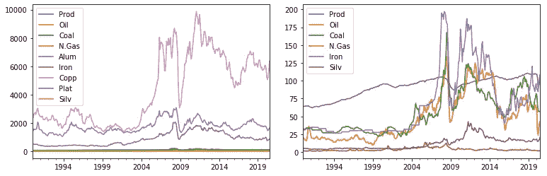

(左)所有选定时间序列的折线图；(右)由于规模差异，不包括铝、铜和铂

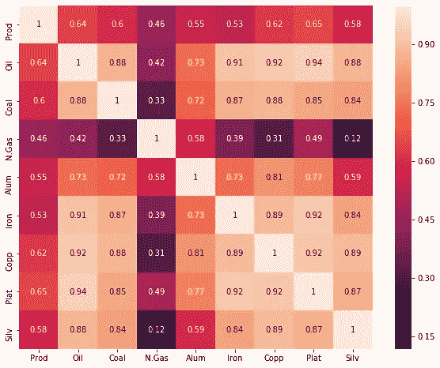

所选时间序列之间的相关矩阵

## **非差异变量的自相关函数(ACF)分析**

在继续之前，让我们看一下 9 个非差分时间序列的自相关函数图，它表明它们肯定是非平稳的。

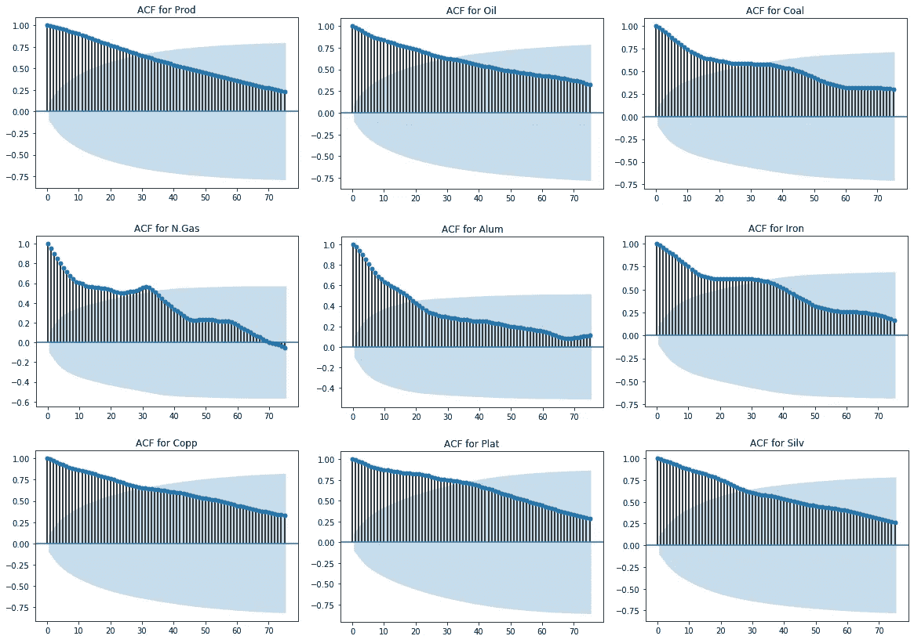

## 差异变量的自相关函数分析

如果我们在第一次差分后对变量作图，差分变量的 ACF 看起来可能是稳定的。这表明每个时间序列都是综合 I(1)的。增强的 Dickey-Fuller (ADF)测试可以进一步证实这一点。

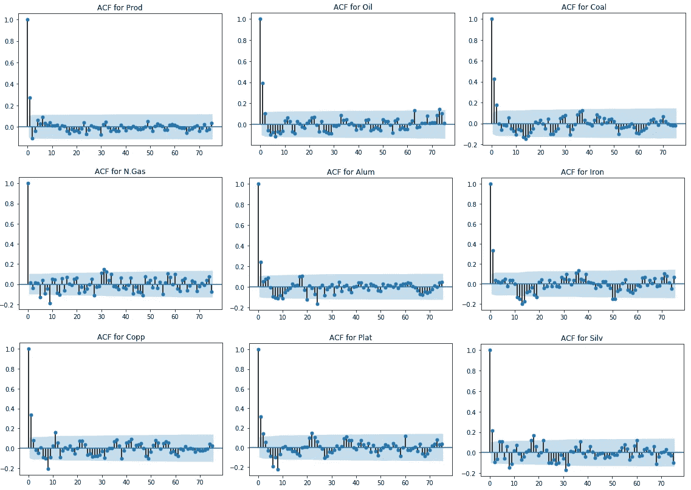

## 差分变量的增广 Dickey-Fuller 检验—平稳性检验

无效假设是数据是非平稳的。因此，如果 p 值较低，则数据是平稳的，具有较高的统计显著性。

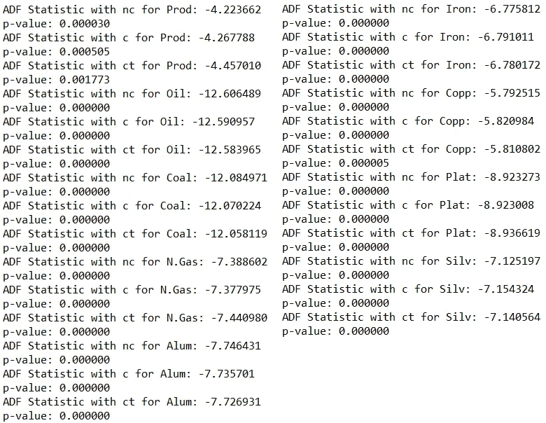

差异变量的 ADF 检验结果有力地支持了时间序列是 I(1)整体的假设。在建模之前，需要对这些时间序列进行一次差分。

## 格兰杰因果检验——因果关系的检验

N ext，我们想通过**格兰杰因果检验**来看看时间序列之间是否存在因果关系。潜在的故事是，如果 X 的先前值可以预测 Y 的未来值，那么 X Granger 导致 Y。通过估计 X 对 Y 的滞后值的回归来执行 f 检验。如果 p 值很小，我们可以拒绝 X 的滞后值的所有系数都是 0 的零假设，即滞后的 X 对未来 Y 具有预测能力

为简单起见，下面只显示美国工业生产指数的测试结果。结果显示，除天然气价格外，所有商品价格都对美国工业生产有预测力。因此，我们在剔除天然气价格后进行 VEC 建模是合适的。

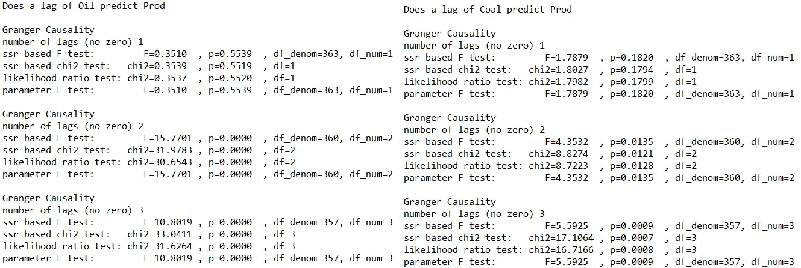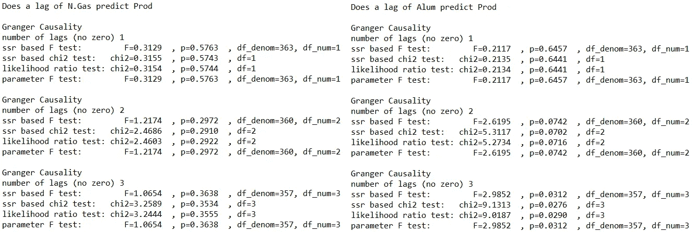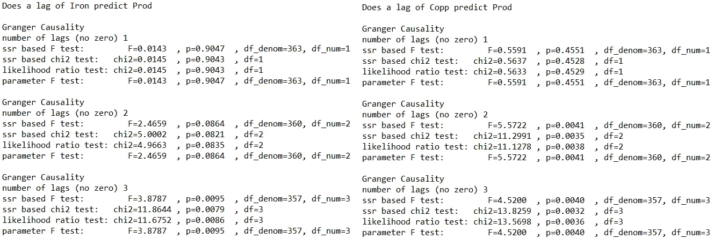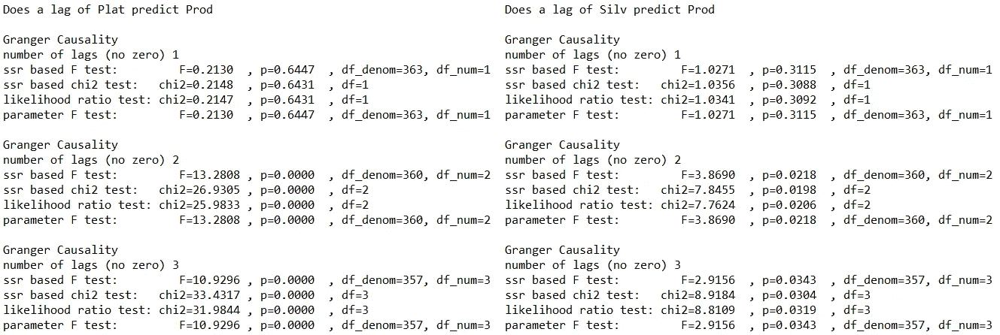

## Johansen 协整检验——协整检验

在下一步，我们将通过 **Johansen 协整检验来检验时间序列之间是否存在协整(长期)关系。**

该检验的结果表明，在滞后 1 和滞后 2 的序列之间分别存在 3 和 2 个协整关系。此外，在 95%的显著性水平上，样本期内第 3、4、5 和 6 个滞后时间序列之间存在 1 个协整关系。因此，我们可以说 **VEC 建模适合对这些时间序列数据**进行建模。

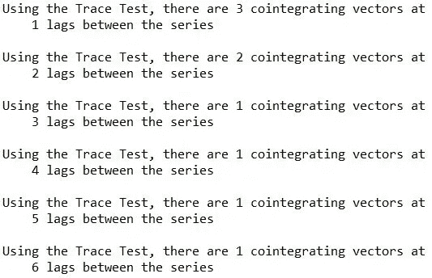

## VECM 评估和分析

**负荷系数(alphas)代表时间序列收敛到长期均衡关系的速度。**

石油、煤炭、铝和银价格的 alphass 值在 0.05 显著性水平上具有统计显著性，而铜和铂价格的 alpha 值在 0.10 显著性水平上具有显著性。然而，铁矿石价格的 alpha 值在统计上并不显著。

从结果来看，我们知道铁矿石价格对美国工业生产指数的外生作用很弱。弱外生性意味着偏离长期不直接影响弱外生变量。这种效应来自于那些非弱外生变量的后续滞后。换句话说，**其他商品价格的滞后是弱外生变量(铁矿石价格)**回归长期均衡的驱动力。

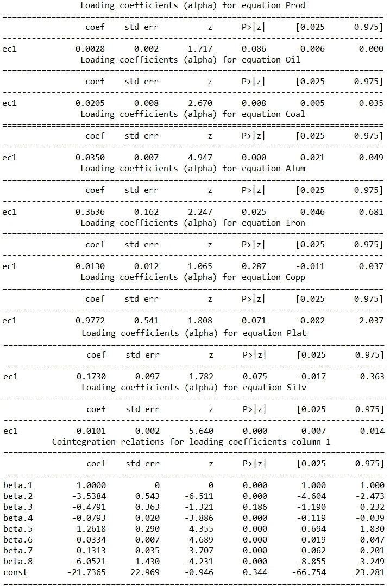

**贝塔系数是实际的长期关系系数。**美国工业生产指数的贝塔系数标准化为 1，以便于解释其他贝塔系数。

其中，白银价格的贝塔系数为-6.0521，这意味着从长期来看，白银价格上涨 1 美元将导致美国工业生产指数下降 6.0521。同样，石油、煤炭和铝的贝塔系数分别为-3.5384、-0.4791 和-0.0793。

相比之下，铁矿石价格的贝塔系数为 1.2618，这意味着从长期来看，铁矿石价格上涨 1 美元将导致美国工业生产指数上涨 1.2618。类似地，铂和铜的贝塔系数分别为 0.1313 和 0.0334。

## 脉冲响应函数

**脉冲响应函数(IRF)显示了一个变量在另一个或同一个变量在前期(月)增加 1 个单位时的响应。**蓝色曲线表示单位冲击随时间推移的影响，虚线表示 IRF 的 95%置信区间。在这里，我们试图观察为期 24 个月的**脉冲响应。**

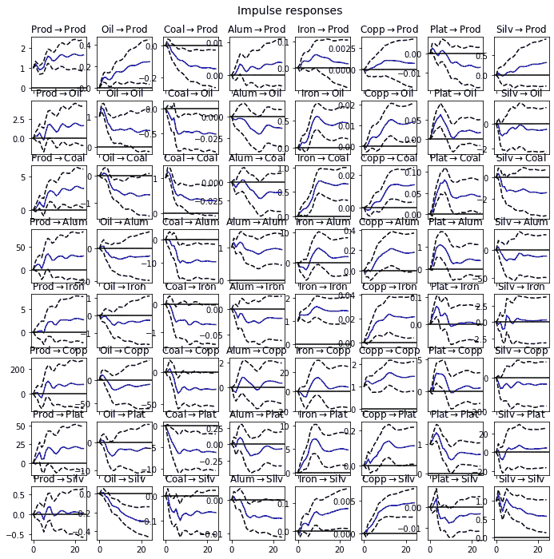

让我们关注美国工业生产指数的 IRF。

首先，从上图的第一列可以有趣地看到,**如果工业生产指数在前一个月经历了 1 个单位增长的冲击，所有商品的价格都会上涨。**这一观察结果可以得到**需求冲击逻辑的支持。**

第二，从上图的第一行我们可以看到**石油、铝、铁、铜和银的价格受到一个单位的正冲击会导致工业生产上升**，尽管幅度和持续时间**不同。**背后的基本原理可能是**在大宗商品价格上涨的情况下，矿业、电力和天然气公用事业行业提高产量的动力增强**。

第三，**当煤炭和铂金价格经历一个单位的正向冲击时，会给工业生产指数带来负面影响。这些商品价格的上涨可能会导致制造业的投入成本上升，从而阻碍工业生产。**

你可能会注意到，在工业生产指数中可能有两个主导但相互矛盾的因素——制造业和采矿业。大宗商品价格的上涨可能会鼓励采矿和公用事业活动，但会放缓制造业。

如果我们看看其他商品的 IRF，会发现许多有趣的现象。例如，油价每波动一个单位就会对煤炭价格产生负面影响，反之亦然。可以说明替代效应。因此，对每种商品的工业用途以及它们之间的关系进行深入调查可能是值得的。

## 动态预测

最后但同样重要的是，下面是美国工业生产指数和商品价格未来一年的动态预测图。

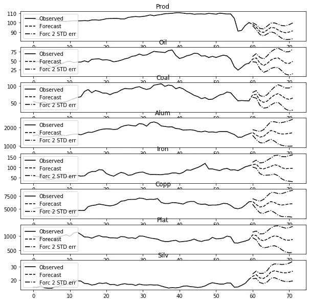

事实上，预测与我们的预期惊人地一致。

**(一)工业生产短期内难以回升，甚至可能进一步小幅下降。美国经济尚未发出强劲的复苏信号。相对疲软的趋势可能会持续更长时间。**

**(二)除白银外，所有商品价格将维持在类似水平。**需求、供应和地缘政治仍然是影响大宗商品价格的基本面。没有一些具体事件，如 3 月份俄罗斯—沙特阿拉伯石油价格战，大宗商品价格趋于稳定。

**(三)目前银价的上涨趋势可能会持续。**除了工业用途，在宽松的货币政策下，白银还可以作为价值储存手段。

# 结论

本文使用了一个流行的计量经济学模型— **向量误差修正模型(VECM)** 来帮助我们**理解工业生产和不同商品价格之间的短期和长期关系。**该模型成功地在数据和现实之间建立了联系。

**脉冲响应函数或动态预测显示的结果符合我们的预期和经济原理。**我希望这能提高你通过经济计量模型分析和预测经济的兴趣。

谢谢您们。下次见。

# 参考

1.  弗朗兹·x·莫尔。(2019).[向量误差修正模型(VECMs)简介](https://www.r-econometrics.com/timeseries/vecintro/)。
2.  约翰·克莱门茨。(2019).[方股票之间的长期关系](/long-run-relationships-between-fang-stocks-82baf183840c)。
3.  纱丽玛依特拉。(2019).[使用 VAR & VECM 的时间序列分析:统计方法](/vector-autoregressions-vector-error-correction-multivariate-model-a69daf6ab618)。
4.  塞尔瓦·普拉巴卡兰。(2019).[向量自回归(VAR)——Python 中的综合指南及示例](https://www.machinelearningplus.com/time-series/vector-autoregression-examples-python/)。
5.  美国能源信息管理局。(2020).[月度能源回顾](https://www.eia.gov/energyexplained/use-of-energy/industry.php)。
6.  世界银行集团。(2020).【2020 年 4 月商品市场展望。

 [## 用我的推荐链接加入媒体-哈德森高

### 如果你对我写的东西感兴趣，不要错过成为 Medium 会员的机会。您将可以完全访问所有…

medium.com](https://medium.com/@hudsonko/membership) 

如果你有兴趣了解如何应用因子和聚类分析进行国家分类，你可以看看我下面的另一篇文章。谢了。

 [## 国家分类的因子分析和聚类分析

### 让我们更多维度地了解这个世界！！！

towardsdatascience.com](/factor-analysis-cluster-analysis-on-countries-classification-1bdb3d8aa096)