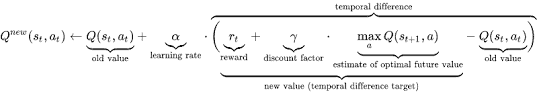
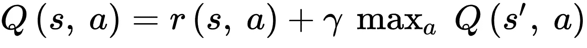
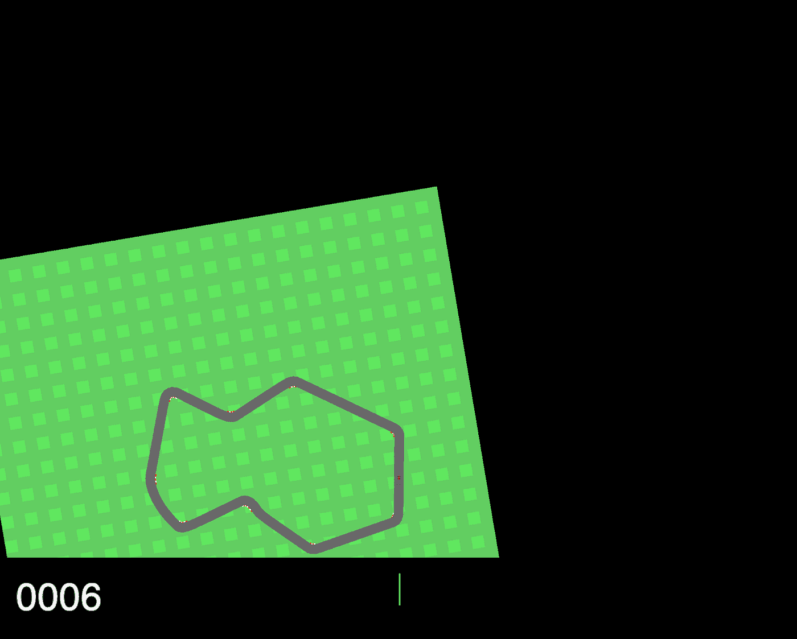
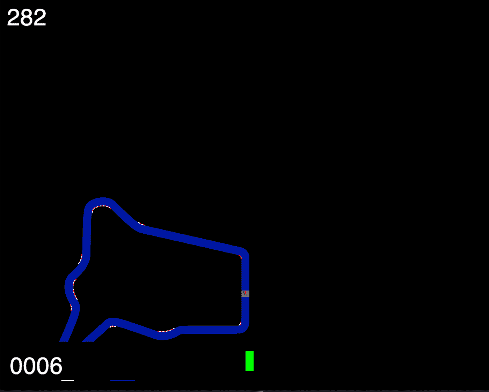
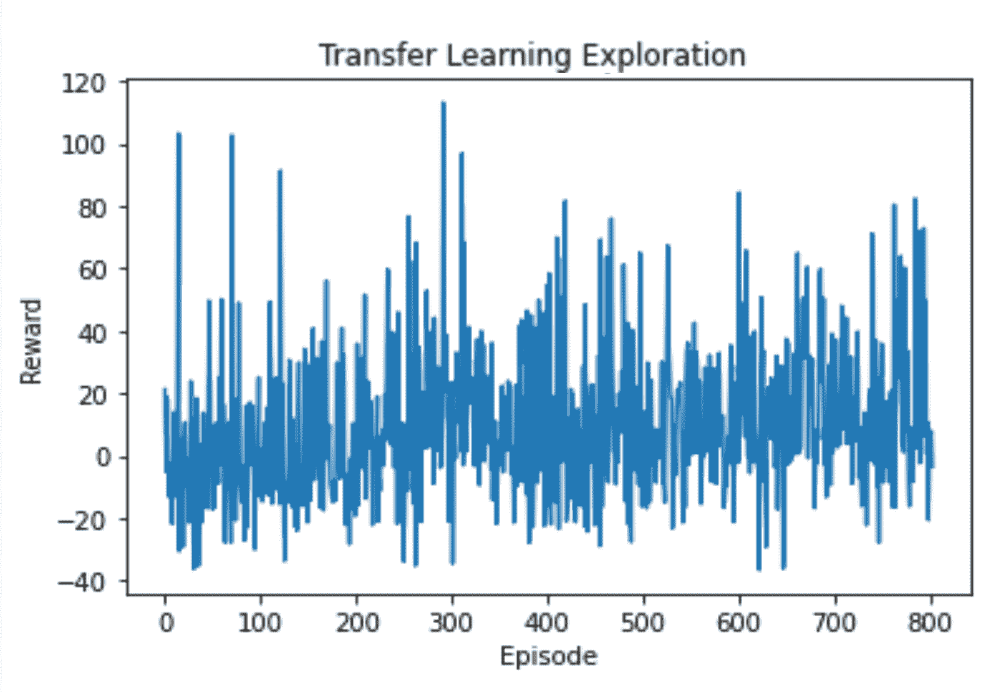
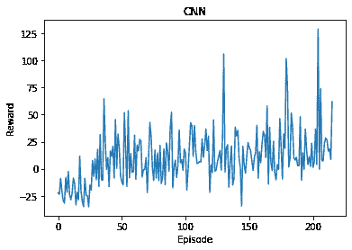
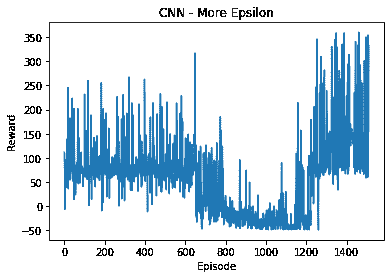

# 为 OpenAI 的赛车游戏应用深度 Q 网络

> 原文：<https://towardsdatascience.com/applying-a-deep-q-network-for-openais-car-racing-game-a642daf58fc9?source=collection_archive---------10----------------------->

**摘要。**使用 OpenAI 的经典环境 carr acing-v 0(2D 自动驾驶汽车环境)以及基于定制的环境修改，创建了 Deep Q-Network (DQN)来解决经典和定制环境。通过使用 Resnet18 预训练架构和定制的卷积神经网络结构，这些模型用于解决经典和修改的环境。包罗万象，自定义环境不允许自由移动，最终造成灾难性的遗忘，使经典环境更适合训练。此外，预先训练的模型产生了更随机的结果，而定制的 CNN 架构导致了剧集和奖励之间更明确的相关性。因此，通过应用这种定制设计的架构，该模型能够定期超过 350 的奖励计数。

**背景**

OpenAI 推出的 Gym 是一个人工智能项目的开源银行。这个数据库已经放在一起，供开发人员使用各种人工智能技术，如强化学习和计算机视觉来解决这些环境[5]。针对这些任务的许多用户生成的解决方案都是公开可用的，从而为未来的开发提供了一个基准。这项研究中探索的环境是 CarRacing-v0，这是一个 2D 自动驾驶汽车环境。使用机器学习，一个依赖于大型数据集的人工智能子集[6]，一个代理被训练来学习这个轨迹。

这项研究中使用的特定机器学习算法是深度 Q 网络——一种强化学习技术。这项技术建立在 Q-Learning 的基础上，这是一种简单的无模型强化学习算法[8]，通过添加神经网络来实现。简单的 Q 学习算法基于先前的状态执行动作，如果先前没有探索过该状态，则该模型将随机动作[8]。神经网络是一种基于先前数据进行估计的工具[7]。因此，通过使用神经网络来估计 Q 值，而不是基于以前的状态和纯粹的随机动作，可以产生更有效的动作[3]。

如前所述，深度 Q 学习算法是 Q 学习的修改变体。这个独特的公式如下所示。

情商。1 深度 Q 网[13]。

使用深度卷积神经网络作为最佳行动的近似工具，可以通过最大奖励总和来描述，在产生各种观察结果并采取适当行动后，根据行为策略，在每个时间间隔对其进行折扣[13]。

情商。2 深 Q-网络的损失函数[13]。

该等式基于状态 s 和正在执行的动作 a 产生 Q 值。因此，这将产生 r(s，a)处的奖励以及来自未来状态 s '的 Q 值最高点。执行经验中继，代理的经验被存储在一个数据集中。在训练时，Q-Learning 应用于已经存储的经验的随机样本(显示在等式 2 中)。在这个等式中，gamma 是调节未来回报的贴现因子。

**基本原理和理由**

这项研究的目的是探索机器学习在现实世界中的应用。自 20 世纪 80 年代以来，自动驾驶汽车领域的发展得到了广泛的宣传和认可[15]。然而，这些进步并没有真正满足商业和社会需求。通过应用人工智能各个领域的进步，如机器学习、计算机视觉、强化学习和神经网络，可以生产出自动驾驶汽车来改善人类社会[15]。本文使用这些方法，将有助于讨论这一领域的发展。使用正向强化来激励车辆保持在期望的路径上，类似于为自动驾驶汽车开发的内容。

同样，这篇研究论文也有助于进一步探索不同学科和用途的机器学习发展。例如，这项研究的方法和结果可以应用于其他领域，如自然语言处理[18]和计算机游戏的强化学习[19]。

**建筑**

1.Pytorch 框架

使用动态计算图和渴望执行深度学习(由短语“定义-运行”而不是经典的“定义-运行”定义)，在训练模型时增加了显著的价值。然而，实现这种方法的框架是以牺牲性能为代价的(Chainer[16])，而其他框架则导致使用表达性较差的语言，如 Dynet[17]，从而限制了它们的应用。然而，通过 Pytorch 库中提供的实现选项和设计选择，可以使用动态执行，而不会牺牲大量的功率或性能[9]。

此外，Pytorch 通过结合使用自动微分和 GPU 加速来执行动态张量的即时执行。此外，Pytorch 在这样做的同时保持了与用于深度学习的领先库相当的性能水平[9]。这是因为这些张量类似于 NumPy 的“ndarrays ”,同时具有通过 GPU 应用的优势。因此，这加快了训练的速度[14]。

2.预训练模型

预训练模型是过去为解决其他类似问题而创建的模型。这些模型的架构是在模型中免费提供的，不需要太多额外的培训。这些包，尤其是 Pytorch 的包，包含了处理不同任务的模型定义。这些包括图像分类、逐像素语义分割、实例分割、对象检测、人物关键点检测和视频分类[12]。

根据定义，使用预先训练的模型被认为是迁移学习。虽然大多数层已经被训练，但是最终的层必须被操纵和整形，以具有与预训练模型的输出相同的输入。此外，在训练时，用户必须通过选择哪些层不被重新训练来优化预训练模型，因为如果所有层都被重新训练，这使得迁移学习的使用有些无用[10]。因此，典型的是整个预训练模型被冻结。

**环境**

**1。经典环境**

经典的 CarRacing-v0 环境既简单又直观。在没有任何外部修改的情况下，状态由 96x96 像素组成，从经典的 RGB 环境开始。对于每个帧，奖励等于-0.1，对于访问的每个轨道区块，奖励等于+1000/N，其中 N 由整个轨道中的区块总数表示。要被认为是成功的运行，代理必须始终达到 900 的奖励，这意味着代理在赛道上的最大时间是 1000 帧。此外，赛道外有一个障碍，如果越过，将导致-100 的处罚，并立即结束该集。在外面，赛道由草地组成，草地不会给你带来回报，但由于环境的摩擦，会导致车辆在赛道上的挣扎。总的来说，这个环境是一个经典的 2D 环境，明显比 3D 环境简单，使得 OpenAI 的 CarRacing-v0 简单得多。

图 1:经典 CarRacing-v0 环境的屏幕截图。

**2。自定义环境**

经典环境的边界迫使代理处于边界的限制之内。因此，一种理论产生了，用延伸的边界代替草地将迫使车辆在赛道上行驶，从而允许更快的学习时间。移除草只留下两个可能的位置，轨道或边界，然而在边界上会立即结束插曲，这意味着所有的州必须在轨道上。相反，在经典环境中，车辆必须花费大量时间学习草地的力学和施加在其上的摩擦力。越过更显著的障碍仍然给代理一个-100 的奖励，并且仍然导致代理在那一集被认为“完成”。

图 2:自定义 CarRacing-v0 环境的屏幕截图。图片作者。

CNN 模型和修改

虽然使用定制架构和预训练模型之间存在差异，但两者都有一些相似之处。两者的学习率为，贴现值等于

1.定制建筑

神经网络中的卷积层非常适合图像识别。由于该环境的图像识别方法，conv2d 层似乎是最合适的。使用 PyTorch 的 Conv2d 设计了一个网络。

*   Conv2d(1，6)(内核大小为 4，步长为 4)
*   ReLU 激活(真)
*   Conv2d(6，24)(内核大小为 4，步长为 1)
*   ReLU 激活(真)
*   MaxPool2d(内核大小为 2)
*   展平图层

虽然图像最初是在 RGB 状态下识别的，但是每一帧都是使用灰度过滤器直接转换的。因此，输入通道必须从 1 开始。在 Conv2d 层之后，还必须实现线性层。

*   线性(((9 x 9)x 24)，1000)
*   ReLU 激活(真)
*   线性(1000，256)
*   ReLU 激活(真)
*   线性(256，4)

由于线性图层的输入图层的性质，计算必须反映 Conv2d 图层。通过线性激活层发送的图像将是 84 x 84 的裁剪后图像。第一个 conv2d 层的卷积为 4 x 4，没有任何填充，步长为 4，大小降至 21 x 21。第二层的输入将为 21 x 21，并将再次应用 4 x 4 卷积，这次步长为 1，大小降至 18 x 18。最后，还有一个 MaxPool2d 层，内核大小为 2，因此总大小等于 9 x 9。这个数字乘以 24，即 conv2d 层的输出，产生线性激活的输入。

2.Resnet18 预训练模型

自发布以来，Resnet 已经成为迁移学习领域中最常见的预训练模型之一，因为它具有准确的结果和表示，特别是对于基于计算机视觉的任务。Resnet18 来自 Resnet 预训练模型系列，是具有 18 层的变体，输出 512 个通道。使用未经训练的 CNN，通常会大大减慢训练过程。该模型可简化如下:

*   Resnet18 (18 层)(冻结)
*   线性(512，256)
*   ReLU(真)
*   线性(256，4)

下图显示了解释的模型。512 的输入层是从 Resnet18 预训练模型接收的，添加的隐藏层的大小为 256，最终输出层的长度为 4。

3.用户化

许多 dqn 的方法是相同的，尤其是对于网络。然而，对待代理人和国家的方式各不相同。采用的许多策略有效地改进了训练时间，但是影响因方法而异。有些方法之前已经解释过了，有些没有。

*   裁剪:84 x 84 框架形状

需要图像的许多部分。但是，不需要底部。事实上，它会扰乱图像识别过程，因为黑色尤其可能被识别为地图的边界。因此，裁剪底部是优化模型所必需的。此外，固定图像的大小也有助于稳定模型。因此，边缘也从 PIL 图像中被裁剪掉，从左边 6 个像素到右边 6 个像素。

*   灰度:3 个通道到 1 个通道

将颜色(RGB)用于计算机视觉任务通常会使模型变得复杂，并引入更多通道。与普通 RGB 图像相比，使用一个通道而不是三个通道可以使模型的灰度级提高大约三倍。很多时候，使用颜色并没有增加任何好处，尤其是对于像 CarRacing-v0 这样简单的模型，其中图像识别部分没有实际学习侧那么重，尤其是因为环境不是 3D 的，而是保持了 2D 方法。

*   图像均衡:均衡图像

对于 PIL 图像，有一个函数将非线性映射应用于输入图像，以便在输出图像中创建灰度值的均匀分布。用于均衡“图像直方图”这种方法用于增加图像的对比度，由于使用了灰度图像，这是一个重要的步骤。

*   ε波动:调整ε

培训需要 Epsilon，因为它允许模型进行必要的探索。然而，很多时候，应用的ε是不够的。因此，更多的ε和随机化是必要的。为了纠正这一点，自动调节ε而不是手动调节似乎是最好的办法。这个过程很简单；如果最后的 50 集比之前的 50 集有更好的改善，那么模型应该将ε减小 0.025。如果没有，模型应该改为添加 0.05，因为似乎需要更多的训练来完善模型。ε在其最大值时被设置为 1.0；在这一点上，所有的行动都是随机的。渐渐地，基于ε衰变，它会减少。

*   奖励修改:调整奖励

很明显，由于各种原因，在这种环境下分配的奖励不恰当。对通过边界的惩罚给出了比需要的更大的惩罚，导致代理由于大的奖励惩罚而限制其移动，阻止探索和尝试追踪。因此，奖励不得不从-100 修改为 0，以允许更好的训练，同时惩罚代理人在草地上停留每一步-0.05。奖励修改已针对自定义环境进行了测试。然而，由于灾难性遗忘的重要性，这对训练没有影响。

**结果和评估**

1.理论:灾难性遗忘

灾难性遗忘是模型可能经历的可怕循环之一，尤其是在使用神经网络时。灾难性遗忘，或有时被称为灾难性干扰，发生在训练一个新的任务或任务类别时，神经网络可能会忘记过去的信息来代替现在的信息[2]。对于定制环境，死亡率高得令人难以置信，这意味着代理在接受培训时几乎会立即死亡。然而，对于其他环境，如 CartPole，这不是什么大问题，但对于有些复杂的环境，如 CarRacing，这就产生了更大的问题。虽然对于大多数传统的 CarRacing-v0 环境来说，这个问题并不突出，但灾难性遗忘似乎正在整个定制的 CarRacing-v0 环境中大规模发生。

汽车，代理人，似乎死得太快，学习新的信息，并逐渐忘记它学习的一切，而是学习保持静止，试图防止超越边界，因为这种行动的反响产生了沉重的奖励惩罚，这是模型试图防止的。

转到经典模型，最初出现了相同的结果。代理人将了解到屏障将产生一个“死亡”状态，使代理人“学会”在一个圆圈中旋转，以试图防止任何死亡和巨额罚款。代理也将忘记它过去在赛道上的经历来做这个序列。这似乎是其他人试图解决环境的常见问题，但允许更多的剧集进行训练和探索，同时调整奖励惩罚，允许模型意识到赛道是目标路线。

然而，改变定制环境的奖励并没有增加变化，更多的训练和探索也没有。对于定制环境，代理人无论如何都会遭受灾难性遗忘的悲剧。

2.比较模型

在显示所示图表之前，前两个图表在最大ε为 1 的情况下被训练，而没有衰减 500 集。然后，根据显示的结果生成这些图表。

当使用预先训练的模型时，它似乎不如完全定制的架构训练得快。为了解决这个问题，冷冻层被解冻以重新训练，这在某种程度上消除了预先训练模型的目的。下面显示了在许多集的课程中使用迁移学习的结果，标题是“迁移学习探索”看起来在图表和它的学习曲线中有大量的波动。每集的奖励似乎是下降，然后上升，再上升。然而，如果不考虑异常值，仍然有轻微的上升趋势。

图表 1:使用来自 Resnet18 的预训练模型。

另一种方法使用定制的架构，产生了类似的结果，但结果的变化更加平缓，如下图所示，标题为“CNN- Stable Exploration”，再次将情节与奖励进行了比较。每集的奖励会逐渐增加，但并没有预期的那么快。该模型的奖励计数在 112 的值达到峰值。

图表 2:具有稳定ε的定制 CNN。

通过为初始训练过程分配更多的剧集，训练过程被加速。不是 500 集训练，而是 1000 集。ε衰减也增加了 15%,以允许更随机的初始探索。结果显示在下图中，带有经典的标题“CNN”看到的变化比其他图表更直接，表明学习的速度更快。此外，该模型在高于 125 的奖励计数处达到峰值，这比图 2 中的略低。然而，图 3 的峰值出现的时间比图 2 的峰值快大约 400 次。

图表 3:ε衰减较少的自定义 CNN。

最后一个图表，图表 4:CNN——更多的ε，有最好的结果。初始训练集比只有 500 个训练集的初始图表大五倍。不仅有 2500 个训练集，而且初始 epsilon 分配从 1.0 增加到 1.5。因此，允许更多的培训和学习，这可以从下图中看出。根据图表 4，奖励计数多次超过 350 的值。

图 4:更多训练和更多 epsilon 的定制 CNN。图片作者。

正如演示的那样，预训练模型似乎每集都有更随机的奖励流，同时似乎在开始时比定制模型训练得更快。然而，可以看出，与使用预训练模型的模型相比，应用定制 CNN 的模型逐渐增加每集的奖励，并导致更高的奖励峰值。

这些假设在许多测试中保持一致，上面给出的图表似乎不是这个假设的异常值。然而，无论使用哪种模式，它们都没有获得足够的奖励来被认为是成功的，因为没有一集汽车的总奖励是 900，更不用说连续 100 集了。

**讨论研究和未来展望**

1.双 dqn(双学习)

虽然 dqn 对许多环境都很有用，但一种称为双 dqn 的 dqn 变体——在双学习下——通常更好、更有效。与双 dqn 相比，dqn 往往更乐观，双 dqn 往往对选择的行动更怀疑，计算采取该行动的目标 Q 值[11]。总的来说，双 dqn 有助于减少对 Q 值的高估，使训练更快，学习更稳定[11]。由于该信息，可以理解，与所应用的经典 DQN 相比，使用双重学习对于该环境将会更加有效和有益。

2.Google Colab GPU(训练时间)

训练时间是深度学习的一个重要部分，因为学习需要大量时间来学习模型所应用的任何过程。在许多情况下，GPU 是必不可少的，因为它们可以成倍地提高训练速度，从而更快地训练模型，分配额外的训练时间来完善模型，并调整额外的变化。

将 Google Colab 用于可访问的云 GPU 允许更快的训练，然而，云程序对于需要渲染的环境来说不是很好。对于 CarRacing-v0 环境，在一集之后使用经典的“env.render()”是不可能的。在花了相当长的时间尝试在 Google Colab 上配置环境后，最好的结果是在运行代码后通过创建一个允许“show_video()”的函数来渲染最后一集。然而，这并不实际，因为它不允许我检查每一次迭代和每一集，并能够仔细分析发生了什么。

3.环境缺陷

虽然 OpenAI 有很多公众可以轻松访问的开源环境，如 CarRacing-v0，但在环境开发中并不完全出色。底部信息的相当不合标准的放置会妨碍代理的性能。应用在赛道上的糟糕的物理学迫使车辆原地打转。奖励分数和其他缺陷一起破坏了环境的整体结构，使代理的训练变得很有挑战性。

4.更多探索(艾司隆)

对于 Q 学习算法的任何变体，探索是学习如何发生的。允许更多的ε允许模型了解更多关于环境的信息以及如何解决环境问题。真的，理论上，更多的训练和更多的探索应该能够推动任何模型学习一个足以解决它的环境。

5.参考他人的作品

这个项目适用于“开放的健身房环境”社区的一个利基部分。如前所述，在这样的项目中使用 DQN 从任何角度来看都不是最佳的做法。然而，其他论文已经尝试使用这种方法，取得了不同程度的成功。例如，两名斯坦福大学研究人员在 2018 年 12 月发表的一篇论文试图将 dqn 用于相同的环境。这篇论文名为“简单赛车游戏的强化学习”，由 Pablo Aldape 和 Samuel Sowell 撰写。

Aldape 和 Sowell 在他们的项目中没有裁剪图像，而是将其留在经典的 96 x 96，节点大小为 9216。然而，他们随后提到，他们没有灰度化，甚至没有保留 RGB 颜色，而是每个节点都接受其各自像素的绿色通道[1]。这似乎是一种复杂的颜色操作方式，而正常的重新缩放可能更容易也更有效。此外，应该更好地利用作物，因为仪表栏上的颜色污染了环境的绿色屏幕，84 x 84 的作物可以消除它。

然而，他们的项目和这个项目也有一些相似之处。例如，分享了使用预培训模型作为一种培训形式。此外，两个模型都没有超过 900 的奖励阈值，因为两者都没有计算能力或时间来完全解决环境问题。

没有使用 DQN 解决 CarRacing-v0 环境的好例子。因此，下一篇与这种环境最接近的论文是一位法国博士生写的。在论文中，作者 Dancette 使用了卷积神经网络，并在结论中详细描述了该模型是如何训练的。Dancette 声称，该网络可以识别形状，以使汽车保持在所需的路径上[4]，这比尝试 DQN 对这种环境更有用，因为这种环境最重要的部分是识别轨道并保持在其边界内。

这三个模型都收敛到不同的最大奖励计数，并能够在一个数字表中表示。可以看出，虽然这个 DQN 优于 Sowell 和 Aldape，但 Dancette 的神经网络模型明显更有效和实用。

这款 DQN 型号:**300–350**

索维尔和阿尔达普的 DQN 模型[1]:**150–200**

丹塞特的神经网络模型[4]:**450–500**

6.未来展望

对于这种环境，使用其他技术可能是有益的，例如，双 dqn 或近似策略优化(PPO)。如果 DQNs 再次用于这种环境，将需要更多的 epsilon、情节和训练，然而，这将比使用其他更可靠的技术更不实际。如果要再次使用 dqn，它们应该更好地应用于更短、更可预测的不同自动驾驶汽车环境。此外，这些不同的强化学习技术应该在更高级的 3D 环境中使用。与其他模拟的自动驾驶汽车环境相比，CarRacing-v0 相当简单。通过在几个 3D 车辆环境中训练使用深度学习算法(如神经网络和策略梯度)的各种模型，可以在自动驾驶汽车方面取得进展。

**参考文献**

[1]阿尔达佩，p .，&索维尔，S. (2018 年 12 月 18 日)。一个简单赛车游戏的强化学习。2020 年 9 月 14 日检索，来自[https://web . Stanford . edu/class/aa 228/reports/2018/final 150 . pdf/](https://web.stanford.edu/class/aa228/reports/2018/final150.pdf/)

[2]《终身机器学习，第二版》*终身机器学习，第二版|人工智能与机器学习综合讲座*，[www . morganclaypool . com/doi/10.2200/s 00832 ed 1 v01y 201802 aim 037。](http://www.morganclaypool.com/doi/10.2200/S00832ED1V01Y201802AIM037.)

[3] Mnih，v .、Kavukcuoglu，k .、Silver，d .、Graves，a .、Antonoglou，I .、Wierstra，d .、& Riedmiller，M. (2013 年 12 月 19 日)。用深度强化学习玩雅达利。ArXiv.Org。[https://arxiv.org/abs/1312.5602](https://arxiv.org/abs/1312.5602)

[4]丹塞特，C. (2018 年 04 月 09 日)。[Tutoriel]2020 年 9 月 10 日从[https://cdancette.fr/2018/04/09/self-driving-CNN/](https://cdancette.fr/2018/04/09/self-driving-CNN/)检索到的

[5] Gym:开发和比较强化学习算法的工具包。(未注明)。OpenAI。检索于 2021 年 1 月 20 日，来自[https://gym.openai.com/](https://gym.openai.com/)

[6]西蒙·奥(2018)。简单介绍机器学习及其在通信系统中的应用。IEEE 认知通信和网络汇刊，4(4)，648–664。[https://doi.org/10.1109/tccn.2018.2881442](https://doi.org/10.1109/tccn.2018.2881442)

[7] Krose，b .，Krose，B. J. A .，Smagt，P. V .，> Smagt，P. (1993 年)。神经网络导论。计算机科学杂志，1–135 页。[https://www . researchgate . net/publication/272832321 _ An _ introduction _ to _ neural _ networks](https://www.researchgate.net/publication/272832321_An_introduction_to_neural_networks)

[8]Fran ois-Lavet，v .，Henderson，p .，Islam，r .，Bellemare，M. G .，& Pineau，J. (2018 年)。深度强化学习导论。机器学习的基础和趋势，11(3–4)，219–354。https://doi.org/10.1561/2200000071

[9] Paszke，a .，Gross，s .，Massa，f .，Lerer，a .，Bradbury，j .，Chanan，g .，Killeen，t .，Lin，z .，Gimelshein，n .，Antiga，l .，Desmaison，a .，KPF，a .，Yang，e .，DeVito，z .，Raison，m .，Tejani，a .，Chilamkurthy，s .，Steiner，b .，Fang，l .，l .，Chintala，S. (2019 年 12 月 3 日)。PyTorch:命令式的高性能深度学习库。ArXiv.Org。【https://arxiv.org/abs/1912.01703 

[10]微调火炬视觉模型。(未注明)。检索于 2020 年 9 月 14 日，来自[https://py torch . org/tutorials/beginner/fine tuning _ torch vision _ models _ tutorial . html](https://pytorch.org/tutorials/beginner/finetuning_torchvision_models_tutorial.html)

[11] Hasselt，V. H .，Guez，a .，& Silver，D. (2015 年 9 月 22 日)。双 Q 学习的深度强化学习。ArXiv.Org。[https://arxiv.org/abs/1509.06461](https://arxiv.org/abs/1509.06461)

[12]火炬视觉模型。(未注明)。检索于 2020 年 9 月 14 日，来自[https://pytorch.org/docs/stable/torchvision/models.html](https://pytorch.org/docs/stable/torchvision/models.html)

[13] Mnih，v .、Kavukcuoglu，k .、Silver，d .、Veness，j .、Bellemare，M. G .、Graves，a .、Riedmiller，m .、Fidjeland，A. K .、Ostrovski，g .、Petersen，s .、Beattie，c .、Sadik，a .、Antonoglou，I .、King，h .、Kumaran，d .、Wierstra，d .、Legg，s .、& Hassabis，D. (2015 年)。通过深度强化学习实现人类水平的控制。自然，518(7540)，529–533。[https://doi.org/10.1038/nature14236](https://doi.org/10.1038/nature14236)

【14】py torch 是什么？。(未注明)。检索于 2020 年 9 月 14 日，来自[https://py torch . org/tutorials/beginner/blitz/tensor _ tutorial . html](https://pytorch.org/tutorials/beginner/blitz/tensor_tutorial.html)

[15] Janai，j .，Güney，f .，Behl，a .，& Geiger，A. (2017 年 4 月 18 日)。自动驾驶汽车的计算机视觉:问题、数据集和技术状态，ArXiv.Org。[https://arxiv.org/abs/1704.05519](https://arxiv.org/abs/1704.05519)

[16]星矢·托奎、肯塔·乌诺、绍黑·希多和贾斯汀·克莱顿。Chainer:深度学习的下一代开源框架。《2015 年第二十九届神经信息处理系统(NIPS)年会机器学习系统(LearningSys)研讨会论文集》。

[17]纽比格、戴尔、戈德堡、马修斯、阿马尔、阿纳斯塔西索普洛斯、巴列斯特罗斯、蒋、克洛索、科恩、杜、法鲁基、甘、加莱特、纪、孔、昆科罗、库马尔、马拉维亚、米歇尔、小田滋、理查森、萨福拉、斯瓦亚姆 DyNet:动态神经网络工具包。ArXiv 电子版，2017 年 1 月。

[18]k . Narasimhan、t . Kulkarni 和 r . Barzilay(2015 年 6 月 30 日)。使用深度强化学习的文本游戏语言理解。ArXiv.Org。https://arxiv.org/abs/1506.08941

[19]林，张，李，林，杨振宁.(2019).使用基于强化 Q 学习的深度神经网络玩视频游戏。电子学，8(10)，1128。【https://doi.org/10.3390/electronics8101128 