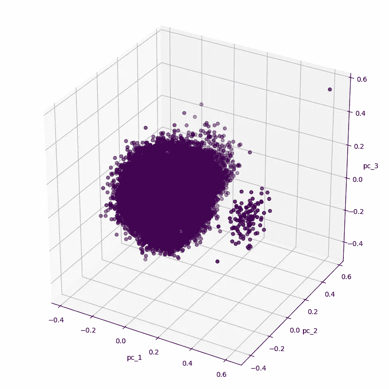
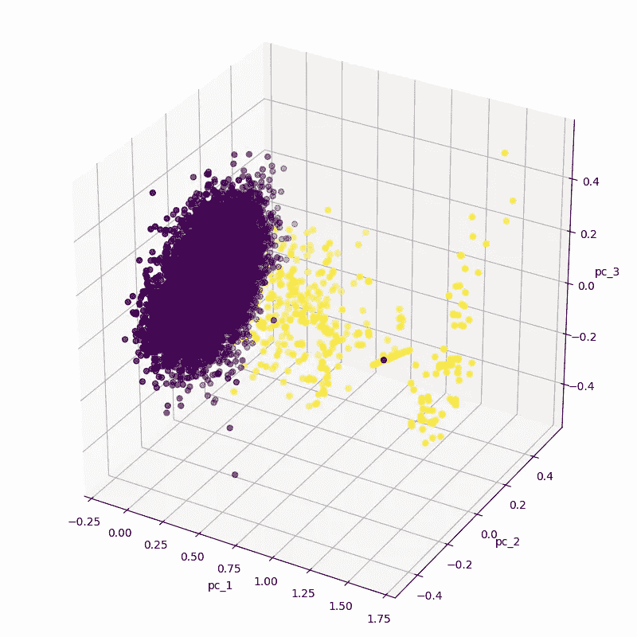
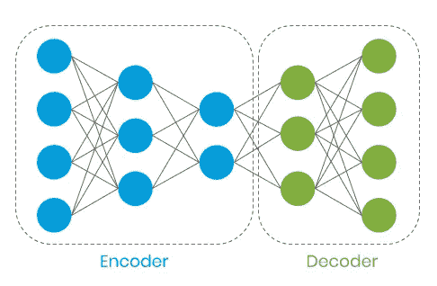
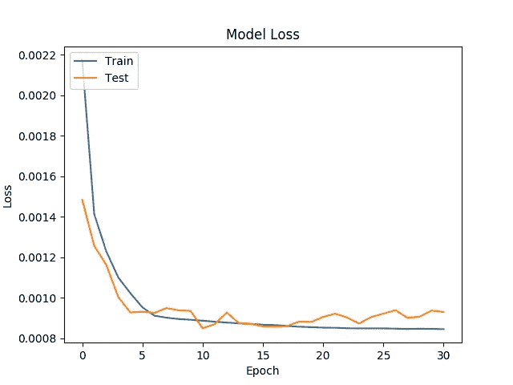
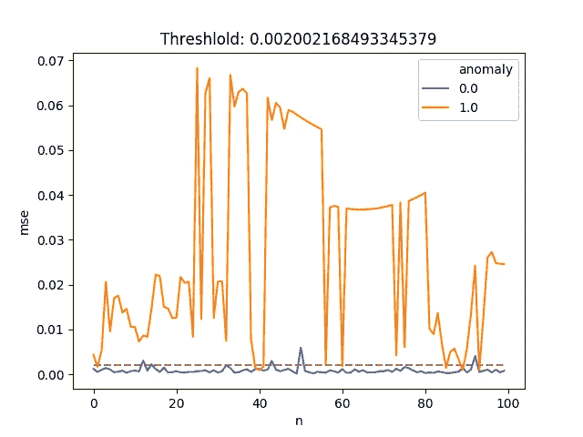

# 将自动编码器异常检测应用于欺诈检测

> 原文：<https://towardsdatascience.com/applying-anomaly-detection-with-autoencoders-to-fraud-detection-feaaee6b5b09?source=collection_archive---------18----------------------->

## 信用卡欺诈可以归类为异常，使用 Keras 中实现的自动编码器可以检测欺诈

[https://unsplash.com/photos/TFqKR4Ynjm8](https://unsplash.com/photos/TFqKR4Ynjm8)

我最近读了一篇名为[用自动编码器进行异常检测](https://medium.com/swlh/anomaly-detection-with-autoencoders-2bd23dedbd9e)的文章。这篇文章是基于生成的数据，因此将这个想法应用到现实世界的欺诈检测任务并验证它听起来是个好主意。

我决定使用来自 Kaggle *的[信用卡欺诈数据集:](https://www.kaggle.com/mlg-ulb/creditcardfraud)

> 该数据集包含欧洲持卡人在 2013 年 9 月的信用卡交易。
> 该数据集显示了两天内发生的交易，其中 284，807 笔交易中有 492 笔欺诈。数据集高度不平衡，正类(欺诈)占所有交易的 0.172%。

这是一个非常不平衡的数据集，是通过异常识别欺诈的良好候选对象。

**让我们从数据发现开始:**

在使用[主成分分析](https://en.wikipedia.org/wiki/Principal_component_analysis)将维度从 30 减少到 3 后，我们将绘制一个更小的图。该数据有 32 列，其中第一列是时间索引、29 个未知特征、1 个交易量和 1 个类别。我将忽略时间索引，因为它不是静止的。

您的第一反应可能是有两个集群，这将是一个简单的任务，但欺诈数据是黄色点！在大星团中有三个可见的黄色点。因此，让我们对正常数据进行二次抽样，同时保留欺诈数据的数量。

现在可以看到，正常交易聚集在一个磁盘中，而欺诈交易则更加分散。

我们将构建一个具有 3 层编码器和 2 层解码器的自动编码器:

[https://medium . com/swlh/anomaly-detection-with-auto encoders-2bd 23 edbd 9 e](https://medium.com/swlh/anomaly-detection-with-autoencoders-2bd23dedbd9e)

[自动编码器](https://blog.keras.io/building-autoencoders-in-keras.html)会将我们的数据编码到一个子空间中，并在*标准化*数据的同时将特征解码回来。我们的期望是，autoencoder 将学习正常交易的特征，并且在应用时输入将类似于输出。对于异常，输入和输出会有很大的不同，因为它是意外的数据。

这种方法的好处是它允许我们使用**无监督学习**，并且我们通常有大量正常的交易数据。数据标注通常昂贵、困难，并且在某些情况下不可用。手动数据标记还包括人工交互，这导致了带有人工偏见的实现。可以看出，在模型训练中，我们只使用正常的交易特征，而不使用标签。

让我们加载数据并训练我们的自动编码器:

我的模型解决了 8.5641e-04 的验证损失。(可以低至 5.4856e-04。)

使用该模型，我们将计算正常交易的均方误差(mse ),并计算所有 mse 值的 95%的阈值。

我们发现我们的阈值(截止值)为 0.002。如果均方差高于 0.002，我们会将交易视为异常。让我们选择 100 个欺诈样本和 100 个正常样本，并根据阈值绘制:

可以看出，与正常交易相比，大多数欺诈性交易具有较高的均方误差。看起来很有希望。

我们放弃了 5%的正常交易。仍有低于阈值的欺诈交易。这可以通过使用更好的特征提取来改善，因为一些欺诈数据似乎具有与正常交易非常相似的特征。信用卡欺诈的一些有价值的特征是前一小时/天/周的交易次数，如果交易是在发行国以外的国家发起的。

**未来任务:**

*   通过使用超参数优化来使用更好的模型。
*   分析数据以了解特征。
*   将这些结果与 SVM 或 K-均值聚类等常用方法进行比较。

这篇文章的完整代码可以在 Github 上找到:

 [## bgokden/带自动编码器的异常检测

### 异常检测与自动编码器-信用卡欺诈案件博客帖子为这个回购:https://blog.berkgokden.com 代码…

github.com](https://github.com/bgokden/anomaly-detection-with-autoencoders) 

在 Github 和 Linkedin 上关注我:

 [## 伯克·格登-高级软件工程师-卡斯帕。人工智能| LinkedIn

### 请在联系之前阅读摘要:我是一名电气工程师，但我目前正在从事…

www.linkedin.com](https://www.linkedin.com/in/berkgokden/) 

# *信用欺诈数据集的确认

该数据集是在 Worldline 和 ulb(布鲁塞尔自由大学)机器学习小组( [http://mlg.ulb.ac.be](http://mlg.ulb.ac.be/) )关于大数据挖掘和欺诈检测的研究合作期间收集和分析的。在[https://www.researchgate.net/project/Fraud-detection-5](https://www.researchgate.net/project/Fraud-detection-5)和 [DefeatFraud](https://mlg.ulb.ac.be/wordpress/portfolio_page/defeatfraud-assessment-and-validation-of-deep-feature-engineering-and-learning-solutions-for-fraud-detection/) 项目的页面上可以获得关于相关主题的当前和过去项目的更多细节

引用作品:

安德烈亚·达尔·波佐洛、奥利维尔·卡伦、里德·约翰逊和吉安卢卡·邦坦皮。[非平衡分类的欠采样概率校准。](https://www.researchgate.net/publication/283349138_Calibrating_Probability_with_Undersampling_for_Unbalanced_Classification)2015 年 IEEE 计算智能和数据挖掘研讨会(CIDM)

安德烈亚·达尔·波佐洛；奥利维耶·卡兰；勒·博尔涅，扬·艾尔；沃特肖特，哔叽；邦坦皮，吉安卢卡。[从从业者的角度吸取信用卡欺诈检测的经验教训](https://www.researchgate.net/publication/260837261_Learned_lessons_in_credit_card_fraud_detection_from_a_practitioner_perspective)，应用专家系统，41，10，4915–4928，2014 年，Pergamon

安德烈亚·达尔·波佐洛；贾科莫博拉奇；奥利维耶·卡兰；阿里皮、塞萨尔；邦坦皮，吉安卢卡。[信用卡欺诈检测:现实建模和新型学习策略，](https://www.researchgate.net/publication/319867396_Credit_Card_Fraud_Detection_A_Realistic_Modeling_and_a_Novel_Learning_Strategy) IEEE 神经网络和学习系统汇刊，29，8，3784–3797，2018，IEEE

达尔·波佐洛，安德里亚[用于信用卡欺诈检测的自适应机器学习](http://di.ulb.ac.be/map/adalpozz/pdf/Dalpozzolo2015PhD.pdf)ULB·MLG 博士论文(g .邦坦皮指导)

法布里齐奥·卡希洛；安德烈亚·达尔·波佐洛；扬·阿勒·勒博尔涅；奥利维耶·卡兰；马泽尔、扬尼斯；邦坦皮，吉安卢卡。 [Scarff:使用 Spark 进行流式信用卡欺诈检测的可扩展框架](https://www.researchgate.net/publication/319616537_SCARFF_a_Scalable_Framework_for_Streaming_Credit_Card_Fraud_Detection_with_Spark)，信息融合，41，182–194，2018，Elsevier

法布里齐奥·卡希洛；扬·阿勒·勒博尔涅；奥利维耶·卡兰；邦坦皮，吉安卢卡。[现实生活中信用卡欺诈检测的流式主动学习策略:评估和可视化，](https://www.researchgate.net/publication/332180999_Deep-Learning_Domain_Adaptation_Techniques_for_Credit_Cards_Fraud_Detection)国际数据科学与分析杂志，5，4，285–300，2018，施普林格国际出版公司

Bertrand Lebichot，Yann-al Le Borgne，何丽云，Frederic Oblé，Gianluca Bontempi [用于信用卡欺诈检测的深度学习领域适应技术](https://www.researchgate.net/publication/332180999_Deep-Learning_Domain_Adaptation_Techniques_for_Credit_Cards_Fraud_Detection)，INNSBDDL 2019:大数据和深度学习的最新进展，第 78-88 页，2019 年

Fabrizio Carcillo，Yann-al Le Borgne，Olivier Caelen，Frederic Oblé，Gianluca Bontempi [在信用卡欺诈检测中结合非监督和监督学习](https://www.researchgate.net/publication/333143698_Combining_Unsupervised_and_Supervised_Learning_in_Credit_Card_Fraud_Detection)信息科学，2019 年