# 将人工智能技术应用于在 X 射线图像中检测新冠肺炎的网络应用程序的开发

> 原文：<https://towardsdatascience.com/applying-artificial-intelligence-techniques-in-the-development-of-a-web-app-for-the-detection-of-9225f0225b4?source=collection_archive---------48----------------------->

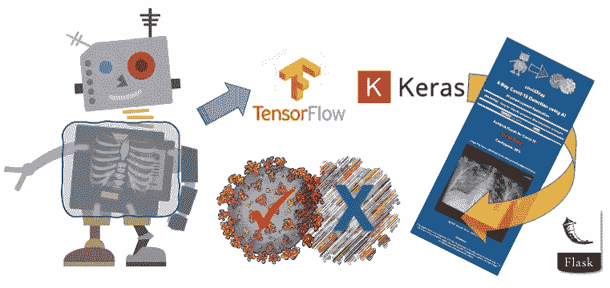

## 放弃

此处开发的自动检测 X 射线图像中新冠肺炎的研究严格用于教育目的。最终应用并不旨在成为用于诊断人类新冠肺炎的可靠和准确的诊断系统，因为它还没有经过专业或学术评估。

## 介绍

新冠肺炎是一种由病毒(新型冠状病毒冠状病毒)引起的疫情病，这种病毒已经感染了数百万人，在几个月内导致数十万人死亡。

根据世界卫生组织(世卫组织)，大多数新冠肺炎患者(约 80%)可能无症状，约 20%的病例可能需要医院护理，因为他们呼吸困难。在这些病例中，大约 5%可能需要呼吸衰竭治疗的支持(通气支持)，这种情况可能会使重症监护设施崩溃。快速检测病毒携带者的方法是抗击疫情的关键。

**什么是冠状病毒？**

冠状病毒是导致呼吸道感染的病毒家族。这种新型冠状病毒制剂是 1919 年底在中国发现病例后发现的。它会导致一种叫做冠状病毒(新冠肺炎)的疾病。

1937 年首次分离出人类冠状病毒。然而，直到 1965 年，这种病毒才被描述为冠状病毒，因为它在显微镜下看起来像一个皇冠。在下面的视频中，您可以看到新型冠状病毒病毒的原子级 3D 模型:

[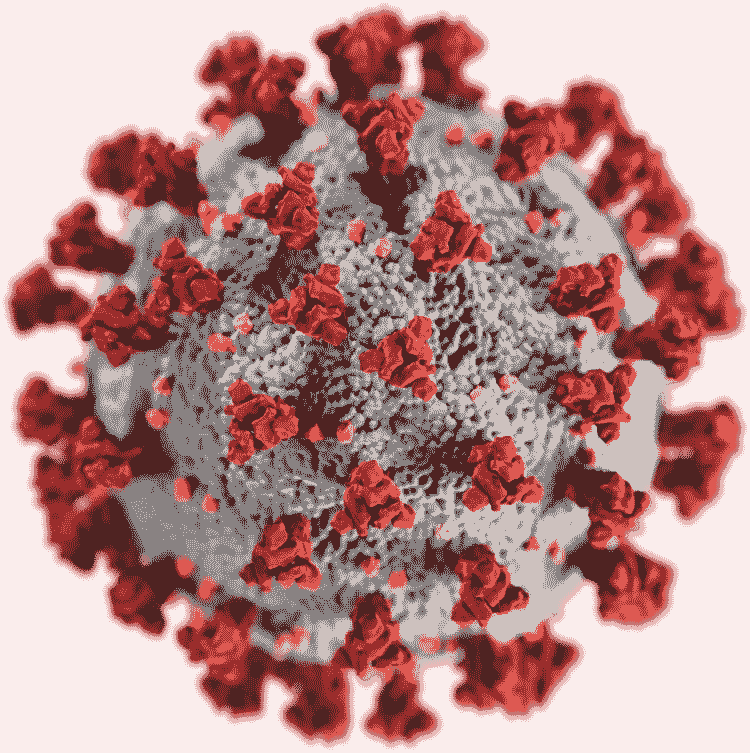](https://youtu.be/y6VC9UqAXHA)

点击图片查看 YouTube 视频

**为什么是 x 光？**

最近，在应用机器学习来辅助基于计算机断层扫描(CT)的新冠肺炎诊断方面已经观察到了一些有前途的努力。尽管这些方法取得了成功，但事实仍然是，新冠肺炎是一种正在各种规模的社区中大力传播的传染病，尤其是最需要帮助的人。

x 光机更便宜、更简单、操作速度更快，因此对于在更贫困或更偏远地区工作的医疗专业人员来说，比 CT 更容易获得。

## 目标

抗击新冠肺炎的重大挑战之一是检测病毒在人群中的存在。因此，该项目的目标是使用扫描的胸部 X 射线图像，自动检测肺炎患者(甚至无症状或未患病的人)中导致新冠肺炎的病毒。这些图像经过预处理，用于训练卷积神经网络(CNN)模型。

CNN 类型的网络通常需要大量数据集才能运行。尽管如此，在这个项目中，应用了一种称为“迁移学习”的技术，这在数据集很小的情况下非常有用(确诊的新冠肺炎患者的图像)。

开发了两种分类模型:

1.  检测新冠肺炎与诊断具有正常胸部 X 线结果的患者
2.  新冠肺炎与肺炎患者的检测

正如论文[新冠肺炎图像数据收集](https://arxiv.org/abs/2003.11597)中所定义的，所有类型的肺炎(除了由新冠肺炎病毒引起的)都被认为是“肺炎”(并以肺炎标签分类)。

对于模型的训练，使用了 [*的工具、库、资源，TensorFlow*](https://www.tensorflow.org) *2.0* (带 Keras)，这是一个开源的平台，用于机器学习，或者更准确的说，深度学习。最终的模型是在 Flask 中开发的 web 应用程序(web-app)的基础，用于在接近现实的情况下进行测试。

下图为我们提供了最终应用程序如何工作的基本概念:

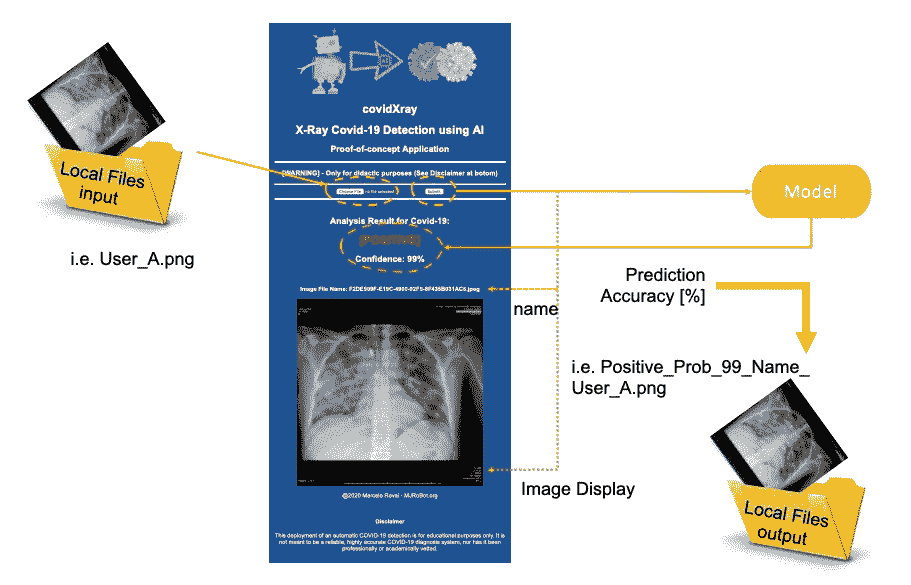

从存储在 web-app 用户计算机上的胸部 x 光扫描图像(User_A.png)中，该应用程序决定该图像是否属于被病毒污染的人(模型预测:[阳性]或[阴性])。在这两种情况下，应用程序都会告知预测的准确性(模型准确性:X%)。为了避免两者的错误，原始文件的名称和它的图像被显示给用户。图像的新副本存储在本地，其名称被添加到预测标签加上准确度值。

这项工作分为 4 个部分:

1.  环境设置、数据采集、清洁和准备
2.  模型 1 培训(Covid/正常)
3.  模式 2 培训(Covid/Pneumo)
4.  用于在 X 射线图像中检测新冠肺炎的 Web 应用程序的开发和测试

## 灵感

该项目的灵感来自于 UFRRJ(巴西里约热内卢联邦农村大学)开发的 [*XRayCovid-19*](http://tools.atislabs.com.br/covid) 项目的概念验证。UFRRJ XRayCovid-19 是一个正在进行的项目，该项目将人工智能用于新冠肺炎医疗系统的诊断过程。该工具的特点是易于使用，响应时间效率高，结果有效，我希望将这些特点扩展到本教程第 4 部分中开发的 Web 应用程序。下面是一个诊断结果的打印屏幕(使用了新冠肺炎数据集 1 的一幅图像):

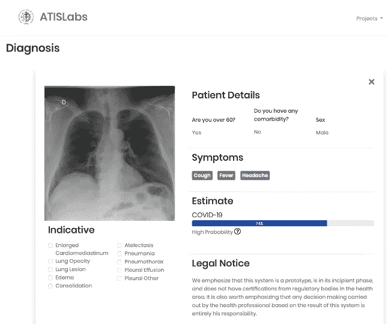

该大学所开展工作的科学基础可以在 Chowdhury 等人的论文中看到 2020，[*AI 能否帮助筛查病毒性和新冠肺炎肺炎？*](https://arxiv.org/abs/2003.13145)

除了用于比较模型的结果之外，另一项激动人心的工作也启发了这个项目，这就是 Chester 应用程序 [*Chester:由蒙特利尔大学的研究人员开发的一个 Web 交付的本地计算胸部 X 射线疾病预测系统*](https://arxiv.org/pdf/1901.11210.pdf)*。Chester 是一个免费的简单原型，可以由医疗专业人员用来了解深度学习工具的现实，以帮助诊断胸部的 X 射线。该系统被设计为第二意见，其中用户可以处理图像以确认或帮助诊断。*

*当前版本的 Chester (2.0)使用 DenseNet-121 型卷积网络对超过 106，000 幅图像进行了训练。这款网络应用没有检测到新冠肺炎，这是研究人员未来版本应用的目标之一。下面是一个诊断结果的打印屏幕(使用了新冠肺炎数据集 1 的一幅图像)*

*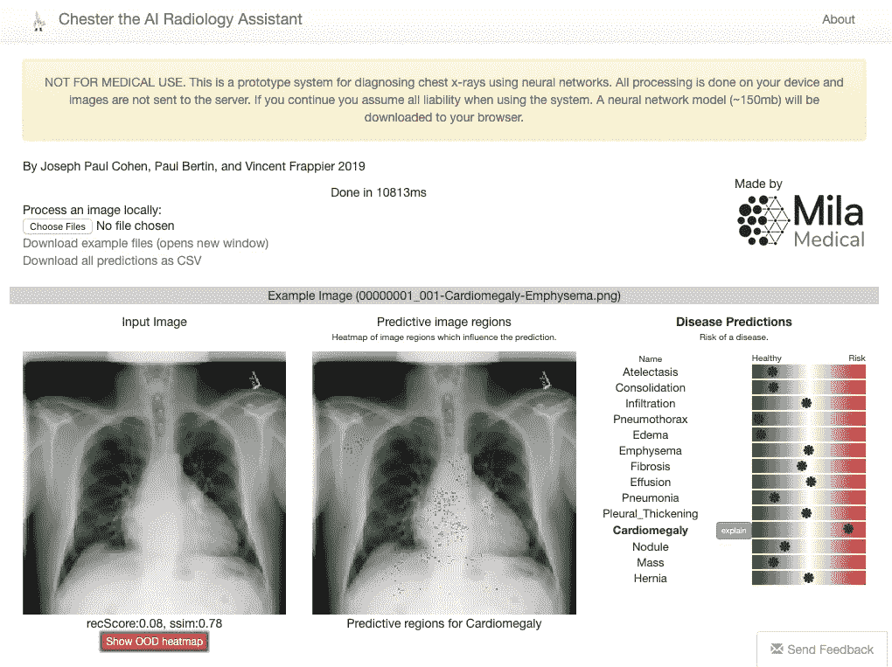*

*人工智能放射学助理切斯特*

*在下面的链接中，你可以访问 [*切斯特*](https://mlmed.org/tools/xray/) 甚至下载 app 离线使用。*

## *谢谢*

*这部作品最初是基于 Adrian Rosebrock 博士发表的优秀教程开发的，我强烈推荐深入阅读。此外，我要感谢 Nell Trevor，他在 Rosebrock 博士工作的基础上，进一步提供了如何测试最终模型的想法。在下面的链接中，Nell 通过 PythonAnyware.com 网站提供了一个在 X 射线图像中对新冠肺炎进行真实测试的网络应用:[新冠肺炎预测 API](http://coviddetector.pythonanywhere.com/) 。*

# *第 1 部分—环境设置和数据准备*

## *数据集*

*训练模型以从图像中检测任何类型的信息的第一个挑战是要使用的数据(或图像)的数量。原则上，图像的数量越多，最终的模型就越好，这与新冠肺炎探测项目的情况不同，一旦公开的图像不多(记住，这个疫情只有几个月大)。然而，像 Hall 等人 [*使用小数据集*](https://arxiv.org/pdf/2004.02060.pdf) *，*上的深度学习从胸部 X 射线中发现新冠肺炎的研究证明，使用迁移学习技术仅用几百张图像就可以获得有希望的结果。*

*如介绍中所解释的，训练两个模型；因此，需要 3 组数据:*

1.  *新冠肺炎确认了一组 x 光图像*
2.  *常规(“正常”)患者(无疾病)的一组 X 射线图像*
3.  *一组 x 光图像显示肺炎，但不是由新冠肺炎引起的*

*为此，下载了两个数据集:*

*数据集 1:新冠肺炎
约瑟夫·保罗·寇恩和保罗·莫里森与蓝岛·新冠肺炎影像数据集，arXiv: 2003.11597，2020*

*新冠肺炎或其他病毒性和细菌性肺炎(MERS、SARS 和 ARDS)阳性或疑似患者的 X 射线和计算机断层扫描图像的公开数据集。).数据从公共来源收集，以及通过医院和医生间接收集(蒙特利尔大学伦理委员会批准的项目# CERSES-20–058-D)。所有的图像和数据都可以在下面的 [GitHub](https://github.com/ieee8023/covid-chestxray-dataset) 库中找到。*

***数据集 2:肺炎和正常人的胸部 x 光图像**
Kermany，Daniel 张、康；Goldbaum，Michael (2018)，“用于分类的标记光学相干断层扫描(OCT)和胸部 X 射线图像”，Mendeley Data，v2。*

*通过深度学习过程，一组经过验证的图像(OCT 和胸部放射摄影)被分类为正常和某种类型的肺炎。图像被分成训练集和独立的患者测试集。数据可在网站上获得:[https://data.mendeley.com/datasets/rscbjbr9sj/2](https://data.mendeley.com/datasets/rscbjbr9sj/2)*

***胸部 x 光的种类***

*从数据集中，可以找到三种类型的图像，PA、AP 和侧位(L)。左侧图像(L)很明显，但是 X 线 AP 和 PA 视图之间有什么区别？简单地说，在拍摄 X 射线的过程中，当 X 射线从身体的后部穿过到前部时，它被称为 PA(后部——前部)视图。而在 AP 视图中，方向是相反的。*

*通常，X 射线是在身体任何部位的 AP 视图中拍摄的。这里一个重要的例外恰恰是胸部 x 光。在这种情况下，最好通过 AP 查看 PA。但是如果病人病得很重，不能保持他的姿势，可以对胸部进行 AP 型 x 光检查。*

*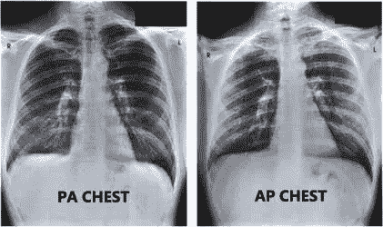*

*由于绝大多数胸部 X 射线是 PA 型视图，这是用于训练模型的视图选择类型。*

## *定义培训 DL 模型的环境*

*理想的情况是从新的 Python 环境开始。为此，使用终端，定义一个工作目录(例如:X-Ray_Covid_development ),然后在那里用 Python 创建一个环境(例如:TF_2_Py_3_7 ):*

```
*mkdir X-Ray_Covid_development
cd X-Ray_Covid_development
conda create — name TF_2_Py_3_7 python=3.7 -y
conda activate TF_2_Py_3_7*
```

*进入环境后，安装 TensorFlow 2.0:*

```
*pip install — upgrade pip
pip install tensorflow*
```

*从现在开始，安装训练模型所需的其他库。例如:*

```
*conda install -c anaconda numpy
conda install -c anaconda pandas
conda install -c anaconda scikit-learn
conda install -c conda-forge matplotlib
conda install -c anaconda pillow
conda install -c conda-forge opencv
conda install -c conda-forge imutils*
```

*创建必要的子目录:*

```
*notebooks
10_dataset — 
           |_ covid  [here goes the dataset for training model 1]
           |_ normal [here goes the dataset for training model 1]
20_dataset — 
           |_ covid  [here goes the dataset for training model 2]
           |_ pneumo [here goes the dataset for training model 2]
input - 
      |_ 10_Covid_Imagens _ 
      |                   |_ [*metadata.csv goes here*]
      |                   |_ images [*Covid-19 images go here*]
      |_ 20_Chest_Xray -
                       |_ test _
                               |_ NORMAL    [*images go here*]
                               |_ PNEUMONIA [*images go here*]
                       |_ train _
                                |_ NORMAL    [*images go here*]
                                |_ PNEUMONIA [*images go here*]
model
dataset_validation _
                   |_ covid_validation          [*images go here*]
                   |_ non_covidcovid_validation [*images go here*]
                   |_ normal_validation         [*images go here*]*
```

## *数据下载*

*下载数据集 1(新冠肺炎)，并将文件 metadata.csv 保存在:/input /10_Covid_Images/下，并将图像保存在/input/10_Covid_Images/images/下。*

*下载数据集 2(pneumono 和 Normal)，将图像保存在/input/20_Chest_Xray/(保持原来的测试和训练结构)下。*

# *第 2 部分—模型 1—Covid/正常*

## *数据准备*

*   *从我的 GitHub 下载笔记本:[*10 _ Xray _ Normal _ covid 19 _ Model _ 1 _ Training _ tests . ipynb*](https://github.com/Mjrovai/covid19Xray/blob/master/10_X-Ray_Covid_development/notebooks/10_Xray_Normal_Covid19_Model_1_Training_Tests.ipynb)保存在子目录/notebooks 中。*
*   *进入笔记本后，导入库并运行支持功能。*

***构建 Covid 标签数据集***

*从输入数据集(/input/10_Covid_Images/)中，创建将用于训练模型 1 的数据集，该数据集将用于要用 Covid 和 normal 标签定义的图像的分类。*

```
*input_dataset_path = ‘../input/10_Covid_images’*
```

*metadata.csv 文件将提供有关/images/文件中图像的信息*

```
*csvPath = os.path.sep.join([input_dataset_path, “metadata.csv”])
df = pd.read_csv(csvPath)
df.shape*
```

*metadat.csv 文件有 354 行和 28 列，这意味着在子目录/images/中有 354 个 X 射线图像。让我们分析它的一些列，以了解这些图像的更多细节。*

*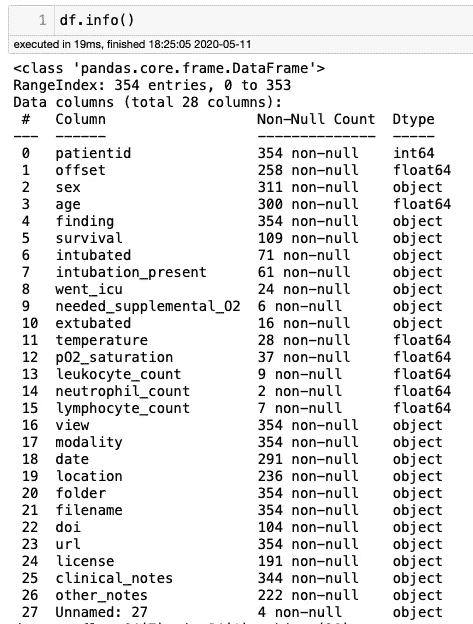*

*通过 df.modality，有 310 个 X 射线图像和 44 个 CT(断层摄影)图像。CT 图像被丢弃，并且 df.findings 列显示 310 个 X 射线图像被细分为:*

```
*COVID-19          235
Streptococcus      17
SARS               16
Pneumocystis       15
COVID-19, ARDS     12
E.Coli              4
ARDS                4
No Finding          2
Chlamydophila       2
Legionella          2
Klebsiella          1*
```

*从可视化的角度来看 235 张确认的新冠肺炎图像，我们有:*

```
*PA               142
AP                39
AP Supine         33
L                 20
AP semi erect      1*
```

*如引言中所述，只有 142 个 PA 型图像(后-前)用于模型训练，因为它们是胸片中最常见的图像(最终数据帧:xray_cv)。*

> *xray _ cv.patiendid 列显示，这 142 幅图像属于 96 名不同的患者，这意味着在某些情况下，同一患者拍摄了不止一张 x 光照片。由于所有图像都用于训练(我们对图像的内容感兴趣)，因此不考虑这些信息。*

*到 x 射线 cv.date，观察到有 8 张最近的图像拍摄于 2020 年 3 月。这些图像在要从模型训练中移除的列表中被分离。从而在以后用作最终模型的验证。*

```
*imgs_march = [
 ‘2966893D-5DDF-4B68–9E2B-4979D5956C8E.jpeg’,
 ‘6C94A287-C059–46A0–8600-AFB95F4727B7.jpeg’,
 ‘F2DE909F-E19C-4900–92F5–8F435B031AC6.jpeg’,
 ‘F4341CE7–73C9–45C6–99C8–8567A5484B63.jpeg’,
 ‘E63574A7–4188–4C8D-8D17–9D67A18A1AFA.jpeg’,
 ‘31BA3780–2323–493F-8AED-62081B9C383B.jpeg’,
 ‘7C69C012–7479–493F-8722-ABC29C60A2DD.jpeg’,
 ‘B2D20576–00B7–4519-A415–72DE29C90C34.jpeg’
]*
```

*下一步将构建指向训练数据集(xray_cv_train)的数据帧，该数据帧应引用 134 幅图像(所有输入图像均来自 Covid，除了用于稍后验证的单独图像):*

```
*xray_cv_train = xray_cv[~xray_cv.filename.isin(imgs_march)]
xray_cv_train.reset_index(drop=True, inplace=True)*
```

*而最终验证(x 射线 _cv_val)有 8 幅图像:*

```
*xray_cv_val = xray_cv[xray_cv.filename.isin(imgs_march)]
xray_cv_val.reset_index(drop=True, inplace=True)*
```

## *为 COVID 训练图像和后续验证创建文件*

*请务必记住，在前面的项目中，仅使用从原始文件 metada.csv 中获取的信息创建了数据帧。我们知道要将哪些图像存储在最终文件中用于训练，现在我们需要将实际图像(以数字化格式)“物理”分离到正确的子目录(文件夹)中。*

*为此，我们将使用 load_image_folder support()函数，该函数从一个元数据文件中将其中引用的图像从一个文件复制到另一个文件:*

```
*def load_image_folder(df_metadata, 
                      col_img_name, 
                      input_dataset_path,
                      output_dataset_path):

    img_number = 0
    # loop over the rows of the COVID-19 data frame
    for (i, row) in df_metadata.iterrows():
        imagePath = os.path.sep.join([input_dataset_path, row[col_img_name]]) if not os.path.exists(imagePath):
            print('image not found')
            continue filename = row[col_img_name].split(os.path.sep)[-1]
        outputPath = os.path.sep.join([f"{output_dataset_path}", filename])
        shutil.copy2(imagePath, outputPath)
        img_number += 1
    print('{} selected Images on folder {}:'.format(img_number, output_dataset_path))*
```

*按照下面的说明，134 幅选定的图像将被复制到文件夹中../10_dataset/covid/。*

```
*input_dataset_path = '../input/10_Covid_images/images'
output_dataset_path = '../dataset/covid'
dataset = xray_cv_train
col_img_name = 'filename'load_image_folder(dataset, col_img_name,
                  input_dataset_path, output_dataset_path)*
```

## *为普通图像创建文件夹(验证和培训)*

*在数据集 2(正常和肺炎图像)的情况下，不提供具有元数据的文件。因此，您只需将图像从输入文件复制到末尾。为此，我们将使用 load_image_folder_direct()支持函数，该函数将大量图像(随机选择)从一个文件夹复制到另一个文件夹:*

```
*def load_image_folder_direct(input_dataset_path,
                             output_dataset_path,
                             img_num_select):
    img_number = 0
    pathlist = Path(input_dataset_path).glob('**/*.*')
    nof_samples = img_num_select
    rc = []
    for k, path in enumerate(pathlist):
        if k < nof_samples:
            rc.append(str(path))  # because path is not string
            shutil.copy2(path, output_dataset_path)
            img_number += 1
        else:
            i = random.randint(0, k)
            if i < nof_samples:
                rc[i] = str(path) print('{} selected Images on folder {}:'.format(img_number,  output_dataset_path))*
```

*对文件夹中的图像重复相同的过程../input/20 _ Chest _ Xray/train/NORMAL，我们将为训练随机复制与之前用于 Covid 图像相同数量的图像(len (xray_cv_train))或 134 幅图像。这样，用于训练模型的数据集就平衡了。*

```
*input_dataset_path = '../input/20_Chest_Xray/train/NORMAL'
output_dataset_path = '../dataset/normal'
img_num_select = len(xray_cv_train)load_image_folder_direct(input_dataset_path, output_dataset_path,
                         img_num_select)*
```

*以同样的方式，我们分离 20 个随机图像，供以后在模型验证中使用。*

```
*input_dataset_path = '../input/20_Chest_Xray/train/NORMAL'
output_dataset_path = '../dataset_validation/normal_validation'img_num_select = 20
load_image_folder_direct(input_dataset_path, output_dataset_path,
                         img_num_select)*
```

*虽然我们不是用显示肺炎症状的图像来训练模型(新冠肺炎除外)，但看看最终的模型对它们的反应是很有趣的。因此，我们还分离了其中的 20 幅图像，以供以后验证。*

```
*input_dataset_path = '../input/20_Chest_Xray/train/PNEUMONIA'
output_dataset_path = '../dataset_validation/non_covid_pneumonia_validation'img_num_select = 20
load_image_folder_direct(input_dataset_path, output_dataset_path,
                         img_num_select)*
```

*下面的图片显示了在这一步结束时应该如何配置文件夹(反正是在我的 Mac 上)。此外，标有红色的数字表示文件夹中包含的 x 射线图像的数量。*

*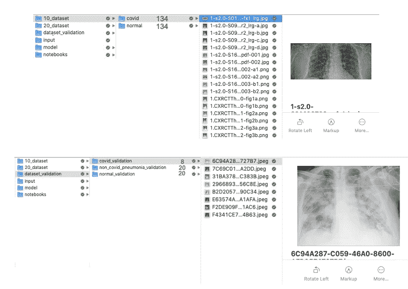*

*包含模型 1 培训和验证数据集的文件夹*

## *绘制数据集以进行快速视觉验证*

*由于文件夹中的图像数量不多，因此可以对它们进行目视检查。为此，使用支持函数 plots_from_files():*

```
*def plots_from_files(imspaths,
                     figsize=(10, 5),
                     rows=1,
                     titles=None,
                     maintitle=None):
    """Plot the images in a grid"""
    f = plt.figure(figsize=figsize)
    if maintitle is not None:
        plt.suptitle(maintitle, fontsize=10)
    for i in range(len(imspaths)):
        sp = f.add_subplot(rows, ceildiv(len(imspaths), rows), i + 1)
        sp.axis('Off')
        if titles is not None:
            sp.set_title(titles[i], fontsize=16)
        img = plt.imread(imspaths[i])
        plt.imshow(img)def ceildiv(a, b):
    return -(-a // b)*
```

*然后，定义将在训练中使用的数据集的路径(dataset_path)以及具有要查看的图像名称的列表:*

```
*dataset_path = '../10_dataset'normal_images = list(paths.list_images(f"{dataset_path}/normal"))
covid_images = list(paths.list_images(f"{dataset_path}/covid"))*
```

*这样，调用可视化的支持函数，图像显示如下:*

```
*plots_from_files(covid_images, rows=10, maintitle="Covid-19 X-ray images")*
```

*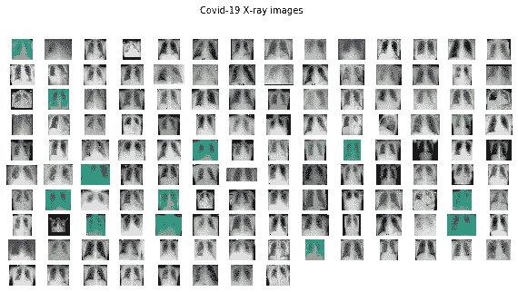*

*Covid 图像可视化*

```
*plots_from_files(normal_images, rows=10, maintitle="Normal X-ray images")*
```

*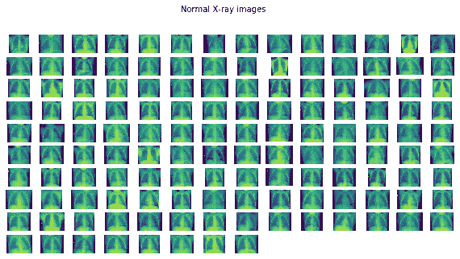*

*正常图像可视化*

*总的来说，图像看起来不错。*

## *预训练卷积神经网络模型的选择*

*使用先前定义的图像来执行模型的训练，但是在已经从 TF / Keras 库中预先训练的模型上，应用被称为“迁移学习”的技术。*

> *迁移学习是一种机器学习方法，其中为一个任务开发的模型被重新用作第二个任务中模型的起点。有关更多信息，请参见 Jason Brownlee 的优秀文章[深度学习迁移学习的温和介绍](https://machinelearningmastery.com/transfer-learning-for-deep-learning/)*

*Keras 应用程序是 Keras 的深度学习库模块，它为 VGG16、ResNet50v2、ResNet101v2、Xception、MobileNet 等几种流行的架构提供模型定义和预训练的权重。以下链接显示了这些选项: [Keras 应用](https://github.com/keras-team/keras-applications)。*

*要使用的预训练模型是 VGG16，由牛津大学的视觉图形组(VGG)开发，并在论文“[用于大规模图像识别的非常深的卷积网络](https://arxiv.org/abs/1409.1556)”中描述。除了在开发公开可用权重的图像分类模型时非常流行之外，这也是 Adrian 博士在他的教程中建议的模型。*

> *理想的情况是使用几个模型(例如，ResNet50v2、ResNet101v2)进行测试(基准测试)，或者甚至创建一个特定的模型(如 Zhang 等人的论文中建议的模型，【使用基于深度学习的异常检测对胸部 X 射线图像进行筛查】)。但由于这项工作的最终目标只是概念验证，我们只是在探索 [VGG16](https://arxiv.org/abs/1409.1556) 。*

*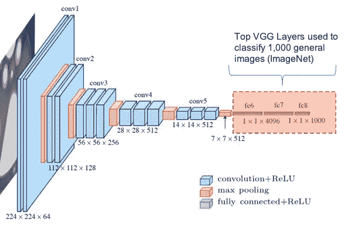*

*VGG16 是一种卷积神经网络(CNN)架构，尽管它是在 2014 年开发的，但今天仍被认为是处理图像分类的最佳架构之一。*

*VGG16 架构的一个特点是，它们没有大量的超参数，而是专注于一次通过一个 3×3 滤波器(内核)的卷积层，然后是一个 2×2 最大池层。在整个架构中，此过程之后是一组一致的卷积层和最大池层。最终，该架构具有 2 个 FC(全连接层)，随后是针对输出的 softmax 类型激活。*

*VGG16 中的 16 是指架构有 16 层，权重为(w)。这个网络是广泛的，在使用所有原始的 16 层的情况下，具有几乎 1 . 4 亿个训练参数。在我们的例子中，最后两层(FC1 和 2)是本地训练的，参数总数刚好超过 1500 万，其中大约 590，000 个参数是本地训练的(而其余的是“冻结的”)。*

*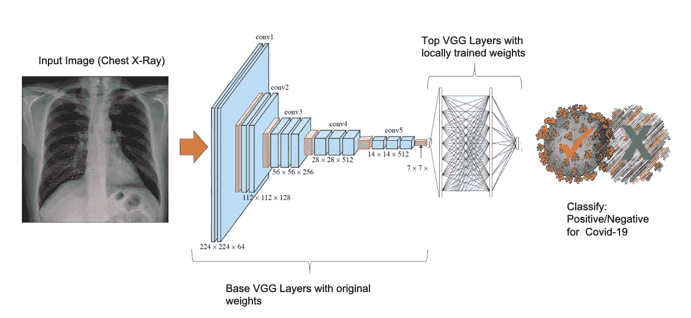*

*要注意的第一点是，VNN16 架构的第一层处理 224x224x3 像素的图像，因此我们必须确保要训练的 X 射线图像也具有这些维度，因为它们是卷积网络“第一层”的一部分。因此，当使用原始权重加载模型时(weights = "imagenet ")，我们还应该忽略模型的顶层(include_top = False)，它由我们的层(headModel)替换。*

```
*baseModel = VGG16(weights="imagenet", include_top=False, input_tensor=Input(shape=(224, 224, 3)))*
```

*接下来，我们必须定义用于训练的超参数(在下面的评论中，将测试一些可能的值以提高模型的“准确性”):*

```
*INIT_LR = 1e-3         # [0.0001]
EPOCHS = 10            # [20]
BS = 8                 # [16, 32]
NODES_DENSE0 = 64      # [128]
DROPOUT = 0.5          # [0.0, 0.1, 0.2, 0.3, 0.4, 0.5]
MAXPOOL_SIZE = (4, 4)  # [(2,2) , (3,3)]
ROTATION_DEG = 15      # [10]
SPLIT = 0.2            # [0.1]*
```

*然后构建我们的模型，它被添加到基本模型中:*

```
*headModel = baseModel.output
headModel = AveragePooling2D(pool_size=MAXPOOL_SIZE)(headModel)
headModel = Flatten(name="flatten")(headModel)
headModel = Dense(NODES_DENSE0, activation="relu")(headModel)
headModel = Dropout(DROPOUT)(headModel)
headModel = Dense(2, activation="softmax")(headModel)*
```

*头模型模型放置在基础模型之上，成为实际训练的模型的一部分(确定最佳权重)。*

```
*model = Model(inputs=baseModel.input, outputs=headModel)*
```

*重要的是要记住，预先训练的 CNN 模型，如 VGG16，是用成千上万的图像训练的，以对普通图像进行分类(如狗、猫、汽车和人)。我们现在要做的是根据我们的需求对其进行定制(对 x 光图像进行分类)。理论上，模型的第一层简化了图像的部分，识别出其中的形状。这些初始标签非常通用(比如直线、圆、正方形)，所以我们不想再训练它们了。我们只想训练网络的最后几层，以及新加入的几层。*

*对基础模型中的所有层执行的以下循环“冻结”它们，使得它们在第一次训练过程中不被更新。*

```
*for layer in baseModel.layers:
    layer.trainable = False*
```

*而此时，模型已经可以接受训练了，但首先，我们必须为模型的训练准备好数据(图像)。*

## *数据预处理*

*让我们首先创建一个包含存储图像的名称(和路径)的列表:*

```
*imagePaths = list(paths.list_images(dataset_path))*
```

*然后，对于列表中的每个图像，我们必须:*

1.  *提取图像标签(在本例中，是 covid 或 normal)*
2.  *将图像通道从 BGR (CV2 默认)设置为 RGB*
3.  *将图像大小调整为 224 x 224(默认为 VGG16)*

```
*data = []
labels = []for imagePath in imagePaths:
    label = imagePath.split(os.path.sep)[-2]
    image = cv2.imread(imagePath)
    image = cv2.cvtColor(image, cv2.COLOR_BGR2RGB)
    image = cv2.resize(image, (224, 224)) data.append(image)
    labels.append(label)*
```

*数据和标签被转换为数组，即每个像素的强度值，范围从 0 到 255，从 0 到 1 缩放，便于训练。*

```
*data = np.array(data) / 255.0
labels = np.array(labels)*
```

*标签将使用一键编码技术进行数字编码。*

```
*lb = LabelBinarizer()
labels = lb.fit_transform(labels)
labels = to_categorical(labels)*
```

*此时，训练数据集分为训练和测试(80%用于训练，20%用于测试):*

```
*(trainX, testX, trainY, testY) = train_test_split(data,
                                                  labels,
                                                  test_size=SPLIT,
                                                  stratify=labels,
                                                  random_state=42)*
```

*最后但同样重要的是，我们应该应用“上升”数据或“增强”技术。*

## *增大*

*正如 Chowdhury 等人在他们的[论文](https://arxiv.org/pdf/2003.13145.pdf)中所建议的，三种增强策略(旋转、调度和平移)可用于为新冠肺炎生成额外的训练图像，有助于防止“过拟合”。*

*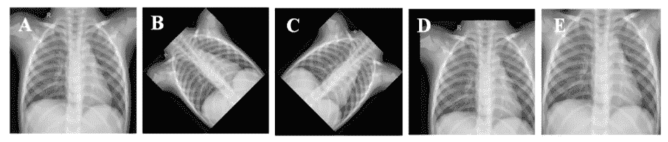*

***原始胸部 x 光图像(A)，逆时针旋转 45 度后的图像(B)，顺时针旋转 45 度后的图像，水平和垂直平移 20%后的图像(D)，以及缩放 10%后的图像(E)。***

*使用 TS/Keras 图像预处理库(ImageDataGenerator)，可以更改几个图像参数，例如:*

```
*trainAug = ImageDataGenerator(
        rotation_range=15,
        width_shift_range=0.2,
        height_shift_range=0.2,
        rescale=1./255,
        shear_range=0.2,
        zoom_range=0.2,
        horizontal_flip=True,
        fill_mode='nearest')*
```

*最初，仅应用 15 度的图像最大旋转来评估结果。*

> *据观察，X 射线图像通常在旋转变化很小的情况下对齐。*

```
*trainAug = ImageDataGenerator(rotation_range=ROTATION_DEG, fill_mode="nearest")*
```

*此时，我们已经定义了模型和数据，并准备好进行编译和训练。*

## *模型构建和培训*

*编译允许实际构建我们之前实现的模型，但是增加了一些额外的特性，比如损失率函数、优化器和指标。*

*对于网络训练，我们使用损失函数来计算网络预测值和训练数据实际值之间的差异。伴随着优化算法(例如 Adam)的损失值促进了对网络内的权重进行的改变的数量。这些超参数有助于网络训练的收敛，获得尽可能接近零的损失值。*

*我们还指定了优化器的学习率(lr)。在这种情况下，lr 被定义为 1e-3(大约。0.05).如果在训练期间，注意到“跳动”的增加，这意味着模型不能收敛，我们应该降低学习速率，以便我们可以达到全局最小值。*

```
*opt = Adam(lr=INIT_LR, decay=INIT_LR / EPOCHS)
model.compile(loss="binary_crossentropy", optimizer=opt, metrics=["accuracy"])*
```

*让我们训练模型:*

```
*H = model.fit(
    trainAug.flow(trainX, trainY, batch_size=BS),
    steps_per_epoch=len(trainX) // BS,
    validation_data=(testX, testY),
    validation_steps=len(testX) // BS,
    epochs=EPOCHS)*
```

*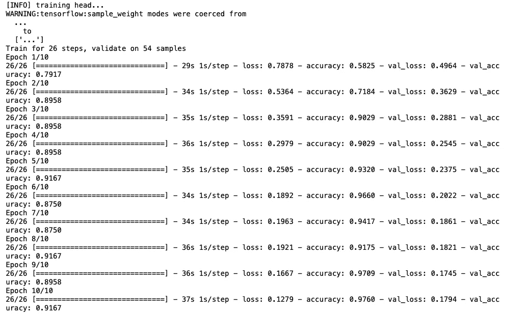*

*结果看起来已经很有趣了，在验证数据中达到了 92%的精确度！让我们绘制精确图表:*

*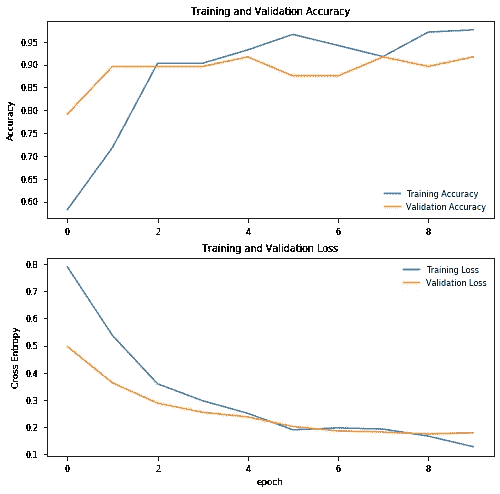*

*评估已训练的模型:*

*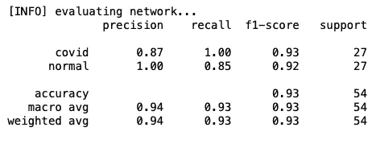*

*看看混淆矩阵:*

```
*[[27  0]
 [ 4 23]]
acc: 0.9259
sensitivity: 1.0000
specificity: 0.8519*
```

*根据用最初选择的超参数训练的模型，我们获得:*

1.  *100%的灵敏度，这意味着对于患有新冠肺炎(即真阳性)的患者，我们可以在 100%的时间内准确地将他们识别为“新冠肺炎阳性”。*
2.  *85%的特异性意味着，对于没有新冠肺炎(即真正阴性)的患者，我们只能在 85%的时间内准确地将他们识别为“新冠肺炎阴性”。*

*结果并不令人满意，因为 15%没有 Covid 的患者会被误诊。让我们首先尝试微调模型，更改一些超参数:*

```
*INIT_LR = 0.0001       # was 1e-3  
EPOCHS = 20            # was 10       
BS = 16                # was 8 
NODES_DENSE0 = 128     # was 64
DROPOUT = 0.5          
MAXPOOL_SIZE = (2, 2)  # was (4, 4)
ROTATION_DEG = 15     
SPLIT = 0.2*
```

*因此，我们有:*

*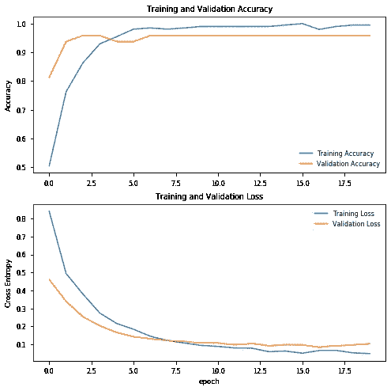*

```
*precision    recall  f1-score   support covid       0.93      1.00      0.96        27
      normal       1.00      0.93      0.96        27 accuracy                           0.96        54
   macro avg       0.97      0.96      0.96        54
weighted avg       0.97      0.96      0.96        54*
```

*和混淆矩阵:*

```
*[[27  0]
 [ 2 25]]acc: 0.9630
sensitivity: 1.0000
specificity: 0.9259*
```

*好得多的结果！现在有了 93%的特异性，这意味着在没有新冠肺炎(即真阴性)的患者中，我们可以在 93%的时间内准确地将他们识别为“新冠肺炎阴性”,而在识别真阳性时为 100%。*

*目前，结果看起来很有希望。让我们保存该模式，对那些在验证训练中遗漏的图像进行测试(2020 年 3 月新冠肺炎的 8 幅图像和从输入数据集中随机选择的 20 幅图像)。*

```
*model.save("../model/covid_normal_model.h5")*
```

## *在真实图像中测试模型(验证)*

*首先，让我们检索模型并展示最终的架构，以检查一切是否正常:*

```
*new_model = load_model('../model/covid_normal_model.h5')# Show the model architecture
new_model.summary()*
```

*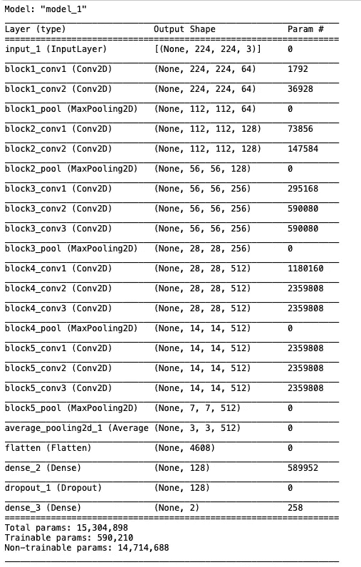*

*模型看起来不错，是 VGG16 的 16 层结构。注意可训练参数为 590，210，是最后两层(dense_2 和 dense_3)的和，加入到预训练模型中，参数为 14.7M。*

*让我们验证测试数据集中加载的模型:*

```
*[INFO] evaluating network...
              precision    recall  f1-score   support covid       0.93      1.00      0.96        27
      normal       1.00      0.93      0.96        27 accuracy                           0.96        54
   macro avg       0.97      0.96      0.96        54
weighted avg       0.97      0.96      0.96        54*
```

*完美，我们得到了和以前一样的结果，这意味着训练好的模型被正确地保存和加载。现在让我们用之前保存的 8 幅 Covid 图像来验证模型。为此，我们使用另一个为单独图像测试开发的支持函数 test_rx_image_for_Covid19():*

```
*def test_rx_image_for_Covid19(imagePath):
    img = cv2.imread(imagePath)
    img = cv2.cvtColor(img, cv2.COLOR_BGR2RGB)
    img = cv2.resize(img, (224, 224))
    img = np.expand_dims(img, axis=0) img = np.array(img) / 255.0 pred = new_model.predict(img)
    pred_neg = round(pred[0][1]*100)
    pred_pos = round(pred[0][0]*100) print('\n X-Ray Covid-19 Detection using AI - MJRovai')
    print('    [WARNING] - Only for didactic purposes')
    if np.argmax(pred, axis=1)[0] == 1:
        plt.title('\nPrediction: [NEGATIVE] with prob: {}% \nNo Covid-19\n'.format(
            pred_neg), fontsize=12)
    else:
        plt.title('\nPrediction: [POSITIVE] with prob: {}% \nPneumonia by Covid-19 Detected\n'.format(
            pred_pos), fontsize=12) img_out = plt.imread(imagePath)
    plt.imshow(img_out)
    plt.savefig('../Image_Prediction/Image_Prediction.png')
    return pred_pos*
```

*在笔记本电脑上，该功能将显示以下结果:*

*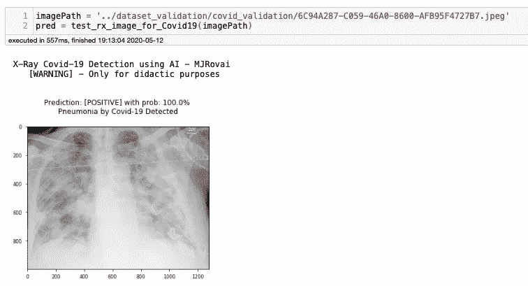*

*通过更改剩余 7 个图像的 imagePath 值，我们获得了以下结果:*

*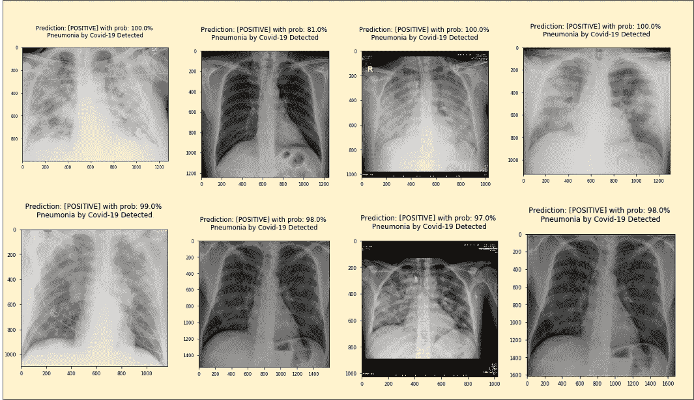*

*所有图像都呈阳性，证实了 100%的灵敏度。*

*现在让我们测试标记为正常的 20 个单独的验证图像。笔记本上的第一个应该是这样的:*

*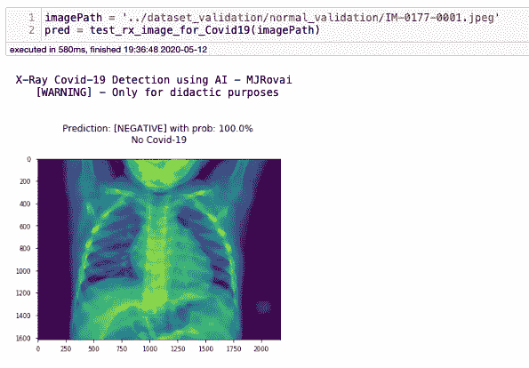*

*逐个测试，有可能证实预测，但由于我们有更多的图像，让我们使用另一个函数来测试一组图像，一次完成:test _ rx _ image _ for _ covid 19 _ batch(img _ lst)。*

## *批量测试图像*

*让我们创建包含在验证文件夹中的图像列表:*

```
*validation_path = '../dataset_validation'normal_val_images = list(paths.list_images(
    f"{validation_path}/normal_validation"))
non_covid_pneumonia_validation_images = list(paths.list_images(
    f"{validation_path}/non_covid_pneumonia_validation"))
covid_val_images = list(paths.list_images(
    f"{validation_path}/covid_validation"))*
```

*test _ rx _ image _ for _ covid 19 _ batch(img _ lst)函数如下所示:*

```
*def test_rx_image_for_Covid19_batch(img_lst):
    neg_cnt = 0
    pos_cnt = 0
    predictions_score = []
    for img in img_lst:
        pred, neg_cnt, pos_cnt = test_rx_image_for_Covid19_2(img, neg_cnt, pos_cnt)
        predictions_score.append(pred)
    print ('{} positive detected in a total of {} images'.format(pos_cnt, (pos_cnt+neg_cnt)))
    return  predictions_score, neg_cnt, pos_cnt*
```

*将该函数应用于我们之前分离的 20 幅图像:*

```
*img_lst = normal_val_images
normal_predictions_score, normal_neg_cnt, normal_pos_cnt = test_rx_image_for_Covid19_batch(img_lst)
normal_predictions_score*
```

*我们观察到，所有 20 人都被诊断为阴性，得分如下(记住，模型将返回接近“1”的“阳性”):*

```
*0.25851375,
 0.025379542,
 0.005824779,
 0.0047603976,
 0.042225637,
 0.025087152,
 0.035508618,
 0.009078974,
 0.014746706,
 0.06489486,
 0.003134642,
 0.004970203,
 0.15801577,
 0.006775451,
 0.0032735346,
 0.007105667,
 0.001369465,
 0.005155371,
 0.029973848,
 0.014993184*
```

*仅在 2 个案例中，图像的 a 值(1-精度)低于 90% (0.26 和 0.16)。*

*由于我们有一个函数来批量应用模型，请记住输入数据集/input /20_Chest_Xray/有两个组/train 和/test。只有包含在/train 中的图像组的一部分用于训练，并且所有/test 图像从未被模型看到:*

```
*input - 
      |_ 10_Covid_Imagens _ 
      |                   |_ *metadata.csv*
      |                   |_ images [used train model 1]
      |_ 20_Chest_Xray -
                       |_ test _
                               |_ NORMAL
                               |_ PNEUMONIA 
                       |_ train _
                                |_ NORMAL   [used train model 1]
                                |_ PNEUMONIA*
```

*然后，我们可以利用并测试该文件夹中的所有新图像。首先，我们创建了图像列表:*

```
*validation_path = '../input/20_Chest_Xray/test'normal_test_val_images = list(paths.list_images(f"{validation_path}/NORMAL"))
print("Normal Xray Images: ", len(normal_test_val_images))pneumo_test_val_images = list(paths.list_images(f"{validation_path}/PNEUMONIA"))
print("Pneumo Xray Images: ", len(pneumo_test_val_images))*
```

*我们观察了 234 张被诊断为正常的“未发表的”图像(还有 390 多张被诊断为非新冠肺炎引起的肺炎)。应用批量测试的功能，我们观察到在总共 234 个图像中有 24 个图像呈现假阳性(大约 10%)。让我们看看模型输出值是如何分布的，记住函数返回的值是这样计算的:*

```
*pred = new_model.predict(image)
pred_pos = round(pred[0][0] * 100)*
```

*我们观察到预测的精确谷值的平均值为 0.15，并且非常集中在接近于零的值中(中值仅为 0.043)。有趣的是，大多数假阳性接近 0.5，少数异常值在 0.6 以上。*

*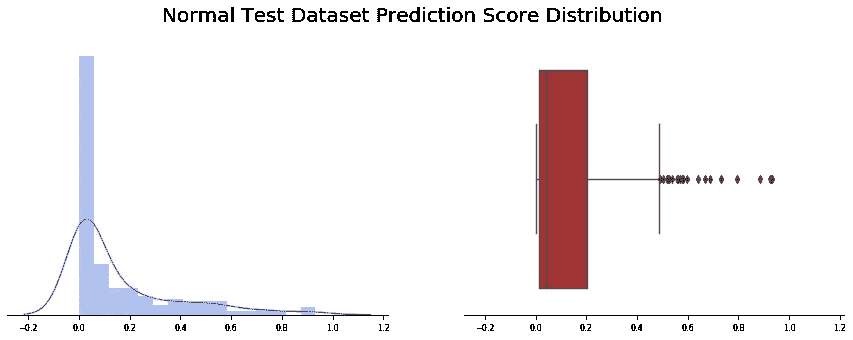*

*除了改进模型之外，研究产生假阳性的图像也是值得的，因为这可能是获取数据的方式的技术特征。*

## *肺炎的图像检测*

*因为输入数据集也有肺炎患者的 X 射线图像，但不是由 Covid 引起的，所以让我们应用模型 1 (Covid / Normal)来看看结果是什么:*

*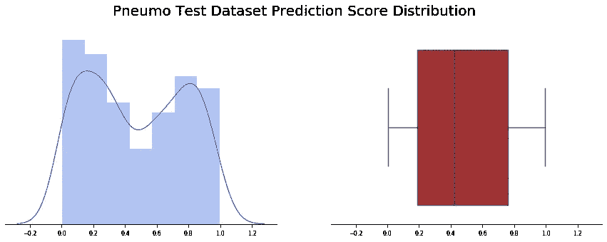*

*结果非常糟糕，因为在 390 张图像中，有 185 张是假阳性。而观察结果的分布，观察到有一个接近 80%的峰值，就是错得很离谱！*

> *回想一下，这个结果在技术上并不令人惊讶，因为该模型没有用肺炎患者的图像进行训练。*

*无论如何，这是一个大问题，因为我想象一个专家可以用肉眼区分一个病人是否患有肺炎。尽管如此，要区分这场肺炎是由新冠肺炎病毒(新型冠状病毒)、任何其他病毒，甚至是细菌引起的，可能会更加困难。*

*该模型应该更有用，能够区分由新冠肺炎病毒引起的肺炎患者和其他类型的病毒或细菌。为此，训练了另一个模型，现在有了感染新冠肺炎病毒的病人和感染肺炎但不是由新冠肺炎病毒引起的病人的图像。*

# *第 3 部分—模型 2 — Covid/Pneumo*

## *数据准备*

*   *从我的 GitHub 下载笔记本:[*20 _ Xray _ pno _ covid 19 _ Model _ 2 _ Training _ tests . ipynb*](https://github.com/Mjrovai/covid19Xray/blob/master/10_X-Ray_Covid_development/notebooks/20_Xray_Pneumo_Covid19_Model_2_Training_Tests.ipynb)保存在子目录/notebooks 中。*
*   *导入使用的库并运行支持函数。*

*模型 2 中使用的 Covid 图像数据集与模型 1 中使用的相同，只是现在它存储在不同的文件夹中。*

```
*dataset_path = '../20_dataset'*
```

*肺炎图像将从文件夹/input/20 _ Chest _ x ray/train/Pneumonia/下载，并存储在/20 _ dataset/pneumono/中。要使用的功能与之前相同:*

```
*input_dataset_path = '../input/20_Chest_Xray/train/PNEUMONIA'
output_dataset_path = '../20_dataset/pneumo'img_num_select = len(xray_cv_train) # Same number of samples as Covid data*
```

*这样，我们调用可视化的支持函数，检查获得的结果:*

```
*pneumo_images = list(paths.list_images(f"{dataset_path}/pneumo"))
covid_images = list(paths.list_images(f"{dataset_path}/covid"))plots_from_files(covid_images, rows=10, maintitle="Covid-19 X-ray images")*
```

**

*Covid 图像可视化*

```
*plots_from_files(pneumo_images, rows=10, maintitle="Pneumony X-ray images"*
```

*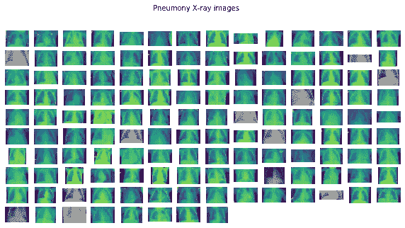*

*总的来说，图像看起来不错。*

## *预训练 CNN 模型及其超参数的选择*

*要使用的预训练模型是 VGG16，与用于模型 1 训练的模型相同*

```
*baseModel = VGG16(weights="imagenet", include_top=False, input_tensor=Input(shape=(224, 224, 3)))*
```

*接下来，我们必须定义用于训练的超参数。我们从模型 1 的最终训练调整后使用的相同参数开始:*

```
*INIT_LR = 0.0001         
EPOCHS = 20            
BS = 16                 
NODES_DENSE0 = 128      
DROPOUT = 0.5          
MAXPOOL_SIZE = (2, 2)  
ROTATION_DEG = 15      
SPLIT = 0.2*
```

*然后，构建我们的模型，该模型将被添加到基本模型中:*

```
*headModel = baseModel.output
headModel = AveragePooling2D(pool_size=MAXPOOL_SIZE)(headModel)
headModel = Flatten(name="flatten")(headModel)
headModel = Dense(NODES_DENSE0, activation="relu")(headModel)
headModel = Dropout(DROPOUT)(headModel)
headModel = Dense(2, activation="softmax")(headModel)*
```

*headModel 模型被放置在基本模型之上，成为用于训练的真实模型。*

```
*model = Model(inputs=baseModel.input, outputs=headModel)*
```

*对基础模型中的所有层执行的以下循环将“冻结”它们，使得它们在第一次训练过程中不被更新。*

```
*for layer in baseModel.layers:
    layer.trainable = False*
```

*此时，模型已经可以进行训练了，但是我们首先要准备好模型的数据(图像)。*

## *数据预处理*

*让我们首先创建一个包含存储图像的名称(和路径)的列表，并执行与模型 1 相同的预处理:*

```
*imagePaths = list(paths.list_images(dataset_path))data = []
labels = []for imagePath in imagePaths:
    label = imagePath.split(os.path.sep)[-2]
    image = cv2.imread(imagePath)
    image = cv2.cvtColor(image, cv2.COLOR_BGR2RGB)
    image = cv2.resize(image, (224, 224)) data.append(image)
    labels.append(label)data = np.array(data) / 255.0
labels = np.array(labels)*
```

*标签使用一键编码技术进行数字编码。*

```
*lb = LabelBinarizer()
labels = lb.fit_transform(labels)
labels = to_categorical(labels)*
```

*此时，我们将把训练数据集分为训练数据集和测试数据集(80%用于训练，20%用于测试):*

```
*(trainX, testX, trainY, testY) = train_test_split(data,
                                                  labels,
                                                  test_size=SPLIT,
                                                  stratify=labels,
                                                  random_state=42)*
```

*最后但同样重要的是，我们将应用数据扩充技术。*

```
*trainAug = ImageDataGenerator(rotation_range=ROTATION_DEG, fill_mode="nearest")*
```

*此时，我们已经定义了模型和数据，并准备好进行编译和训练。*

## *模型 2 的编译和训练*

*编译:*

```
*opt = Adam(lr=INIT_LR, decay=INIT_LR / EPOCHS)
model.compile(loss="binary_crossentropy", optimizer=opt, metrics=["accuracy"])*
```

*培训:*

```
*H = model.fit(
    trainAug.flow(trainX, trainY, batch_size=BS),
    steps_per_epoch=len(trainX) // BS,
    validation_data=(testX, testY),
    validation_steps=len(testX) // BS,
    epochs=EPOCHS)*
```

*通过 20 个时期和初始参数，结果看起来非常有趣，在验证数据中达到 100%的精度！让我们绘制精度图表，评估训练好的模型，并查看混淆矩阵:*

*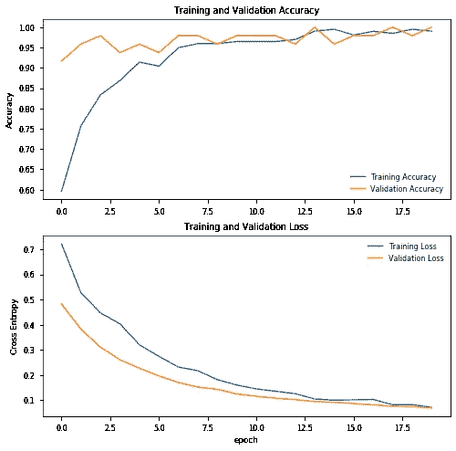*

```
*precision    recall  f1-score   support covid       0.96      1.00      0.98        27
      pneumo       1.00      0.96      0.98        27 accuracy                           0.98        54
   macro avg       0.98      0.98      0.98        54
weighted avg       0.98      0.98      0.98        54*
```

*混淆矩阵:*

```
*[[27  0]
 [ 1 26]]
acc: 0.9815
sensitivity: 1.0000
specificity: 0.9630*
```

*利用训练的模型(利用最初选择的超参数)，我们获得:*

*   *100%的灵敏度，这意味着对于患有新冠肺炎(即，真阳性)的患者，我们可以在 100%的时间内准确地将他们识别为“新冠肺炎阳性”。*
*   *96%的特异性，这意味着对于没有新冠肺炎(即，真阴性)的患者，我们可以在 96%的时间内准确地将他们识别为“新冠肺炎阴性”。*

*结果完全令人满意，因为只有 4%没有 Covid 的患者会被误诊。但在这种情况下，肺炎患者和新冠肺炎患者之间的正确分类是最有益的；我们至少应该对超参数进行一些调整，重新进行训练。*

> *首先，我试图降低初始 lr 一点，这是一场灾难。我回到了原来的值。*

*我还减少了数据的分割，增加了一点 Covid 图像，并将最大旋转角度更改为 10 度，这是与原始数据集相关的论文中建议的:*

```
*INIT_LR = 0.0001         
EPOCHS = 20            
BS = 16                 
NODES_DENSE0 = 128      
DROPOUT = 0.5          
MAXPOOL_SIZE = (2, 2)  
ROTATION_DEG = 10      
SPLIT = 0.1*
```

*因此，我们有:*

*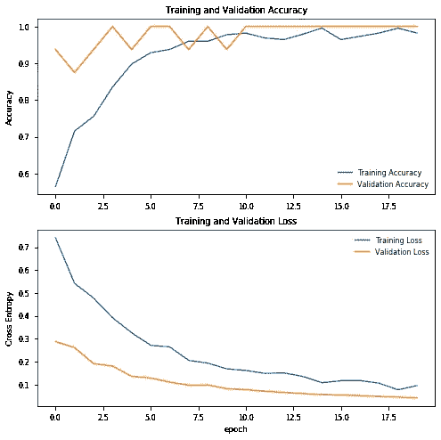*

```
*precision    recall  f1-score   support covid       1.00      1.00      1.00        13
      pneumo       1.00      1.00      1.00        14 accuracy                           1.00        27
   macro avg       1.00      1.00      1.00        27
weighted avg       1.00      1.00      1.00        27*
```

*和混淆矩阵:*

```
*[[13  0]
 [ 0 14]]acc: 1.0000
sensitivity: 1.0000
specificity: 1.0000*
```

*结果看起来比他们以前更好，但我们使用的测试数据很少！让我们保存这个模型，像以前一样用大量的图片进行测试。*

```
*model.save("../model/covid_pneumo_model.h5")*
```

*我们观察到有 390 张图片被标记为非新冠肺炎病毒引起的肺炎。应用批量测试功能，我们观察到在总共 390 个图像中只有 3 个图像呈现假阳性(大约 0.8%)。此外，预测精度值的平均值为 0.04，并且非常集中在接近于零的值中(中值仅为 0.02)。*

*总体结果甚至比以前的模型观察到的更好。有趣的是，几乎所有结果都在前 3 个四分位数内，只有极少数异常值的误差超过 20%。*

*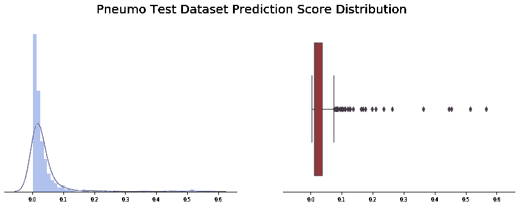*

> *在这种情况下，也值得研究产生假阳性(只有 3 个)的图像，因为它们也可能是捕获数据的方式的技术特征。*

## *使用被认为正常(健康)的患者图像进行测试*

*由于输入数据集也有正常患者(未训练)的 X 射线图像，让我们应用模型 2 (Covid/Pneumo)来看看结果是什么*

*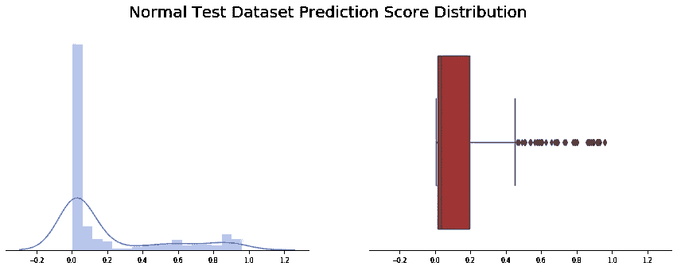*

*在这种情况下，结果并不像在模型 1 测试中看到的那样糟糕，因为在 234 幅图像中，有 45 幅呈现假阳性(19%)。*

*理想的情况是对每种情况使用正确的模型，但是如果只使用一种，模型 2 是正确的选择。*

> *注意:在最后一次测试备选方案的尝试中，做了一次基准测试，我试图改变增强参数，正如 Chowdhury 等人所建议的那样，但令我惊讶的是，结果并没有更好(结果在笔记本的末尾)。*

# *第 4 部分—用于 X 射线图像中新冠肺炎检测的 Web 应用程序*

## *测试 Python 独立脚本*

*对于 web-app 的开发，我们使用 Flask，这是一个用 Python 编写的 web 微框架。它被归类为微结构，因为它不需要特定的工具或库来运行。*

*此外，我们只需要几个库和与单独测试图像相关的函数。因此，让我们首先在一个“干净”的笔记本上工作，在那里使用已经训练和保存的模型 2 进行测试。*

*   *从我的 GitHub 加载，笔记本:[*30 _ AI _ Xray _ covid 19 _ pno _ Detection _ application . ipynb*](https://github.com/Mjrovai/covid19Xray/blob/master/10_X-Ray_Covid_development/notebooks/30_AI_Xray_Covid19_Pneumo_Detection_Application.ipynb)*
*   *现在只导入测试在前一个笔记本中创建的模型所需的库。*

```
*import numpy as np
import cv2
from tensorflow.keras.models import load_model*
```

*   *然后执行加载和测试映像的支持功能:*

```
*def test_rx_image_for_Covid19_2(model, imagePath):
    img = cv2.imread(imagePath)
    img_out = img
    img = cv2.cvtColor(img, cv2.COLOR_BGR2RGB)
    img = cv2.resize(img, (224, 224))
    img = np.expand_dims(img, axis=0) img = np.array(img) / 255.0 pred = model.predict(img)
    pred_neg = round(pred[0][1]*100)
    pred_pos = round(pred[0][0]*100)

    if np.argmax(pred, axis=1)[0] == 1:
        prediction = 'NEGATIVE'
        prob = pred_neg
    else:
        prediction = 'POSITIVE'
        prob = pred_pos cv2.imwrite('../Image_Prediction/Image_Prediction.png', img_out)
    return prediction, prob*
```

*   *下载训练好的模型*

```
*covid_pneumo_model = load_model('../model/covid_pneumo_model.h5')*
```

*   *然后，从验证子目录上传一些图像，并确认一切正常:*

```
*imagePath = '../dataset_validation/covid_validation/6C94A287-C059-46A0-8600-AFB95F4727B7.jpeg'
test_rx_image_for_Covid19_2(covid_pneumo_model, imagePath)*
```

*结果应该是:('阳性'，96.0)*

```
*imagePath = ‘../dataset_validation/normal_validation/IM-0177–0001.jpeg’
test_rx_image_for_Covid19_2(covid_pneumo_model, imagePath)*
```

*结果应该是:('负'，99.0)*

```
*imagePath = '../dataset_validation/non_covid_pneumonia_validation/person63_bacteria_306.jpeg'
test_rx_image_for_Covid19_2(covid_pneumo_model, imagePath)*
```

*结果应该是:('负'，98.0)*

*到目前为止，所有的开发都是在 Jupyter 笔记本上完成的，我们应该做一个最终测试，让代码作为 python 脚本运行在最初创建的开发目录中，例如，使用名称:covidXrayApp_test.py。*

```
*# Import Libraries and Setupimport numpy as np
import cv2
from tensorflow.keras.models import load_model# Turn-off Info and warnings
import os
os.environ['TF_CPP_MIN_LOG_LEVEL'] = '2'# Support Functionsdef test_rx_image_for_Covid19_2(model, imagePath):
    img = cv2.imread(imagePath)
    img_out = img
    img = cv2.cvtColor(img, cv2.COLOR_BGR2RGB)
    img = cv2.resize(img, (224, 224))
    img = np.expand_dims(img, axis=0) img = np.array(img) / 255.0 pred = model.predict(img)
    pred_neg = round(pred[0][1]*100)
    pred_pos = round(pred[0][0]*100)

    if np.argmax(pred, axis=1)[0] == 1:
        prediction = 'NEGATIVE'
        prob = pred_neg
    else:
        prediction = 'POSITIVE'
        prob = pred_pos cv2.imwrite('./Image_Prediction/Image_Prediction.png', img_out)
    return prediction, prob# load model
covid_pneumo_model = load_model('./model/covid_pneumo_model.h5')# ---------------------------------------------------------------
# Execute testimagePath = './dataset_validation/covid_validation/6C94A287-C059-46A0-8600-AFB95F4727B7.jpeg'prediction, prob = test_rx_image_for_Covid19_2(covid_pneumo_model, imagePath)print (prediction, prob)*
```

*让我们直接在终端上测试这个脚本:*

*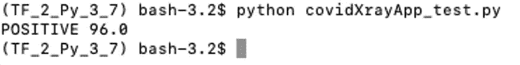*

*完美一切工作完美和“独立”，在笔记本之外。*

## *在 Flask 中创建运行应用程序的环境*

*第一步是从新的 Python 环境开始。为此，使用终端定义一个工作目录(例如 covid19XrayWebApp ),然后在那里用 Python 创建一个环境(例如:*

```
*mkdir covid19XrayWebApp
cd covid19XrayWebApp
conda create --name covid19xraywebapp python=3.7.6 -y
conda activate covid19xraywebapp*
```

*进入环境后，安装 Flask 和运行应用程序所需的所有库:*

```
*conda install -c anaconda flask
conda install -c anaconda requests
conda install -c anaconda numpy
conda install -c conda-forge matplotlib
conda install -c anaconda pillow
conda install -c conda-forge opencv
pip install --upgrade pip
pip install tensorflow
pip install gunicorn*
```

*创建必要的子目录:*

```
*[here the app.py]
model [here the trained and saved model]
templates [here the .html file]
static _ [here the .css file and static images]
       |_ xray_analysis [here the output image after analysis]
       |_ xray_img [here the input x-ray image]*
```

*从我的 [GitHub](https://github.com/Mjrovai/covid19Xray/tree/master/20_covid19XrayWebApp) 中复制文件，并存储在新创建的目录中，如下所示:*

1.  *服务器上负责“后端”执行的 python 应用程序称为 app.py，必须位于主目录的根目录下*
2.  *在/template 中，应该存储 index.html 文件，它将是应用程序的“面孔”，或者说是“前端”*
3.  *在/static 中将是 style.css 文件，负责格式化前端(template.html)以及静态图片如 logo，icon 等。*
4.  *在/static 下还有子目录，这些子目录将接收要分析的图像以及分析结果(实际上，相同的图像以新名称保存，其中包含:其原始名称加上诊断和准确率)。*

*一旦所有文件都安装到了正确的位置，工作目录看起来就像这样:*

*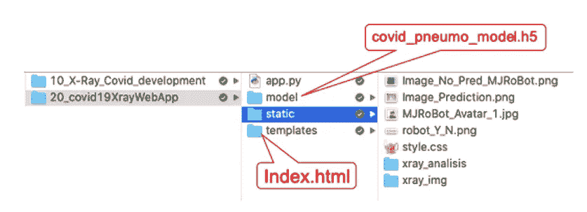*

## *在本地网络上启动 Web 应用程序*

*一旦你将文件安装到你的文件夹中，运行 app.py，它是我们 web 应用程序的“引擎”,负责接收存储在用户计算机某处的图像(无论在哪里)。*

```
*python app.py*
```

*在终端，我们可以观察到:*

*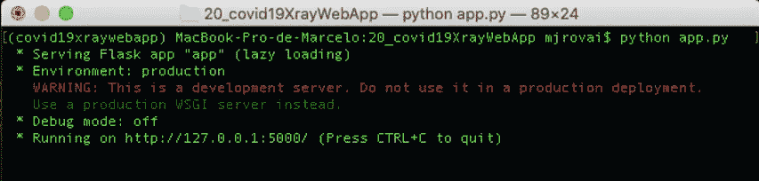*

*在您的浏览器上，输入方向:*

*[http://127.0.0.1:](http://127.0.0.1:5000/)*

*该应用将在您的本地网络中运行:*

*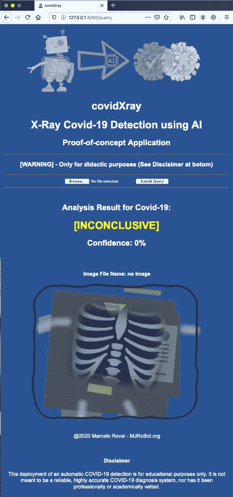*

## *用真实图像测试网络应用*

*我们可以选择开始显示 Covid 的 X 射线图像之一，它已经在开发过程中用于验证。*

1.  *按下应用程序中的[浏览]按钮，打开您电脑的文件管理器*
2.  *选择图像，然后选择[打开](在我的 Mac 的 Finder 窗口中)*
3.  *文件名显示为在应用程序中选择的文件名。*
4.  *在 app 中按【提交查询】。*
5.  *图像显示在应用程序的底部，同时显示图像诊断及其准确度值。*
6.  *图像存储在文件夹:/static/Xray _ Analysys 中，结构如下:[Result]_ Prob _[XX]_ Name _[FILENAME]。png*

*以下是一系列步骤:*

*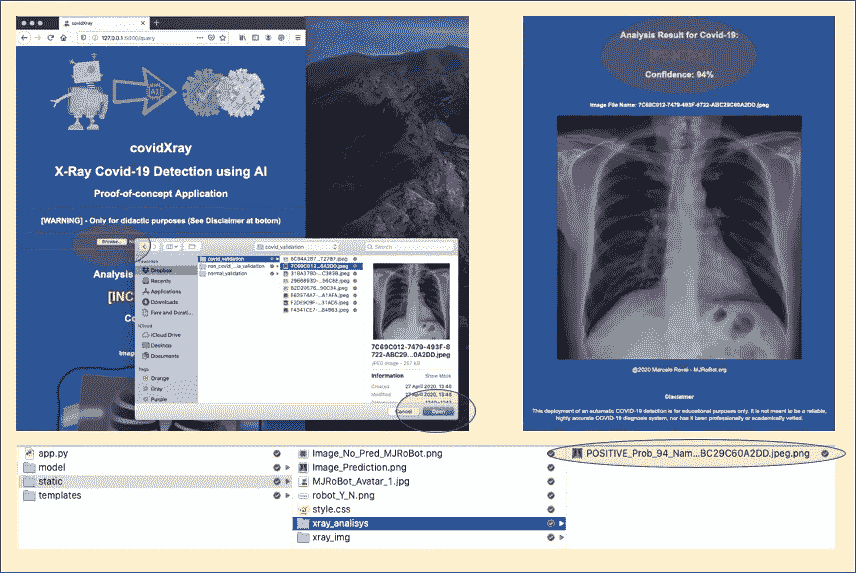*

*对有肺炎但没有新冠肺炎的图像之一重复测试:*

*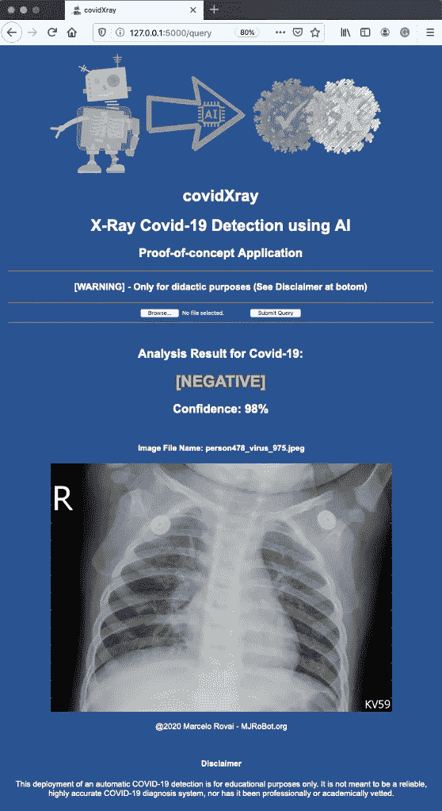*

# *后续步骤*

*正如导言中所讨论的，该项目是一个概念验证，以证明在 X 射线图像中检测导致新冠肺炎的病毒的可行性。对于要在实际案例中使用的项目，还必须完成几个步骤。以下是一些建议:*

1.  *与卫生领域的专业人员一起验证整个项目*
2.  *开发一个基准来寻找最佳的预训练模型*
3.  *使用从患者处获得的图像来训练该模型，最好是来自将使用该应用的相同区域。*
4.  *使用新冠肺炎获得更广泛的患者图像*
5.  *改变模型的模型超参数*
6.  *测试用 3 个类别(正常、Covid 和肺炎)训练模型的可行性*
7.  *对应用程序要测试的图像应用与训练图像相同的捕获和数字化程序*
8.  *更改应用程序，允许选择更适合使用的型号(型号 1 或 2)*
9.  *在 Heroku.com 或 pythonanywhere.com 等平台上将网络应用投入生产*

# *结论*

*一如既往，我希望这篇文章能够帮助其他人在数据科学的美好世界中找到自己的路！我比以往任何时候都更希望这篇文章能够激励深度学习和健康领域的专业人士共同努力，投入生产模型，帮助抗击疫情。*

*本文使用的所有代码都可以在我的 GitHub 上下载: [covid19Xray](https://github.com/Mjrovai/covid19Xray) 。*

*来自世界南方的问候！*

*我的下一篇文章再见！*

*谢谢你*

*马塞洛*