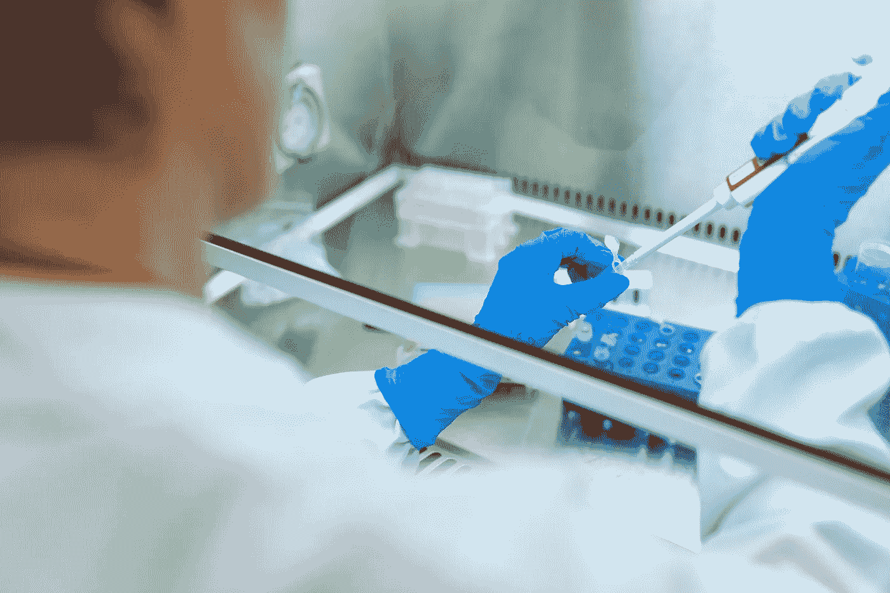

# 应用数据科学

> 原文：<https://towardsdatascience.com/applying-data-science-8b5d3a332d8c?source=collection_archive---------83----------------------->

弗兰基·查马基在 [Unsplash](/s/photos/data?utm_source=unsplash&utm_medium=referral&utm_content=creditCopyText) 上拍摄的照片

*地点、时间、原因和内容*

你已经阅读了关于在大规模数据集上使用前沿人工智能改变世界的博客帖子。您已经看到了揭示 TensorFlow、Spark 和高级模型组合的复杂技术细节的文章。

但是一个通常不被关注的问题是如何将这些新奇的工具应用到日常生活中？或者仅仅是如何应用更普通的数据科学工具和概念？这篇博文试图展示一些可能的想法。

# **基础数据科学**

在头条新闻和摇滚明星出现之前，有统计学家和数据分析师。数据已经在各行各业使用了几十年，但在最近五年左右，数据的数量和可用于利用数据的工具的数量都呈爆炸式增长。这有时会模糊如何以及在哪里应用数据科学。

在线课程和比赛通常不会遇到这个问题。通常会给你一个数据集和一个明确定义的问题来解决。但是，当你完成了一系列课程，学习了一长串概念和想法，却没有人告诉你该怎么做时，你该怎么办呢？答案很简单；四处看看，把你的鼻子伸进去，为你自己找到应用程序。

当你发现这些应用程序时，它们并不是你在新闻中读到的那些被大肆宣传的超级酷的东西。事实上，有时最平凡和简单的概念可以将现有的系统或过程变得更好。

因此，如果你发现自己在一家目前缺乏任何现代数据驱动专业知识的公司或学术部门工作，或者与缺乏一定程度数据素养的人一起工作，那么把像数据科学通才一样思考并在任何可能的地方应用你的技能视为你的工作。

这是我几年前发现自己处于的情况，下面是我利用数据科学为公司带来好处的 10 个例子。

# **示例 1 —实验室质量控制程序**

*工具/概念:* ***一介 t-test***

有一天，我决定调查我们一个科学实验室的内部运作，看看他们是如何分析数据的。我发现了一个 Excel 文件，它被用来比较化学药品更换前后的批次测试结果。该方法是基本的，关注的是样本之间的个体百分比变化，以及一些关于什么构成通过/失败的任意规则。我写了一个简单的 R 脚本，用 t-test 代替，并在这个过程中注入了一些严谨性。这个脚本然后被版本控制并集成到正式的过程中。

# **示例 2——领导销售团队**

*工具/概念:****&k-means 聚类***

照片由 [Cytonn 摄影](https://unsplash.com/@cytonn_photography?utm_source=unsplash&utm_medium=referral&utm_content=creditCopyText)在 [Unsplash](/s/photos/sales?utm_source=unsplash&utm_medium=referral&utm_content=creditCopyText) 上拍摄

一个销售团队使用直觉和有限的、过时的、手工构建的数据来规划他们的日记。有一个基本的 CRM(客户关系管理)系统，但它没有连接到公司的会计软件。

我使用 R、Shiny 和 SQL 创建了一个仪表板，每天早上自动从会计软件中提取数据，对其进行预处理，并执行 RFM(最近、频率、货币价值)分析，然后进行聚类分析，以细分我们的客户群。然后，销售被绘制出来，每个客户都由 RFM 聚类进行颜色编码。该应用程序还允许生成报告。这为销售团队提供了最新的分析数据，他们可以用这些数据来协调他们的销售工作。该分析还被市场营销部门用来针对不同的客户群进行定制沟通。

# **示例 3 —异常值检测**

*工具/概念:* ***标准回归误差***

一组科学家正在 GraphPad Prism 中执行 4PL 曲线拟合，并以主观方式手动移除异常值。在研究了评估这种拟合的最佳统计方法后，我发现了“回归的标准误差”。我在一个脚本中使用它来创建一些检测异常值的规则，使过程更加客观和可重复。

# **示例 4——数据清理**

*工具/概念:* ***gsub (R)***

一天，一位同事似乎完全厌倦了。我问他们出了什么问题，发现他们正在手动进行数据清理练习。他们拿到了一个很大的 Excel 电子表格，正在整理姓名、地址、邮政编码等。他们花了两天时间完成这项任务，但只完成了三分之一。不仅如此，预计未来几周还会有更多的数据。我花了大约一个小时写了一个 R 脚本来为他们做这件事，运行时间大约 10 秒。不用说，他们非常高兴！

# **例 5——实验设计**

*工具/概念:* ***统计力量***

照片由[this engineering RAEng](https://unsplash.com/@thisisengineering?utm_source=unsplash&utm_medium=referral&utm_content=creditCopyText)在 [Unsplash](/s/photos/lab?utm_source=unsplash&utm_medium=referral&utm_content=creditCopyText) 上拍摄

实验正在进行，决策是基于非常不充分的样本数量。没有人听说过“权力”或其含义。为了避免浪费宝贵的时间和金钱，我编写了项目文档，要求在任何重要工作之前进行功耗计算。

我还召开了一次“午餐学习”会议，解释了新流程背后的概念和原因。

# **示例 6 —数据审计**

*工具/概念:* ***数据质量***

该公司拥有大量面向数据的系统和流程，这些系统和流程已经发展了多年。人们来了又走，特别的规则产生了，指南写好了又丢掉了，事情变得杂乱无章，支离破碎，令人困惑。

我进行了一次数据审计，重点是数据质量，这导致了许多改进项目被确定和实施。

# **示例 7 —数据训练**

*工具/概念:* ***数据素养***

我发现自己与大量非常聪明的人一起工作，他们都在生物化学和金融等领域受过良好的训练，经验丰富，但似乎都缺乏现代数据技能。我创建了一个工作室，遵循[数据木工、](https://datacarpentry.org/)系统，并以小组形式在线教授材料(在新冠肺炎封锁期间)。主题包括数据管理、电子表格最佳实践和 r 的介绍。

# **示例 8 —图像分类**

*工具/概念:* ***keras***

一位来访的合作者提到，他们认识一个拥有大量医学图像的人，他们正在从人工智能的角度研究他们可以做些什么。我要了这些文件(首先要有一个数据共享协议),并使用 keras 用 Python 建立了一个原型深度学习模型。我们设法得到了一些合理的结果，但不幸的是，数据质量不是很好。我们希望以后继续这项工作。

# **示例 9——可重复研究**

*工具/概念:* ***R 笔记本***

Excel 独占鳌头，因为它被用于大量的数据处理、分析、存储和通信。在几次数据混淆或丢失后，我开始在 R 笔记本上分析人们最关键的项目工作(特别是涉及第三方的项目)，然后对外共享。这些为合作者提供了一个可重复且透明的工具，增强了他们对我们工作的信心。

[Pop &斑马](https://unsplash.com/@popnzebra?utm_source=unsplash&utm_medium=referral&utm_content=creditCopyText)在 [Unsplash](/s/photos/statistics?utm_source=unsplash&utm_medium=referral&utm_content=creditCopyText) 上拍照

# **例 10—常规监测**

*工具/概念:* ***SQL 和闪亮***

业务的多个领域要么没有受到监控，要么受到手动监控。例如，实验室日常工作的某些方面每个月都会被计算和查看。我开发了一系列闪亮的应用程序，自动整理、分析和可视化关键领域，为人们节省了大量时间和精力。有些甚至内置了规则，以突出相关工作人员可以进一步探讨的关切领域。

# 结束语

希望这些例子能让你思考如何将数据科学应用到你工作的公司或部门的某些领域。这不一定是什么大的，花哨的大型项目。它可以是一个简单的脚本，放在正确的地方，最终可能会节省一年数百个小时的工作时间，或者防止由于文件丢失或使用错误数据而导致的数据灾难。

你越是这样想，你就会发现越多的机会。很快，不仅你周围的组织的整体数据成熟度开始提高，而且你还会发现自己需要解决更多的问题。这是一个好问题！