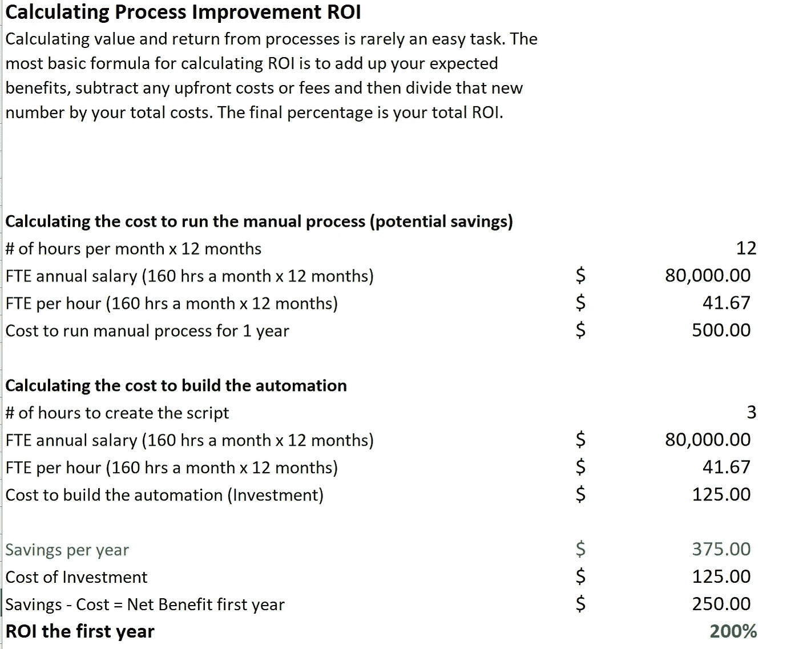

# 将数据科学技能应用于您当前的角色—流程自动化

> 原文：<https://towardsdatascience.com/applying-data-science-skills-in-your-current-role-process-automation-62f89e03aeea?source=collection_archive---------53----------------------->

## 如何在提供实际价值的同时获得真实世界的体验

卡尔·海尔达尔在 [Unsplash](https://unsplash.com/s/photos/technology?utm_source=unsplash&utm_medium=referral&utm_content=creditCopyText) 上拍摄的照片

对于有抱负的数据科学家和数据分析师来说，在没有“真实世界”经验的情况下闯入这个领域可能会令人沮丧。在之前的文章中([这里](https://medium.com/illumination/landing-a-data-analytics-role-at-your-company-without-luck-dca1cbe3f35b)和[这里](/my-journey-from-mainframes-to-data-science-54358958fc02)，我谈到了创造你的机会。你可能想看看你目前的工作，看看如何应用你的数据科学兴趣和技能。我想介绍一些项目，如流程自动化和文本分析，它们可能会帮助你在当前的职位上获得经验。在本文中，我将回顾过程自动化以及为什么您应该这样做。

## 业务流程自动化(BPA)

业务流程自动化( [BPA](https://en.wikipedia.org/wiki/Business_process_automation) )是任何简化工作场所流程并可能降低成本的流程。机器人过程自动化是 BPA 的一种，使用机器和人工智能技术。我们将从 BPA 开始。

## 自动化如何帮助您的团队

如果你的团队发现自己陷入了重复性的手工任务，BPA 就有机会了。如果你能减少非增值工作的数量，员工将会被解放出来从事其他有价值的项目。这种情况的一些例子包括:

*   每周，项目经理必须清理三个电子表格中的格式，计算 KPI，并将它们合并成一份报告。日期通常很乱，为什么会计总是大写每个单词？
*   每个月，一位经理都会创建一个包含部门 KPI 的电子表格，并将其加载到 Tableau 中，供其老板召开员工会议时使用。
*   每周三，数据分析师手动从不同的报告中提取数据，并将其加载到另一个数据库，如 Access 或 AWS。
*   每天早上，一名员工会提前到达，汇总前一天的客户来电数量。经理喜欢早上第一件事就是拿到它，所以如果需要保险，如果员工请假。

这些听起来熟悉吗？毫无疑问。机会就在你身边。

## 实施自动化如何帮助您

这和数据科学有什么关系？能够传输和格式化大量数据是工作的一部分。你花在重复性任务上的手工越少，你花在分析上的时间就越多。虽然这项技能本身不会让你在任何面试名单中名列前茅，但它是一项坚实的技能，可以让你的工作生活变得更好。它通常易于实现，并具有良好的投资回报(ROI)。

## 你能做什么

让我们回顾一下第一个示例任务。尽管有人工智能的浮华，大多数部门仍然有 excel 电子表格和重要数据。您可以编写脚本来系统地清理部门电子表格并将其合并。您可以安排在员工会议前每周运行一次，并通过电子邮件发送给经理进行审核。更好的一步可能是建立一个自动更新的 Tableau 报告。哪个经理会拒绝让他们最讨厌的任务自动化的提议？

新手级别的 python 脚本可以处理整个过程，直到 Tableau。你可以在一个下午就完成它，让你的努力冒着几个小时的风险。

网上有很多关于如何编写代码的教程。我的建议是保持代码简单并添加注释。

确保您测试了您的脚本，并让您的经理对其进行了验证！我希望我不必说，但最好把它放在那里。

## 提供价值证据(美元美元美元)

一旦你完成了自动化，计算投资回报率。根据每个全职员工的价值(FTE)，每个公司的做法略有不同，所以你可能需要咨询你的经理或财务部门。你可以开始将你的技能转化为收入和储蓄。

有许多理由来计算您的工作所带来的节约。如果你能证明你正在解放你的团队去做更高优先级的任务，那么请求可能会变成更复杂的任务，挑战你的技能。你也可以在你的绩效评估和简历中使用这些计算出来的节省。

这是我创建的一个 ROI 示例。该定义来源于 Big Sky Associates 的博客。

ROI 计算示例—作者提供的图片

## 结论

自动化业务流程的机会无处不在。寻找一个低风险的过程开始。保持简单。测试一下。计算投资回报率。把这些放在一起，在你的公司建立你的自信和你的个人品牌。做数据科学不用等官衔。