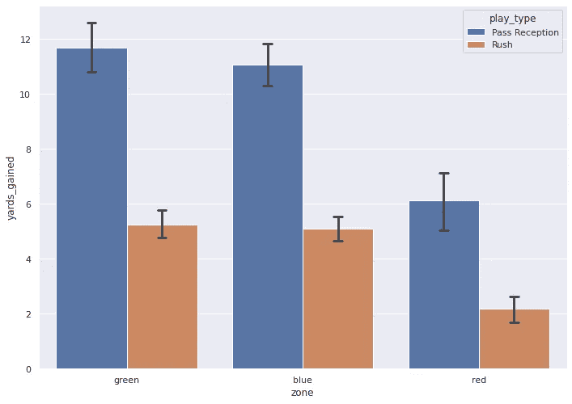
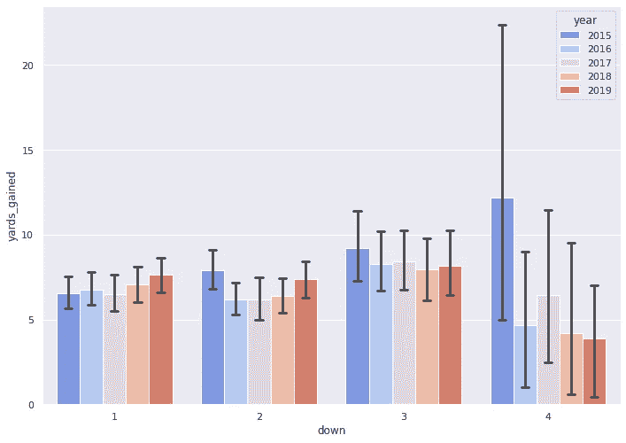
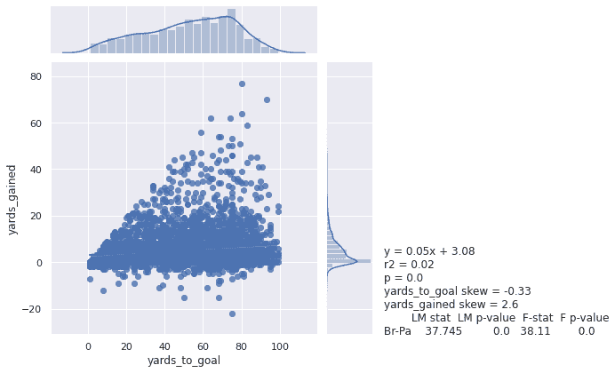
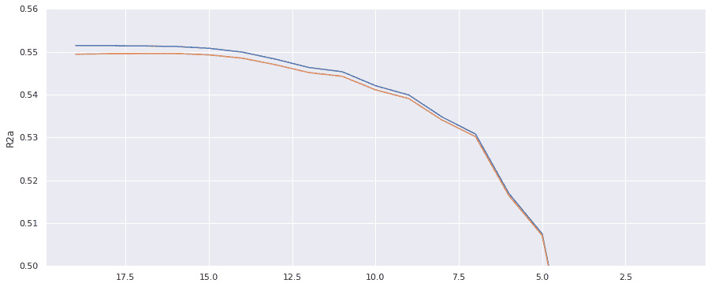
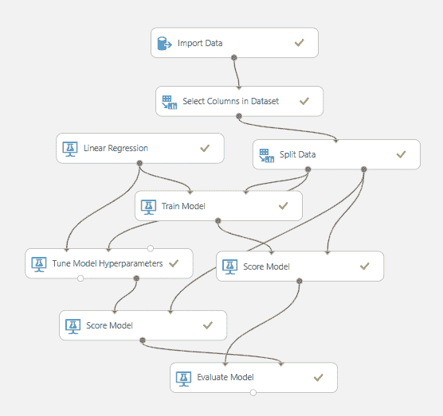
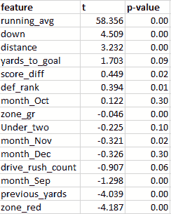
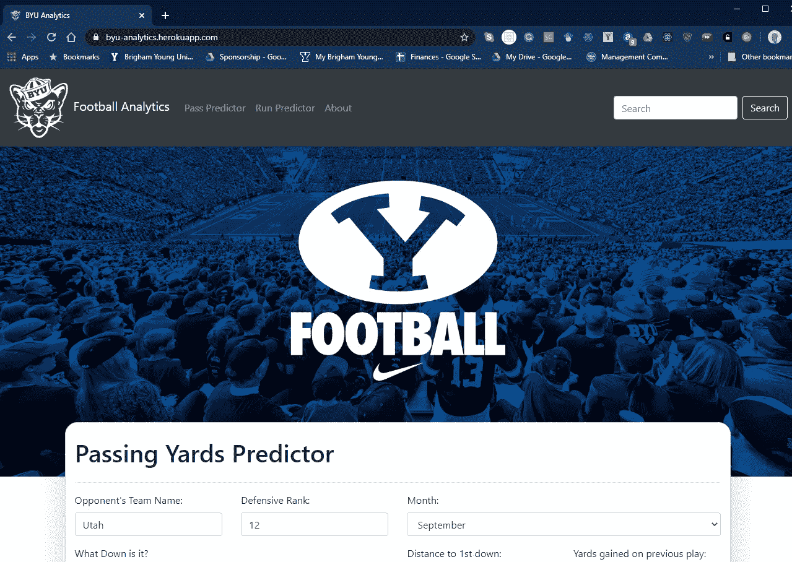
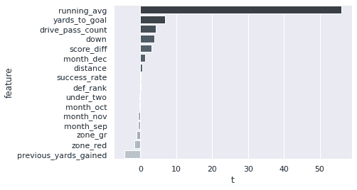
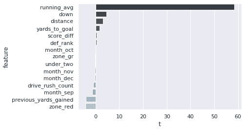

# 应用机器学习预测 BYU 足球比赛的成功

> 原文：<https://towardsdatascience.com/applying-machine-learning-to-predict-byu-football-play-success-60b57267b78c?source=collection_archive---------29----------------------->

## 使用详细的比赛数据帮助教练确定即将到来的最佳比赛叫牌——以获得的潜在码数衡量。

Claire Gentry 在 BYU 体育画廊拍摄的照片

你知道 BYU 上一次赢得对犹他的比赛是在 2009 年 11 月 28 日，那场比赛以 BYU 在 26-23 的加时赛中获胜而告终吗？BYU 已经有将近 11 年没有尝到战胜对手犹他爵士的滋味了！是什么让犹他的足球队比 BYU 好？是他们试图跑动或传球的次数吗？他们的进攻好还是防守好？为了提供关于为什么 BYU 输给犹他的洞察力，我们建立了一个机器学习模型来预测 BYU 在某些比赛时间场景中奔跑或传球获得的码数。我们相信，BYU 足球可以利用这种模式做出更好的比赛决策，从而提高进攻效率，赢得更多比赛。

**大纲:** -数据分析
-方法
-结果
- Web 应用
-下一步
-投稿
-总结

# 数据分析

**数据源** 我们的数据源是由 BYU 足球分析部门提供给我们的——它由 2015 年至 2019 年所有比赛的所有抢攻/传球比赛的结果组成。

该数据记录了关于每个重头戏的几个指标，如下所示:

*   码数增加——比赛增加/减少了多少码
*   距离-到下一个第一个向下的距离
*   离触地还有多少码
*   PlayTextString —谁参与了该剧
*   向下，一半，得分差异…

**数据清理** 我们的项目特别关注 BYU 的进攻，所以我们过滤掉了记录 BYU 足球队防守打法的所有行，这样我们就剩下了大约一半的数据集。从那以后，我们删除了所有涉及踢门、射门、拦截等的战术。我们想特别关注传球和抢攻。

BYU 足球分析团队也有几个可供他们使用的计算功能，如 EPA(预期平均得分)和 WP，但由于我们的应用程序的预计动态使用，我们将它们从我们的数据集中删除。

我们还设计了其他特征，看看它们是否是码数增加的良好预测器(结果见下文):

*   比赛/比赛传球/冲刺次数——BYU 在比赛/比赛中传球/冲刺的次数(在模型中影响不大——不包括在内)。
*   自上次传球/冲刺以来的打法-为了考虑不同打法的惊喜因素，我们想看看在不同类型的几次连续打法之后切换打法是否与 yards _ gained 相关(模型中的影响很小-不包括)。
*   跑动平均传球/跑动码数——这是每个跑动/传球球员获得的跑动平均码数(包括模型中的大效应)。

理想情况下，这些指标将实时提供给 BYU，从而使 BYU 能够使用网络应用程序工具来帮助打电话。

**调查结果** 我们的探索性数据分析过程包括计算数据的原始相关性，并跨地区和年度进行比较。

BYU 足球按打法和区域获得的平均码数(2015 — 2019)

在左边，我们看到在每种情况下，通过传球获得的平均码数大于通过冲刺获得的平均码数。这是有道理的，因为传球比抢跑风险更高，回报更高。

然而，两者之间的差异在红区没有那么剧烈。这是有道理的，因为有更少的码来获得。此外，防守往往会把他们的努力踢到另一个水平，以防止进攻得分的机会。

作为这一发现的结果，我们决定建造**两个独立的模型**——一个用于狂奔，一个用于超车。传球和抢攻数据有很大的不同，因此我们想要分割数据，一次只预测一种打法。

BYU 足球的平均码数逐年下降(2015 — 2019)

这里我们看到第四下获得的码数是最低的(2015 年除外)。这是有道理的，因为大多数球队会在第四回合采取低风险、低回报的打法。

然而，所有下降之间存在显著差异，尤其是第三次下降。第三次进攻的平均码数比其他任何一次进攻都要高。这种发现表明我们需要将它包含在我们的模型中。点击这里查看我们其余的清洁/分析[。](https://colab.research.google.com/drive/1_2jOZT8ATErt-Ep_XIPpUyJ3lvFIkYex?usp=sharing)

从我们的发现中，我们能够理解我们想要为我们的模型使用哪些度量，例如向下数、区域、到目标的码数等。

# 方法

我们首先将数据集中的每个特征和标签(增加的码数)之间的关系可视化。这有助于我们了解哪些特征在预测基于相关效应获得的码数时会产生很大影响。点击查看我们的初始模型[。](https://colab.research.google.com/drive/1-wyiv0CuknB1JNj01i0dtu0kUeb1crru?usp=sharing)

获得的码数与目标码数之间的关系

通过我们对数据集的分析确认了这些初始关系，我们选择了与详细播放数据最相关的前 30 个特征，并开始在 python 中运行多元线性回归模型。这将有助于我们看到各种特征相互之间的综合影响，以及总的关系，或预测的强度，以及增加的码数。

我们开发了一个函数，该函数将遍历模型，并剔除标签上 t 值最低的特征。这允许我们不断选择具有最佳系数权重的最重要的特征，同时还调解我们的 R 平方得分和调整后的 R 平方得分之间的差异。这个迭代，可视化，通过剩余特征的数量绘制 R 平方和调整的 R 平方。

## 自动功能代码逐个功能迭代:

自动 MLR 迭代的功能

绘制 R 平方和调整后的 R 平方的变化

随着对模型分数影响很小或没有影响的特征被移除，R 平方和经调整的 R 平方彼此接近，并产生更好、更准确的模型。我们决定在我们的模型中使用大约 11-12 个特征，并审查它们以确保它们在考虑下一场比赛的数据时具有实际意义，以帮助教练进行决策。

这些特征是:
-防守等级
-当前击球的次数
-月份
-半场还剩 2 分钟不到
-倒球次数
-第一次倒球的距离
-当前在场上的区域位置
-目前在击球中获得的平均码数
-到球门的码数
-先前击球的区域
-先前获得的码数

有了这些指标，我们觉得我们可以预测下一场比赛的潜在码数。然而，为了创建一个更好、更准确的模型，我们想更进一步，分离出我们的数据集。

冲球和传球有明显不同的防守/进攻阵型，获得的码数不同(冲球通常比传球获得的码数少)，以及各种其他不同的影响，这导致我们将数据分为传球数据集和冲球数据集。有了两个不同的模型，我们觉得我们可以用相同类型的数据对抢攻和传球进行分组，从而获得更好的预测。

# 结果

一旦数据被分离出来，我们就设计了与比赛类型更相关的特定特征:传球或抢攻。对于传球，我们增加了当前驱动中传球所获得的移动平均码数。我们还在游戏中添加了一个运行成功率。如果一个四分卫或某个接球手很抢手，那么这些指标会在数据中显示出来。

对于加急打法，我们增加了一个类似的功能，可以帮助计算当前驱动中加急打法的平均码数。准备好这些特性后，我们运行了两个特定于游戏类型的模型。

泰勒·理查森在 BYU 体育画廊拍摄的照片

## 传递模型结果

r 平方:0.685
平均月收入:3.789
RMSE: 5.818

## 快速模型结果

r 平方:0.615
平均误差:2.411
RMSE: 4.358

如上所示，由于平均超车码数*和*成功率的计算，超车模型的 R 平方得分略高，而冲刺模型只有平均冲刺码数，以及其他特征，如距离、下降数等。

# 网络应用

有了模型，我们下一步开发了一个[原型应用](https://byu-analytics.herokuapp.com) ( [BYU 分析](https://byu-analytics.herokuapp.com))，教练可能会在比赛中使用。本质上，该应用程序是一个简单的计算器，可以输入 down，distance，passing completion rate 等。这些输入被发送到一个实时的 Azure 机器学习 web 服务，该服务计算预测的码增益并将其发送回应用程序。点击访问我们的 Azure [通过](https://gallery.azure.ai/Experiment/Passing-MLR)和[冲](https://gallery.azure.ai/Experiment/Rushing-MLR)实验。

Azure 机器学习实验

这个应用程序是用 ReactJS 前端和 Django-Python 后端构建的，后者连接到 Azure cloud 中的 SQL Server 上托管的动态数据库。我们在 Azure 中制作我们的模型是为了方便访问，也是为了我们实现原型应用的速度。随着时间的推移，我们希望用 Python 创建我们的机器学习模型。

Python 方法获取用户输入，发送到 Azure，然后返回给用户

本质上，这个 app 是一个全栈的机器学习平台。输入从用户发送到后端，后端调用机器学习 web 服务。web 服务从我们托管的数据库导入数据，并向后端返回一个预测。然后，我们将输入和预测的总码数一起保存到数据库中，这样模型可以使用这些预测来重新训练和“学习”并随着时间的推移提高准确性和结果。然后将预测发送回用户，用户可以根据预测的码数值做出更好的决策。

冲击模型特征权重和重要性

在这款应用上，抢球预测和传球预测都有单独的输入表单。我们这样设计是为了让教练可以在视图之间来回切换，看看哪种打法效果更好。在我们的 GitHub [repo](https://github.com/cyoung43/football-project) 查看我们的其余代码。

# 后续步骤

如前所述，我们的应用程序目前是一个原型。但是，我们将概述我们希望采取的下一步措施，以使我们的应用程序成为一个更可行的游戏时间产品，教练可以使用它来帮助决策过程。

## 获取进攻/防守阵型的额外数据

目前，我们的数据只能通过衡量比赛对球场影响的比赛时间统计来帮助我们的模型准确性。我们需要更多的数据来解释球场上所有移动的棋子。我们相信，利用进攻和防守阵型数据，我们可以更好地解释防守失误和进攻成功，反之亦然。这将使我们预测码数增加的模型更上一层楼。

Web 应用程序用户界面

## 导入特定玩家的数据和统计

我们模型的另一个缺失部分是缺少球员在球场上的季节性统计和进步。了解特定跑锋在一个赛季中的总冲刺码数以及相同跑锋在一场比赛中获得的平均码数将有助于预测过程。特定球员的数据以及阵型数据将有助于提高我们模型的预测能力。

# 贡献

这个项目处于一个我们在体育分析领域还没有遇到过的独特空间。虽然许多球队目前正在分析 NFL 级别的数据，但我们认为大学足球的利基市场是一个开放的分析机会。

这个特定项目对大学足球分析领域知识的贡献是:

*   球场上每个区域获得的码数分析。与其他区域相比,“红区”(距离球门线 20 码或更少)每次比赛获得的码数最少。我们认为这是由于防守为了防止进攻得分机会而表现出的额外努力和强度。
*   **开发基于逐场比赛数据的模型来预测获得的码数。**虽然目前存在局限性，但教练可以使用这些模型在比赛发生前分析比赛的成功。这些模型也可以作为球迷参与的工具，让那些“看台上的教练”看到他们会做什么，并将他们的预测结果与进攻教练的实际行为进行比较。

*   **预测码增益应用原型的开发。**我们制作了一个现场应用程序来展示我们对一个工具的愿景，该工具可以在比赛时间供球迷和教练使用。点击查看这个工具[。](https://byu-analytics.herokuapp.com/)

*   在一次击球中获得的平均码数的高效效果是一个特点。在快速和快速模型中，该特征对模型的 R 平方贡献最大。这表明，有更多的因素需要考虑，为什么平均码数在驾驶模型中增加得如此显著。如前所述，我们认为这种巨大的影响和系数权重可能掩盖了潜在的因素，如防守/进攻阵型以及预期的接收目标、四分卫和其他进攻球员。有了额外的数据，这种巨大的影响可以得到更好的解释，从而产生更准确的模型。

# 摘要

足球是一项极其复杂的运动，有大量的人为因素。通过使用机器学习和数据分析，我们已经表明，我们能够在合理的确定性水平内预测一场比赛的结果。这种学习也可以实时集成到一个易于使用的平台中。随着进一步的发展和更多的数据，模型的可信度可能会进一步提高。

我们希望基于我们的研究可以得出一个未来的模型，该模型可以推荐理想的下一场比赛，以最大化获得的码数。这种工具可以在比赛中实时使用，或者由教练在过去的比赛回顾中使用，以更好地改进他们的团队策略。游戏分析师和爱好者也可以使用这样的工具来分析球队和球员的表现，以做出投资或幻想体育决策。

最终，我们对我们能够取得的研究和成果感到满意。通过对 BYU 比赛的分析，我们能够最大限度地减少足球比赛中的人为因素和复杂性。有些领域需要改进和进一步发展，我们希望看到以后由我们自己或其他数据科学家来进行。

## 组

喜欢你看到的吗？联系我们获取更多信息！请在下面评论您的反馈和建议。

我们的团队:BYU 信息系统项目的在校学生