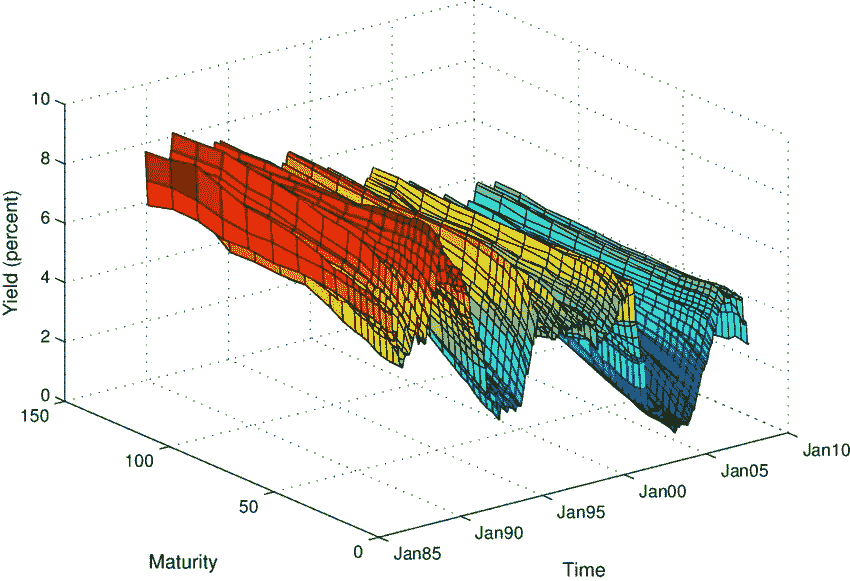
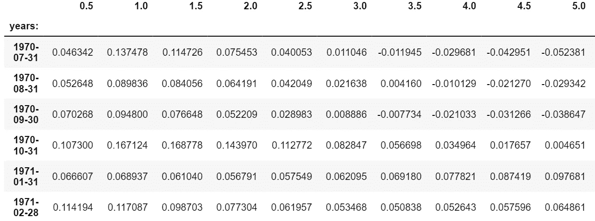
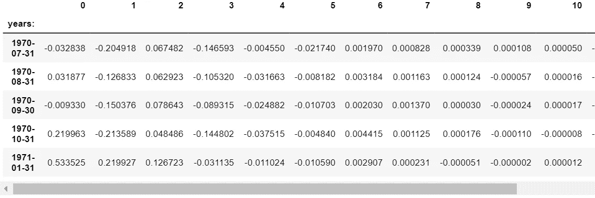
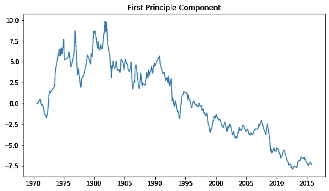
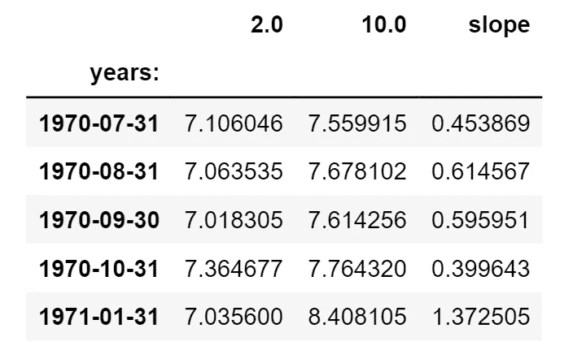
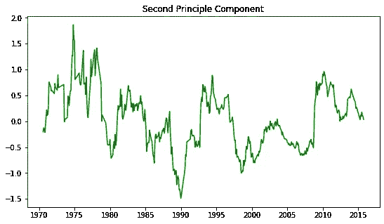
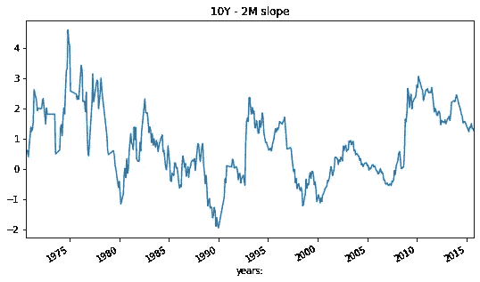

# 将主成分分析应用于收益率曲线——困难重重

> 原文：<https://towardsdatascience.com/applying-pca-to-the-yield-curve-4d2023e555b3?source=collection_archive---------6----------------------->

## 了解如何使用 python 中的当前金融数据应用主成分分析的最流行的应用程序之一。



资料来源:Diaa Noureldin，[研究之门](https://www.researchgate.net/figure/Three-dimensional-plot-of-the-US-treasuries-yield-curve-Sample-period-is-19861-200712_fig1_300072954)。

收益率曲线是一条线，它描绘了信用质量相同、期限不同的债券的各种利率。据说政府债券的违约风险可以忽略不计，因为政府可以简单地借更多的钱来偿还债务。根据利率预期理论，收益率曲线由两个方面组成:

1.*对未来短期利率的平均*市场预期。

2.*期限溢价*——投资者因持有长期债券而获得的额外补偿。这本质上是因为金钱的时间价值——100 英镑今天的价值大于明天的价值，因为它有潜在的盈利能力。因此，为了让固定收益投资物有所值，投资者必须拿出他们的现金，债券发行人必须向投资者支付一些额外的金额。

我们可以使用主成分分解来模拟收益率曲线的这些方面。数据有两个主要属性:噪声和信号。主成分分析旨在提取信号并降低数据集的维数；通过找到最少数量的变量来解释最大比例的数据。它通过将数据从相关性/协方差矩阵转换到一个维度更少的子空间来实现这一点，其中所有解释变量都是相互正交的，即不存在多重共线性*(注意:这些是统计属性，不一定有经济解释)。*

在本次分析中，我将使用从 0.5 年到 10 年到期的各种英国政府债券即期利率(由英格兰银行提供)，看看我们是否可以模拟收益率曲线及其斜率。在寻找收益率曲线的主要成分时，计量经济学家持有的主要理论是:

**PC1** =常数≈长期利率≈ R*

**PC2** =斜率≈期限溢价

**PC3** :曲率

scikit 中有一个函数——学习执行 PCA，但是，为了更好地理解它，让我们手动执行(实际上*并没有*那么难)！

```
%matplotlib inline
import matplotlib.pyplot as plt
import pandas as pd
import numpy as np# Import Bank of England spot curve data from excel
df = pd.read_excel("GLC Nominal month end data_1970 to 2015.xlsx", 
                   index_col=0, header=3, dtypes = "float64", sheet_name="4\. spot curve", skiprows=[4])# Select all of the data up to 10 years
df = df.iloc[:,0:20]df.head()
```

在导入所需的相关模块后，从英格兰银行导入现货曲线数据，我们可以在数据框中看到，由于数据缺失，有一些 *nan* 值。我们可以放弃这些，因为它们不会对分析产生很大影响。



英格兰银行现货曲线数据。来源:[英格兰银行。](https://www.bankofengland.co.uk/statistics/yield-curves)

下一步是将数据标准化为 z 分数，假设平均值为 0，方差为 1。我们可以通过使用以下公式来做到这一点:


然后，我们使用 numpy 从标准化数据中形成一个协方差矩阵。虽然相关矩阵在金融中更常用，但由于我们的数据是标准化的，相关矩阵和协方差矩阵*实际上会产生相同的结果*。这是因为相关矩阵只是一个标准化的协方差矩阵。


然后，我们可以使用 numpy 的 linalg.eig 包从矩阵中创建特征值和特征向量。这在我们的标准化数据上执行特征分解。特征值是在 np.linalg.eig 中应用的线性变换的标量。我们可以使用特征值来找到总方差的比例，每个主分量使用以下公式解释:


```
# Perform eigendecompositioneigenvalues, eigenvectors = np.linalg.eig(corr_matrix_array)# Put data into a DataFrame
df_eigval = pd.DataFrame({"Eigenvalues":eigenvalues}, index=range(1,21))

# Work out explained proportion 
df_eigval["Explained proportion"] = df_eigval["Eigenvalues"] / np.sum(df_eigval["Eigenvalues"])#Format as percentage
df_eigval.style.format({"Explained proportion": "{:.2%}"})
```


特征值的数据帧。每个主成分一个特征值。

特征向量是这些线性变换的系数，保持方向不变。这个图表和等式应该有助于直观地解释这个概念:


对象被变换，但是向量的方向保持不变。来源:[视觉假人](https://www.visiondummy.com/2014/03/eigenvalues-eigenvectors/)


为了形成主成分的时间序列，我们只需要计算特征向量和标准化数据之间的点积。

```
principal_components = df_std.dot(eigenvectors)
principal_components.head()
```



主成分时间序列的提取

当我们绘制第一个主成分时，我们可以看到它与实际的 10 年期收益率曲线非常相似。这是有意义的，因为根据我们的特征值，第一主成分解释了 98%的数据。



第二个主成分代表斜率——这应该与实际收益率曲线的斜率相关。计算斜率的一种方法是 10 年期现货利率减去 2 年期现货利率。

```
df_s = pd.DataFrame(data = df)
df_s = df_s[[2,10]]
df_s["slope"] = df_s[10] - df_s[2]
df_s.head()
```



即期利率，其中斜率= 10 年期减去 2 年期即期利率。

简单地从视觉上看，我们可以看到斜率看起来几乎与我们的第二主成分相同。让我们用一个相关性来验证:



```
np.corrcoef(principal_components[1], df_s[“slope”])array([[1\.        , 0.95856134],
       [0.95856134, 1\.        ]])
```

当运行第二主成分和收益率曲线的 10Y-2M 斜率之间的相关性时，0.96 的高相关性向我们表明，第二主成分实际上代表了斜率！

***感谢阅读！*** *如果你有什么见解，请不吝赐教。包含我用来做这个项目的源代码的完整 Jupyter 笔记本可以在我的* [*Github 资源库*](https://github.com/nathanwilthomas/UK-Yield-Curve) *中找到。*

参考资料:

[1]亚历山大·卡罗尔(2008)。*市场风险分析二、实用金融计量经济学*。

[2]阿多戈，费利克斯·阿坦加等人，2018 年。*宏观经济指标的主成分和因子分析。*可在:*[https://pdfs . semantic scholar . org/8736/5855217 edbb 53 e 5e 29 c 5872 db 7 efb 907 cc . pdf](https://pdfs.semanticscholar.org/8736/5855217edbc53e5e29c5c5872db7efb907cc.pdf)*

**免责声明:本文表达的所有观点均为本人观点，* ***与*** *和先锋或任何其他金融实体没有任何关联。我不是一个交易者，也没有用本文中的方法赚钱。这不是财务建议。**