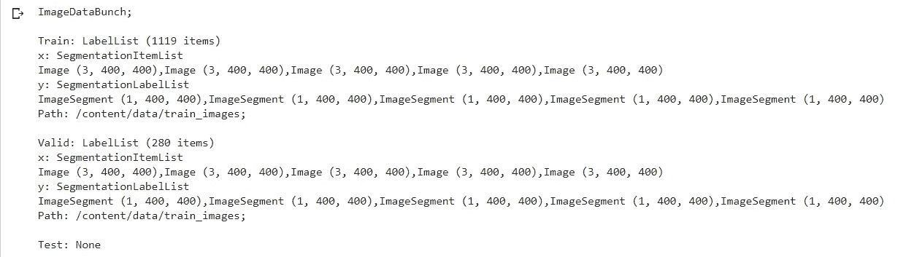
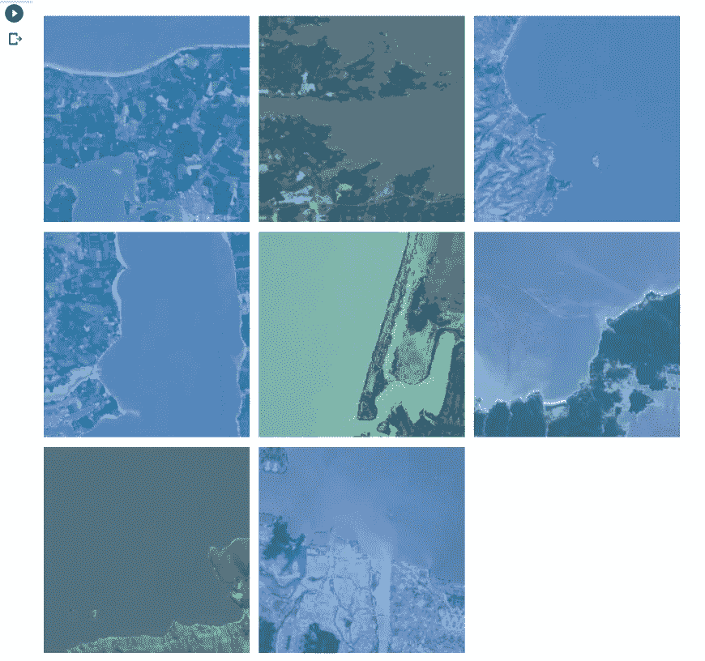
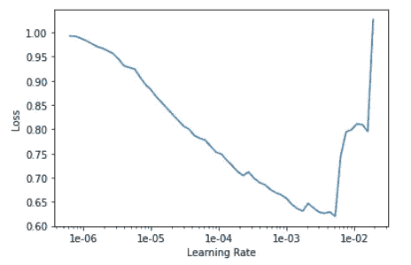
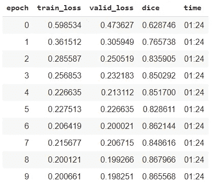
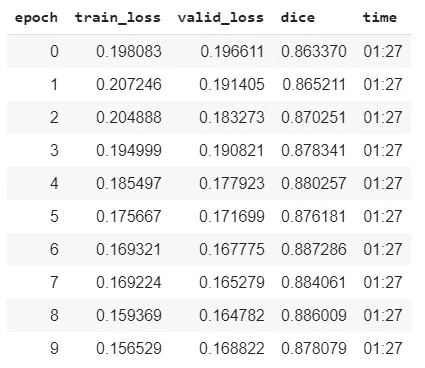
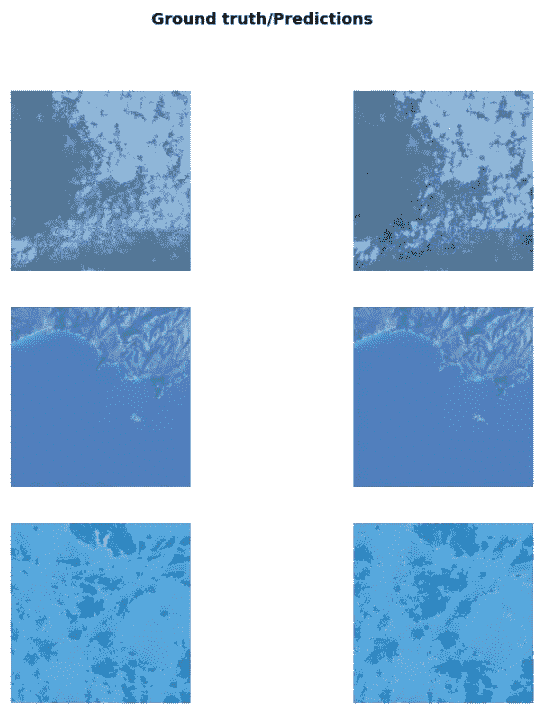

# 用不到 50 行代码解决 AIcrowd 的第一个问题！

> 原文：<https://towardsdatascience.com/approaching-aicrowds-lndst-problem-in-under-50-lines-of-code-b8b5fb536f2b?source=collection_archive---------54----------------------->

在这篇文章中，我将说明如何解决一个核心的计算机视觉问题，即所谓的*语义分割*。简单地说，语义分割的目标是根据图像中显示的内容，简单地将给定图像中的每个像素分类到特定的类别。

LNDST 是语义分割的经典例子，可以使用[CNN](/a-comprehensive-guide-to-convolutional-neural-networks-the-eli5-way-3bd2b1164a53#:~:text=A%20Convolutional%20Neural%20Network%20(ConvNet,differentiate%20one%20from%20the%20other.)解决。Landsat 数据集由 400x400 RGB 卫星图像组成，这些图像取自 Landsat 8 号卫星。在每个图像中，可以有水和背景。我们的分类器应该将每个像素预测为`0 - background`或`1 - water`。排名的标准是[F1/骰子得分](https://en.wikipedia.org/wiki/F1_score)。


由 [SpaceX](https://unsplash.com/@spacex) 在 [Unsplash](https://unsplash.com/) 上拍摄的照片

我们将使用 FastAI v1 来解决这个问题。FastAI 是一个流行的包装器，它与 PyTorch 框架协同工作。我选择 FastAI 来解决这个问题，因为它提供了几个特性，比如学习率查找器、可以用几行代码创建的数据加载器，以及其他几个好东西。确保您已经下载了[数据集](https://www.aicrowd.com/challenges/ai-for-good-ai-blitz-3/problems/lndst/dataset_files)，并将其提取到名为 *data 的文件夹中。*我们开始吧！

```
from fastai.vision import *
```

上面一行导入了 FastAI 的视觉模块。

```
path = Path('data')
path_img = path/'train_images'
path_lbl = path/'train_gt'img_names = get_image_files(path_img)
lbl_names = get_image_files(path_lbl)
```

*img_names* 和 *lbl_names* 是包含训练图像及其各自遮罩的列表。

```
# Batch Size
bs = 8# Labels
labels = ['background', 'water']# Mapping fuction mapping x names and y names
def get_y_fn(x):
    dest = x.name.split('.')[0] + '.png'\
    return path_lbl/destsrc = (SegmentationItemList.from_folder(path_img)
        # Load in x data from folder
        .split_by_rand_pct()
        # Split data into training and validation set
        .label_from_func(get_y_fn, classes=labels)
        # Label data using the get_y_fn function
)# Define our image augmentations
tfms = get_transforms(flip_vert=True, max_lighting=0.1, max_zoom=1.05, max_warp=0.)data = (src.transform(tfms, size=400, tfm_y=True)
        # Augments the images and the mask
        .databunch(bs=bs)
        # Create a databunch
        .normalize(imagenet_stats)
        # Normalize for imagenet mean and std
)
```



上面的代码创建了一个 *ImageDataBunch* 对象，它处理数据处理的所有方面，比如预处理、扩充、分割成训练集和验证集等等。现在让我们来看一看我们的一小批数据。

```
data.show_batch(8, figsize=(10,10))
```



这是在应用旋转、翻转等随机变换后的随机小批量。

现在我们的数据已经准备好了，让我们创建一个模型并训练它。有几种架构可用于解决细分任务，如 U-Net、FPN、DeepLabV3 和 PSPNet。我们将在本文中使用 U-Net。

```
# Pretrained Encoder
encoder = models.resnet34learn = unet_learner(data, encoder, metrics=dice)
```

FastAI 的 *unet_learner* 方法创建了一个 *Learner* 类的实例。*学员*班处理完整的培训循环并打印指定的指标。该方法特别使用给定的编码器构建了一个类似 U-Net 的架构，并只为编码器部分加载 imagenet 预训练权重。如果你不确定 U 网是如何工作的，看看这篇文章。请注意，我们将骰子作为一个度量来传递，这将让我们了解我们的模型在测试集上的表现。

```
learn.lr_find()
learn.recorder.plot()
```



这个图表给了我们一个最佳学习率的概念。根据 FastAI 的说法，最佳学习率应该是图中最陡的向下斜率，在该斜率处，损失快速下滑至最小值。在这种情况下，它可以是 1e-5 左右的任何值。

```
# Fit the model
learn.fit_one_cycle(10, 1e-5)
```



现在，我们以 1e-5 的最大学习速率运行 10 个纪元。FastAI 使用一个周期策略进行学习率调度，这在本文[中](https://arxiv.org/pdf/1803.09820.pdf)提到过。该初始训练仅更新解码器的参数，保留预训练编码器的权重。一旦我们的模型训练得足够好，我们也可以解冻编码器，并训练更多的编码器。

```
# Unfreeze and train some more
learn.unfreeze()
learn.fit_one_cycle(10, slice(1e-6, 1e-5))
```



现在，我们用有区别的学习速率训练更多的时期，其中较早的层用较低的最大学习速率训练，并且学习速率对于随后的层组增加。现在我们的模型已经训练好了，我们将直观地检查模型是否工作正常。

```
learn.show_results(rows=3, figsize=(10,10))
```



现在一切都设置好了，我们可以在测试集上运行推理并提交了！

```
from glob import glob
lst = sorted(glob('.data/test_images/*') , key=lambda x: int(x.split('_')[-1].split('.')[0]))main_array = []for i in lst:
    # Open image
    img = open_image(i)
    mask = learn.predict(img)[0] # Convert torch tensor to numpy array
    mask = mask.data.numpy() # Flatten the array
    mask = mask.flatten()
    main_array.append(mask)main_array = np.asarray(main_array)
main_array_flat = np.reshape(main_array,(-1)).astype(np.uint8)with open('submission.npy', 'wb') as f:
    np.save(f,main_array_flat)
```

上面的代码在测试集上运行推理，并创建一个可以提交到 AIcrowd 网站的提交文件。

# **结论**

这绝对不是可能让你在排行榜上获得最佳成绩的完整解决方案。但这绝对是一个很好的起点，人们可以在此基础上开发他们的解决方案。对上述解决方案的一些改进可以是进行交叉验证、集成、测试时间增加、检查除交叉熵损失之外的不同损失函数，等等。最后，我想祝贺 AIcrowd 的团队创造了这个精彩的平台，举办了这场令人敬畏的短时间闪电战比赛，这无疑鼓励了初学者步入机器学习的世界。