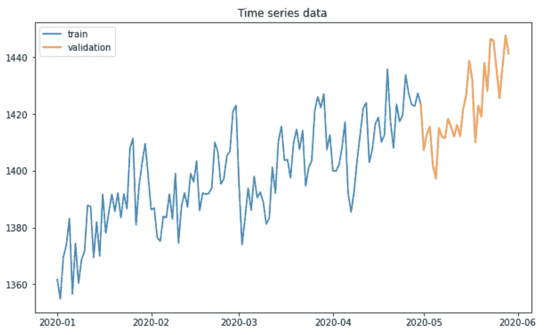
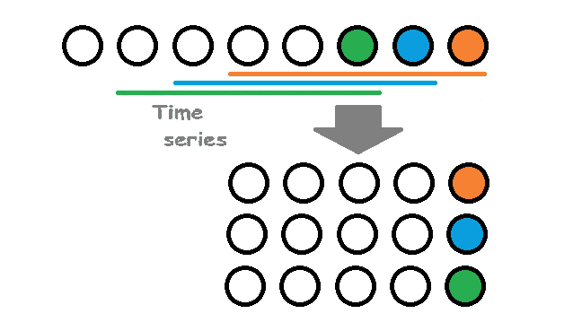
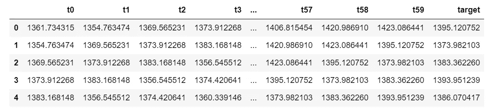
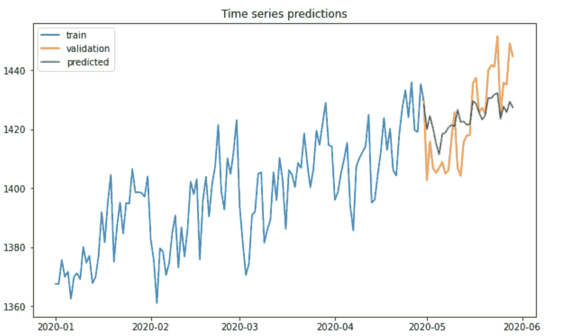

# 用基于树的模型处理时间序列

> 原文：<https://towardsdatascience.com/approaching-time-series-with-a-tree-based-model-87c6d1fb6603?source=collection_archive---------11----------------------->

## 预测未来—通用数据转换和特征工程基础

在这篇文章中，我将展示如何用机器学习模型处理时间序列预测问题的一般方法。我在这里使用基于树的模型 LightGBM 作为例子，但实际上它可以是几乎任何经典的机器学习模型，包括线性回归或其他一些模型。我将介绍所需的数据转换、基本的特性工程和建模本身。


在 [Unsplash](https://unsplash.com?utm_source=medium&utm_medium=referral) 上由 [Aron 视觉](https://unsplash.com/@aronvisuals?utm_source=medium&utm_medium=referral)拍摄的照片

## 时间序列问题介绍

时间序列基本上是已知时间点的值的列表。一些例子:商店的每日购买量、网站访问者的每日数量、每小时的温度测量等。数据点之间的间隔通常是固定的，但这不是强制性要求。而我们要解决的一个时间序列的问题，就是预测未来各点的值。

有许多专门的方法来解决这个问题。指数平滑，特殊模型如 ARIMA，先知，当然还有神经网络(RNN，LSTM)，等等。但是在本文中，我将重点介绍使用通用的基于树的模型进行时间序列预测。

现成的树模型不支持对原始数据进行时间序列预测。因此，必须首先以特殊方式对数据进行预处理，并生成相应的特征。

典型的原始时间序列数据如下所示。



每个时间序列步长都有一个值。在这个特定的例子中，这个步骤是一天，但是它可以是一个小时、一个月或者任何其他时间间隔。我们有一些过去的已知训练数据(上图中的蓝色)。我们有未知的未来数据要预测(例子中的黄色)。

## 数据转换

对于基于树的模型，我们需要许多带有目标值的训练样本，但这里只有一条带有时间序列数据的长线。为了使其可用，让我们对其进行转换，遍历所有值，将每个值作为一个样本的目标，将之前的数据点作为训练数据，如下图所示。



数据转换可视化(由作者创建)

不要将未来的数据点作为训练数据，这一点非常重要，否则将会出现数据泄漏，模型在未来数据上的表现将会很差。参考示例 Python 代码:

```
SIZE = 60 #we take 2 past months here for each time-series point
COLUMNS = ['t{}'.format(x) for x in range(SIZE)] + ['target']df_train = []
for i in range(SIZE, df.shape[0]):
    df_train.append(df.loc[i-SIZE:i, 'value'].tolist())
df_train = pd.DataFrame(df_train, columns=COLUMNS)
```

这样，我们将长度为 *N* 的时间序列数据线转换成一个具有( *N-M)* 行和 *M* 列的数据帧(表)。其中 *M* 是我们为每个训练样本选择的过去数据点的长度(在上面的例子中，60 个点= 2 个月)。数据表现在看起来如下:



基本上，现在它已经是一种格式，任何经典模型都可以将其作为输入，并为目标变量(时间序列的下一个数据点)生成预测。然而，在像这样的原始数据上，基于树的模型将不能获得好的结果。有必要做出特殊的特征，允许树模型捕捉时间序列的不同组成部分，如趋势和季节性。

## 时间序列组件

为了更好地理解我们需要什么特性，让我们记住时间序列数据的主要组成部分:

*   基准水平:这是时间序列数据的平均值
*   趋势:这是基准面随时间的变化
*   季节性:这些是在一段时间内(周、月、年)重复的周期性变化
*   剩余部分:这是其他 3 个组件没有涵盖的所有内容。其余部分可能由可预测部分(当变化由一些外部不规则事件触发时，我们可以在我们的模型中观察和使用)和不可预测部分(基本上只是噪音或由我们无法访问的事件触发的变化)组成。

让我们进一步尝试捕获可用于我们基于树的模型的特征中的前三个时间序列成分。

## 特征工程

我们将以基于窗口的方法创建特征，一次查看 N 个连续的数据点。第一个最简单的情况是窗口大小为 1。这仅仅意味着我们取每个样本的最后一个值或可用的训练数据，它是正好在目标值之前的数据点。仅仅用一个值我们做不了什么，所以让我们按原样把它作为一个特性添加进来。这是一个很好的特性，因为这是最近已知的数据点。缺点是这个功能会很吵。

```
df_feats['prev_1'] = df_train.iloc[:,-2] #Here -2 as -1 is a target
```

接下来，我们取窗口大小 2，在目标之前有 2 个最近的数据点。然后窗口大小为 3，以此类推。示例代码片段:

```
for win in [2, 3, 5, 7, 10, 14, 21, 28, 56]:
    tmp = df_train.iloc[:,-1-win:-1] #General statistics for base level
    df_feats['mean_prev_{}'.format(win)] = tmp.mean(axis=1)
    df_feats['median_prev_{}'.format(win)] = tmp.median(axis=1)
    df_feats['min_prev_{}'.format(win)] = tmp.min(axis=1)
    df_feats['max_prev_{}'.format(win)] = tmp.max(axis=1)
    df_feats['std_prev_{}'.format(win)] = tmp.std(axis=1) #Capturing trend
    df_feats['mean_ewm_prev_{}'.format(win)] = 
            tmp.T.ewm(com=9.5).mean().T.mean(axis=1)
    df_feats['last_ewm_prev_{}'.format(win)] =
            tmp.T.ewm(com=9.5).mean().T.iloc[:,-1]

    df_feats['avg_diff_{}'.format(win)] =
            (tmp - tmp.shift(1, axis=1)).mean(axis=1)
    df_feats['avg_div_{}'.format(win)] =
            (tmp / tmp.shift(1, axis=1)).mean(axis=1)
```

让我们看一下代码。第一行定义使用的窗口大小。接下来，对于每个窗口大小，我们用当前窗口中选定的数据点创建临时变量`tmp`。该变量稍后用于创建所有特征。

*基层综合统计*

*前 5 个特征是一般统计数据-平均值、中值、最小值、最大值和标准差。这种特征将有助于确定不同窗口大小的时间序列的基准水平。根据时间序列的特征，一些窗口大小可能更重要。例如:*

*   *对于有噪声的数据，间隔越大越好，因为它们不会受到噪声太大的影响；*
*   *对于具有尖锐趋势的数据，较小的间隔可能更好，因为它们将更好地捕捉最新趋势。*

*使用什么样的窗口大小并不总是显而易见的，所以包含几个窗口大小并让模型自己选择是明智的。*

****捕捉趋势****

*接下来的两行定义了*指数加权平均(EWM)* 特征。加权平均值不同于简单平均值，它对最近的数据点赋予更大的权重，以便更好地捕捉趋势。*

*最后两个特征也有助于捕捉趋势，它们计算两个后续数据点的平均差异。这允许评估数据变化的速度和方向。*

*与之前的要素组一样，窗口大小对于趋势要素也很重要。小窗口将能够捕捉快速变化的短期趋势。然而，存在捕获噪声的风险。*

*还有许多其他特征有助于预测趋势。一些想法值得一提:*

*   *计算数据点之间差异的加权平均值(对更近的数据点的趋势给予更大的影响)；*
*   *获取点之间差异的最小值、最大值、标准值和其他统计数据。*
*   *计算每两个后续数据点的斜率，并对其进行平均或其他统计；*
*   *更多。*

****季节性特征****

*到目前为止，我们只为时间序列的前两个部分——基值和趋势——生成特征。季节性呢？这个组件也有一些特殊的功能。请考虑下面的代码示例:*

```
*for win in [2, 3, 4, 8]:
    tmp = df_train.iloc[:,-1-win*7:-1:7] #7 for week #Features for weekly seasonality
    df_feats[‘week_mean_prev_{}’.format(win)] = tmp.mean(axis=1)
    df_feats[‘week_median_prev_{}’.format(win)] = tmp.median(axis=1)
    df_feats[‘week_min_prev_{}’.format(win)] = tmp.min(axis=1)
    df_feats[‘week_max_prev_{}’.format(win)] = tmp.max(axis=1)
    df_feats[‘week_std_prev_{}’.format(win)] = tmp.std(axis=1)*
```

*请注意，本例中的`tmp`变量只取第 7 个值，因此它只包含与目标变量相同工作日的数据。通过这种方式，我们计算特定于给定工作日的统计特征。如果给定的时间序列有很强的周季节性成分，这种特征将非常重要。*

## *建模*

*我们现在已经准备了基本特征，准备用于基于树的机器学习模型。下面以 LightGBM 模型为例，提供建模代码供参考:*

```
*import lightgbm as lgb
params = {
    'objective': 'regression',
    'metric': 'mae',
    'boosting': 'gbdt',
    'learning_rate': 0.06,
    'num_leaves': 64,
    'bagging_fraction': 0.9,
    'feature_fraction': 0.9
}
x_train = lgb.Dataset(df_feats, df_train['target'])
model = lgb.train(params, x_train, num_boost_round=500)
preds = model.predict(df_feats_validation)*
```

*首先，我们导入 LightGBM 模型并准备它的几个最重要的参数。然后，根据先前从`df_feats`变量准备的特征训练模型。类似地，在`df_feats_validation`变量中准备了验证期的特征，用于在`preds`变量中获得预测。我们现在可以绘制获得的预测，看看它是否有效。*

**

*预测远非完美，因为我们只使用了非常基本的特征，但我们仍然可以注意到预测遵循真实数据的趋势。随着更多相似特征和模型参数的调整，结果可以进一步改善。*

## *总结和结论*

*在本文中，我展示了如何转换时间序列数据的一般方法，并给出了为主要时间序列组件计算的示例特性。基于树的模型不是在时间序列数据上实现最先进的准确性的首选，但是，它们具有许多其他良好的特性，如可解释性、简单性，这通常要求选择这些模型来进行实时时间序列预测。*

*感谢阅读，敬请关注更多关于数据科学和机器学习的文章。*