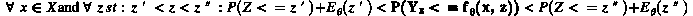
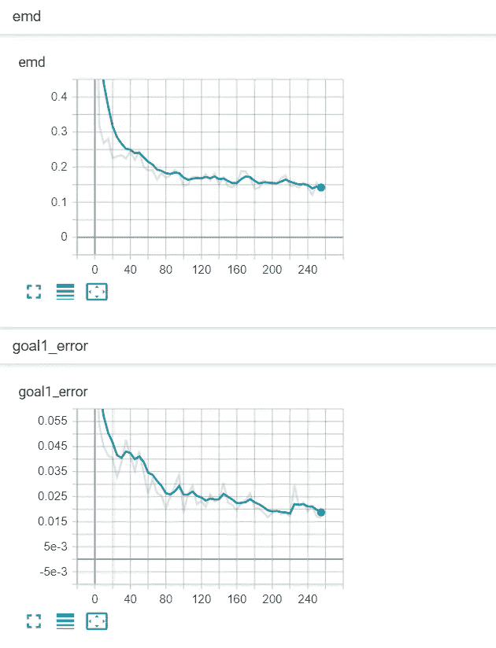

# 逼近随机函数

> 原文：<https://towardsdatascience.com/approximating-stochastic-functions-be7d6ccf4f6?source=collection_archive---------28----------------------->

## [实践教程](https://towardsdatascience.com/tagged/hands-on-tutorials)

## 训练概率机器学习模型的通用方法

你可以通过克隆 github.com/narroyo1/sffnn[来复制本文中的实验](https://github.com/narroyo1/sffnn)

# 介绍

神经网络是[通用函数逼近器](https://en.wikipedia.org/wiki/Universal_approximation_theorem)。这意味着有足够多的隐藏神经元，神经网络可以用来逼近任何连续函数。然而，真实世界的数据通常具有噪声，这在某些情况下使得产生单个确定性值预测是不够的。以**图 1a** 中的数据集为例，它显示了一年内 JFK 国际机场航班的出发延误和到达延误之间的关系(2015 年[航班延误和取消](https://www.kaggle.com/usdot/flight-delays)的子集)。

**图 1a** 从 JFK 出发到抵达的延误— *作者图片*

**图 1a** 还示出了完全训练的神经网络的预测，该神经网络在近似平均值方面做得很好，并且提供了关于数据集趋势的信息。然而，它无助于回答诸如*给定出发延迟，X%的航班的最大预期到达时间是多少？*或*给定一个出发延误，到达延误比 Y 长的概率是多少？*或者更有趣的是，编写一个模型，对给定出发延误的到达延误值进行采样，其分布与真实情况相同。

有一些方法可以解决这个问题，例如，假设图 1a 中的**模型估计了平均值，就可以计算出整个数据集的标准偏差，利用这些参数就可以得出预期的正态分布。如果方差不恒定，也就是说，如果方差在整个输入空间内发生变化，您可以使用[带最大似然估计的逻辑回归](https://machinelearningmastery.com/logistic-regression-with-maximum-likelihood-estimation/)，它简单地训练一个模型来预测给定输入的特定分布函数的参数(例如，正态或高斯分布的平均值和标准偏差)。问题是它依赖于数据集分布的先验知识，这在某些情况下可能很困难，或者太不规则而无法匹配已知的分布。**

在出发至到达延迟数据集的情况下，我们可以从图中观察到分布似乎类似于正态分布，因此建立最大似然估计模型来计算正态分布的参数是有意义的。**图 1b** 示出了完全训练的模型的图，示出了平均值、平均值加/减标准偏差以及平均值加/减两倍标准偏差。该模型的误差为 2.48%，相当不错。然而，数据集的分布并不是完全正态的，你可以看到除了其他不完善之处，上尾比下尾略长，这就是精度并不更好的原因。

**图 1b** 从 JFK 出发到抵达的延误和概率模型— *作者图片*

本文介绍了一种训练概率机器学习模型的通用方法，该模型将产生适应真实数据的任何分布，甚至分支分布或在输入空间中改变形式的分布。

# 该方法

假设产生数据的函数在输入 ***x ∈ X*** 处具有特定的分布 ***Y*** 我们可以将目标函数，或者我们实际上想要近似的函数定义为***y∾yₓ***。我们想要创建一个算法，能够从任意给定的 ***x ∈ X*** 的 ***Yₓ*** 中采样任意数量的数据点。

为此，我们引入一个二次输入 ***z*** ，它可以通过算法从一个均匀分布的空间 ***Z*** 中采样，并馈送给一个确定性函数 ***f*** ，使得 ***P(Z ≤ z) = P(Yₓ ≤f(x，z)***。

或者换句话说，我们想要一个确定性函数，对于任何给定的输入 ***x*** ，将一个随机(但均匀)变量*映射到一个因变量***【yₓ】***。*

# *模型*

*所提出的近似***【yₓ】***的模型是一个普通的前馈神经网络，除了一个输入 ***x*** 之外，还接受一个输入*z*。***

******

****作者图片****

# ***概观***

***在每一点 ***x ∈ X*** 我们希望我们的模型 ***f(x，z∾z)***以任意精度逼近 ***Yₓ*** 分布。让我们把 ***f(x，z∾z)***和 ***Yₓ*** 想象成二维的(在 ***X*** 和 ***Z*** 都是一维的情况下)织物，它们可以在不同的区域以不同的尺度拉伸和收缩，分别降低或增加它们的密度。我们想要一种机制，它以与***【yₓ】***中的收缩和伸展相匹配的方式来伸展和收缩 ***f(x，z∞z)***。***

****

****图 2** 配合 ***x*** 添加均匀噪声的训练动画。— *作者图片***

**在**图 2** 中，我们可以看到经过训练的模型输出如何在每个时期一点一点地拉伸和收缩，直到它与目标函数匹配。**

**继续进行织物的拉伸和收缩模拟，我们希望将“针”放入覆盖织物(我们的模型)中，以便我们可以将它叠加在我们试图匹配的底层织物(目标数据集)上。我们将把这些大头针放入覆盖织物中的固定点，但在训练模型时，我们会将它们移动到底层织物的不同位置。首先，我们将它们固定在底层织物上的随机位置。当我们观察下层织物上的销相对于上层织物的位置时，我们将略微向上或向下移动销，以改善上层织物与下层织物的匹配。每一个针都会影响它在织物中的周围，与针的距离成比例。**

**我们将首先在覆盖织物的任意给定经度的固定位置和织物高度的中点纬度放置 1 个大头针。然后，我们将在同一经度的基础结构中进行多次观察，也就是说，我们将在穿过所选引脚位置的垂直线处随机选取几个位置。**

**对于每个观察点，如果观察点低于其当前位置，我们会将底层结构上的固定位置(在覆盖结构上保持相同的固定位置)向下移动一小段预定义的距离，如果观察点高于当前位置，我们会将其向上移动。这意味着，如果在底层织物中针的位置上方有更多的观察点，总运动将向上，反之亦然，如果在其下方有更多的观察点。如果我们重复这一过程足够多次，针在底层织物中的位置将停留在将观察点减半的位置，也就是说，在其上的观察点的数量与在其下的观察点的数量相同。**

> ****为什么我们要将大头针向上或向下移动预定义的距离，而不是与观察点成比例的距离？** 原因是我们对匹配观察点不感兴趣。由于目标数据集是随机的，匹配随机观察值是没有意义的。我们从观察点得到的有趣信息是针是否将它们除以二(或另一个特定的比率)**

****

****图 3** 向观察点移动 1 个针，直到它停止。— *作者图片***

****图 3** 显示了针如何到达一个稳定的位置，将所有数据点分成两半，因为对于上面的数据点和下面的数据点，每次观察的移动量是相等的。如果上面观察的预定移动距离不同于下面观察的预定移动距离，则针将停留在以不同比率(不同于一半)划分数据点的位置。例如，让我们尝试使用 2 个销而不是 1 个销，第一个销将为上面的观察移动 1 个距离，为下面的观察移动 0.5 个距离，第二个销将做相反的事情。经过足够的迭代后，第一个引脚应该停留在将数据点除以上面的*和下面的 ***2/3*** 的位置，而第二个引脚将除以上面的 ***2/3*** 和下面的 ***1/3*** 。这意味着我们将使*的 1/3 位于第一个销上方， ***的 1/3*** 位于两个销之间，而 ***的 1/3*** 位于第二个销下方，如图 4 中的**所示。******

****

****图 4** 向观察点移动 2 个销，直到它们停止。— *作者图片***

**如果针将观察到的数据点分成大小为*和 ***b*** 的两组，并且在训练之后，其固定位置位于从顶部开始的***【a/(a+b)***纬度中的底层织物中，我们在两个织物之间具有单点映射，即在该经度处，针上方和下方的密度在两片织物中相等。我们可以推断出这个概念，并使用尽可能多的引脚，以便在两片织物之间创建更精细的映射。***

# **定义**

**我们首先在尺寸为*的 ***Z*** 中选择一组固定的点，我们称之为 ***z 样本*** 。我们可以将这个集合定义为:***

****

**预测模型将被定义为:**

****

**这里的 ***x*** 将是来自输入域的任意输入元组， ***z*** 将是来自均匀随机变量 ***Z*** 和 ***θ*** 是模型的内部状态，或者说是权重矩阵。**

**然后我们将任意输入 ***x*** 对于特定的 ***z ∈ Z*** 的预测误差定义为:**

****

**即真实数据累积概率分布和预测累积概率分布之间的差异。**

**现在，我们可以将我们的培训目标定义为:**

**目标 1**

****

**换句话说，我们希望对于*中的每一个***z’***以及整个 ***X*** 输入空间的绝对误差***| e(z’)|***最小化。这个第一个目标给了我们一个在 ***z 样本*** 集合和 ***Yₓ*** 之间的近似离散有限映射。即使没有说任何关于****z***中所有不在***【zₛₐₘₚₗₑₛ***中的点。****

**目标 2**

****

**这个第二个目标给了我们，对于任意给定的 ***x*** 在 ***X*** ， ***f*** 在 ***Z*** 中是单调递增函数。**

**这两个目标都将在训练算法的测试步骤中根据经验进行测试。**

# **模型精度**

**对于任意点***Z∾Z***，并且***Z’***和***Z”***分别是立即变小和变大的 ***z 样本*** ，并且假设[目标 2](https://narroyo1.github.io/sffnn/#goal-2) 被满足，则我们有:**

****

**取代我们的预测误差:**

****

**如果我们从每一项中减去 ***P(Z ≤ z)*** :**

****

**这意味着对于任意一点***Z∾Z***预测误差 error ***E(z)*** 下界为***P(Z≤Z’)—P(Z≤Z)+E(Z’)***，上界为***P(Z≤Z’)—P(Z≤Z)+E(Z’)***。**

**假设[目标 1](https://narroyo1.github.io/sffnn/#goal-1) 被满足，我们知道***【Z’)***和***【E(Z’)***是小数字，这使得***P(Z≤Z’)—P(Z≤Z)***和***P(Z≤Z’)—P(Z≤Z)***成为主导因素。任何 ***z*** 与其相邻 **z 样本**之间的距离可以通过增加 ***z 样本*** 或 ***S*** 的数量来最小化。换句话说， ***f*** 的最大误差可以通过足够大的 ***S*** 任意最小化。**

# **计算运动标量**

**定义了我们的目标以及他们会给我们买什么之后，我们开始展示我们将如何实现目标 1。为简单起见，我们将使用一个均匀分布在*中的***Z-样本集，即: ***{z[0]，z[1]，…，z[S-1]} ∈ Z s.t. z[0] < z[1]，…，< z[S] ∧ P(z[0] < Z <*********

*对于**中任意给定的 ***x*** 和*中任意给定的***z’***我们要 ***f*** 满足 ***P(Yₓ ≤ f(x，z’)= p(z≤z’***。为此，我们假设我们在*或***yₜᵣₐᵢₙ∾yₓ***用一组足够有代表性的样本进行计数。*****

****对于给定的 ***x ∈ X*** 并且具有*作为 ***Z*** (即***Z’∈Z s . t . Pr(Z’≤Z)= 0.5***，我们可以简单地训练 ***f*** 来改变*的值 z))*一个恒定的移动数 ***M*** 大于每个训练示例 ***y ∈ yₜᵣₐᵢₙ*** 它大于 ***f(x，z’)***本身并且相同的恒定数小于每个较小的训练示例(记住 2 块织物和销的类比)。 这将导致在足够的迭代之后，当总移动等于 0 时， ***f(x，z’)***的值停留在将所有训练样本分成两半的位置。*****

****如果不是 ***Z*** 的中点***P(Z≤Z’)≠0.5***那么更大和更小样本的移动常数必须不同。****

****假设 ***a*** 是*与 ***Z*** 或 *Zₘᵢₙ* 和 ***b*** 之间的距离*与**之间的距离********

**********

*****由于 ***a*** 表示我们希望找到的训练样本的数量小于*和 ***b*** 训练样本的数量大于***【z’***我们需要 2 个标量 ***α*** 和******

************

******这些运动标量将作为乘数，分别与小于和大于***【z’***的每个观察点上的恒定运动 ***M*** 一起使用。这个第一个等式保证了当***z’***位于 ***Zₘᵢₙ + a*** 或 ***Zₘₐₓ — b*** 时的总运动将为 0。******

************

******第二个等式对标量进行归一化，使得*中所有 ***z*** 的总运动具有相同的总运动。*******

******这给了我们:******

************

******然而，这个逻辑在边缘处中断，即当一个 *z 样本*等于 ***Zₘᵢₙ*** 或 ***Zₘₐₓ*** 时。在这些值处，a*或 ***b*** 为 0，如果其中一个为 0，则 ***α*** 或 ***β*** 中的一个未定义。*******

******当 ***a*** 或 ***b*** 接近 0 ***α*** 或 ***β*** 趋向于无穷大时，人们可能会试图用一个大的数字来代替它，但这并不实际，因为大的距离乘数将支配训练并最小化其他 ***zₛₐₘₚₗₑₛ*********

******同样随着 ***α*** 或 ***β*** 中的一个趋于无穷大，另一个变成了一个同样不切实际但原因不同的小数字。边缘处的 ***zₛₐₘₚₗₑₛ*** 应该映射到*yₓ的边缘，任何向相反方向的移动量都将导致*或***【zₘₐₓ***分别映射到*中更大或更小的点。因此，边缘处的***【zₛₐₘₚₗₑₛ】***【即***【z[0]***和 ***z[S]*** 】的 ***α*** 和 ***β*** 将被指定为向内推的值 0 和预定义的值*********

# ******训练模型******

******为了训练神经网络，z 样本*，集合大小 ***S*** 根据期望的精度和可用的计算来选择。决定之后，必须定义 ***Z*** 。也就是说，必须选择维数及其范围。给定 ***Z*** 和训练级别，我们可以创建 ***z 样本*** 集合。*******

******例如，如果 ***Z*** 是一维的，范围定义为***【10.0，20.0】******s = 9***，则 *z 样本*集合为 ***{z₀ (10.0)、z₁ (11.25)、z₂ (12.5)、z₃ (13.75)、z₄(13.75)*********

******首先我们从大小为 ***n*** 的训练数据中选择一批数据，对于该批中的每个数据点，我们在每个 *z 样本*上评估当前模型。这给了我们预测矩阵:******

************

******对于批量中的每一个数据点***【xᵢ，yᵢ】***，我们取输出值***【yᵢ***，并与预测矩阵中其对应行的每一个值(即***【f(xᵢ，z₀】，【f(xᵢ，z₁】，…，f(xᵢ，z≠)***)进行比较。在确定 ***yᵢ*** 大于还是小于每个预测值之后，我们为矩阵中的每个元素产生 2 个值:******

# ******运动标量******

******如果****【z-sample】*****比预测的**【z-sample】**【yᵢ】小，如果 比预测的【z-sample】大。*******

************

# ******目标值******

******如果*比预测值小，则目标值为预测值本身加上预选的移动常数 ***M*** 乘以-1，如果 ***比预测值大，则为 1。您可以将目标值视为“我们希望预测的位置”值。**********

************

******在计算了这两个值之后，我们就可以准备组装在反向传播过程中使用的矩阵了。******

************

******我们将预测矩阵结果添加到这个矩阵中，并传递给加权均方误差损失函数(WMSE)。损失函数看起来像这样:******

************

# ******测试模型******

******均方误差(MSE)损失函数使用反向传播和目标值来训练模型，但是测试模型需要不同的方法。由于 ***f(x，Z)*** 和 ***Yₓ*** 都是随机变量，测量它们样本之间的差异是没有意义的。因此，模型的成功将通过两种方式来衡量:******

# ******推土机距离(EMD)******

> *******在统计学中，* ***推土机的距离****(****EMD****)是一个区域内两个概率分布之间距离的度量**。在数学中，这被称为瓦瑟斯坦度规。非正式地，如果分布被解释为在区域* D *上堆积一定数量的灰尘的两种不同方式，EMD 是将一堆灰尘变成另一堆灰尘的最小成本；其中成本假定为移动的灰尘量乘以移动的距离。*[*wikipedia.org*](https://en.wikipedia.org/wiki/Earth_mover%27s_distance)******

******使用 [EMD](https://en.wikipedia.org/wiki/Earth_mover%27s_distance) 我们可以获得 ***Yₓ*** 和 ***f(x，Z)*** 有多相似的指标。可以通过比较测试数据和预测数据集中的每个 ***x，y*** 数据点，并找到将一个数据点转换成另一个数据点所需的最小总移动量来计算。EMD 数字告诉我们的是将预测数据集中的每一点转换为测试数据集中的平均距离。******

******在下面的例子中，你可以看到，在一个厚度约为 100 的数据集上，平均 EMD 约为 3.9。由于数据集的随机性质，EMD 不能用作字面上的错误指标，但它可以用作进度指标，即告知模型是否随着训练而改进。******

************

********图 5** EMD 测试。— *作者图片*******

# ******测试培训目标******

******培训目标 1******

******理想情况下，为了测试[目标 1](https://narroyo1.github.io/sffnn/#goal-1) (即***∀x∈x∧∀z’∈zₛₐₘₚₗₑₛ: arg min | e(z’)|***)我们将对给定的 ***x*** 和每个 ***z 样本*** 评估 ***f*** ，然后将其与具有相同**的任意数量的测试数据点进行比较然后，我们将继续为每个 ***z 样本*** 计算比它小的测试数据点的数量。利用比计数(即 ***P(Yₓ ≤ f(x，z’)***)小的矢量*，我们可以将它与每个***【z 样本】*** (即***p(z≤z’)***)的规范计数进行比较，并测量误差。然而，在现实生活中，这是不可能的。现实生活中的数据集不太可能有任意数量的数据点具有相同的 ***x*** (它们甚至不太可能有两个数据点具有相同的 ***x*** )，这意味着我们需要使用接近于 ***x*** (值 ***X*** 的 ***x*** )来测试目标*********

***我们首先创建一个排序(一个索引数组) ***O = {o₀，o₁，…，o[m]}*** ，对***【xₜₑₛₜ***【测试数据集中的 ***x*** 输入中的所有元素进行排序。然后我们选择数组 ***O' = {oᵢ，oᵢ₊₁，…，oⱼ}*** 的一个子串。***

***现在我们可以对每个***x【o’】∣o’∈o’***在每个 ***z-sample*** 上求值 ***f*** ，这就给出了矩阵:***

******

***然后，我们将每一行与输出***y[o '】∣o '∈o '***进行比较***

******

***并创建比计数小的*(即 ***P(Yₓ ≤ f(x，z))*** )，然后我们可以将它与每个 ***z 样本*** (即 ***P(Z ≤ z)*** )的规范计数进行比较，以测量所选子串中的误差。****

***我们将创建许多这样的子串，并将每个错误称为位于子串中心元素的本地邻近错误。***

***在下面的示例中，您可以看到目标 1 的平均误差约为 1.6%，这可以用作模型的误差指标。***

******

*****图 6** 训练目标 1 测试。— *作者图片****

***培训目标 2***

***为了测试[目标 2](https://narroyo1.github.io/sffnn/#goal-2) ***∀ x ∈ X ∧ ∀ z₀，z₁ ∈ Z s.t. z₀ < z₁: f(x，z₀) < f(x，z₁)*** 我们在*中选择一些随机点，并在*中选择一组随机点，我们在我们的模型中运行它们并得到结果矩阵:*****

**********

*****从这里开始，检查每一行是否单调递增是很容易的。为了提高检查的质量，我们可以增加在 ***X*** 中设置的测试点和在 ***Z*** 中设置的测试点的大小。*****

# ****回到延迟****

****现在我们可以回到出发延误到到达延误数据集，下面你可以看到 MLE 方法(**图 7a** )和本文介绍的方法(**图 7b** )并列。正如我们之前看到的，最大似然估计方法未能捕捉到小的缺陷，获得 2.48%的目标 1 误差，而一般方法做得好得多，目标 1 误差为 0.018%。****

********

******图 7a** 概率模型 MLE 方法。**图 7b** 通用方法。— *作者图片*****

# ****实验****

****以下是在不同数据集上进行的各种实验。****

# ****x 加高斯噪声****

****让我们从一个简单的例子开始。添加了高斯噪声的函数 ***x*** 。在左侧面板中，您可以看到训练在 180 个时期内不断发展。在此面板的左上角，您可以看到目标 1 的误差局限在 ***X*** 上，在训练结束时，您可以看到最高局部误差约为 2%，全局误差约为 0.5%。在同一面板的右上角，您可以看到本地推土机的距离(EMD)。在左下角，您可以看到原始测试数据集(蓝色)和 ***z-samples*** (橙色)的图，您可以看到它们是如何逐渐符合测试数据的。在右下方，您可以看到原始测试数据集(蓝色)和随机预测(带有***Z∾Z***)的图表，您可以看到预测结果逐渐代表了测试数据。****

****在右侧面板中，您可以看到全局目标 1 误差(上图)和全局 EMD 值(下图)在培训过程中的变化图。****

****************

******图 8** 训练模型匹配 ***x*** 加高斯。— *作者图片*****

# ****一个 x + bx + cx + d 加截断高斯噪声****

****这个有点复杂。添加了截断高斯噪声的 3 阶多项式(即在特定点截断的正态分布)。****

****************

******图 9** 训练模型匹配 ***x + bx + cx + d*** 加截断高斯。— *作者图片*****

# ****双 sin(x)加高斯噪声乘以 sin(x)****

****这个更有趣。2 镜像 ***sin(x)*** 函数带有由 ***sin(x)*** 本身缩放的高斯噪声。****

********

****请注意，该模型如何成功地表示了密度较低的中间区域。****

****************

******图 10** 训练模型匹配双*加高斯倍***【sin(x)***。— *作者图片******

# *****分支函数加高斯噪声*****

*****这个实验用分支路径。它从围绕 ***0*** 的简单高斯噪声开始，然后开始在各个段的过程中以相等的概率分割它。*****

**********

*****尽管分布不是连续的，但该模型在逼近分布方面做得相当不错。*****

********************

*******图 11** 匹配分支函数加高斯的训练模型。— *作者图片******

# *****(x₀) + (x₁)加绝对高斯噪声*****

*****下一个例子有二维输入。 ***X₀*** (第一维)是***x******x₁***(第二维)是 ***x*** 加了绝对高斯噪声。显示略有不同，为了节省空间，省略了 ***z-samples*** 图。如您所见，每个维度都有一个面板，另外还有一个面板用于显示目标 1 错误和 EMD 错误历史。*****

******************************

*******图 12** 训练模型匹配***(x₀)+***加绝对高斯。— *作者图片******

# *****加州住房数据集*****

*****该实验使用真实数据代替生成数据，证明了该模型对真实数据的有效性。这是经典的[加州住房数据集](http://lib.stat.cmu.edu/datasets/houses.zip)。它有来自 1990 年加州人口普查的信息，有 8 个输入维度(收入中值、房龄等)。下面你可以看到每个维度的图。*****

******************************************************************************************

*******图 13** 匹配加州住房数据集的训练模型。— *作者图片******

# *****结论*****

*****提出的方法允许以任意精度近似随机数据集的分布。该模型简单，训练速度快，可以用普通的前馈神经网络实现。它能够近似输入空间中的任何分布，这使它成为任何需要预测的任务的重要工具。*****