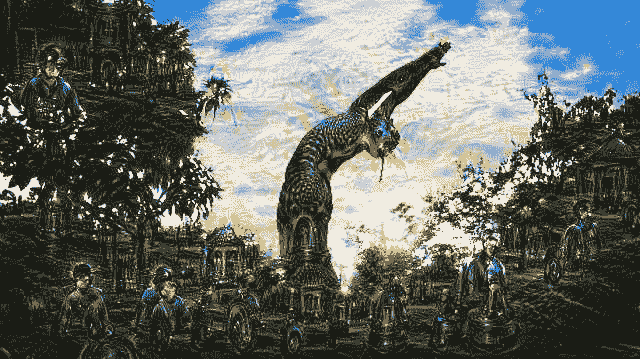

# 四月版:艺术、创造力和数据科学

> 原文：<https://towardsdatascience.com/april-edition-art-creativity-and-data-science-5ca9849f5da3?source=collection_archive---------27----------------------->

照片由来自[佩克斯](https://www.pexels.com/photo/blue-tree-painting-2397989/?utm_content=attributionCopyText&utm_medium=referral&utm_source=pexels)的[安德烈·布伦南](https://www.pexels.com/@andree-brennan-974943?utm_content=attributionCopyText&utm_medium=referral&utm_source=pexels)拍摄

人们对数据科学如此感兴趣的一个主要原因是它的各种应用。人工智能(AI)驱动的解决方案每天都在使用的一些领域的例子包括医学、金融和技术行业。不过，研究人员目前正在努力创造能够在更多领域运作的人工智能服务。

为了创作艺术品，可以使用人工智能吗？

当然可以！

由于多年的研究，谷歌和英伟达等公司成功创建了不同的深度学习模型架构，能够满足这一目的。一些例子包括谷歌 DeepDream(用于从真实图像中创建梦幻般的迷幻图像)和英伟达 GauGAN(能够将涂鸦变成现实图像)。

图 1: [谷歌 DeepDream 示例](https://commons.wikimedia.org/wiki/File:Google_Deep_Dream_Image_(19926204302).jpg)

如果你有兴趣了解更多关于如何使用数据科学创作艺术作品的信息，本月的时事通讯提供了一些关于数据科学的最佳文章。

Pier Paolo Ippolito —编辑助理

## [艺术育种家。给我画一只电动羊。](/artbreeder-draw-me-an-electric-sheep-841babe80b67)

由[弗拉德·亚历克斯](https://medium.com/u/5244b970029b?source=post_page-----5ca9849f5da3--------------------------------) — 10 分钟阅读

如何以用户友好的方式应用生成式对抗网络？

## [超级创造力](/supercreativity-b4114ebd0357)

通过 [Serafim Batzoglou](https://medium.com/u/ccf342949c4?source=post_page-----5ca9849f5da3--------------------------------) — 12 分钟读取

人工智能可能很快就会超越人类的艺术创造力

## [CycleGANs 创造电脑生成艺术](/cyclegans-to-create-computer-generated-art-161082601709)

扎克·蒙赫博士——9 分钟阅读

对 CycleGANs 的解释和计算机生成艺术的演示

## [下一级艺术以及工作和休闲的未来](/next-level-art-and-the-future-of-work-and-leisure-f66049112e44)

由 [Max Frenzel](https://medium.com/u/1ac593c7124f?source=post_page-----5ca9849f5da3--------------------------------) — 30 分钟阅读

用人工智能变得更有创造力(和人性)

## [我训练一个人工智能来模仿我自己的艺术风格。事情是这样的。](/i-trained-an-ai-to-imitate-my-own-art-style-this-is-what-happened-461785b9a15b)

由迈克尔·卡默勒 — 6 分钟读完

今天人工智能无处不在，如果你认为我们不需要另一篇人工智能文章，你可能是对的。但是在你关闭这个标签之前，请听我说完。这个不一样。

## [机器学习时代的艺术鉴赏](/art-connoisseurship-in-the-age-of-machine-learning-d72e8a3716df)

由[凯瑟琳黄](https://medium.com/u/4cb7815da390?source=post_page-----5ca9849f5da3--------------------------------) — 5 分钟读完

如果我很难通过 Buzzfeed 关于赝品的测试，那么计算机如何能更好地识别赝品呢？

# **新视频**

*   克里斯托弗·威金斯— [数据科学@纽约时报](https://www.youtube.com/watch?v=ffwYAqqGaj8)
*   刘畅— [使用 TensorFlow Privacy 构建不同的私有机器学习模型](https://www.youtube.com/watch?v=S5j0kKgqbJc)
*   [凯尔·加拉丁](https://medium.com/u/51ff4b76ebf4?source=post_page-----5ca9849f5da3--------------------------------)——[英伟达给了我一台价值 15000 美元的数据科学工作站——以下是我用它做的事情](https://www.youtube.com/watch?v=WCz8AF-wT1I)

# **新播客**

*   [杰瑞米·霍华德](https://medium.com/u/34ab754f8c5e?source=post_page-----5ca9849f5da3--------------------------------) — [冠状病毒:疾病背后的数据](/coronavirus-the-data-behind-the-disease-68c912f1a5e0)
*   [克里斯·帕默](https://medium.com/u/1a52c7a1d28b?source=post_page-----5ca9849f5da3--------------------------------)——[Plotly 创始人，关于什么是数据科学，数据科学将走向何方](/plotly-founder-on-what-data-science-is-and-where-its-going-46c5d6ec6a7d)
*   [史云光·斯廷布鲁格](https://medium.com/u/c7394a61a2da?source=post_page-----5ca9849f5da3--------------------------------)——[作为创造性工具的机器学习，以及对人工通用智能的探索](/machine-learning-as-a-creative-tool-and-the-quest-for-artificial-general-intelligence-dfaf81ce7927)

我们也感谢最近加入我们的所有伟大的新作家[凯尔文·李](https://medium.com/u/d04c34f2d3b8?source=post_page-----5ca9849f5da3--------------------------------)、[路易斯·丽塔](https://medium.com/u/a1bb6b2089e7?source=post_page-----5ca9849f5da3--------------------------------)、[乔伊·罗斯](https://medium.com/u/a3adf9dfadfc?source=post_page-----5ca9849f5da3--------------------------------)、[哈德尔·哈马德](https://medium.com/u/f52761610b4a?source=post_page-----5ca9849f5da3--------------------------------)、[奥雷莉·吉罗](https://medium.com/u/1914f04e91f8?source=post_page-----5ca9849f5da3--------------------------------)、[伊戈尔·里布卡斯·塞尔帕](https://medium.com/u/857d8734c7da?source=post_page-----5ca9849f5da3--------------------------------)、[于峰](https://medium.com/u/9cda0369fb2?source=post_page-----5ca9849f5da3--------------------------------)、[迪帕克·迪利普库马尔](https://medium.com/u/3a6bca9167fd?source=post_page-----5ca9849f5da3--------------------------------)、[安吉拉·库南巴瓦](https://medium.com/u/5ffa1b2f4da5?source=post_page-----5ca9849f5da3--------------------------------)、  [丹尼尔·威奇维](https://medium.com/u/9ecdedb7ac9b?source=post_page-----5ca9849f5da3--------------------------------)、[尼古拉·佐丹奴](https://medium.com/u/adb15a4025fb?source=post_page-----5ca9849f5da3--------------------------------)、[兰斯·邓](https://medium.com/u/8c287bd4cc1f?source=post_page-----5ca9849f5da3--------------------------------)、[马修·R·芬奇](https://medium.com/u/f583b68d1c6c?source=post_page-----5ca9849f5da3--------------------------------)、[阿拉丁](https://medium.com/u/c0beebeaa03d?source=post_page-----5ca9849f5da3--------------------------------)、[尼古拉斯·贝尔塔尼奥利](https://medium.com/u/a998d10e34d8?source=post_page-----5ca9849f5da3--------------------------------)、[杰克叶](https://medium.com/u/8352075feb7f?source=post_page-----5ca9849f5da3--------------------------------)等等很多人。 我们邀请你看看他们的简介，看看他们的工作。