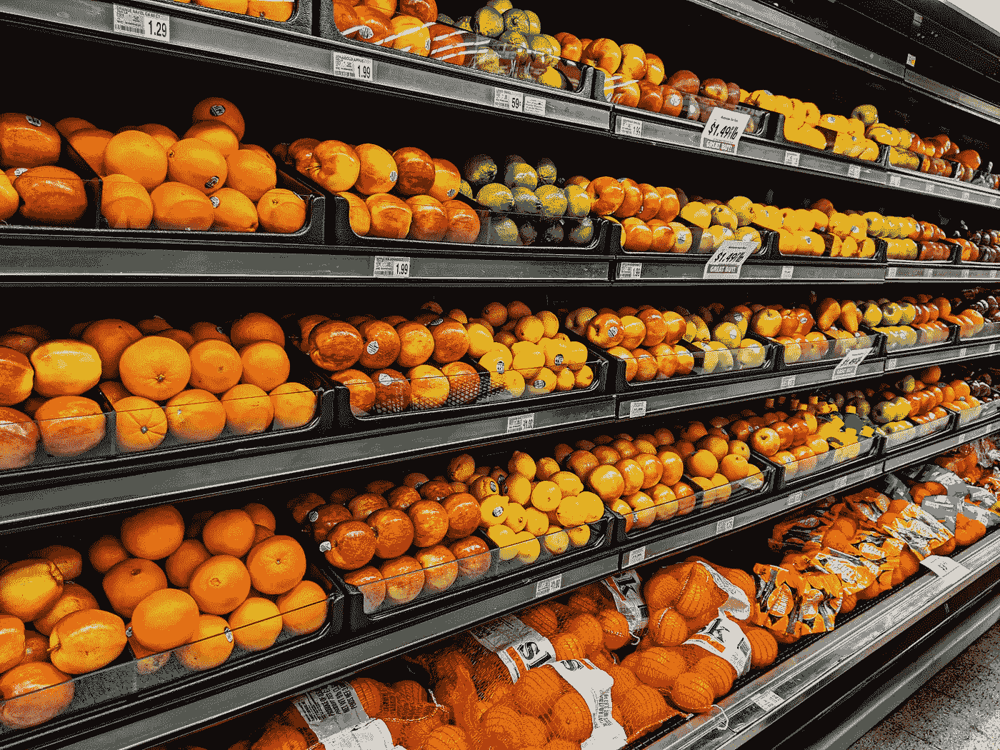
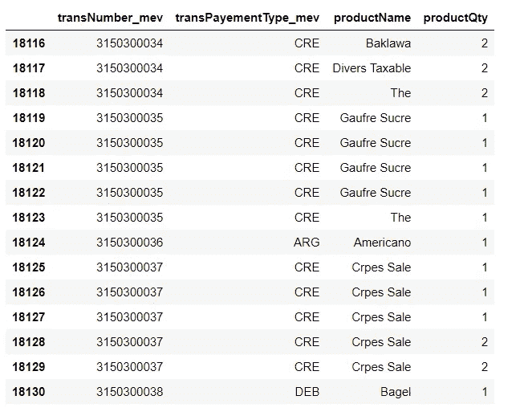
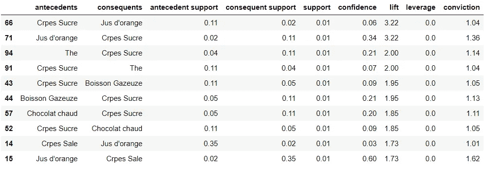

# Apriori 算法教程

> 原文：<https://towardsdatascience.com/apriori-algorithm-tutorial-2e5eb1d896ab?source=collection_archive---------21----------------------->

## 关系数据库上的数据挖掘和关联规则



来源:[https://unsplash.com/photos/stpjHJGqZyw](https://unsplash.com/photos/stpjHJGqZyw)

关联规则的主要目标是识别数据集中产品或变量之间的关系。这个想法是为了确定哪些产品经常在一起。例如，它被广泛应用于市场购物篮分析，分析师从一个包含所有交易的数据库开始，试图确定哪些产品以何种频率组合在一起，等等。

这些信息有助于优化商店中各种产品的位置，或者在某种产品打折时制定销售计划。

Apriori 算法是最流行的关联规则挖掘算法。它在数据库中查找最频繁的组合，并根据 3 个重要因素确定项目之间的关联规则:

1.  **支持度**:X 和 Y 走到一起的概率
2.  **置信度**:Y 知道 X 的条件概率，换句话说，X 先发生的时候，Y 发生的频率。
3.  **提升**:支持度和信心度之比。提升 2 意味着同时购买 X 和 Y 的可能性是只购买 Y 的可能性的 2 倍。

在实践中，至少 1 的提升对于被认为相关的规则是必要的。

下面是使用 mlxtend 库实现的 apriori 算法。首先，让我们导入库并查看数据，这些数据来自一家餐馆的交易。

```
from mlxtend.frequent_patterns import apriori, association_rulesdf.head(15)
```



数据帧的快照

该数据集包含 30，000 多行和大约 9，000 个事务。对于每笔交易(可以跨越多行)，对我们来说重要的是交易中包含的产品。

我们要做的第一件事是改变数据的结构，这样每个事务都变成一行。我们将对产品名称使用 unstack 函数，这样数据库中所有可能的产品都成为一列。

```
tl = df.unstack(level='productName').fillna(0)
```

然后，对于每一笔交易，我们想知道一个产品是在(1)还是不在(0)。我们不关心产品的数量，只关心它是否出现在交易中。

```
#**Function** 
def presence(x): 
    if(x<= 0): 
        return 0
    if(x>= 1): 
        return 1**#Apply function** tl_encoded = tl.applymap(presence)
```

然后，我们可以使用 apriori 函数构建模型，并使用 association_rules 函数收集所有满足最小支持度 0.01 的推断规则。

```
**# Building the model** frq_items = apriori(tl_encoded, min_support = 0.01, use_colnames = True) 

**# Collecting the inferred rules in a dataframe** rules = association_rules(frq_items, metric ="lift", min_threshold = 1) 
```

这段代码将返回如下 frozensets:

`[frozenset({'crpes sucre', 'Jus d'orange,'})]`

我个人觉得使用列表要方便得多。下面是进行转换并创建一个包含 apriori 算法创建的所有关联规则的数据帧的代码。

```
**#Sort the rules** rules = rules.sort_values(['lift'], ascending =[False])**#From Frozenset to string** rules["antecedents"] = rules["antecedents"].apply(lambda x: list(x)[0]).astype("unicode")
rules["consequents"] = rules["consequents"].apply(lambda x: list(x)[0]).astype("unicode")**#Table with most relevant rules** print(rules.sort_values('lift', ascending=False).nlargest(10, 'lift'))
```



让我们解释一下第一条规则。它说，当加糖的薄饼在交易时，橙汁也经常来。3.22 的升力意味着一起购买薄饼和橙汁的可能性是只购买橙汁的可能性的 3.22 倍。0.01 的支持意味着它们一起出现在所有交易的 1%左右的交易中。

这些信息可能有助于为客户创造新的优惠。例如，我们可以买一个可丽饼，买一杯半价的橙汁。

非常感谢你的阅读！