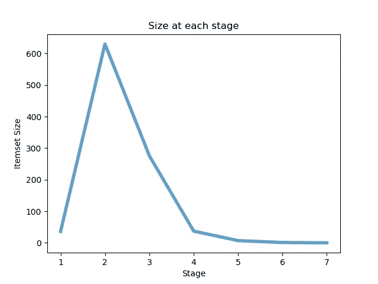
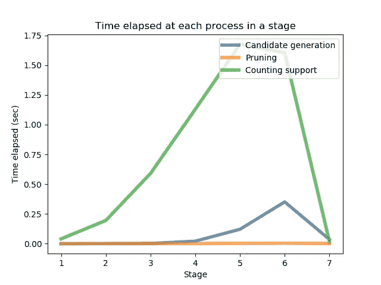

# apriori——关联规则挖掘的深层解释及 Python 实现

> 原文：<https://towardsdatascience.com/apriori-association-rule-mining-explanation-and-python-implementation-290b42afdfc6?source=collection_archive---------2----------------------->

## 简明扼要地介绍入门级数据挖掘。


弗兰基·查马基在 [Unsplash](https://unsplash.com?utm_source=medium&utm_medium=referral) 上拍摄的照片

# 介绍

关于关联规则挖掘最著名的故事是**《啤酒和尿布》**。研究人员发现，购买尿布的顾客也倾向于购买啤酒。这个经典的例子表明，在我们的日常数据中可能隐藏着许多有趣的关联规则。

关联规则挖掘是一种识别不同项目之间潜在关系的技术。有许多方法可以执行关联规则挖掘。我们将在本文中介绍的 Apriori 算法是最简单明了的方法。然而，因为它是基本方法，所以有许多不同的改进可以应用于它。

我们不会深入研究这些改进。相反，我将在这个故事中展示先验的主要缺点。并且在即将到来的帖子中，会介绍一个更高效的 **FP 增长**算法。我们还会在下一篇文章中比较 FP 增长和 Apriori 的利弊。

[](/fp-growth-frequent-pattern-generation-in-data-mining-with-python-implementation-244e561ab1c3) [## FP 增长:用 Python 实现数据挖掘中的频繁模式生成

### 在本文中，我们将展示一种叫做 FP 增长算法的高级方法。我们将走过整个…

towardsdatascience.com](/fp-growth-frequent-pattern-generation-in-data-mining-with-python-implementation-244e561ab1c3) 

# 先验概念

## 支持

> 包含项集的事务的一部分。

例如，第 I 项的支持度定义为包含 I 的事务数除以事务总数。


图片由 Chonyy 提供

## 信心

> 测量 Y 中的项目在包含 X 的事务中出现的频率

置信度是如果购买了物品 X，也购买了物品 Y 的可能性。它的计算方法是包含 X 和 Y 的事务数除以包含 X 的事务数。


图片由 Chonyy 提供

## 频繁项目集

> 支持度大于或等于最小支持度阈值的项目集

频繁项集也称为频繁模式，简单地说就是支持度满足最小支持度阈值的所有项集。

# Apriori 算法

请随意查看评论良好的源代码。这真的有助于理解整个算法。

[](https://github.com/chonyy/apriori_python) [## chonyy/apriori_python

### pip 安装 apriori_python，然后像使用 git clone git clone 一样使用它来获得此 repo 的副本…

github.com](https://github.com/chonyy/apriori_python) 

先验的主要思想是

> 频繁项集的所有非空子集也必须是频繁的。


图片由 Chonyy 提供

这是一种**自下而上**的方法。我们从项目集列表中的每一个项目开始。然后，通过自连接产生候选。我们一次扩展一个项目集的长度。子集测试在每个阶段执行，包含不频繁子集的项目集被删除。我们重复这个过程，直到不能从数据中获得更多成功的项目集。

# 算法概述

这是 Apriori 的官方伪代码

*   **Lk:** 频繁 k 项集，满足最小支持度
*   **Ck:** 候选 k 项集，可能的频繁 k 项集


图片由 Chonyy 提供

请注意，修剪步骤已经包含在先验生成函数中。我个人觉得这个伪代码挺混乱的。所以，我整理成了自己的版本。这应该更容易理解。

```
L[1] = {frequent 1-itemsets};
for (k=2; L[k-1] != 0; k ++) do begin
    // perform self-joining
    C[k] = getUnion(L[k-1])
    // remove pruned supersets
    C[k] = pruning(C[k])
    // get itemsets that satisfy minSup
    L[k] = getAboveMinSup(C[k], minSup)
end
Answer = Lk (union)
```

综上所述，Apriori 的基本组成部分可以写成

*   使用 k-1 个项目集生成 k 个项目集
*   通过连接 L[k-1]和 L[k-1]得到 C[k]
*   用子集测试剪枝 C[k]
*   通过提取 C[k]中满足 minSup 的项集生成 L[k]

在头脑中模拟算法，并用下面的例子验证它。现在概念应该真的很清楚了。


图片由 Chonyy 提供

# Python 实现

## 先验函数

这是这个 Apriori Python 实现的主要功能。这个功能最重要的部分是从**第 16 行~第 21 行**。它基本上遵循我上面写的修改后的伪代码。

1.  通过连接前一阶段的频繁项集来生成候选集。
2.  执行子集测试，如果包含不频繁的项目集，则修剪候选集。
3.  通过获取满足最小支持度的频繁项集来计算最终的频繁项集。

## 候选生成

对于自连接，我们简单地通过蛮力得到所有的联合，并且只返回那些特定长度的联合。

## 修剪

为了执行子集测试，我们遍历项目集中所有可能的子集。如果该子集不在先前的频繁项集中，我们就对其进行剪枝。

## **从候选项中获取频繁项集**

在最后一步，我们**将候选集变成频繁项集**。因为我们没有应用任何改进技术。我们可以采用的唯一方法是无脑地一遍又一遍地遍历项目和项目集来获得计数。最后，我们只保留支持度等于或高于最小支持度的项集。

## 结果

```
print(rules)  
# [[{'beer'}, {'rice'}, 0.666], [{'rice'}, {'beer'}, 1.000]]
# (rules[0] --> rules[1]), confidence = rules[2]
```

更多用法和示例请查看[***GitHub repo***](https://github.com/chonyy/apriori_python)或 [***PyPi 包***](https://pypi.org/project/apriori-python/) 。

# 缺点

Apriori 算法有两个主要缺点

*   候选生成项集的大小可能非常大
*   因为我们必须一遍又一遍地扫描项目集数据库，所以在计算支持度上浪费了大量时间

我们将在 repo 中使用 data4.csv(从 [IBM generator](https://sourceforge.net/projects/ibmquestdatagen/) 生成)来展示这些缺点，看看是否能得到一些有趣的观察结果。

## 每个阶段的候选项集大小



图片由 Chonyy 提供

通过对 data4.csv 运行 Apriori，我们可以绘制出如上图所示的流程。我们上面提到的缺点可以在观察图表时发现。

在右边，我们可以看到算法的三个主要过程之后的项集大小。从图表中可以发现两个关键点

*   项目集的大小在开始时迅速增加，随着迭代的进行逐渐减小
*   修剪过程可能像阶段 1 和阶段 2 一样没有用。然而，在某些情况下，比如第三阶段，它会有很大的帮助。修剪了一半的项目集，这意味着计数时间可以减少一半！

## 每个阶段经过的时间


图片由 Chonyy 提供

从剧情可以看出，跑步大部分时间都花在了数支持上。与一遍又一遍地扫描原始项目集数据库相比，花在候选项生成和剪枝上的时间算不了什么。

另一个值得注意的观察是，我们在**阶段 2** 得到一个成本峰值。有趣的是，这其实不是意外！当使用 Apriori 时，数据科学家经常在阶段 2 遇到瓶颈。由于在阶段 1 几乎没有候选项被删除，所以在阶段 2 生成的候选项基本上是所有 1-频繁项集的所有可能组合。而计算如此庞大的项集的支持度导致了极高的成本。

## 尝试不同的数据集(在 repo 中)

**kaggle.csv**



图片由 Chonyy 提供

正如我们上面提到的，我们知道先验的瓶颈通常在阶段 2。然而，正如在 [Kaggle](https://www.kaggle.com/newshuntkannada/dataset-for-apriori-and-fp-growth-algorithm) 数据集图上显示的那样，这种观察可能并不总是成立的。准确地说，这取决于数据集本身和我们想要的最小支持度。

**data7.csv**


图片由 Chonyy 提供

正如我们所看到的，我们需要一分多钟来计算数据 7 与 Apriori 的关联规则。显然，这个运行时间是难以接受的。记得我说过先验只是一个根本方法吗？它的效率是它在数据科学领域没有得到广泛应用的原因。我们将把这个结果与 FP 增长的结果进行比较。

[](/fp-growth-frequent-pattern-generation-in-data-mining-with-python-implementation-244e561ab1c3) [## FP 增长:用 Python 实现数据挖掘中的频繁模式生成

### 在本文中，我们将展示一种叫做 FP 增长算法的高级方法。我们将走过整个…

towardsdatascience.com](/fp-growth-frequent-pattern-generation-in-data-mining-with-python-implementation-244e561ab1c3) 

# 丰富

有许多额外的技术可以应用于 Apriori 来提高效率。下面列出了其中的一些。

*   **散列:**减少数据库扫描
*   **事务减少:**不再考虑不频繁的事务
*   **分区:**可能频繁一定是频繁中的一个分区
*   **动态项目集计数:**减少对数据的遍历次数
*   **抽样:**随机抽取样本

# 源代码

[](https://github.com/chonyy/apriori_python) [## chonyy/apriori_python

### pip 安装 apriori_python，然后像使用 git clone git clone 一样使用它来获得此 repo 的副本…

github.com](https://github.com/chonyy/apriori_python) 

# PyPi 包

[](https://pypi.org/project/apriori-python/) [## 先验 python

### pip 安装 apriori_python，然后像运行程序一样使用提供的数据集和 minSupport 的默认值…

pypi.org](https://pypi.org/project/apriori-python/)