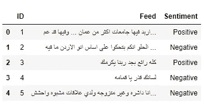
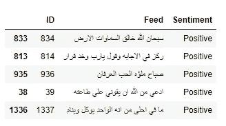
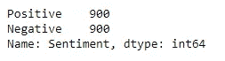
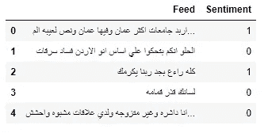
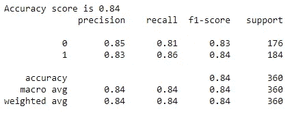
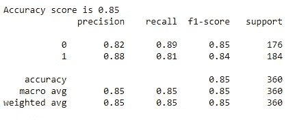
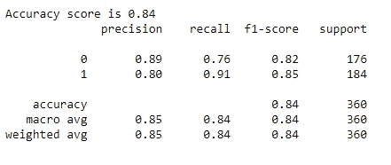
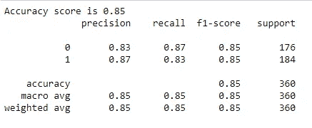

# 阿拉伯情感分析

> 原文：<https://towardsdatascience.com/arabic-sentiment-analysis-5e21b77fb5ea?source=collection_archive---------13----------------------->

## 关于如何对阿拉伯文本进行情感分析的说明性指南

在 [Unsplash](https://unsplash.com?utm_source=medium&utm_medium=referral) 上由 [Mutia Rahmah](https://unsplash.com/@mutiarahmah?utm_source=medium&utm_medium=referral) 拍摄的照片

识别和分类一段文本中表达的观点(也称为情感分析)是 NLP 中执行最多的任务之一。尽管阿拉伯语是世界上使用最多的语言之一，但在情感分析方面却很少受到关注。因此，本文致力于使用 Python 实现阿拉伯情感分析(ASA)。

# **概述**

1.  数据集
2.  图书馆导入和数据探索
3.  文本预处理
4.  基于不同 ML 算法的情感分析。
5.  结论
6.  参考

# **数据**

本文中使用的数据集由 1800 条标注为正面和负面的推文组成。这里可以找到[这里](https://github.com/komari6/Arabic-twitter-corpus-AJGT)

# **库导入和数据浏览**

图 1

图 2

我们这里有一个非常平衡的班级。

# **文本预处理**

作为一个习惯于处理英语文本的人，我发现首先很难将通常用于英语文本的预处理步骤翻译成阿拉伯语。幸运的是，我后来发现了一个 G [ithub repo](https://github.com/motazsaad/process-arabic-text/blob/master/clean_arabic_text.py) sitory，里面有清除阿拉伯文本的代码。这些步骤基本上包括删除标点符号、阿拉伯语音调符号(短元音和其他 harakahs)、延长和停用词(在 NLTK 语料库中可以找到)。

预处理数据

# 使用不同技术的情感分析

本文的目的是演示不同的信息提取技术如何用于 SA。但是为了简单起见，我在这里只演示单词向量化(即 tf-idf)。与任何监督学习任务一样，数据首先被分为特征(提要)和标签(情感)。接下来，将数据分为训练集和测试集，并从逻辑回归开始实施不同的分类器。

**逻辑回归**

逻辑回归是一种非常常见的分类算法。它实现简单，可以作为分类任务的基准算法。为了使代码更短，Scilkit-Learn 中的管道类结合了向量化、转换、网格搜索和分类。你可以在官方文档中阅读更多关于 gridsearch 的内容

准确率达到了 84%

**随机森林分类器**

**朴素贝叶斯分类器(多项式)**

**支持向量机**

# 结论

本文演示了阿拉伯情感分析的步骤。阿拉伯语和英语 NLP 的主要区别在于预处理步骤。所有适合的分类器给出了范围从 84%到 85%的令人印象深刻的准确度分数。朴素贝叶斯、逻辑回归和随机森林给出了 84%的准确率，而线性支持向量机实现了 1%的提高。通过应用单词嵌入和递归神经网络等技术，可以进一步改进模型，我将在后续文章中尝试实现这些技术。

# **参考文献**

 [## 多类文本分类模型的比较与选择

### 自然语言处理，word2vec，支持向量机，词袋，深度学习

towardsdatascience.com](/multi-class-text-classification-model-comparison-and-selection-5eb066197568) 

[https://github . com/motazsaad/process-Arabic-text/blob/master/clean _ Arabic _ text . py](https://github.com/motazsaad/process-arabic-text/blob/master/clean_arabic_text.py)