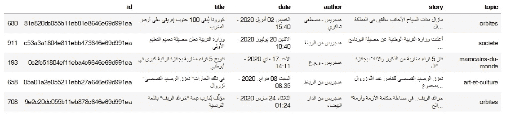
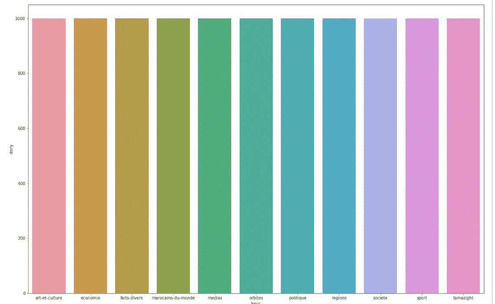
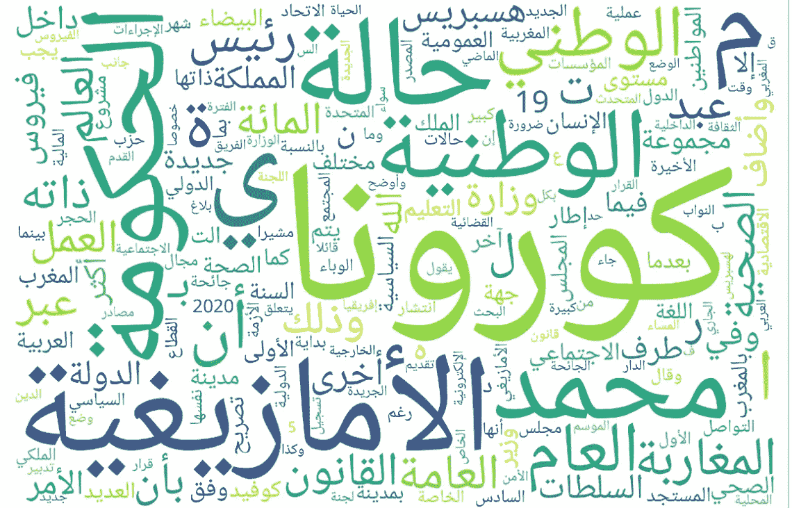
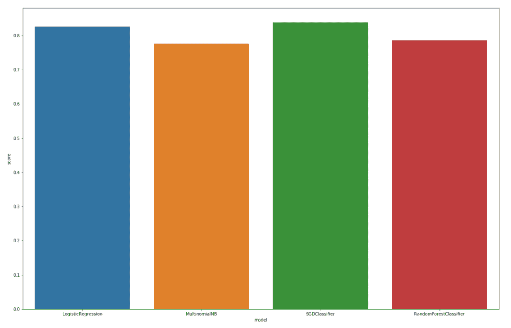
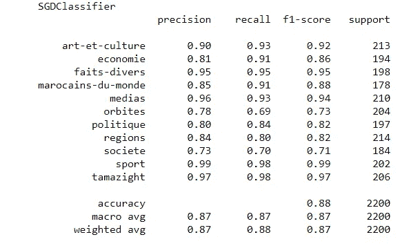
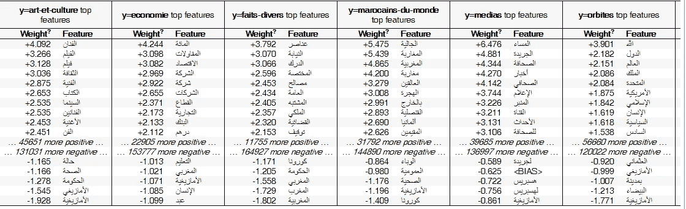
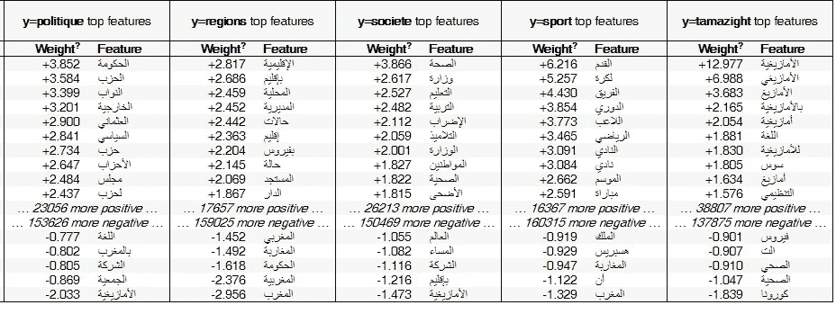

# Hespress 新闻数据集上的阿拉伯语主题分类

> 原文：<https://towardsdatascience.com/arabic-topic-classification-on-the-hespress-news-dataset-7adceef12bed?source=collection_archive---------23----------------------->

## 如何正确分类阿拉伯文本


马库斯·温克勒在 [Unsplash](https://unsplash.com?utm_source=medium&utm_medium=referral) 上的照片

本文是一个系列的第一篇，在这个系列中，我将介绍对 Hespress 数据集的分析。

根据“alexa.com”的统计，Hespress 在摩洛哥排名第四，是该国最大的新闻网站，平均每个摩洛哥人每天在该网站上花费大约 6 分钟。

Hespress 数据集是 11 万篇新闻文章和 30 万条评论的集合，每篇文章都有相关用户的评分，可以把这些评分想象成脸书邮报上的赞。这个数据集可以用于新闻文章分类，这将是我们在本文中的重点，也可以用于对摩洛哥舆论的情感分析。您可以使用以下链接下载数据集:

[](https://www.kaggle.com/tariqmassaoudi/hespress) [## 赫斯普雷斯

### Kaggle 是世界上最大的数据科学社区，拥有强大的工具和资源来帮助您实现您的数据…

www.kaggle.com](https://www.kaggle.com/tariqmassaoudi/hespress) 

这篇文章的目标读者是对机器学习有一点了解的人，例如分类和回归之间有什么区别，什么是交叉验证。然而，我将对这个项目的步骤做一个简单的解释。

# **问题介绍:**

幸运的是，我们的数据集包含文章及其标签，因此我们正在处理一个有监督的学习问题，这将使我们的生活更加容易，因为如果不是这样，我们将不得不手动标记每篇文章或采用无监督的方法。

简而言之，我们的目标是在给定文本的情况下预测文章的主题。我们总共有 11 个主题:

*   塔马塞特语(一种摩洛哥语言)
*   运动(运动)
*   社会团体
*   区域(地区)
*   政治
*   轨道(世界新闻)
*   媒体(当地报纸的新闻)
*   世界摩洛哥人
*   Faits Divers(杂项)
*   经济学家
*   艺术与文化(艺术与文化)

# **探索性数据分析:**

我们将使用 seaborn 进行数据可视化，使用 pandas 进行数据操作。

让我们从加载数据开始:

因为数据存储在不同的文件中，每个文件包含特定主题的数据，所以我们必须循环遍历主题并连接结果。

```
import pandas as pd
stories=pd.DataFrame()
topics["tamazight","sport","societe","regions","politique","orbites","medias","marocains-du-monde","faits-divers","economie","art-et-culture"]for topic in topics:
  stories=pd.concat([stories,pd.read_csv("stories_"+topic+".csv")])stories.drop(columns=["Unnamed: 0"],axis=1,inplace=True)
```

接下来让我们从数据中获取一个样本:

```
stories.sample(5)
```



stories 数据集中的示例列

我们可以看到我们有 5 个专栏，对于这篇文章，我们只对故事和主题特性感兴趣。

现在，让我们检查一下每个主题中有多少故事，这对于分类极其重要，因为如果我们有一个**不平衡的数据集**，即(我们在一个主题中有比其他主题多得多的数据点)，我们的模型将会有偏差，也不会工作。如果我们有这个问题，一个常见的解决方案是应用一个**欠采样**或**过采样**方法，我们不会去查看细节，因为这不在我们的文章范围内。

```
import seaborn as sns
storiesByTopic=stories.groupby(by="topic").count()["story"]
sns.barplot(x=storiesByTopic.index,y=storiesByTopic)
```



按主题的故事计数

我们可以看到，每个主题几乎有 1000 个故事，我们的数据集非常平衡。


资料来源:memegenerator.net

# **数据清理:**

我们正在处理阿拉伯文本数据。我们的数据清理流程将包括 2 个步骤:

**删除停用词**:一些词，如“و”、“كيف”，在所有阿拉伯文本中出现频率极高，并且不提供我们的模型可以用来预测的含义。移除它们将减少噪音，并让我们的模型只关注相关的单词。为此，我们将使用一个列表，循环遍历所有文章，删除列表中出现的所有单词。

我使用的停用词表可以在 [Github](https://github.com/mohataher/arabic-stop-words/blob/master/list.txt) 上找到

```
from nltk.tokenize import word_tokenizefile1 = open('stopwordsarabic.txt', 'r', encoding='utf-8') 
stopwords_arabic = file1.read().splitlines()+["المغرب","المغربية","المغربي"]def removeStopWords(text,stopwords):
    text_tokens = word_tokenize(text)
    return " ".join([word for word in text_tokens if not word in stopwords])
```

**删除标点符号**:出于同样的原因，我们将删除标点符号，为此我使用了一个正则表达式。

```
from nltk.tokenize import RegexpTokenizer
def removePunctuation(text):
    tokenizer = RegexpTokenizer(r'\w+')
    return " ".join(tokenizer.tokenize(text))
```

# **绘制文字云:**

让我们找点乐子，我们将使用 python " **WordCloud** "库从我们的数据集中的所有故事中画出一个单词云

在这样做之前，有一些额外的步骤需要特别为阿拉伯语，要了解更多关于他们访问这个[链接](https://amueller.github.io/word_cloud/auto_examples/arabic.html)。

```
import arabic_reshaper
from bidi.algorithm import get_display
import matplotlib.pyplot as plt
%matplotlib inlinedef preprocessText(text,stopwords,wordcloud=False):
    noStop=removeStopWords(text,stopwords)
    noPunctuation=removePunctuation(noStop)
    if wordcloud:
        text=arabic_reshaper.reshape(noPunctuation)
        text=get_display(text)
        return text
    return noPunctuationdrawWordcloud(stories.story,stopwords_arabic)
```



西方新闻报道的文字云

由于这个数据集包含最近的新闻文章，我们认为“كورونا”(冠状病毒)是一个反复出现的词。还有“الامازيغية”是摩洛哥的主要语言，“محمد”是摩洛哥最流行的名字，也是摩洛哥国王的名字，“الحكومة”是政府的意思。

# **特色工程:**

机器学习模型本质上是数学方程，无法理解文本，所以在运行我们的模型之前，我们需要将文本转换为数字，有多种方法可以做到这一点，让我们来发现两种最流行的方法。

*   **字数:**

这个非常简单，每一列代表整个故事语料库中的一个单词，每一行代表一个故事，单元格的值就是一个单词在故事中出现的频率！

*   ***TF–IDF:***

TF-IDF 代表“词频逆文档频率”,它使用一种稍微复杂一点的方法来惩罚在多个文档中出现的常见单词。

我们将使用 TF-IDF，因为它在大多数情况下会产生更好的性能！

```
from sklearn.feature_extraction.text import TfidfVectorizer#Clean the stories 
stories["storyClean"]=stories["story"].apply(lambda s: preprocessText(s,stopwords_arabic))#Vectorize the storiesvectorizer = TfidfVectorizer()
X = vectorizer.fit_transform(stories["storyClean"])
y=stories.topic
```

# **造型:**

我们将尝试以下型号:

*   随机森林
*   逻辑回归
*   SGD 分类器
*   多项式朴素贝叶斯

我们将通过每个模型运行数据，并使用**准确性**作为我们的衡量标准，它是正确预测和总数据点的比率，为了获得更准确的结果，我们使用了 5 倍交叉验证进行评分，然后我们将绘制结果。

```
from sklearn.model_selection import train_test_split
from sklearn.metrics import accuracy_score
from sklearn.model_selection import cross_val_score
import numpy as np
from sklearn.metrics import classification_report
def testModel(model,X,y):
    X_train, X_test, y_train, y_test = train_test_split(X, y, test_size=0.2, random_state=42)
    model.fit(X_train,y_train)
    modelName = type(model).__name__
    pred=model.predict(X_test)
    print(modelName)
    print(classification_report(y_test,model.predict(X_test)))
    score=np.mean(cross_val_score(model, X, y, cv=5))

    return model,{"model":modelName,"score":score}
```



模型准确性

我们最好的模型是精确度为 87 %的 SDG 分类器

# **模型解释:**

现在我们有了一个工作模型，让我们试着了解更多的情况，因为我们将回答两个问题:

*   我们的模型纠结于哪些话题？
*   哪些词对预测不同话题最有影响力？

对于第一个问题，我们可以查看最佳模型的分类报告:



分类报告 SGD 分类器

我们预测“体育”、“艺术”、“媒体”、“塔马塞特”的准确度极高。我们最纠结的是“**orbits**”(世界新闻)、 **societe** ”(社会)这可能是因为这两个话题更为宽泛。

为了回答第二个问题，我们将使用逻辑回归的一个有用属性，我们可以使用权重作为每个模型中单词重要性的度量。"**Eli 5**" python 库让这一切变得简单:



我们可以看到，大多数单词都是有意义的，并且与主题的主题相对应，例如对于“艺术”，顶部的单词是:“艺术家”、“电影”、“文化”、“书籍”。

# **结论:**

在本文中，我们已经经历了为阿拉伯语设计文本分类系统所需的所有步骤，从数据探索到模型解释。然而，我们仍然可以通过调整超参数来提高精度。

在下一篇文章中，我们将尝试使用**情感分析来理解每篇文章的评论。**

如果你设法来到这里，恭喜你。感谢阅读，我希望你喜欢这篇文章。如需个人联系或讨论，请随时通过 LinkedIn 联系我。