# 阿基米德和积分学

> 原文：<https://towardsdatascience.com/archimedes-and-the-integral-calculus-4cf875c6fee4?source=collection_archive---------29----------------------->

## 伟大的希腊数学家如何计算抛物线内的面积

图片由[皮克斯拜](https://pixabay.com/fr/?utm_source=link-attribution&utm_medium=referral&utm_campaign=image&utm_content=1235606)的 Gerd Altmann 提供

[锡拉丘兹的阿基米德](https://en.wikipedia.org/wiki/Archimedes)是古代最伟大的科学家和数学家。他是一个博学的人，在很多领域都有贡献，包括数学、物理、天文学和工程学。阿基米德也是一位杰出的发明家和武器设计师。

他的许多成就包括:

*   他基本上创立了力学和流体静力学(包括杠杆定律、[重心](https://en.wikipedia.org/wiki/Center_of_mass#Center_of_gravity)和所谓的[阿基米德原理](https://en.wikipedia.org/wiki/Archimedes%27_principle)，用于流体中的物体)

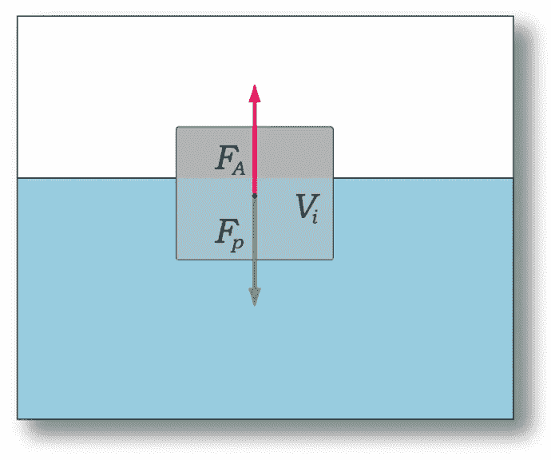

图 1:根据[阿基米德原理](https://en.wikipedia.org/wiki/Archimedes%27_principle)，浸没在流体中的物体所受到的向上浮力等于该物体所排开的流体重量([来源](https://en.wikipedia.org/wiki/Archimedes%27_principle))。

*   他证明了球体和其他几何物体的体积和表面积的公式(详见此[链接](https://en.wikipedia.org/wiki/Archimedes#Mathematics))。

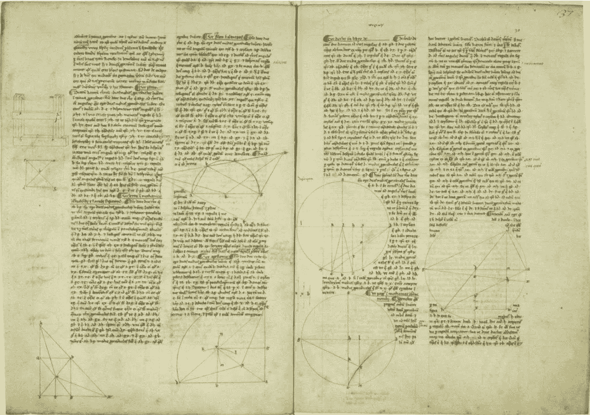

图 2:来自阿基米德的《关于球体和圆柱体的书》中的一页，其中他展示了如何找到球体的表面积，以及球体的体积是包含它的圆柱体体积的 2/3([来源](https://en.wikipedia.org/wiki/On_the_Sphere_and_Cylinder))。

*   他是应用物理学解决数学问题的先驱(而不仅仅是反过来)。下面的文章包含了这样一个应用程序的例子。

 [## 阿基米德的天才

### 他是如何利用基础物理学推导出球体的体积的

towardsdatascience.com](/the-genius-of-archimedes-421cfb51f7d8) 

*   他预见到了两千年后才完全发展起来的积分学技术。

用数学家史蒂文·斯特罗加兹的话来说，“说[阿基米德]走在他的时代的前面是一种委婉的说法”。

图 3:一幅 18 世纪中期的阿基米德的画作(作者朱塞佩·诺加里)([来源](https://www.britannica.com/biography/Archimedes))。

*   他发明了几种战争机器。他甚至将镜子作为抛物面反射器的特性应用于焚烧攻击锡拉丘兹的船只(尽管这个故事[的真实性已经被争论了很长时间](https://en.wikipedia.org/wiki/Archimedes#Heat_ray))。

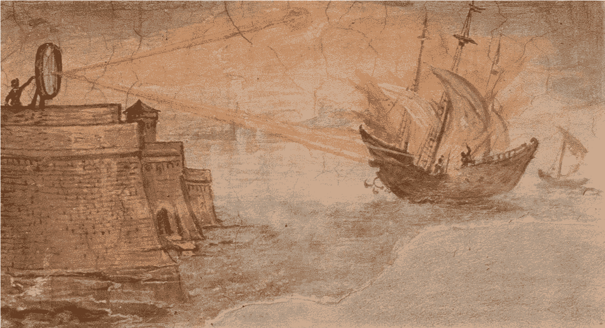

图 4:阿基米德(可能)应用镜子焚烧罗马船只(作者[朱利奥·帕里吉](https://en.wikipedia.org/wiki/Giulio_Parigi) ) ( [来源](https://en.wikipedia.org/wiki/Archimedes))。

在这篇文章中，我将基于[西蒙斯](https://books.google.com.br/books?id=m1Q8AAAACAAJ&dq=Simmons+calculus&hl=en&sa=X&ved=0ahUKEwi_7vfjwrnpAhUFGbkGHaFAB5EQ6AEIKDAA)解释他是如何计算抛物线段内的面积的(见下图 6)。阿基米德的证明包含在他写于公元前 3 世纪的论文《[抛物线](https://en.wikipedia.org/wiki/The_Quadrature_of_the_Parabola)的求积》(比现代微积分发展早了两千年)中，这些数学家包括[巴罗](https://en.wikipedia.org/wiki/Isaac_Barrow)、[笛卡尔](https://en.wikipedia.org/wiki/Ren%C3%A9_Descartes)、[费马](https://en.wikipedia.org/wiki/Pierre_de_Fermat)、[帕斯卡](https://en.wikipedia.org/wiki/Blaise_Pascal)、[沃利斯](https://en.wikipedia.org/wiki/John_Wallis)、[卡瓦列里](https://en.wikipedia.org/wiki/Bonaventura_Cavalieri)、[格里高利](https://en.wikipedia.org/wiki/James_Gregory_%28astronomer_and_mathematician%29)、[牛顿](https://en.wikipedia.org/wiki/Isaac_Newton)和[莱布尼茨](https://en.wikipedia.org/wiki/Gottfried_Leibniz)

图 5:托马斯·德乔治笔下的阿基米德之死。根据神话(没有可靠证据)，他在罗马士兵用他的剑杀死他之前告诉罗马士兵“不要打扰我的圈子”([来源](https://en.wikipedia.org/wiki/Archimedes#Biography))。

# 阿基米德结构

在图 6 和 7 中，阿基米德用于计算由弦 *AB* 限定的面积 *S* 的结构如图*所示。*他构建了三个三角形，即 ABC、ADC 和δCEB，方法如下:

*   他首先找到切线平行于边界弦 AB 的点 *C* 。
*   类似地，选择 *D* 作为切线平行于 *AC* 的点。
*   点 *E* 和弦 *BC* 的选择遵循相同的规则。
*   然后，他对还不包含内接三角形的区域采取同样的步骤。然后他无限重复这个过程*(这被称为[用尽方法](https://en.wikipedia.org/wiki/Method_of_exhaustion))。关于这一点的更多细节将在文章的最后一节提供。*

*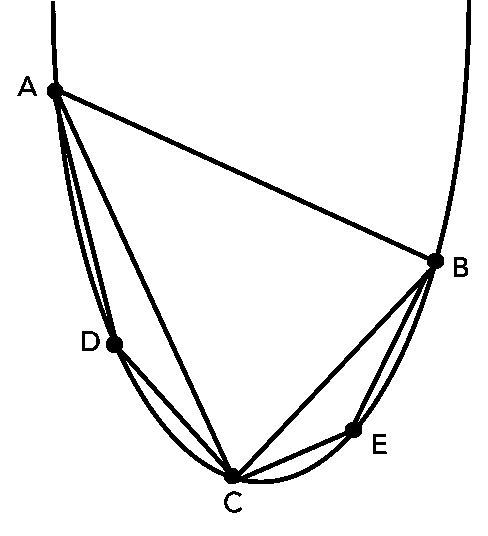*

*图 6:阿基米德要计算其面积的抛物线段(受弦 AB 限制)。*

*阿基米德的目标是证明抛物线段内的面积 *S* 等于三角形面积 ABC 的 4/3:*

*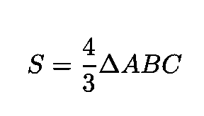*

*等式 1:阿基米德在其论文[中证明的等式抛物线](https://en.wikipedia.org/wiki/The_Quadrature_of_the_Parabola)的求积。证明将在本文中描述。*

*正如我们将在最后一节看到的，这可以通过首先显示*

*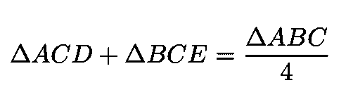*

*等式 2:如果这个关系被遵守，证明等式 2 给出的最终结果是一个简单的任务。1.*

*然后将上面提到的穷举法应用于 ACD 和 BCE 下面的三角形等等。*

# *证明等式 2*

*在这一节，我将展示如何证明情商。2(证明跟随[西蒙斯](https://books.google.com.br/books?id=m1Q8AAAACAAJ&dq=Simmons+calculus&hl=en&sa=X&ved=0ahUKEwi_7vfjwrnpAhUFGbkGHaFAB5EQ6AEIKDAA))。在下一篇文章中，我将简单应用[穷举法](https://en.wikipedia.org/wiki/Method_of_exhaustion)证明抛物线段的面积等于三角形 ABC 面积的 4/3。*

*代表抛物线的方程可以写成(方便地选择轴):*

*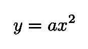*

*方程 3:代表抛物线的方程。*

*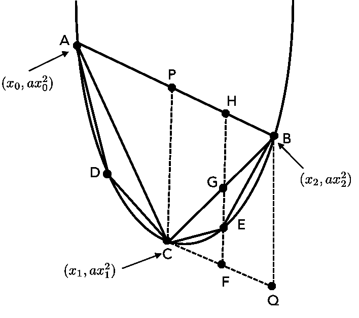*

*图 7:在图 1 的抛物线段中定义了三个点 A、B 和 C。*

*然后，我们定义三个点 *A* 、 *B* 和 *C* ，并进行图 7 所示的构造，其中:*

*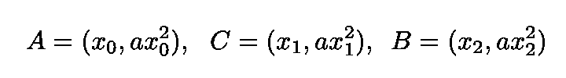*

*等式 4:三个点 A、B 和 C 的定义，如图 7 所示*

*从图 7 中，我们发现以下关系:*

*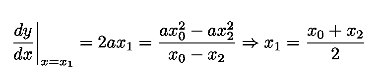*

*等式 5:根据 y 在点 x₁的导数，我们发现穿过 *C* 的垂直线是弦 *AB 的平分线。**

*根据等式。5、穿过 *C* 的垂直线是弦 *AB 的平分线。它们相交的点用 p 表示。这足以证明**

*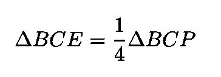*

*等式 6:如果证明了这个等式，等式。2 是服从。*

*我们自动证明情商。2(更多详情见[此链接](https://proofwiki.org/wiki/Quadrature_of_Parabola))。从图 7 中我们看到，垂线穿过 *E* 平分点 *G* 处的线段 *BC* 和点*h*处的线段 *BP* ，如果我们现在证明:*

*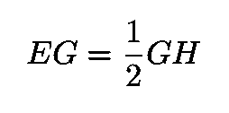*

*我们将拥有:*

*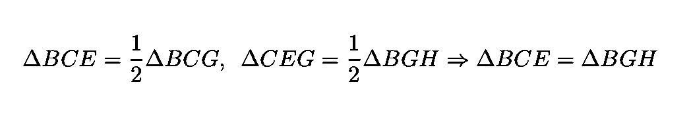*

*等式 7:这些等式是上面等式的结果。*

*现在，因为:*

*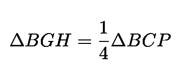*

*我们直接得到 Eq。6.现在证明情商的最后一步。二是检查:*

*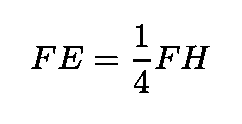*

*或者等效地，根据图 7:*

*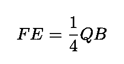*

*为了证明这一点，我们将解析几何应用于图 7。很自然，阿基米德的证明仅仅基于几何学，因为解析几何仅仅是在 17 世纪发展起来的(由法国哲学家、数学家和科学家勒内·笛卡尔提出)。*

*经过一些简单的代数运算后，我们得到:*

*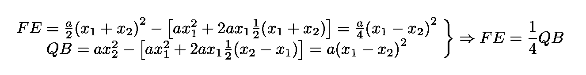*

*情商。8:使用图 3 中的结构证明 FE=(1/4)QB。*

# *最后一步:运用穷举法*

*现在使用[穷举法](https://en.wikipedia.org/wiki/Method_of_exhaustion) 和对较小的三角形(低于 ACD 和 BCE)重新应用与弦 ABC 相同的程序，我们得到一个几何级数，其和给出了我们想要的结果:*

*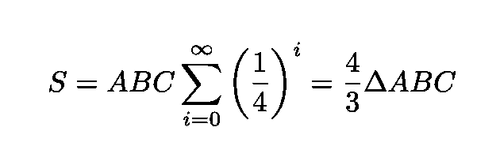*

*感谢您的阅读，再见！一如既往，我们随时欢迎建设性的批评和反馈！*

*我的 [Github](https://github.com/marcotav) 和个人网站 [www.marcotavora.me](https://marcotavora.me/) 有一些其他有趣的材料，既有关于数学的，也有关于物理、数据科学和金融等其他主题的。看看他们！*