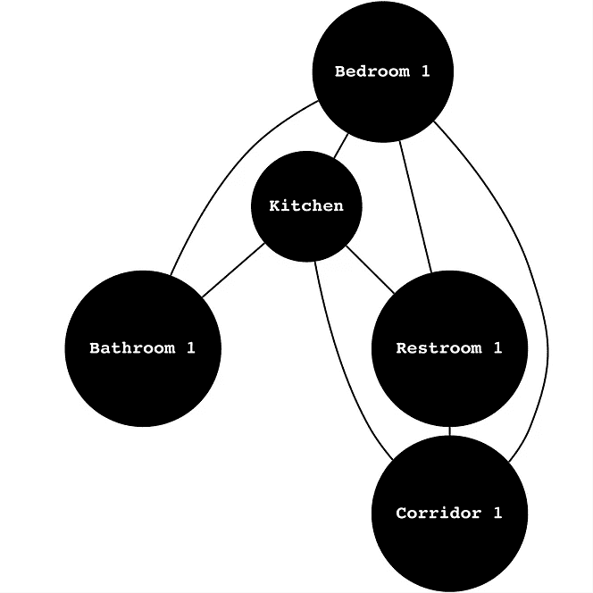
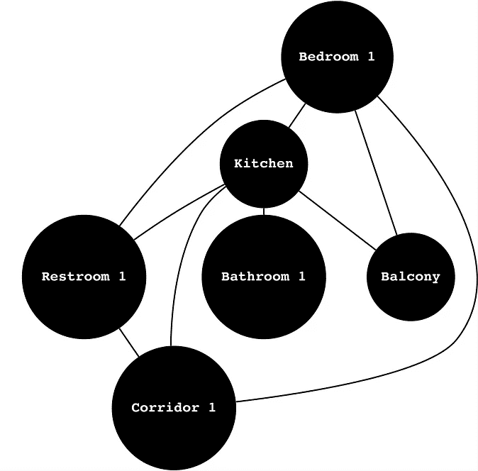
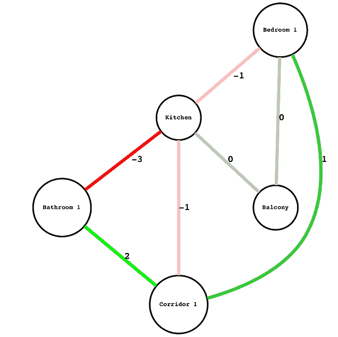
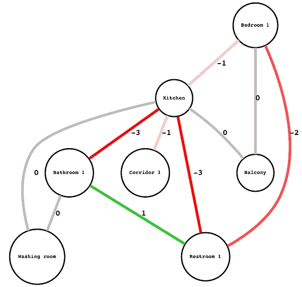
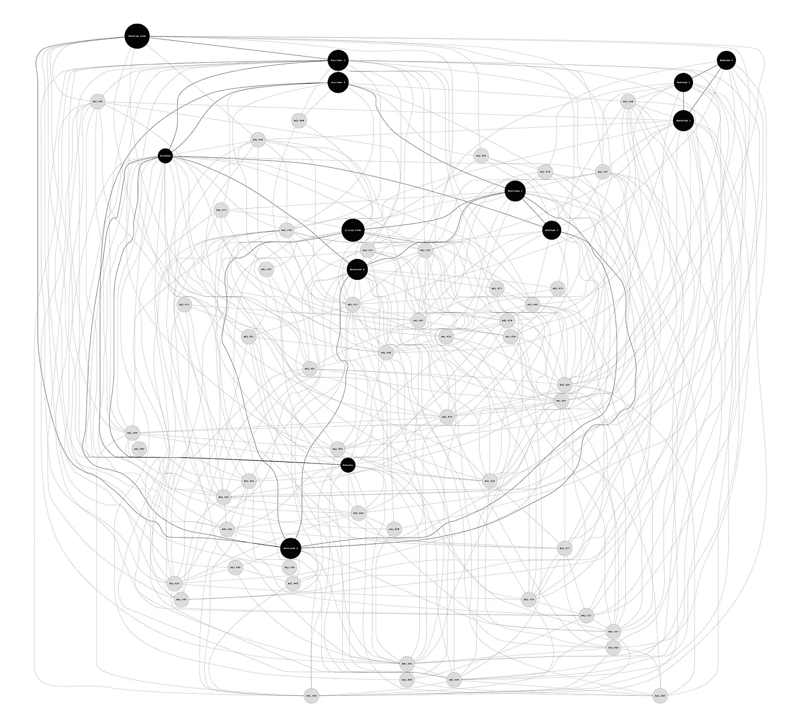
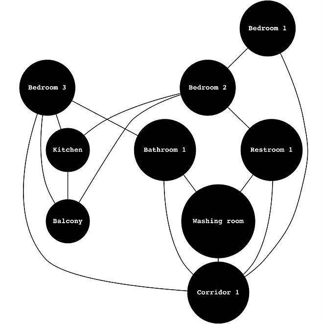

# 作为图表的建筑

> 原文：<https://towardsdatascience.com/architecture-as-a-graph-6a835d46f918?source=collection_archive---------17----------------------->

## 计算方法

[***杰弗里·兰德斯***](https://www.linkedin.com/in/jeffrey-landes-558548126/) *，数据科学家@ Spacemaker AI*

[***hkon Dissen***](https://www.linkedin.com/in/h%C3%A5kon-dissen-63040013b/)*、软件工程师@ Spacemaker AI*

[***贺康 Fure***](https://www.linkedin.com/in/h%C3%A5kon-fure-3a386b94/) *，数据科学家@ Spacemaker AI*

[***Chaillou***](https://www.linkedin.com/in/stanislas-chaillou-b1931090/)*，建筑师&数据科学家@ Spacemaker AI*

在本文中，我们公布了 Spacemaker AI 在过去一个季度中实施的一些最新成果和方法。这个项目旨在支持 Spacemaker 的长期愿景，作为我们正在进行的许多研究计划之一。

平面布置图的设计可以利用机器的直觉来生成和验证潜在的设计选项。在这篇文章中，我们提出了一个特定的空间抽象:*邻接*。任何平面布置图都有自己的嵌入式逻辑；显然，房间的相对位置和它们之间的联系是由某种相互依赖的逻辑所驱动的，并在空间中产生不同的质量。例如，一个房间的存在将决定其他房间的存在，以及它们之间的开口位置。**首先，我们试图在这里鉴定现有平面布置图的邻接关系**，以评估房间间邻接关系的相关性。**我们稍后转向贝叶斯建模来生成邻接图**，自由地或者在设定的约束下。通过*限定*和*生成*，我们希望研究同一个问题的两个方面:理解相邻空间之间的关系。

# 一.资格

房间之间的相邻关系定义了任何给定平面图的质量。鉴于它们连接的房间，这些关系或多或少是相关的。在不同的背景下，它们的重要性也各不相同。适合工作室的东西不一定适合两居室。在重要性和相关性的交叉点上，我们提供了一种既容易解释又可调的质量评估方法。

我们的框架交叉引用了两个矩阵:

*   **连接矩阵** ( *图 1，左)*，其中我们定义了在给定的平面布置图中，某些连接应该(*直接*)还是不应该(*间接*)存在。
*   **重要性矩阵** ( *图 1，右*)，其中我们指定了连通性矩阵中定义的规则实际上有多重要。

图 1: **邻接规则&框架** |来源:作者

然后，我们通过提取它们的邻接矩阵并基于上述框架对其分级来对平面布置图评分。在 clear 中，邻接图中存在的每条边都将通过查询其*“连通性 x 重要性”*得分来分级。平面图的总体等级是所有边的综合得分。我们在图 2 中展示了这个过程。

图 2: **邻近评分法** |来源:作者

因为这些规则是依赖于上下文的，所以确保设计者可以改变它们是至关重要的。**这种方法允许设计者根据他/她对给定平面布置图的期望，通过简单地编辑两个矩阵中的权重来调整评分方法**。我们在*图 3 中显示了我们数据库的一个子集，其中每个连接都被分配了一个分数，使用了上面的框架&权重。*

图 3: **邻接评估图** |来源:作者

# 二。产生

图 4: **贝叶斯因果图**为(*左* ) **工作室**，【中】**一居室**公寓&(右)**两居室**公寓|来源:作者

我们现在转向邻接图的生成。我们更喜欢使用[贝叶斯方法](https://en.wikipedia.org/wiki/Bayesian_statistics)，而不是使用任何形式的程序或基于规则的技术。这个统计领域通常被描述为:

> “基于数据以及关于事件或与事件相关的条件的先验信息或信念，对事件的条件概率的研究”。

对我们来说，贝叶斯方法提供了一个机会来**研究和建模一组潜在的关系(原因),这些关系决定了平面图中房间的存在，以及它们之间潜在的现有联系。**例如，给定房间的存在可以导致另一个房间的存在，并决定房间之间连接的存在。这一事实可以通过我们 500 多个平面图的数据库使用贝叶斯统计来捕捉。

我们将房间和连接建模为节点，并希望**我们的贝叶斯模型将帮助我们推断它们之间因果关系**的存在，以及这些相互依赖的相对权重。

## A.工作室

图 5: **贝叶斯因果图** **工作室类型学** |来源:作者

我们首先在工作室计划的子集上运行模型。这些平面图只展示一个卧室，没有客厅，最多 6 个房间。该模型能够相当快地绘制出房间和连接之间的所有现有因果关系(图 5 中的*边和图 5 中的*节点)。总之，给定节点的传入边形成了条件概率表。这种形成意味着房间或相邻空间存在的概率取决于其父值。这样，**我们从数量上和拓扑上揭示了房间和连接之间相互依赖的存在。**

*你也可以在这个地址* *浏览这个贝叶斯因果图* [*的交互版。*](http://stanislaschaillou.com/graphs/studio/index.html)

为了生成新的工作室式邻接图，**我们现在可以从上面的图**中取样。由于抽样本质上是一个*随机过程*，所以每次都会产生不同的结果。因此，我们可以生成大量不同的图形结构，所有这些都是从我们的数据库中找到的工作室公寓的观察结构中得到的启发。

我们在图 6 中展示了这些图的子集。我们可以注意到，大多数相邻音都是声音，反映了工作室公寓中常见的典型节目组合和连接。

图 6: **抽样邻接图** |来源:作者

现在可以使用上面定义的评分方法对这些图表进行分级。为了限制我们的贝叶斯方法可以产生的图的数量，**我们使用分数来过滤掉不相关的选项**。

图 7: **抽样的&得分邻接图** |来源:作者

## B.一居室公寓

图 8: **一居室 Apt 的贝叶斯因果图** **。类型学** |来源:作者

**我们在这一部分应用相同的过程，这次是一居室公寓的子集。这些平面图有一个客厅、一个卧室和最多 10 个房间。**

*由此产生的因果图如图 8 所示。*

*你也可以在这个地址* *浏览这个贝叶斯因果图* [*的交互版。*](http://stanislaschaillou.com/graphs/one_b/index.html)

*我们在图 9* ***中显示了一个子集的采样图*** *，以及图 10* ***中相同的图，使用之前定义的评分方法*** *进行评估。*

图 9: **抽样邻接图** |来源:作者

图 10: **抽样的&得分邻接图** |来源:作者

## C.两居室公寓及更多

图 11: **两居室 Apt 的贝叶斯因果图** **。类型学|资料来源:作者**

**我们在这一部分应用相同的过程，这次是两居室公寓的子集。这些平面图有一个客厅、两个卧室和最多 13 个房间。**

*产生的因果图如图 11 所示。*

*你也可以在这个地址* *浏览这个贝叶斯因果图* [*的交互版。*](http://stanislaschaillou.com/graphs/two_b/index.html)

*我们在图 12* ***中显示了采样图*** *的子集，在图 13* ***中显示了使用之前定义的评分方法*** *评估的相同图形。*

图 12: **抽样邻接图** |来源:作者

图 13: **抽样的&得分邻接图** |来源:作者

# 三。结论

本文使用的贝叶斯方法证明了设计过程的**随机性的相关性。一方面，统计推断允许我们模拟和复制复杂的现象，这里，在平面图中发现的复杂性。另一方面，它允许我们产生各种各样的选择，这将激发创造性的过程。**

同时，**我们为将设计分解成嵌套的步骤和抽象层次的重要性提供了证据**。我们已经在这里通过处理它们的相邻关系解决了平面图的底层结构。通过限定和生成这样的邻接，我们展示了平面布置图的高级表示的重要性，以及这种抽象对于理解空间规划是多么重要。

事实上，解决房间之间的层次和联系是我们走向更全面的平面图生成定义的第一步。从空间中房间的一组相邻关系到实际几何形状，我们计划扩展这项研究，将我们当前的模型与另一个生成模型相结合，生成最终的平面布置图。

**最后，我们希望我们的框架将有助于解决平面图设计的无尽复杂性。**像我们这样使用贝叶斯方法处理他们的结构，是我们相信的一大组选项中的一种可能的方法。要概括空间规划的必要步骤，关键更多的是原则而不是方法。随着建筑数据可用性的增加，我们鼓励进一步的工作和开放的实验。

## 参考

*   *石榴:Python 中快速灵活的概率建模，*机器学习研究杂志 2018 年第 18 期，Jacob Schreiber & al。[ [链接](http://www.jmlr.org/papers/volume18/17-636/17-636.pdf) ]
*   *贝叶斯统计:导论，第四版*，彼得·m·李，威利[ [链接](https://www.wiley.com/en-gb/Bayesian+Statistics%3A+An+Introduction%2C+4th+Edition-p-9781118332573) ]
*   计算机生成的住宅建筑布局图。，斯坦福大学，2010 [ [链接](https://www.researchgate.net/publication/256663544_Computer-Generated_Residential_Building_Layouts) ]