# AlexNet、VGGNet、ResNet、Inception、DenseNet 的架构比较

> 原文：<https://towardsdatascience.com/architecture-comparison-of-alexnet-vggnet-resnet-inception-densenet-beb8b116866d?source=collection_archive---------8----------------------->

## 内部人工智能

## ILSVRC 挑战结果中具有超参数和准确性的图层描述

> 你好，读者，如果你正在寻找一个完美的指南来获得关于 AlexNet，VGGNet，ResNet，Inception 和 DenseNet 的所有信息，那么你在正确的地方。仔细阅读博客，你会得到关于所有架构的详细信息。尽情享受吧！！！

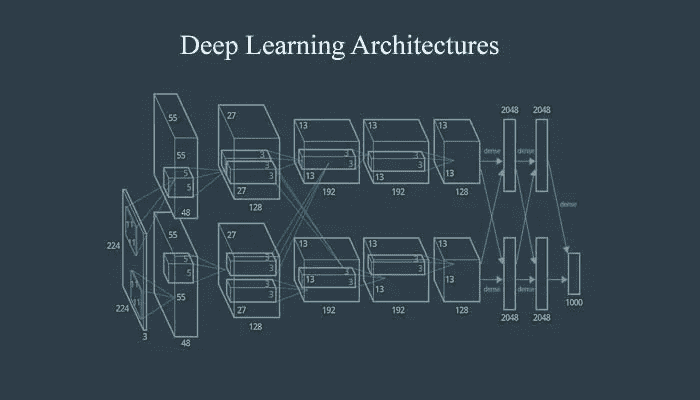

来源:[https://www . tech leer . com/articles/259-concepts-of-advanced-deep-learning-architectures/](https://www.techleer.com/articles/259-concepts-of-advanced-deep-learning-architectures/)

# AlexNet

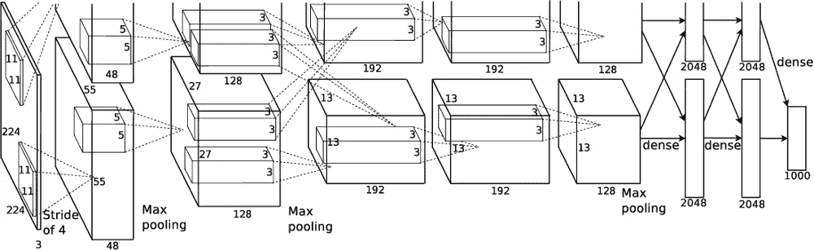

AlexNet 架构[1]

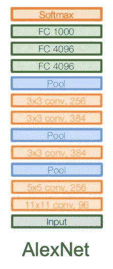

AlexNet 图层详细信息[2]

AlexNet 是第一个大规模卷积神经网络架构，在图像网络分类上表现良好。AlexNet 参加了比赛，并能够以显著的优势超越所有之前的非深度学习模型。

AlexNet 架构是一个 conv 层，然后是池层、标准化、conv 池规范，然后是几个 conv 层、一个池层，然后是几个完全连接的层。实际上看起来很像 LeNet 网络。总共只是多了几层而已。共有五个 conv 层，在最终的全连接层到达输出类之前，还有两个全连接层。

AlexNet 在 ImageNet 上接受训练，输入大小为 227 x 227 x 3 的图像。如果我们看看第一层，这是 AlexNet 的 conv 层，它是 11 x 11 个过滤器，其中 96 个应用于 stride 4。我在输出中有 55 x 55 x 96，在第一层中有 35K 参数。第二层是池层，在这种情况下，我们在步长 2 处应用了 3 个 3 x 3 的过滤器。汇集层的输出体积为 27 x 27 x 96，要学习的参数为 0。池层不学习任何东西，因为参数是试图学习的权重。卷积层具有我们学习的权重，但汇集我们所做的只是有一个规则，我们查看汇集区域，并取最大值。因此没有学习到的参数。

开始有 11×11 个过滤器，然后是 5×5 和一些 3×3 个过滤器。最后，我们有两个大小为 4096 的完全连接的层，最后一层是 FC8，它连接到 softmax，soft max 连接到 1000 个 ImageNet 类。这种结构是 ReLu 非线性的首次应用。

## 超参数:

这种结构是 ReLU 非线性的首次应用。AlexNet 也使用了一层标准化。在数据扩充中，ALexNet 使用了翻转、抖动、裁剪、颜色标准化等等。其他参数是 0.5 的辍学、0.9 的 SGD +动量、1e-2 的初始学习率，并且当验证准确度变得平坦时再次减少 10。该网络中使用的正则化是权重衰减为 5e-4 的 L2。它是在包含 3GB 内存的 GTX580 GPU 上训练的。

它在 ImageNet 大规模视觉识别挑战(ILSVRC)中的错误率为 16.4。

> AlexNet 是 2012 年 ImageNet 大规模视觉识别挑战(ILSVRC)基准分类的获胜者。

# VGGNet

VGG16 架构[3]

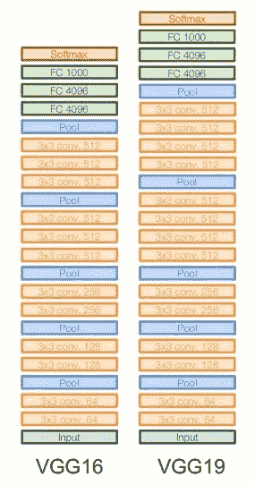

VGG 16 层和 VGG 19 层细节[2]

在 2014 年，有几个架构有了显著的不同，在性能上又有了一次飞跃，这些网络与更深层网络的主要区别是。

VGG 16 是 16 层体系结构，具有一对卷积层、池化层和最后的全连接层。VGG 网络是更深层次的网络和更小的过滤器。VGGNet 从 AlexNet 的八层增加了层数。现在它有 16 到 19 层的 VGGNet 版本。一个关键的事情是，这些模型始终保持非常小的 3 x 3 conv 过滤器，这基本上是最小的 conv 过滤器大小，查看一点点相邻像素。他们只是保持了这种非常简单的 3 x 3 convs 结构，并通过网络定期进行池化。

VGG 使用小过滤器，因为参数更少，并堆叠更多的过滤器，而不是更大的过滤器。VGG 有更小更深的过滤器，而不是大过滤器。它最终具有相同的有效感受野，就好像只有一个 7 x 7 卷积层一样。

VGGNet 有 conv 层和一个池层，还有几个 conv 层，池层，几个 conv 层等等。VGG 架构总共有 16 个卷积和全连接层。在这种情况下，VGG 16 有 16 层，VGG 19 有 19 层，这只是一个非常相似的架构，但其中多了几个 conv 层。

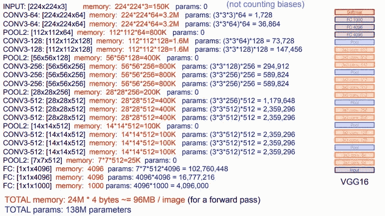

VGG16 参数[2]

因此，这是相当昂贵的计算，总共有 138M 参数，每个图像有 96MB 的内存，这比常规图像大得多。它在 ILSVRC 挑战中只有 7.3 的错误率。

> VGGNet 是 2014 年 ImageNet 大规模视觉识别挑战(ILSVRC)分类基准的亚军。

# 雷斯内特

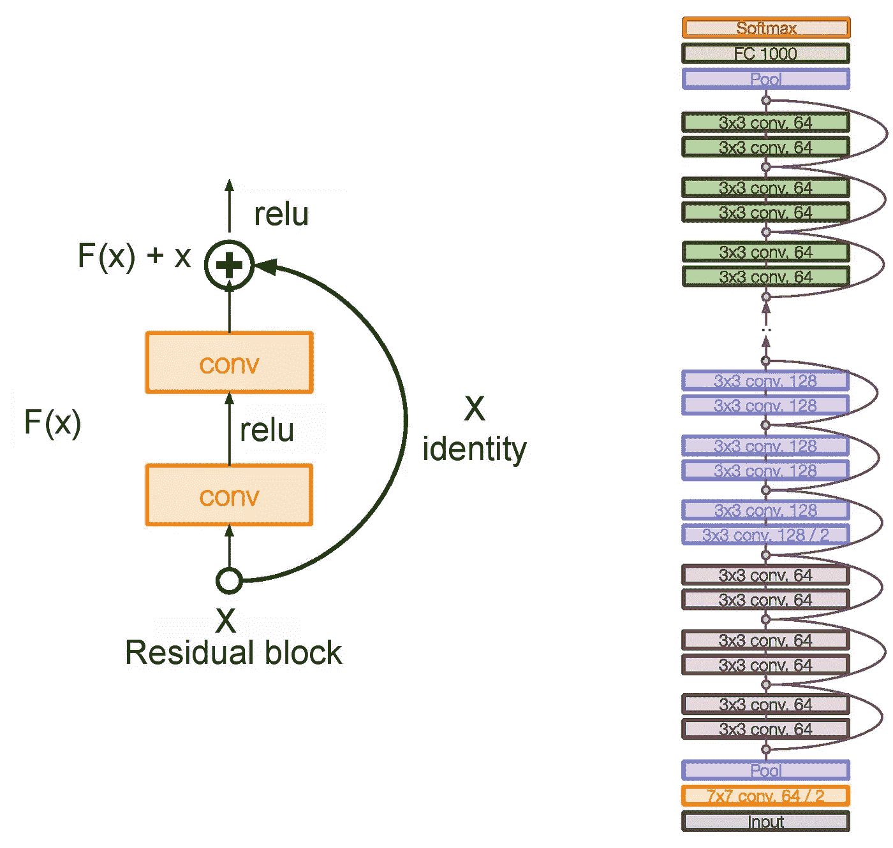

ResNet 架构和层细节[2]

ResNet 的主要基本元素是剩余块。随着我们深入到具有大量层的网络中，计算变得更加复杂。这些层放在彼此之上，每一层都试图学习所需函数的一些底层映射，而不是拥有这些块，我们试图拟合一个残差映射。

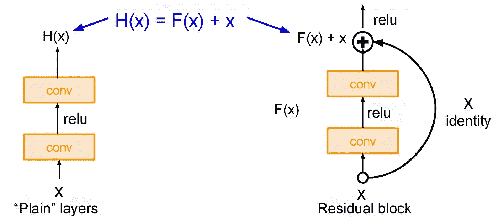

普通层与残余块[2]

在右边，这些模块的输入只是进来的输入，而在另一边，我们将使用我们的层来尝试拟合 H(X) - X 的一些残差，而不是直接拟合所需的函数 H(X)。基本上，在这个模块的末尾，它会跳过这里的连接，在这里，它只接受输入，并将其作为一个身份传递，因此，如果中间没有权重层，它就只是一个身份。这和输出是一样的，但是现在我们使用额外的权重层来学习一些 delta，一些来自 x 的残差。

简而言之，随着我们深入网络，学习 H(X)是如此困难，因为我们有大量的层。所以这里我们用了跳过连接和学习 F(x)直接输入 x 作为最终输出。所以 F(x)被称为残差。

在 ResNet 中，将所有这些块非常深入地堆叠在一起。这种非常深的架构的另一个特点是，它支持高达 150 层的深度，然后我们定期堆叠所有这些层。我们还将滤波器数量增加一倍，并使用步长 2 进行空间下采样。最后，只有完全连接的第 1000 层才能输出类。

## **超参数:**

在 ResNet 中，它在每个 conv 图层后使用批量归一化。它还使用 SGD + Momentum 的 Xavier 初始化。学习率为 0.1，当验证误差变为常数时，学习率除以 10。此外，批量大小为 256，重量衰减为 1e-5。重要的是，在 ResNet 中没有使用辍学。

> ResNet 以 3.6%的错误率在 ILSVRC 和 COCO 2015 比赛中获得第一名。(比人类的表现还要好！！！)

# 开始

Inception v3 是一种广泛使用的图像识别模型，已被证明在 ImageNet 数据集上获得了超过 78.1%的准确率。该模型是多年来由多名研究人员开发的许多想法的结合。

模型本身由对称和非对称构建块组成，包括卷积、平均池、最大池、漏失和完全连接层。Batchnorm 在整个模型中广泛使用，并应用于激活输入。损耗通过 Softmax 计算。

初始阶段的工作是分解卷积。分解卷积用于减少要学习的连接和参数的数量。这将提高速度并提供良好的性能。

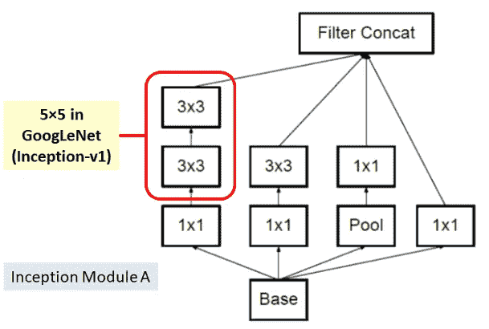

GoogleNet 使用 5x5 卷积层，而在 inception 中使用两个 3x3 层来减少学习参数的数量。在 5×5 中共有 25 个参数，3×3+3×3 中共有 18 个参数要学习。因此，无学习参数显著减少了 28%。

分解成非对称卷积也用于初始阶段，这也有助于减少学习参数。

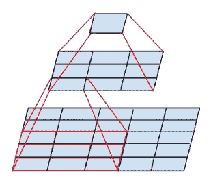

一个 3×1 卷积后跟一个 1×3 卷积代替一个 3×3 卷积。在一个 3×3 中总共有 9 个参数，而 3×1+1×3 总共有 6 个参数，所以它将减少 33%。这种方法不太可能在您深入训练时过度拟合模型。[4]

在 42 层深度的情况下，计算成本仅比 GoogleNet 高 2.5 倍左右，比 VGGNet 效率高得多。

> **Inception-v3 用 144 个作物和 4 个模型集合，得到 3.58%** 的前 5 名错误率，最终在 ILSVRC 2015 获得**亚军(影像分类)。**

# DenseNet

DenseNet 由如下所示的密集块组成。在这些块中，图层紧密地连接在一起:每一层都从以前的图层获得输入输出要素地图。残差的这种极端重用创建了深度监督，因为每一层都从前一层接收更多的监督，因此损失函数将做出相应的反应，并且由于这种方法，它使其成为更强大的网络。

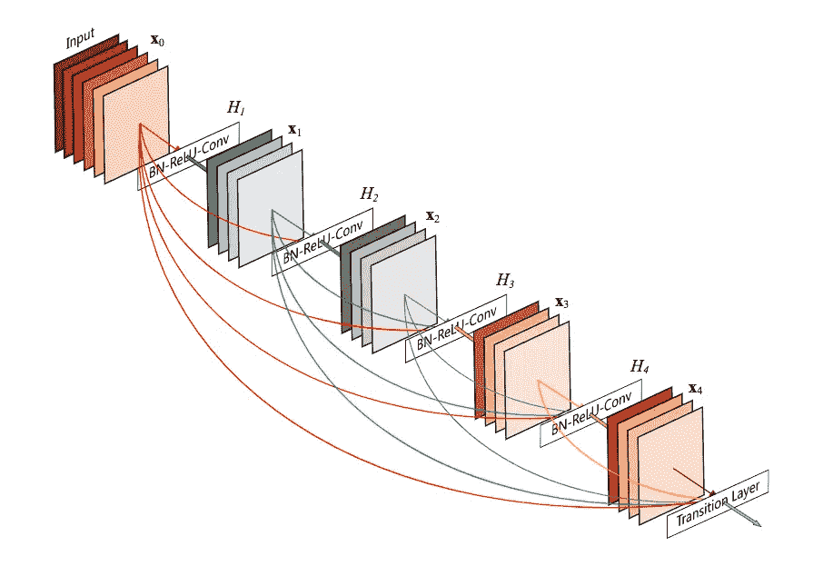

DenseNet 框图

DenseNet 由两个模块组成:

1.  致密块体:单个块体由这些层组成:

*   批量标准化
*   ReLU 激活
*   3x3 卷积

2.过渡层:在 ResNet 中将执行残差求和，而不是将残差求和 Densenet 连接所有的特征映射。这一层是由

*   批量标准化
*   1x1 卷积
*   平均池

基本上，Densenet 的卷积生成较少数量的特征图。DenseNet 对宽层的需求较低，因为层是紧密连接的，所以在学习的特征中几乎没有冗余。多层密集的块共享一块集体知识。层的输出特征地图的数量被定义为增长率。最终，增长率控制着每一层向全球贡献多少新信息。

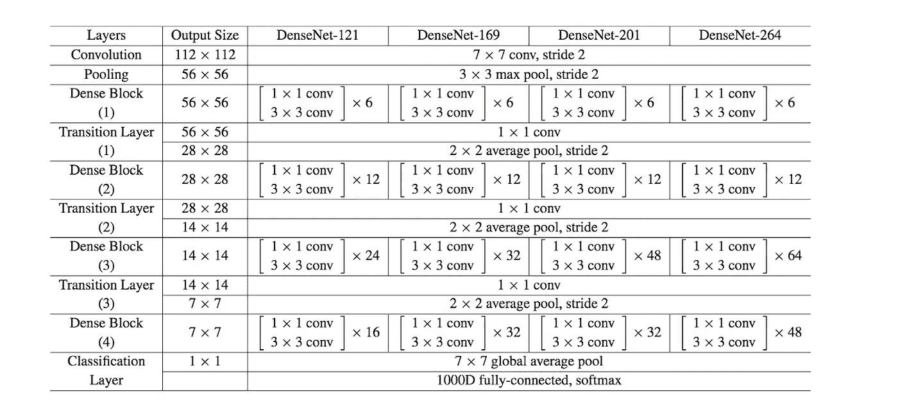

DenseNet 建筑

简而言之，DenseNet 架构最大限度地利用剩余机制，使每一层都与其后续层紧密相连。模型的紧凑性使得学习到的特征不冗余，因为它们都通过集体知识共享。以训练由于隐式深度监督而紧密连接的深度网络，其中梯度由于短连接而更容易回流。

参考资料:

[1]https://mc.ai/alexnet-review-and-implementation/

[2][http://cs 231n . Stanford . edu/slides/2019/cs 231n _ 2019 _ lecture 09 . pdf](http://cs231n.stanford.edu/slides/2019/cs231n_2019_lecture09.pdf)

[3][https://www . pyimagesearch . com/2017/03/20/imagenet-vggnet-resnet-inception-xception-keras/](https://www.pyimagesearch.com/2017/03/20/imagenet-vggnet-resnet-inception-xception-keras/)

[4][https://medium . com/@ sh . tsang/review-inception-v3-第一名-亚军-图片-分类-in-ils vrc-2015-17915421 f77c](https://medium.com/@sh.tsang/review-inception-v3-1st-runner-up-image-classification-in-ilsvrc-2015-17915421f77c)