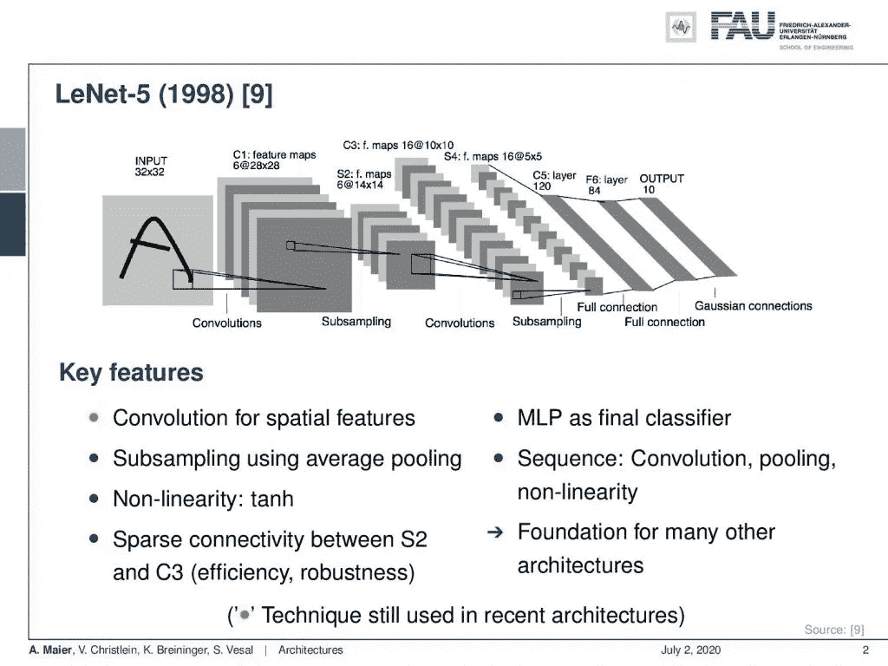

# 架构—第 1 部分

> 原文：<https://towardsdatascience.com/architectures-part-1-62c686f500c3?source=collection_archive---------48----------------------->

## [FAU 讲座笔记](https://towardsdatascience.com/tagged/fau-lecture-notes)关于深度学习

## 从 LeNet 到 GoogLeNet

FAU 大学的深度学习。下图 [CC BY 4.0](https://creativecommons.org/licenses/by/4.0/) 来自[深度学习讲座](https://www.youtube.com/watch?v=p-_Stl0t3kU&list=PLpOGQvPCDQzvgpD3S0vTy7bJe2pf_yJFj&index=1)

**这些是 FAU 的 YouTube 讲座** [**深度学习**](https://www.youtube.com/watch?v=p-_Stl0t3kU&list=PLpOGQvPCDQzvgpD3S0vTy7bJe2pf_yJFj&index=1) **的讲义。这是讲座视频&配套幻灯片的完整抄本。我们希望，你喜欢这个视频一样多。当然，这份抄本是用深度学习技术在很大程度上自动创建的，只进行了少量的手动修改。如果你发现了错误，请告诉我们！**

# 航行

[**上一讲**](/common-practices-part-4-70c08fce3588) **/** [**观看本视频**](https://youtu.be/H4K3AY7xRy8) **/** [**顶级**](/all-you-want-to-know-about-deep-learning-8d68dcffc258) **/** [**下一讲**](/architectures-part-2-2d2ac8f7458e)

欢迎回到深度学习，你可以在视频中看到，我有几个升级。我们现在有了更好的录音质量，我希望你也能看到我最终解决了声音问题。你现在应该能听得更清楚了。我们回来参加新的会议，我们想谈谈几个令人兴奋的话题。让我们看看我为你准备了什么。所以今天我想开始讨论不同的架构。特别是，在前几个视频中，我想谈谈早期的架构。我们在深度学习的早期看到的东西。接下来，我们将在后面的视频中探讨更深入的模型，最后我们想谈谈学习架构。

为了更快地测试架构，可以使用更小的数据集。 [CC 下的图片来自](https://creativecommons.org/licenses/by/4.0/)[深度学习讲座](https://www.youtube.com/watch?v=p-_Stl0t3kU&list=PLpOGQvPCDQzvgpD3S0vTy7bJe2pf_yJFj&index=1)的 4.0 。

我们将在接下来的几张幻灯片和视频中看到的许多内容当然是为图像识别和物体检测任务开发的。特别是两个数据集对这类任务非常重要。这是你在[11]中找到的 ImageNet 数据集。它有大约 1000 个类和超过 1400 万张图片。子集已用于 ImageNet 大规模视觉识别挑战。它包含不同大小的自然图像。所以，很多这样的图片实际上是从网上下载的。如果你不想马上用几百万张图片进行训练，也有更小的数据集。所以，它们也很重要。CIFAR 10 和 CIFAR 100 分别有 10 个和 100 个类。在这两种情况下，我们只有 50k 训练和 10k 测试映像。为了能够快速探索不同的架构，图像缩小到 32 x 32。如果你有这些更小的数据集，那么训练也不需要这么长时间。所以如果你想评估你的架构，这也是一个很常见的数据集。

Yann LeCun 的 LeNet 是深度学习短暂历史中的一个里程碑式的架构。来自[深度学习讲座](https://www.youtube.com/watch?v=p-_Stl0t3kU&list=PLpOGQvPCDQzvgpD3S0vTy7bJe2pf_yJFj&index=1)的 [CC BY 4.0](https://creativecommons.org/licenses/by/4.0/) 下的图片。

基于这些不同的数据集，我们接下来想继续研究早期的架构。我认为其中最重要的是 LeNet，它于 1998 年在[9]中发表。你可以看到这本质上是我们迄今为止一直在讨论的卷积神经网络(CNN)。例如，它已经被用于字母识别。我们有具有可训练内核和池化的卷积层、另一组卷积层和另一个池化操作，最后，我们将进入完全连接的层。因此，我们逐渐减少维度，最后，我们有对应于类的数量的输出层。这是一个非常典型的 CNN 类型的架构，这种方法已经在许多论文中使用。这激发了很多工作。我们为这里的每个体系结构都提供了关键功能，您可以看到，这里的大部分项目符号都是灰色的。这意味着这些特征中的大部分没有保留下来。当然，这里保留下来的是空间特征的卷积。这是仍然流行的主要观点。所有其他的事情，比如使用平均池的二次抽样，都没有经过时间的考验。它仍然用双曲正切作为非线性。这是一个不太深入的模型，对吗？然后，它在 S2 层和 C3 层之间有稀疏的连接，如图所示。因此，多层感知器作为最终分类器也不再常见。我们不再看到这种情况，因为它已经被完全卷积网络所取代。这是一种更加灵活的方法，卷积池和非线性的顺序也是固定的。今天，我们将以一种更好的方式做到这一点，当然，这种架构是许多进一步发展的基础。所以，我认为把它列在这里真的很重要。

AlexNet 引发了深度学习的大趋势。 [CC 下的图片来自](https://creativecommons.org/licenses/by/4.0/)[深度学习讲座](https://www.youtube.com/watch?v=p-_Stl0t3kU&list=PLpOGQvPCDQzvgpD3S0vTy7bJe2pf_yJFj&index=1)的 4.0 。

我想在这个视频中谈论的下一个里程碑是 AlexNet。你可以在这里找到典型的图像。顺便说一句，您会在原始出版物中找到完全相同的图像。因此，Alex net 由这两个分支组成，你可以看到，即使在最初的出版物中，顶部的分支也被切成了两半。所以，当提到这个图形时，你会在 AlexNet 的许多表示中发现一种人工制品。所以，这个图形被分割成几部分，但并没有那么严重，因为这两部分本质上是相同的。你可以说，它被分成两个子网络的原因之一是因为 AlexNet 已经在图形处理单元(GPU)上实现。这是在 GPU 上实现的，实际上已经是多 GPU 了。所以，你在顶部看到的两个分支，已经在两个不同的图形处理单元上实现，它们也可以被训练，然后使用软件同步。所以，GPU 当然是一个仍然非常普遍的功能。你知道今天深度学习的每个人都非常依赖图形处理单元。正如我们在这节课中多次看到的，它基本上有八层。所以不是那么深的关系网。它有重叠的最大池，步幅为 2，大小为 3。它引入了 ReLU 非线性，这也是当今非常常用的方法。所以这也是一个很重要的特点。当然，它是 2012 年 ImageNet 挑战赛的获胜者，该挑战赛将错误率降低了一半。所以这真的是 CNN 突破的里程碑之一。我们还有什么？为了对抗这种架构中的过拟合，已经在前两个完全连接的层中使用了概率为 0.5 的丢失。此外，还包括数据扩充。所以有随机的变换和随机的强度变化。另一个关键特征是，它一直采用动量为 0.9 的小批量随机梯度下降和 L2 重量衰减，参数设置为 5 倍 10⁻⁵.它使用了一个相当简单的权重初始化。只是用一个正态分布和一个小的标准差。在之前的讲座中，我们已经看到了更好的方法。还有什么重要的？好吧，我们已经看到 GPU 分离是有历史原因的。当时的 GPU 太小，无法托管整个网络，所以它被分成两个 GPU。

网络中的网络论文介绍了 1x1 卷积。来自[深度学习讲座](https://www.youtube.com/watch?v=p-_Stl0t3kU&list=PLpOGQvPCDQzvgpD3S0vTy7bJe2pf_yJFj&index=1)的 [CC BY 4.0](https://creativecommons.org/licenses/by/4.0/) 下的图片。

另一篇重要论文是“网络中的网络”论文，其中介绍了 1x1 滤波器。这最初被描述为网络中的网络，但实际上我们今天称之为 1x1 卷积，因为它们实际上在通道上引入了完全连接的层。如果你想压缩通道，我们现在经常使用这个方法，因为我们在通道维度上完全连接。这非常好，因为我们已经看到这相当于一个完全连接的层。我们现在可以根据 1x1 卷积来集成完全连接的层，这使我们能够实现完全卷积网络的这一非常好的概念。因此，在所有激活中共享的参数非常少。使用全局空间平均池作为最后一层，这实质上是完全卷积神经网络的诞生。

VGG 是一个受欢迎的建筑，因为它可以预先训练。 [CC 下的图片来自](https://creativecommons.org/licenses/by/4.0/)[深度学习讲座](https://www.youtube.com/watch?v=p-_Stl0t3kU&list=PLpOGQvPCDQzvgpD3S0vTy7bJe2pf_yJFj&index=1)的 4.0 。

另一个非常重要的架构是牛津大学视觉几何小组(VGG)的 VGG 网络。他们在每个卷积中引入了小的内核大小。这个网络也很常见，因为它可以下载。因此，有一些预先训练好的模型可供使用，您可以看到，它们在这个网络中的关键特征是，它们在逐步增加通道维度的同时，基本上减少了空间维度。这是一个从空间域到分类器重要解释域的逐步转换。因此，我们可以看到空间维度下降，同时通道维度上升。这让我们逐渐从彩色图像向意义转化。所以，我认为小内核是仍然被使用的关键特性。它通常用于 16 层和 19 层，在某些层之间有最大池。学习过程与 AlexNet 非常相似，但结果证明很难训练。在实践中，你需要用较浅的网络进行预训练来构建这个。因此，该网络在性能方面不是很好，并且有很多参数，但它是预先训练好的，并且是可用的。因此这也导致了社区相当广泛地采用它。所以，你也可以看到，当你使用开源和可访问的软件时，这也是一个关键的特性，对其他人来说很重要，以便开发进一步的概念。参数可以共享。训练好的模型可以共享。源代码可以共享。这就是为什么我认为这是深度学习领域中一个非常重要的实例。

GoogLeNet 引入了几个新概念。 [CC 下的图片来自](https://creativecommons.org/licenses/by/4.0/)[深度学习讲座](https://www.youtube.com/watch?v=p-_Stl0t3kU&list=PLpOGQvPCDQzvgpD3S0vTy7bJe2pf_yJFj&index=1)的 4.0 。

另一个重要的网络，我们已经在这个讲座的很多场合看到过，是 GoogleNet。这里，我们有你在[14]中找到的盗梦空间 V1 版本。我想我想在这里强调的要点是，他们有非常好的想法，通过使用一些技巧来节省计算。因此，他们开发这些网络时考虑到了嵌入式硬件，并且它还在推理时间内进行了 15 亿次乘加运算(MAD)。这很酷，但我发现更酷的是这些初始块。因此，总共有 22 层，全球平均池作为最后一层。这些初始模块真的很好，我们将在下一张幻灯片中更详细地讨论它们，因为它们本质上允许您让网络决定它是想要共享还是想要卷积。这太酷了。另一个非常好的技巧是使用这些辅助分类器，它们应用于早期的层，以稳定梯度。所以，这个想法是你把你的损失插入到一些更早期的层中，在那里你已经试图找出一个初步的分类。这有助于建立更深层次的模型，因为你可以在相当早的阶段引入损失。你知道，你进入网络越深，你越是去更早的层，你越有可能得到一个消失的梯度。有了这些辅助分类器，可以在一定程度上预防。例如，如果你想弄清楚你真正需要多少个 inceptions 模块，这也是非常有用的。然后，您可以使用那些腋窝分类器。这真是一个非常有趣的概念。

初始模块概述。来自[深度学习讲座](https://www.youtube.com/watch?v=p-_Stl0t3kU&list=PLpOGQvPCDQzvgpD3S0vTy7bJe2pf_yJFj&index=1)的 [CC BY 4.0](https://creativecommons.org/licenses/by/4.0/) 下的图片。

因此，让我们谈一谈那些初始模块。顺便说一下，inception 模块当然是已经存在了相当长一段时间的东西，它仍然在许多最先进的深度学习模型中使用。所以通过这些网络有不同的分支。就像只有一个 1x1 卷积，一个 1x1 卷积后一个 3x3 卷积，或 1x1 卷积后一个 5x5 卷积，或最大池后一个 1x1 卷积。因此，所有这些分支并行进行，然后将分支的输出连接起来，提供给下一层。因此，本质上这允许网络决定在下一层信任哪个分支。这样，它可以以某种方式确定它是否想要池或是否想要卷积。所以，你可以把它看作是在训练过程中确定的自动路径。

1x1 卷积能够压缩信道并节省计算时间。 [CC 下的图片来自](https://creativecommons.org/licenses/by/4.0/)[深度学习讲座](https://www.youtube.com/watch?v=p-_Stl0t3kU&list=PLpOGQvPCDQzvgpD3S0vTy7bJe2pf_yJFj&index=1)的 4.0 。

同样有趣的是，1x1 滤波器充当了一种瓶颈层。因此，您可以使用它来压缩先前层的通道。然后，你可以压缩，然后卷积。尽管如此，如果你完全按照这种方式实现，还是有很多计算。因此，他们的想法是使用这个瓶颈层来压缩不同特征图之间的相关性。想法是你有这些 1x1 滤波器。你所做的是省略额外的计算。假设您通过一个 3×3 卷积路由 256 个输入特征地图和 256 个输出特征地图，这将意味着您已经有大约 600，000 个乘加操作。所以相反，你用这些瓶颈想法。通过 1x1 卷积将通道从 256 压缩到 64。然后对 64 个通道进行 3×3 卷积。接下来，您基本上再次从 64 通道解压缩到 256 通道。这节省了大量计算。总的来说，你需要大约 70.000 次乘加运算。如果你看看最初的 600，000 次乘加运算，那么你可以看到我们已经节省了大量的计算运算。

在这个深度学习讲座中，更多令人兴奋的事情即将到来。来自[深度学习讲座](https://www.youtube.com/watch?v=p-_Stl0t3kU&list=PLpOGQvPCDQzvgpD3S0vTy7bJe2pf_yJFj&index=1)的 [CC BY 4.0](https://creativecommons.org/licenses/by/4.0/) 下的图片。

好的，这些本质上是经典的深度学习架构。我们想在第二部分讨论更复杂的问题，在那里我想向你展示如何更深入，以及你如何有效地做到这一点，例如用其他版本的 inception 模块。非常感谢大家的收听，希望在下一段视频中再见！

如果你喜欢这篇文章，你可以在这里找到更多的文章，或者看看我们的讲座。如果你想在未来了解更多的文章、视频和研究，我也会很感激关注 [YouTube](https://www.youtube.com/c/AndreasMaierTV) 、 [Twitter](https://twitter.com/maier_ak) 、[脸书](https://www.facebook.com/andreas.maier.31337)或 [LinkedIn](https://www.linkedin.com/in/andreas-maier-a6870b1a6/) 。本文以 [Creative Commons 4.0 归属许可](https://creativecommons.org/licenses/by/4.0/deed.de)发布，如果引用，可以转载和修改。

# 参考

[1] Klaus Greff、Rupesh K. Srivastava 和 Jürgen Schmidhuber。“高速公路和残差网络学习展开的迭代估计”。年:学习代表国际会议(ICLR)。土伦，2017 年 4 月。arXiv: 1612.07771。
[2]何，，，任，等.“深度残差学习用于图像识别”。In: 2016 年 IEEE 计算机视觉与模式识别大会(CVPR)。拉斯维加斯，2016 年 6 月，第 770–778 页。arXiv: 1512.03385。
[3]何，，，，任等.“深剩余网络中的身份映射”。载于:计算机视觉— ECCV 2016:第 14 届欧洲会议，荷兰阿姆斯特丹，2016 年，第 630–645 页。arXiv: 1603.05027。
[4]胡经昌、沈立群、孙广昌。“挤压和激励网络”。载于:ArXiv 电子版(2017 年 9 月)。arXiv: 1709.01507 [cs。简历】。
[5]黄高，孙玉，刘庄等，“具有随机深度的深度网络”。载于:计算机视觉-ECCV 2016，会议录，第四部分。湛:施普林格国际出版公司，2016 年，第 646–661 页。
[6]黄高、刘庄和基利安·q·温伯格。“密集连接的卷积网络”。In: 2017 年 IEEE 计算机视觉与模式识别大会(CVPR)。檀香山，2017 年 7 月。arXiv: 1608.06993。亚历克斯·克里热夫斯基、伊利亚·苏茨基弗和杰弗里·E·辛顿。“使用深度卷积神经网络的 ImageNet 分类”。神经信息处理系统进展 25。柯伦咨询公司，2012 年，第 1097-1105 页。arXiv: 1102.0183。
[8] Yann A LeCun，Léon Bottou，Genevieve B Orr 等著《有效反向推进》。神经网络:交易技巧:第二版。第 75 卷。柏林，海德堡:施普林格柏林海德堡，2012 年，第 9-48 页。
【9】Y le Cun，L Bottou，Y Bengio 等，“基于梯度的学习应用于文档识别”。摘自:IEEE 86.11 会议录(1998 年 11 月)，第 2278-2324 页。arXiv: 1102.0183。
【10】、，与水城颜。“网络中的网络”。国际学习代表会议。加拿大班夫，2014 年 4 月。arXiv: 1102.0183。
[11] Olga Russakovsky，贾登，苏浩等，“ImageNet 大规模视觉识别挑战赛”。摘自:《国际计算机视觉杂志》115.3(2015 年 12 月)，第 211–252 页。
[12]卡伦·西蒙扬和安德鲁·齐塞曼。“用于大规模图像识别的非常深的卷积网络”。年:学习代表国际会议(ICLR)。2015 年 5 月，圣地亚哥。arXiv: 1409.1556。
[13]鲁佩什·库马尔·斯里瓦斯塔瓦，克劳斯·格雷夫，乌尔根·施密德胡伯等，《训练非常深的网络》。神经信息处理系统进展 28。柯伦咨询公司，2015 年，第 2377-2385 页。arXiv: 1507.06228。
[14]塞格迪、、、贾等著《用回旋深化》。In: 2015 年 IEEE 计算机视觉与模式识别会议(CVPR)。2015 年 6 月，第 1–9 页。
[15] C. Szegedy，V. Vanhoucke，S. Ioffe 等，“重新思考计算机视觉的初始架构”。In: 2016 年 IEEE 计算机视觉与模式识别大会(CVPR)。2016 年 6 月，第 2818–2826 页。
[16]克里斯蒂安·塞格迪、谢尔盖·约菲和文森特·万霍克。“Inception-v4，Inception-ResNet 和剩余连接对学习的影响”。In:第三十一届 AAAI 人工智能会议(AAAI-17) Inception-v4，三藩市，2017 年 2 月。arXiv: 1602.07261。
[17]安德烈亚斯·韦特、迈克尔·J·威尔伯和塞尔日·贝隆吉。“残差网络的行为类似于相对较浅的网络的集合”。神经信息处理系统进展 29。柯伦联合公司，2016 年，第 550–558 页。
【18】谢地、蒋雄、石梁浦。“你所需要的只是一个好的 Init:探索更好的解决方案来训练具有正交性和调制的极深度卷积神经网络”。In: 2017 年 IEEE 计算机视觉与模式识别大会(CVPR)。檀香山，2017 年 7 月。arXiv: 1703.01827。
[19]谢灵犀与。遗传 CNN。技术。众议员 2017。arXiv: 1703.01513。
[20]谢尔盖·扎戈鲁伊科和尼科斯·科莫达基斯。“广残网”。英国机器视觉会议(BMVC)会议录。BMVA 出版社，2016 年 9 月，第 87.1–87.12 页。
【21】K .张，M .孙，X .韩等《残差网络的残差网络:多级残差网络》。载于:IEEE 视频技术电路与系统汇刊第 99 页(2017)，第 1 页。
[22]巴雷特·佐夫，维贾伊·瓦苏德万，黄邦贤·施伦斯等人,《学习可扩展的可转移架构》