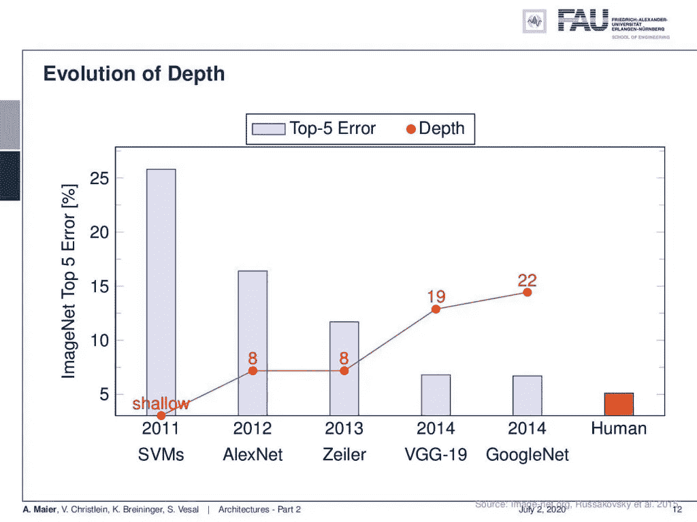
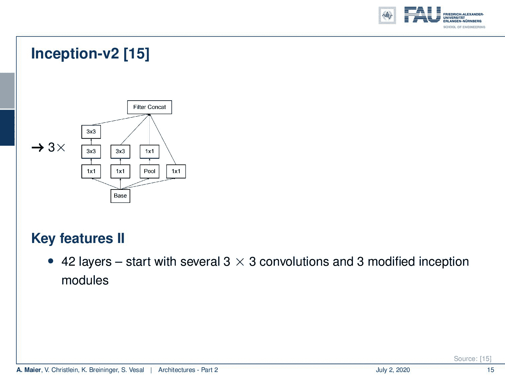
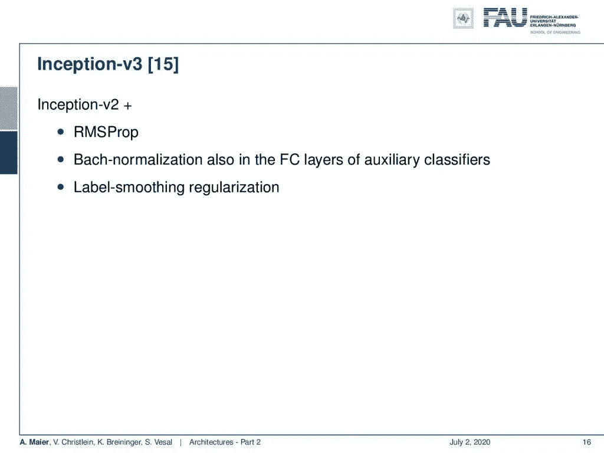

# 架构—第 2 部分

> 原文：<https://towardsdatascience.com/architectures-part-2-2d2ac8f7458e?source=collection_archive---------51----------------------->

## [FAU 讲座笔记](https://towardsdatascience.com/tagged/fau-lecture-notes)关于深度学习

## 更深层的架构

FAU 大学的深度学习。下图 [CC BY 4.0](https://creativecommons.org/licenses/by/4.0/) 来自[深度学习讲座](https://www.youtube.com/watch?v=p-_Stl0t3kU&list=PLpOGQvPCDQzvgpD3S0vTy7bJe2pf_yJFj&index=1)

**这些是 FAU 的 YouTube 讲座** [**深度学习**](https://www.youtube.com/watch?v=p-_Stl0t3kU&list=PLpOGQvPCDQzvgpD3S0vTy7bJe2pf_yJFj&index=1) **的讲义。这是与幻灯片匹配的讲座视频&的完整抄本。我们希望，你喜欢这个视频一样多。当然，这份抄本是用深度学习技术在很大程度上自动创建的，只进行了少量的手动修改。如果你发现了错误，请告诉我们！**

# 航行

[**上一讲**](/architectures-part-1-62c686f500c3) **/** [**观看本视频**](https://youtu.be/8IULwh7xbCE) **/** [**顶级**](/all-you-want-to-know-about-deep-learning-8d68dcffc258) **/** [**下一讲**](/architectures-part-3-34dcfd979344)

更深的结构产生更好的性能。 [CC 下的图片来自](https://creativecommons.org/licenses/by/4.0/)[深度学习讲座](https://www.youtube.com/watch?v=p-_Stl0t3kU&list=PLpOGQvPCDQzvgpD3S0vTy7bJe2pf_yJFj&index=1)的 4.0 。

欢迎回到深度学习！今天我想谈谈架构的第二部分。现在，我们想在第二部分更深入一点:更深入的模型。因此，我们看到更深入的研究确实对错误率非常有益。所以，你可以在 ImageNet 上看到结果。在 2011 年，使用浅层支持向量机，您可以看到错误率非常高，达到 25%。AlexNet 在 2012 年已经几乎将它削减了一半。2013 年，泽勒再次以八层赢得冠军。2014 年 VGG:19 层。2014 年的 Google net:22 层，性能也差不多。因此，你可以看到，我们增加的深度越多，性能似乎就越好。我们可以看到只剩下一点点的差距来击败人类的表现。

深度网络允许指数级特征重用。 [CC 下的图片来自](https://creativecommons.org/licenses/by/4.0/)[深度学习讲座](https://www.youtube.com/watch?v=p-_Stl0t3kU&list=PLpOGQvPCDQzvgpD3S0vTy7bJe2pf_yJFj&index=1)的 4.0 。

深度似乎在构建良好的网络中扮演着关键角色。为什么会这样呢？这些更深层次的网络可能非常有效的一个原因是我们称之为指数特征重用的东西。这里你可以看到我们是否只有两个特征。如果我们把神经元堆在上面，你可以看到可能的路径数量呈指数增长。有了两个神经元，我就有了两条路。有了另一层神经元，我就有了路径。有三层路径，⁴路径等等。因此，更深层次的网络似乎能够重用以前各层的信息。我们也可以看到，如果我们看看他们在做什么。[如果我们生成 get 这些可视化](https://youtu.be/pdO7cz9pWy4)，我们会看到它们越来越多地构建更抽象的表示。所以，我们不知何故看到了某种模块化的发生。我们认为深度学习之所以有效，是因为我们能够在不同的位置拥有不同的功能部分。因此，我们正在以某种方式将处理过程分解为更简单的步骤，然后我们本质上训练一个具有多个步骤的程序，它能够描述越来越多的抽象表示。这里我们看到了第一层，它们可能有边缘和斑点。比方说，第三层检测到这些纹理。第五层感知对象部分，第八层已经是对象类。这些图片是从 AlexNet 的可视化中创建的。所以你可以看到，这似乎真的在网络中发生了。这大概也是深度学习奏效的一个关键原因。当我们试图在不同的位置计算不同的东西时，我们能够解开这个函数。

堆积回旋允许接近更大的内核。 [CC 下的图片来自](https://creativecommons.org/licenses/by/4.0/)[深度学习讲座](https://www.youtube.com/watch?v=p-_Stl0t3kU&list=PLpOGQvPCDQzvgpD3S0vTy7bJe2pf_yJFj&index=1)的 4.0 。

嗯，我们想更深入一些，这里已经实现的一项技术是初始模块。改进的初始模块现在基本上用 5x5 卷积和 3x3 卷积取代了我们看到的那些过滤器，变成了这些结论的倍数。不是做 5x5 的卷积，而是连续做两个 3x3 的卷积。这已经节省了一些计算，然后您可以通过在顶部堆叠过滤器来替换 5x5 过滤器。我们可以看到，这实际上适用于各种各样的内核，您实际上可以将它们分成几个步骤。所以，你可以把它们串联起来。这种滤波器级联也是典型的计算机视觉课程中会讨论的内容。

可分离卷积允许从一维滤波器创建二维卷积。来自[深度学习讲座](https://www.youtube.com/watch?v=p-_Stl0t3kU&list=PLpOGQvPCDQzvgpD3S0vTy7bJe2pf_yJFj&index=1)的 [CC BY 4.0](https://creativecommons.org/licenses/by/4.0/) 下的图片。

所以《盗梦空间 V2》已经有 42 层了。他们从本质上的 3x3 卷积和三个修改的初始模块开始，就像我们刚刚看到的。然后在下一层中，引入了一种有效的网格尺寸缩减方法，即使用步长卷积。因此，通道压缩有 1x1 卷积，步长为 1 的 3x3 卷积，后跟步长为 2 的 3x3 卷积。这实际上有效地取代了不同的池操作。下一个想法是引入五次平坦卷积模块。这里的想法是不再用二维卷积来表示卷积，而是把它们分成 x 和 y 方向的卷积。你交替产生这两个卷积。这里可以看到，我们从左侧分支的 1x1 卷积开始。然后我们进行 1x *n* 卷积，接着进行 *n* x1 卷积，接着进行 1x *n* 卷积，依此类推。这允许我们将内核分解成两个方向。所以，你知道，因为你交替地改变卷积的方向，你实际上是通过强制可分计算来分解二维卷积。我们还可以看到，卷积滤波器的分离适用于多种滤波器。当然，这是一个限制，因为它不允许所有可能的计算。但是请记住，我们在前面的层中有完整的 3x3 卷积。所以他们已经可以学习如何为后面的层采用。结果，它们可以被可分离卷积处理。

Inception V3 的特性。来自[深度学习讲座](https://www.youtube.com/watch?v=p-_Stl0t3kU&list=PLpOGQvPCDQzvgpD3S0vTy7bJe2pf_yJFj&index=1)的 4.0CC 下的图片。

这就导致了 Inception V3。对于 Inception 的第三个版本，他们基本上使用了 Inception V2，并为训练过程引入了 RMSprop，还在辅助分类器的完全连接层中引入了批量归一化，以及标签平滑正则化。

标注平滑有助于消除标注噪点。 [CC 下的图片来自](https://creativecommons.org/licenses/by/4.0/)[深度学习讲座](https://www.youtube.com/watch?v=p-_Stl0t3kU&list=PLpOGQvPCDQzvgpD3S0vTy7bJe2pf_yJFj&index=1)的 4.0 。

标签平滑正则化是一个非常酷的技巧。所以让我们再花几分钟来研究一下这个想法。现在，如果你想想我们的标签向量通常是什么样子，我们有一个热编码向量。这意味着我们的标签本质上是狄拉克分布。这实质上是说，一个元素是正确的，所有其他元素都是错误的。我们通常使用 softmax。所以这意味着我们的激活趋向于无穷大。这并不太好，因为我们继续学习越来越大的权重，使它们变得越来越极端。所以，我们可以通过重量衰减来防止这种情况。这将防止我们的体重急剧增加。此外，我们还可以使用标签平滑。标签平滑的想法是，我们不是只使用狄拉克脉冲，而是将概率质量涂抹到其他类上。这是非常有用的，特别是在像 ImageNet 这样的地方，你有相当嘈杂的标签。你还记得那些不完全清楚的案例。在这些嘈杂的标签情况下，您可以看到这种标签平滑真的很有帮助。这个想法是，你把你的狄拉克分布乘以 1 减去一些小的ϵ.然后，将从正确类中扣除的ϵ平均分配给所有其他类。你可以看到这就是 1/K，其中 K 是类的数量。这种标签平滑的好处在于，你基本上不鼓励做出非常艰难的决定。这在有噪声标签的情况下非常有用。所以这是一个非常好的技巧，可以帮助你建立更深层次的模型。

在这个深度学习讲座中，更多令人兴奋的事情即将到来。 [CC 下的图片来自](https://creativecommons.org/licenses/by/4.0/)[深度学习讲座](https://www.youtube.com/watch?v=p-_Stl0t3kU&list=PLpOGQvPCDQzvgpD3S0vTy7bJe2pf_yJFj&index=1)的 4.0 。

下一次，我们想看看如何构建那些真正深度的模型。就我们目前所见，我们会问:为什么不在顶部堆叠更多层呢？如果你尝试这样做，会出现一些问题，我们将在下一个视频中探究原因。我们也将提出一些真正深入的解决方案。非常感谢大家的收听，下期视频再见。

如果你喜欢这篇文章，你可以在这里找到更多的文章，或者看看我们的讲座。如果你想在未来了解更多的文章、视频和研究，我也会很感激关注 [YouTube](https://www.youtube.com/c/AndreasMaierTV) 、 [Twitter](https://twitter.com/maier_ak) 、[脸书](https://www.facebook.com/andreas.maier.31337)或 [LinkedIn](https://www.linkedin.com/in/andreas-maier-a6870b1a6/) 。本文以 [Creative Commons 4.0 归属许可](https://creativecommons.org/licenses/by/4.0/deed.de)发布，如果引用，可以转载和修改。

# 参考

[1] Klaus Greff、Rupesh K. Srivastava 和 Jürgen Schmidhuber。“高速公路和残差网络学习展开的迭代估计”。年:学习代表国际会议(ICLR)。土伦，2017 年 4 月。arXiv: 1612.07771。
[2]何，，，任，等.“深度残差学习用于图像识别”。In: 2016 年 IEEE 计算机视觉与模式识别大会(CVPR)。拉斯维加斯，2016 年 6 月，第 770–778 页。arXiv: 1512.03385。
[3]何，，，，任等.“深剩余网络中的身份映射”。载于:计算机视觉— ECCV 2016:第 14 届欧洲会议，荷兰阿姆斯特丹，2016 年，第 630–645 页。arXiv: 1603.05027。
[4]胡经昌、沈立群、孙广昌。“挤压和激励网络”。载于:ArXiv 电子版(2017 年 9 月)。arXiv: 1709.01507 [cs。简历】。
[5]黄高，孙玉，刘庄等，“具有随机深度的深度网络”。载于:计算机视觉-ECCV 2016，会议录，第四部分。湛:施普林格国际出版公司，2016 年，第 646–661 页。
[6]黄高、刘庄和基利安·q·温伯格。“密集连接的卷积网络”。In: 2017 年 IEEE 计算机视觉与模式识别大会(CVPR)。檀香山，2017 年 7 月。arXiv: 1608.06993。亚历克斯·克里热夫斯基、伊利亚·苏茨基弗和杰弗里·E·辛顿。“使用深度卷积神经网络的 ImageNet 分类”。神经信息处理系统进展 25。柯伦咨询公司，2012 年，第 1097-1105 页。arXiv: 1102.0183。
[8] Yann A LeCun，Léon Bottou，Genevieve B Orr 等著《有效反向推进》。神经网络:交易技巧:第二版。第 75 卷。柏林，海德堡:施普林格柏林海德堡，2012 年，第 9-48 页。
【9】Y le Cun，L Bottou，Y Bengio 等，“基于梯度的学习应用于文档识别”。摘自:IEEE 86.11 会议录(1998 年 11 月)，第 2278-2324 页。arXiv: 1102.0183。
【10】、，与水城颜。“网络中的网络”。国际学习代表会议。加拿大班夫，2014 年 4 月。arXiv: 1102.0183。
[11] Olga Russakovsky，贾登，苏浩等，“ImageNet 大规模视觉识别挑战赛”。摘自:《国际计算机视觉杂志》115.3(2015 年 12 月)，第 211–252 页。
[12]卡伦·西蒙扬和安德鲁·齐塞曼。“用于大规模图像识别的非常深的卷积网络”。年:学习代表国际会议(ICLR)。2015 年 5 月，圣地亚哥。arXiv: 1409.1556。
[13]鲁佩什·库马尔·斯里瓦斯塔瓦，克劳斯·格雷夫，乌尔根·施密德胡伯等，《训练非常深的网络》。神经信息处理系统进展 28。柯伦咨询公司，2015 年，第 2377-2385 页。arXiv: 1507.06228。
[14]塞格迪、、、贾等著《用回旋深化》。In: 2015 年 IEEE 计算机视觉与模式识别会议(CVPR)。2015 年 6 月，第 1–9 页。
[15] C. Szegedy，V. Vanhoucke，S. Ioffe 等，“重新思考计算机视觉的初始架构”。In: 2016 年 IEEE 计算机视觉与模式识别大会(CVPR)。2016 年 6 月，第 2818–2826 页。
[16]克里斯蒂安·塞格迪、谢尔盖·约菲和文森特·万霍克。“Inception-v4，Inception-ResNet 和剩余连接对学习的影响”。In:第三十一届 AAAI 人工智能会议(AAAI-17) Inception-v4，三藩市，2017 年 2 月。arXiv: 1602.07261。
[17]安德烈亚斯·韦特、迈克尔·J·威尔伯和塞尔日·贝隆吉。“残差网络的行为类似于相对较浅的网络的集合”。神经信息处理系统进展 29。柯伦联合公司，2016 年，第 550–558 页。
【18】谢地、蒋雄、石梁浦。“你所需要的只是一个好的 Init:探索更好的解决方案来训练具有正交性和调制的极深度卷积神经网络”。In: 2017 年 IEEE 计算机视觉与模式识别大会(CVPR)。檀香山，2017 年 7 月。arXiv: 1703.01827。
[19]谢灵犀与。遗传 CNN。技术。众议员 2017。arXiv: 1703.01513。
[20]谢尔盖·扎戈鲁伊科和尼科斯·科莫达基斯。“广残网”。英国机器视觉会议(BMVC)会议录。BMVA 出版社，2016 年 9 月，第 87.1–87.12 页。
【21】K .张，M .孙，X .韩等《残差网络的残差网络:多级残差网络》。载于:IEEE 视频技术电路与系统汇刊第 99 页(2017)，第 1 页。
[22]巴雷特·佐夫，维贾伊·瓦苏德万，黄邦贤·施伦斯等人,《学习可扩展的可转移架构》