# 架构—第 3 部分

> 原文：<https://towardsdatascience.com/architectures-part-3-34dcfd979344?source=collection_archive---------45----------------------->

## [FAU 讲座笔记](https://towardsdatascience.com/tagged/fau-lecture-notes)关于深度学习

## 剩余网络

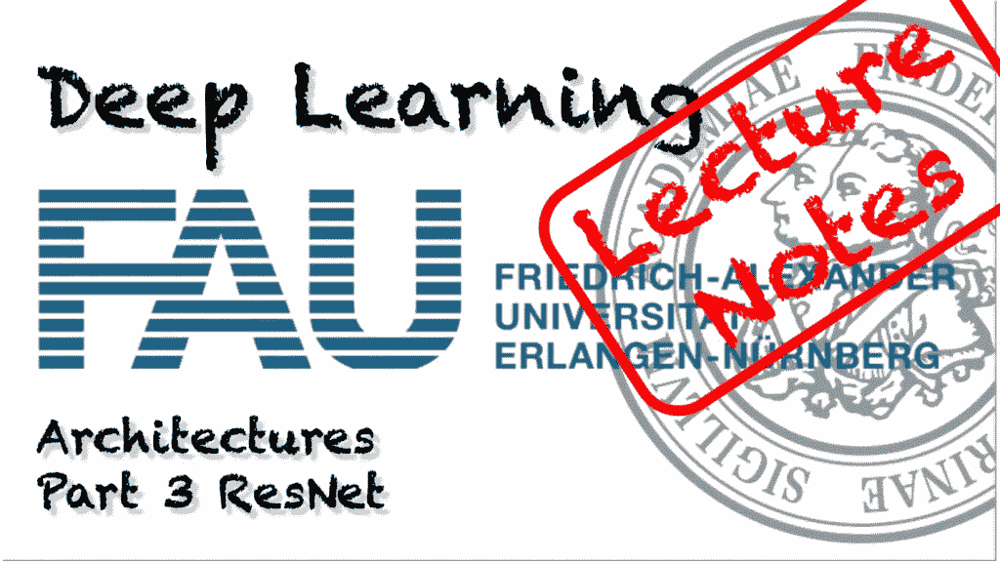

FAU 大学的深度学习。下图 [CC BY 4.0](https://creativecommons.org/licenses/by/4.0/) 来自[深度学习讲座](https://www.youtube.com/watch?v=p-_Stl0t3kU&list=PLpOGQvPCDQzvgpD3S0vTy7bJe2pf_yJFj&index=1)

**这些是 FAU 的 YouTube 讲座** [**深度学习**](https://www.youtube.com/watch?v=p-_Stl0t3kU&list=PLpOGQvPCDQzvgpD3S0vTy7bJe2pf_yJFj&index=1) **的讲义。这是与幻灯片匹配的讲座视频&的完整抄本。我们希望，你喜欢这个视频一样多。当然，这份抄本是用深度学习技术在很大程度上自动创建的，只进行了少量的手动修改。如果你发现了错误，请告诉我们！**

# 航行

[**上一讲**](/architectures-part-2-2d2ac8f7458e) **/** [**观看本视频**](https://youtu.be/a6P24LadHus) **/** [**顶级**](/all-you-want-to-know-about-deep-learning-8d68dcffc258) **/** [**下一讲**](/architectures-part-4-a56f1b70f12f)

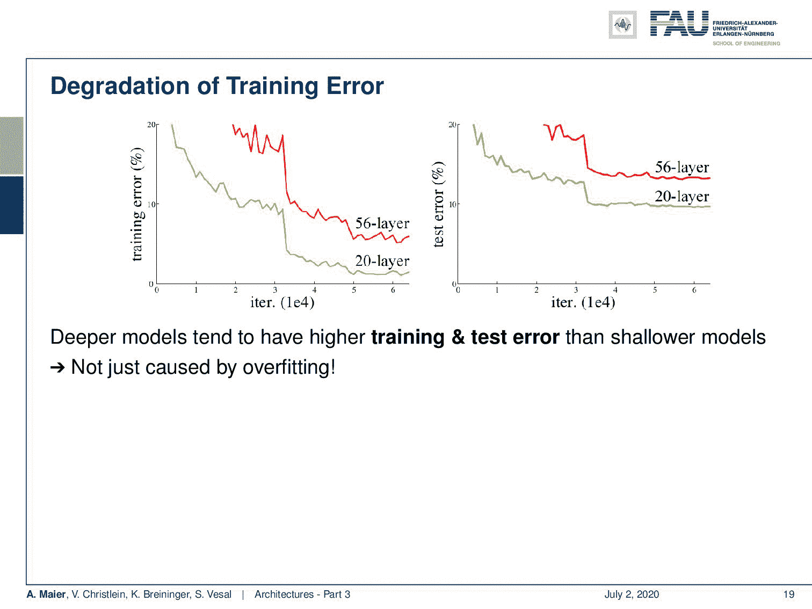

更深的模型在某个点饱和，甚至可能产生更差的结果。 [CC 下的图片来自](https://creativecommons.org/licenses/by/4.0/)[深度学习讲座](https://www.youtube.com/watch?v=p-_Stl0t3kU&list=PLpOGQvPCDQzvgpD3S0vTy7bJe2pf_yJFj&index=1)的 4.0 。

欢迎回到深度学习！今天我们想讨论更多的架构，尤其是真正深层的架构。所以，我们真的在走向深度学习。如果你想用我们到目前为止看到的所有东西来训练更深入的模型，你会看到我们进入了某种饱和状态。如果你想更深入，那么你只需在顶部添加层，你会希望训练误差会下降。但是如果你仔细观察，你会发现一个 20 层的网络比一个 56 层的模型有更低的训练误差和测试集误差。因此，我们不能只是增加一层又一层，然后希望事情会变得更好。这种影响不仅仅是过度拟合造成的。我们在顶部构建层。所以，肯定有其他原因，这些原因很可能与消失梯度问题有关。其他原因可能是 ReLU、初始化或内部协变量移位的问题，我们尝试了批量标准化、eLU 和 SELU，但我们仍然有激活和梯度传播不良的问题。我们看到，如果你试图建立那些非常深的模型，我们会遇到渐变消失的问题，我们无法训练早期的层，这甚至会导致训练集的更严重的损失。

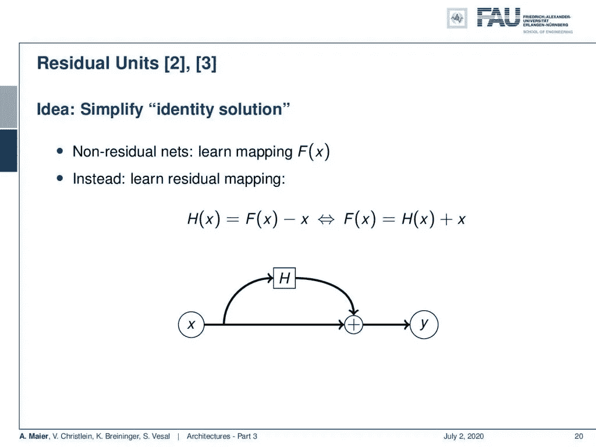

剩余网络将学习部分移动到侧支。 [CC 下的图片来自](https://creativecommons.org/licenses/by/4.0/)[深度学习讲座](https://www.youtube.com/watch?v=p-_Stl0t3kU&list=PLpOGQvPCDQzvgpD3S0vTy7bJe2pf_yJFj&index=1)的 4.0 。

所以，我有一个解决方案，这些是剩余单位。这是一个非常酷的想法。所以，他们建议做的不是学习直接映射 F(x ),而是学习剩余映射。所以，我们想知道 H(x)和 H(x)是 F(x)和 x 的差，所以，我们也可以用不同的方式来表达，这实际上是如何实现的。你把你的网络 F(x)计算成某个层 H(x) + x，所以，可训练部分现在基本上在一个侧支中，侧支是 H(x)，这是可训练的。在主分支上，我们只有一些 x 加上侧分支，它们将给出我们估计的 y。

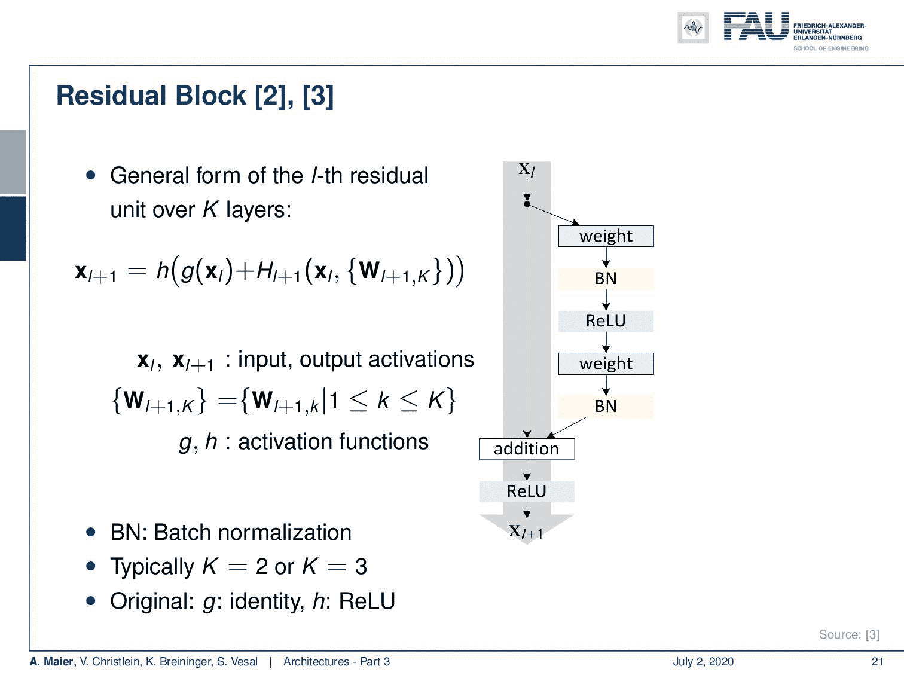

残差块的第一版本在主路径上仍然具有非线性。来自[深度学习讲座](https://www.youtube.com/watch?v=p-_Stl0t3kU&list=PLpOGQvPCDQzvgpD3S0vTy7bJe2pf_yJFj&index=1)的 [CC BY 4.0](https://creativecommons.org/licenses/by/4.0/) 下的图片。

在残差块的原始实现中，仍然存在差异。这与我们在上一张幻灯片中看到的并不完全一样。我们有一个侧分支，其中有一个加权层、批次归一化、ReLU、加权、另一个批次归一化，然后是加法和另一个非线性，即一个残差块的 ReLU。后来，这被改变为使用批次标准、ReLU、重量、批次标准、ReLU 和剩余块的重量。原来这种配置更稳定。我们基本上有了在正分支上反向传播的恒等式。这非常好，因为我们可以将梯度传播回早期层，这样我们可以获得更稳定的反向传播。

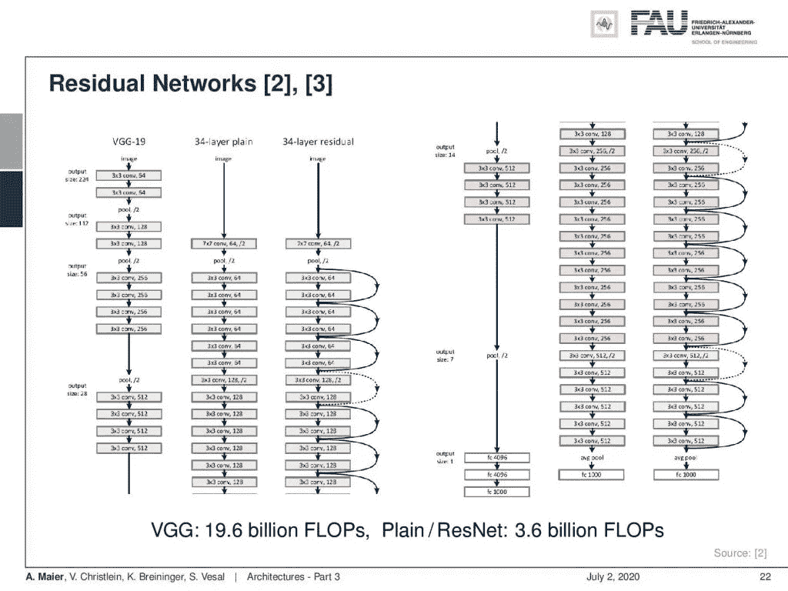

VGG、18 层网络和 18 层剩余网络的比较。 [CC 下的图片来自](https://creativecommons.org/licenses/by/4.0/)[深度学习讲座](https://www.youtube.com/watch?v=p-_Stl0t3kU&list=PLpOGQvPCDQzvgpD3S0vTy7bJe2pf_yJFj&index=1)的 4.0 。

这就给我们带来了一个完整的剩余网络。所以，我们在底部切开它，在右手边显示底部。这是 VGG、43 层平面网络和 43 层剩余网络之间的比较。你可以看到本质上有这些被引入的跳跃连接。它们允许我们跳过这一步，然后在相应的早期层中反向传播。还涉及到缩减采样，当然，跳过连接也必须缩减采样。这就是为什么我们在这些位置有虚线连接。我们可以看到，VGG 有大约 196 亿次浮点运算，而我们的普通和剩余网络只有 36 亿次浮点运算。所以，它也更有效率。

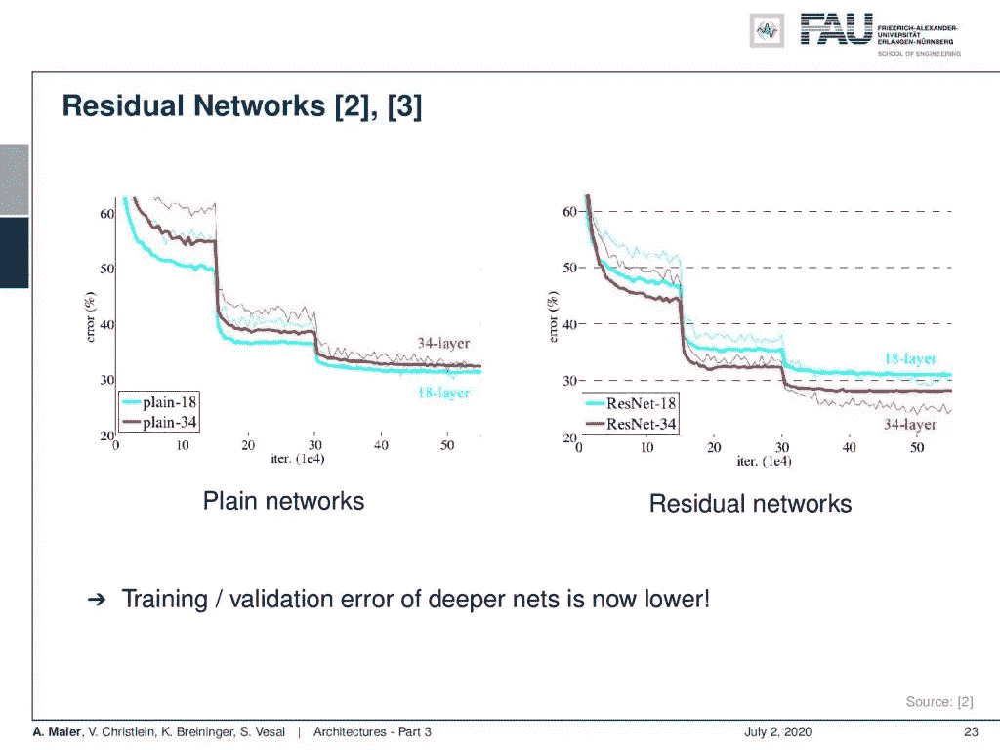

有了剩余连接，我们现在可以更深入。来自[深度学习讲座](https://www.youtube.com/watch?v=p-_Stl0t3kU&list=PLpOGQvPCDQzvgpD3S0vTy7bJe2pf_yJFj&index=1)的 [CC BY 4.0](https://creativecommons.org/licenses/by/4.0/) 下的图片。

现在让我们来测试一下。我们现在可以看到，在 34 层的情况下，我们没有得到错误率，因为我们希望有非常深的网络。因此，与仅使用 18 层网络相比，误差更高。但是如果您引入剩余连接，我们可以看到我们得到了好处，并且降低了错误率。因此，剩余连接帮助我们获得更稳定的梯度，并且我们现在可以随着深入而降低训练和验证误差。

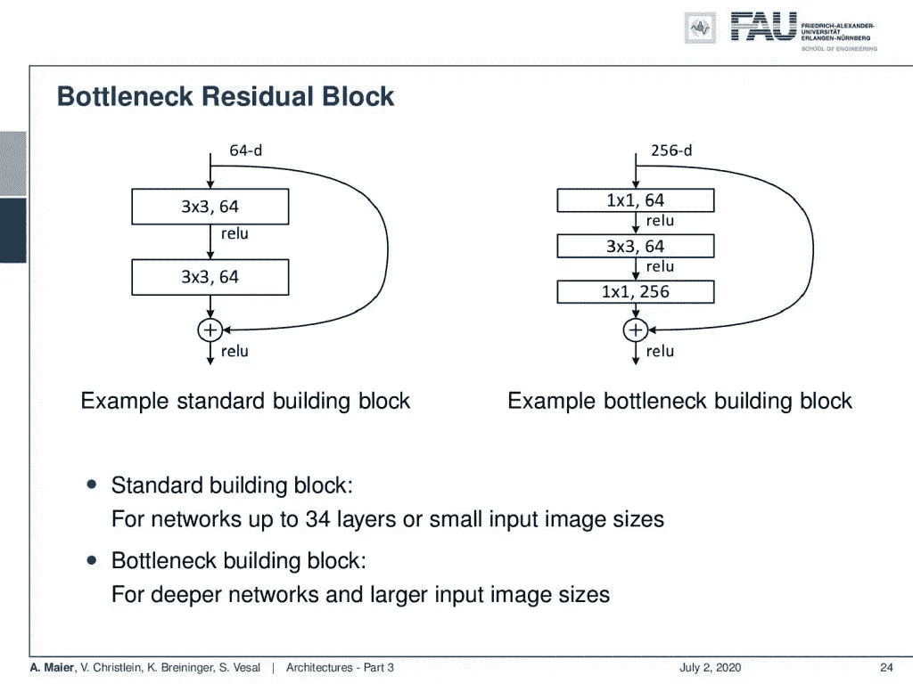

剩余块还允许瓶颈结构的集成。 [CC 下的图片来自](https://creativecommons.org/licenses/by/4.0/)[深度学习讲座](https://www.youtube.com/watch?v=p-_Stl0t3kU&list=PLpOGQvPCDQzvgpD3S0vTy7bJe2pf_yJFj&index=1)的 4.0 。

残差块网络有不同的变体。这是标准构建模块，在右侧，您可以看到我们也可以利用瓶颈思想，对通道进行下采样，然后进行卷积，再进行上采样。这就是那种瓶颈版的残块。

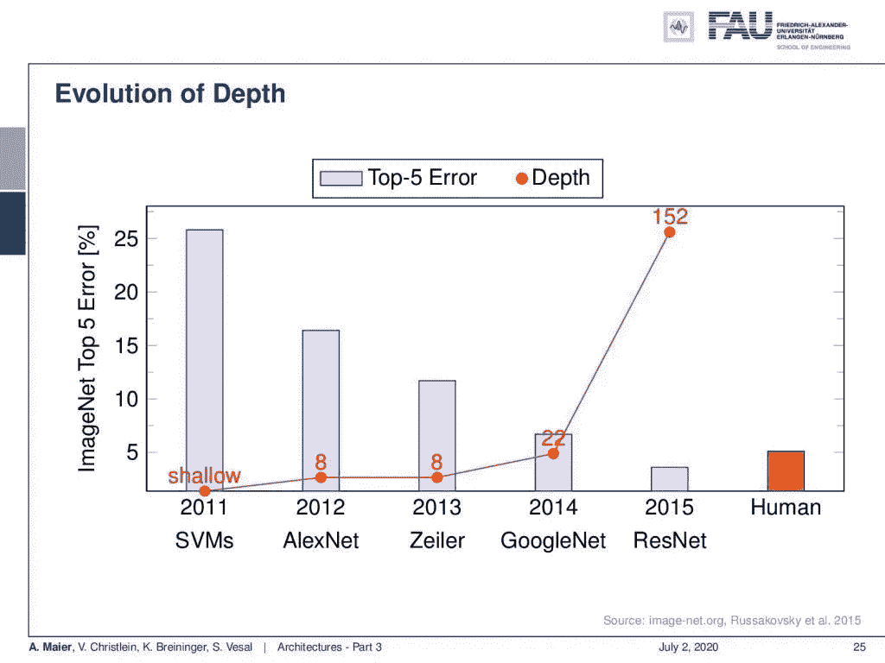

ResNets 再次将 ImageNet 的错误率减半。来自[深度学习讲座](https://www.youtube.com/watch?v=p-_Stl0t3kU&list=PLpOGQvPCDQzvgpD3S0vTy7bJe2pf_yJFj&index=1)的 [CC BY 4.0](https://creativecommons.org/licenses/by/4.0/) 下的图片。

所以，我们可以把这个和我们到目前为止学过的其他食谱结合起来。如果我们这样做，我们可以看到我们甚至可以训练 152 层的网络。这在 2015 年产生了第一个真正击败人类表现的网络之一。记住我们说过的关于人类行为的所有事情，特别是如果你只有一个标签的话。所以，实际上你必须有更多的标签来理解问题的不确定性。无论如何，我们可以看到，我们真的进入了人类表现的范围，这是一个非常好的结果。

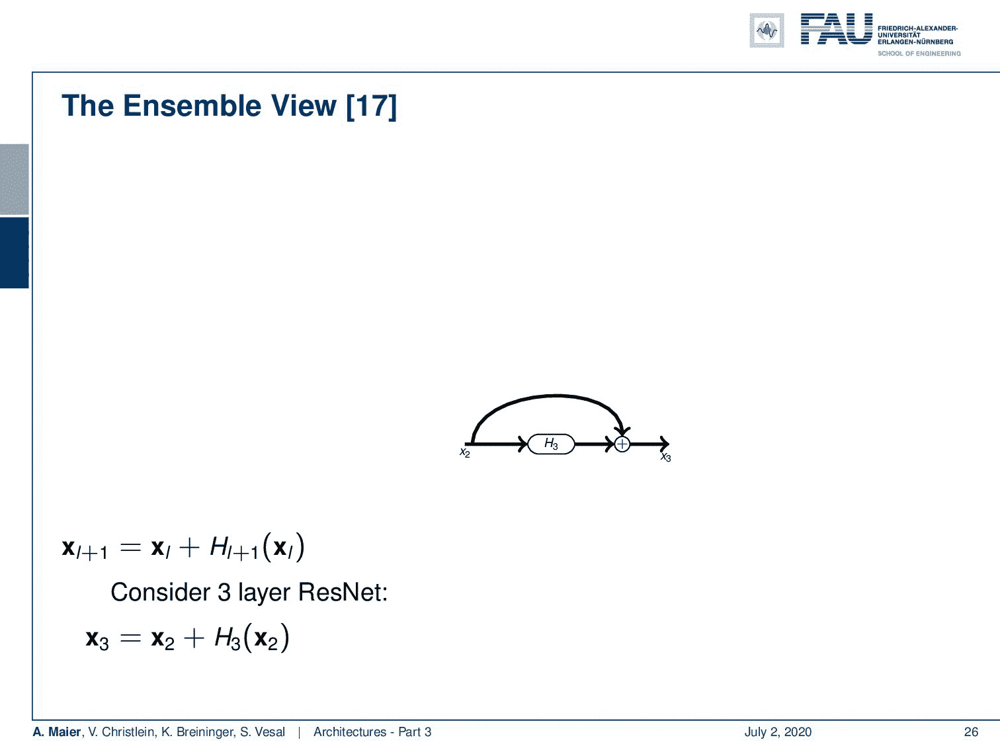

结果网可以被解释为分类器的集合。 [CC 下的图片来自](https://creativecommons.org/licenses/by/4.0/)[深度学习讲座](https://www.youtube.com/watch?v=p-_Stl0t3kU&list=PLpOGQvPCDQzvgpD3S0vTy7bJe2pf_yJFj&index=1)的 4.0 。

人们一直在问“为什么这些残余网络表现得这么好？”。一个非常有趣的解释是这种所谓的 ResNets 系综观点。在这里，你可以看到，如果我们在彼此之上构建残差层或残差块，我们会看到我们可以将其分解为一种递归。所以，如果我们有 x₃等于 x₂加 H₃(x₂)，我们可以代入，看到这等于 x₁加 H₂(x₁)加 H₃(x₁ + H₂(x₁)).我们可以再次代入，看到我们实际计算的是 x₀ + H₁(x₀)加上 H₂(x₀ + H₁(x₀))加上 H₃(x₀ + H₁(x₀) + H₂(x₀ + H₁(x₀))).哇，很酷的把戏。如果有人出于任何未知的原因要测试你的深度学习知识，你可能要记住这一点。所以，我真的建议仔细看看这条线。因此，我们在解释中看到，我们本质上是在构建我们更浅的残差分类器的集合。因此，我们可以说，我们从 ResNets 训练的分类器本质上是在构建一个非常强大的集成。

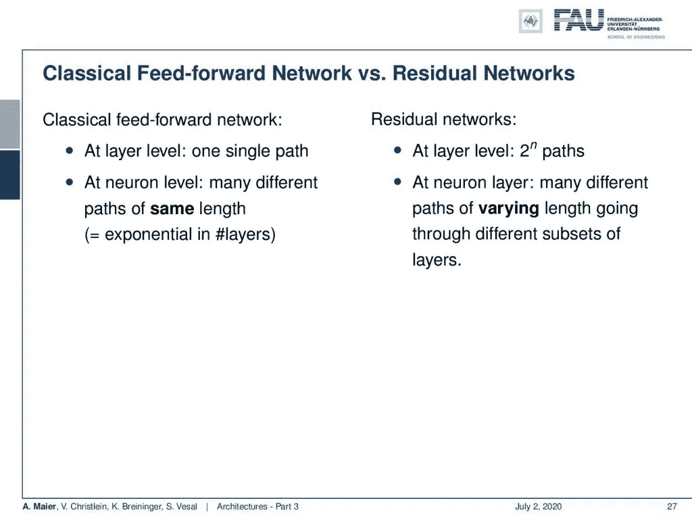

ResNets 与前馈网络。 [CC 下的图片来自](https://creativecommons.org/licenses/by/4.0/)[深度学习讲座](https://www.youtube.com/watch?v=p-_Stl0t3kU&list=PLpOGQvPCDQzvgpD3S0vTy7bJe2pf_yJFj&index=1)的 4.0 。

这很好，我们看到，在经典前馈网络中，我们可以改变每个单层区域的表示，因为这里有矩阵乘法。矩阵乘法具有可以转换到完全不同的域的特性。因此，本质上在经典的前馈网络中，我们有一个单一的路径，在神经元水平上我们有许多不同的路径。在剩余网络中，我们得到 2ⁿ路径。在神经元水平，我们得到许多不同长度的路径，通过不同的层子集，这是一个非常强的集合，以这种方式构建。

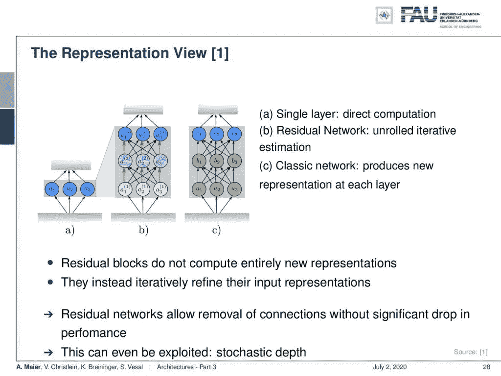

表示视图将结果解释为表示的逐渐变化。来自[深度学习讲座](https://www.youtube.com/watch?v=p-_Stl0t3kU&list=PLpOGQvPCDQzvgpD3S0vTy7bJe2pf_yJFj&index=1)的 [CC BY 4.0](https://creativecommons.org/licenses/by/4.0/) 下的图片。

我们也可以改变我们的观点，想想我们之前看到的剩余网络和全连接网络。在完全连接的层中，您基本上可以更改完整的表示。因此，我们试图在 a)、b)和 c)中展示这一点。所以 a)只是从一个域到另一个域的转换。如果我们现在展开它，我们可以看到残差网络在不同层上的表现基本上是逐渐变化的。因此，我们看到我们有一个轻微的变化，然后颜色逐渐向蓝色变化，我们必须在最后决定表示。如果我们将其与 c)中的完全连接的层进行比较，我们可以在第一层中有一个完全不同的表示，然后在第二层中有一个完全不同的表示，最后，我们最终映射到最后一层中所需的表示。所以在经典的全连通网络中，我们可以在每一层产生一个全新的表示。这意味着它们也变得非常依赖，因为为了做进一步的处理，表示需要匹配。

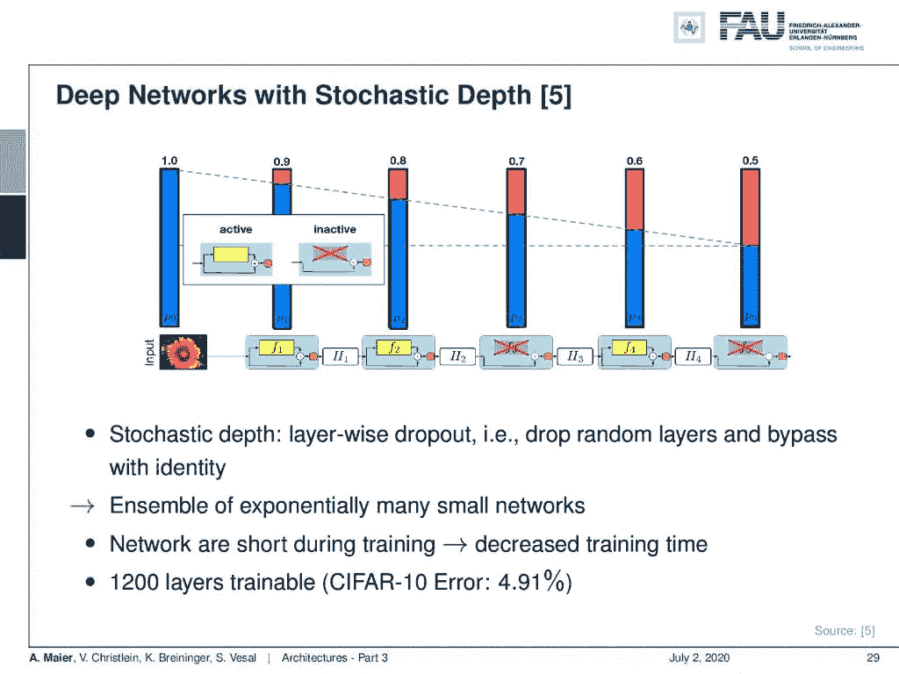

如果删除层，ResNets 只会逐渐失去性能。 [CC 下的图片来自](https://creativecommons.org/licenses/by/4.0/)[深度学习讲座](https://www.youtube.com/watch?v=p-_Stl0t3kU&list=PLpOGQvPCDQzvgpD3S0vTy7bJe2pf_yJFj&index=1)的 4.0 。

所以，我们可以做一个非常有趣的实验，比如损伤研究，就像你在生物神经网络中做的一样。以下是随机深度的一些结果。所以，现在的想法是我们关闭整个层。我们可以关闭完整的层，它不会破坏由 ResNet 完成的分类，这很酷。因此，如果您只关闭大约 10%的层，那么您可以看到我们的性能有所下降，但不会崩溃。我减少的层数越多，性能就越差，但是因为我们在表示上有了细微的变化，我们可以去掉一些单独的步骤，而不会完全破坏这个网络。所以，这当然是我们对合奏的期望。好了，有了这些简单的表示和这种逐渐的变化，我们将在这堂课的后面展示，ResNets 也可以被解释为一种梯度下降过程。这当然是因为与观察有关，如果你遵循梯度下降，那么我们从每个位置都有相同的渐变。因此，我们正在用 ResNet 构建本质上类似的东西。我们实际上可以证明，如果你试图优化一个未知的损失函数，ResNet 配置也可以达到。你想训练这个梯度，你会准确地提出一个 ResNet 作为解决方案。但是这需要一点时间，我们会在这节课快结束的时候讨论这个问题。到目前为止，这些网络已经建得非常非常深了。甚至在 CIFAR-10 上也可能有 1200 层。这是一个非常有趣的结果。我们看到我们真的在向非常深的网络发展。

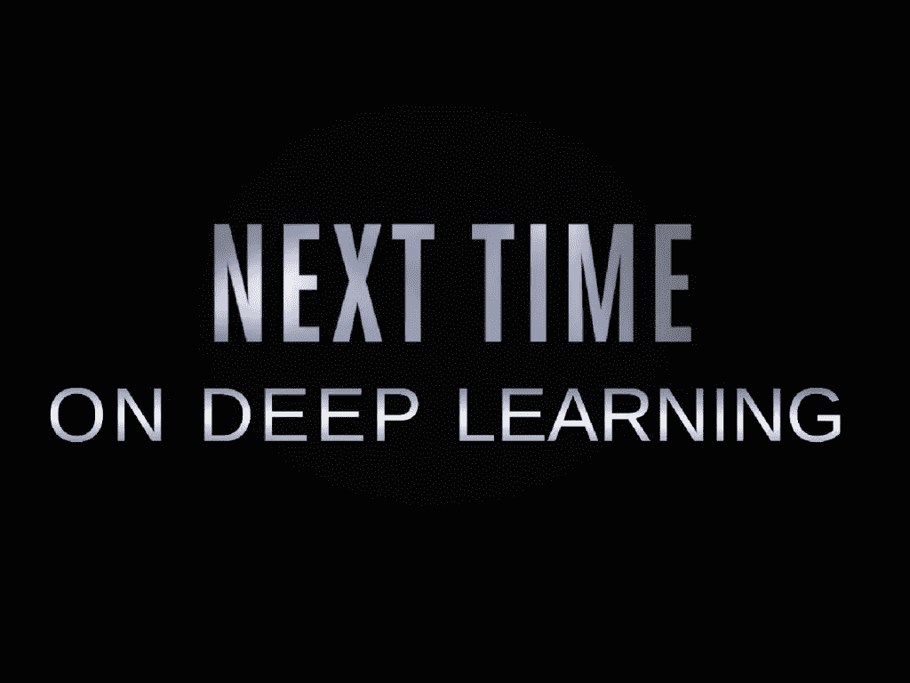

在这个深度学习讲座中，更多令人兴奋的事情即将到来。 [CC 下的图片来自](https://creativecommons.org/licenses/by/4.0/)[深度学习讲座](https://www.youtube.com/watch?v=p-_Stl0t3kU&list=PLpOGQvPCDQzvgpD3S0vTy7bJe2pf_yJFj&index=1)的 4.0 。

那么我们还能谈些什么呢？好吧，下一次在深度学习中，我们想谈谈剩余连接的兴起，以及一些帮助你建立真正有效的深度网络的技巧。所以，我希望你喜欢这个视频，并期待下一个！

如果你喜欢这篇文章，你可以在这里找到更多的文章，或者看看我们的讲座。如果你想在未来了解更多的文章、视频和研究，我也会很感激关注 [YouTube](https://www.youtube.com/c/AndreasMaierTV) 、 [Twitter](https://twitter.com/maier_ak) 、[脸书](https://www.facebook.com/andreas.maier.31337)或 [LinkedIn](https://www.linkedin.com/in/andreas-maier-a6870b1a6/) 。本文以 [Creative Commons 4.0 归属许可](https://creativecommons.org/licenses/by/4.0/deed.de)发布，如果引用，可以转载和修改。

# 参考

[1] Klaus Greff、Rupesh K. Srivastava 和 Jürgen Schmidhuber。“高速公路和残差网络学习展开的迭代估计”。年:学习代表国际会议(ICLR)。土伦，2017 年 4 月。arXiv: 1612.07771。
[2]何，，，任，等.“深度残差学习用于图像识别”。In: 2016 年 IEEE 计算机视觉与模式识别大会(CVPR)。拉斯维加斯，2016 年 6 月，第 770–778 页。arXiv: 1512.03385。
[3]何，，，，任等.“深剩余网络中的身份映射”。载于:计算机视觉— ECCV 2016:第 14 届欧洲会议，荷兰阿姆斯特丹，2016 年，第 630–645 页。arXiv: 1603.05027。
[4]胡经昌、沈立群、孙广昌。“挤压和激励网络”。载于:ArXiv 电子版(2017 年 9 月)。arXiv: 1709.01507 [cs。简历】。
[5]黄高，孙玉，刘庄等，“具有随机深度的深度网络”。载于:计算机视觉-ECCV 2016，会议录，第四部分。湛:施普林格国际出版公司，2016 年，第 646–661 页。
[6]黄高、刘庄和基利安·q·温伯格。“密集连接的卷积网络”。In: 2017 年 IEEE 计算机视觉与模式识别大会(CVPR)。檀香山，2017 年 7 月。arXiv: 1608.06993。亚历克斯·克里热夫斯基、伊利亚·苏茨基弗和杰弗里·E·辛顿。“使用深度卷积神经网络的 ImageNet 分类”。神经信息处理系统进展 25。柯伦咨询公司，2012 年，第 1097-1105 页。arXiv: 1102.0183。
[8] Yann A LeCun，Léon Bottou，Genevieve B Orr 等著《有效反向推进》。神经网络:交易技巧:第二版。第 75 卷。柏林，海德堡:施普林格柏林海德堡，2012 年，第 9-48 页。
【9】Y le Cun，L Bottou，Y Bengio 等，“基于梯度的学习应用于文档识别”。摘自:IEEE 86.11 会议录(1998 年 11 月)，第 2278-2324 页。arXiv: 1102.0183。
【10】、，与水城颜。“网络中的网络”。国际学习代表会议。加拿大班夫，2014 年 4 月。arXiv: 1102.0183。
[11] Olga Russakovsky，贾登，苏浩等，“ImageNet 大规模视觉识别挑战赛”。摘自:《国际计算机视觉杂志》115.3(2015 年 12 月)，第 211–252 页。
[12]卡伦·西蒙扬和安德鲁·齐塞曼。“用于大规模图像识别的非常深的卷积网络”。年:学习代表国际会议(ICLR)。2015 年 5 月，圣地亚哥。arXiv: 1409.1556。
[13]鲁佩什·库马尔·斯里瓦斯塔瓦，克劳斯·格雷夫，乌尔根·施密德胡伯等，《训练非常深的网络》。神经信息处理系统进展 28。柯伦咨询公司，2015 年，第 2377-2385 页。arXiv: 1507.06228。
[14]塞格迪、、、贾等著《用回旋深化》。In: 2015 年 IEEE 计算机视觉与模式识别会议(CVPR)。2015 年 6 月，第 1–9 页。
[15] C. Szegedy，V. Vanhoucke，S. Ioffe 等，“重新思考计算机视觉的初始架构”。In: 2016 年 IEEE 计算机视觉与模式识别大会(CVPR)。2016 年 6 月，第 2818–2826 页。
[16]克里斯蒂安·塞格迪、谢尔盖·约菲和文森特·万霍克。“Inception-v4，Inception-ResNet 和剩余连接对学习的影响”。In:第三十一届 AAAI 人工智能会议(AAAI-17) Inception-v4，三藩市，2017 年 2 月。arXiv: 1602.07261。
[17]安德烈亚斯·韦特、迈克尔·J·威尔伯和塞尔日·贝隆吉。“残差网络的行为类似于相对较浅的网络的集合”。神经信息处理系统进展 29。柯伦联合公司，2016 年，第 550–558 页。
【18】谢地、蒋雄、石梁浦。“你所需要的只是一个好的 Init:探索更好的解决方案来训练具有正交性和调制的极深度卷积神经网络”。In: 2017 年 IEEE 计算机视觉与模式识别大会(CVPR)。檀香山，2017 年 7 月。arXiv: 1703.01827。
[19]谢灵犀与。遗传 CNN。技术。众议员 2017。arXiv: 1703.01513。
[20]谢尔盖·扎戈鲁伊科和尼科斯·科莫达基斯。“广残网”。英国机器视觉会议(BMVC)会议录。BMVA 出版社，2016 年 9 月，第 87.1–87.12 页。
【21】K .张，M .孙，X .韩等《残差网络的残差网络:多级残差网络》。载于:IEEE 视频技术电路与系统汇刊第 99 页(2017)，第 1 页。
[22]巴雷特·佐夫，维贾伊·瓦苏德万，黄邦贤·施伦斯等人,《学习可扩展的可转移架构》