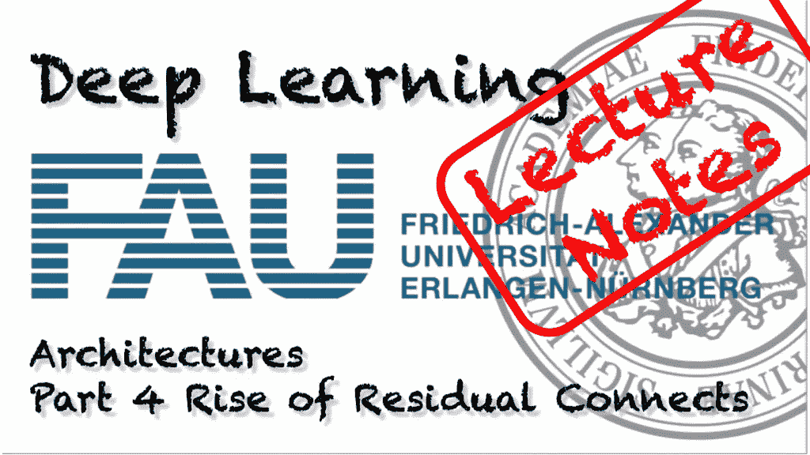
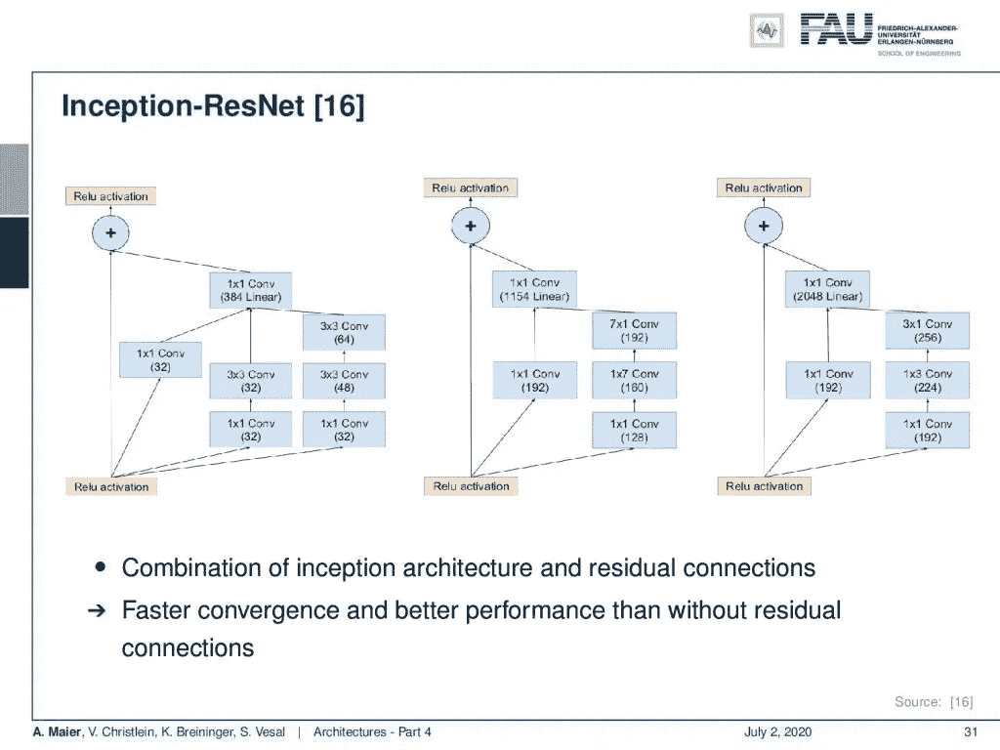
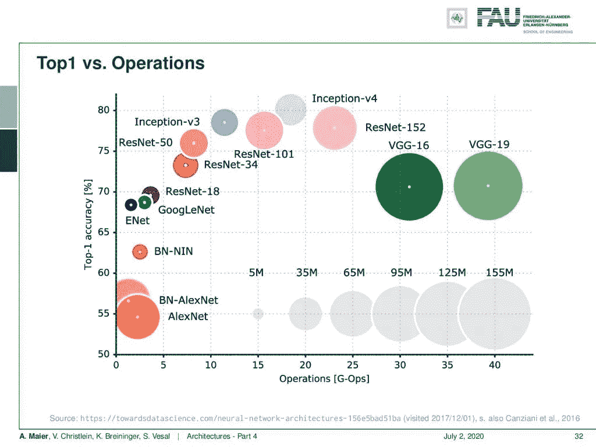
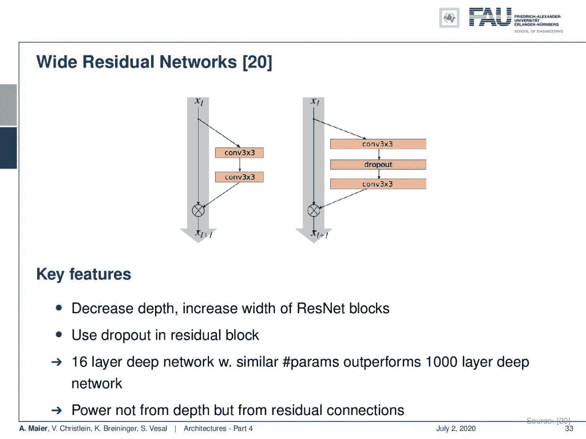
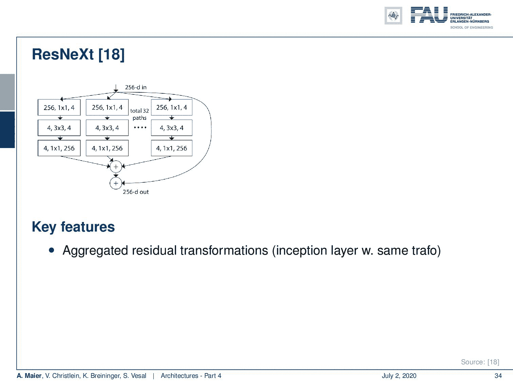
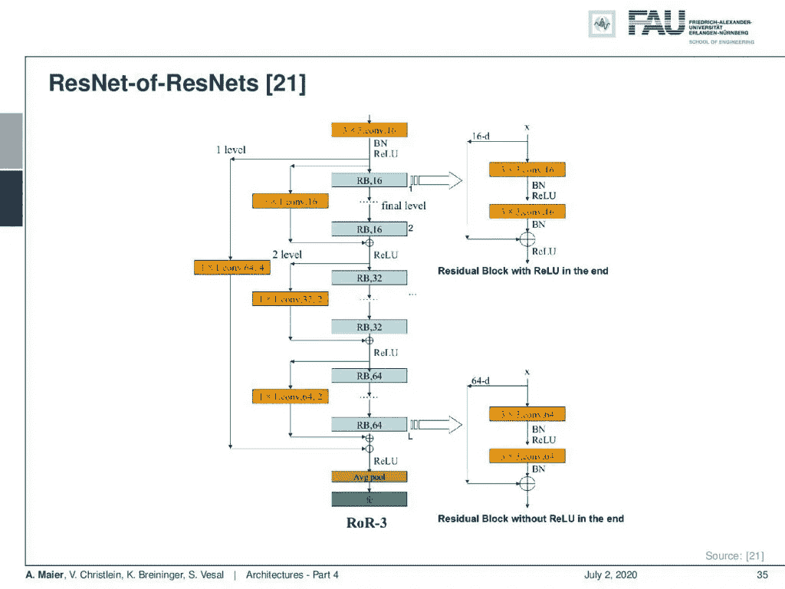
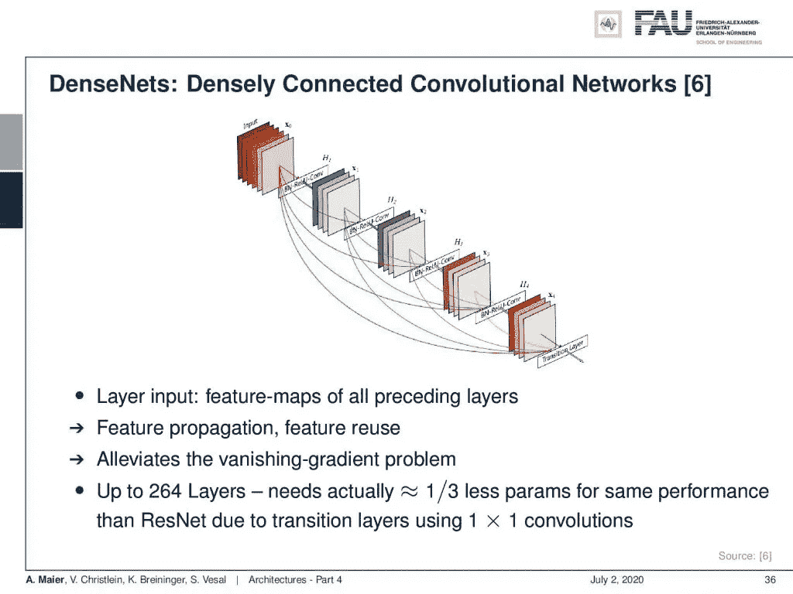
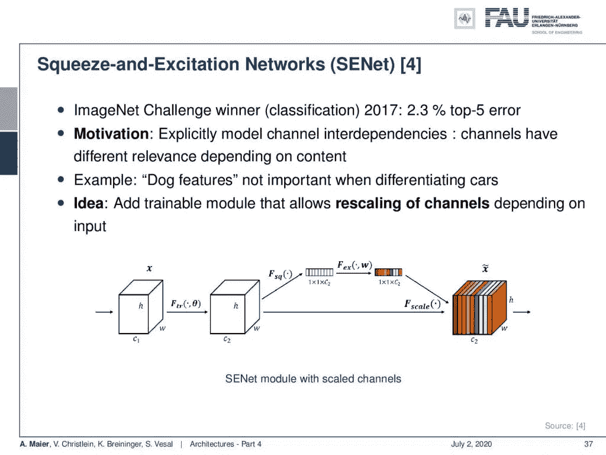
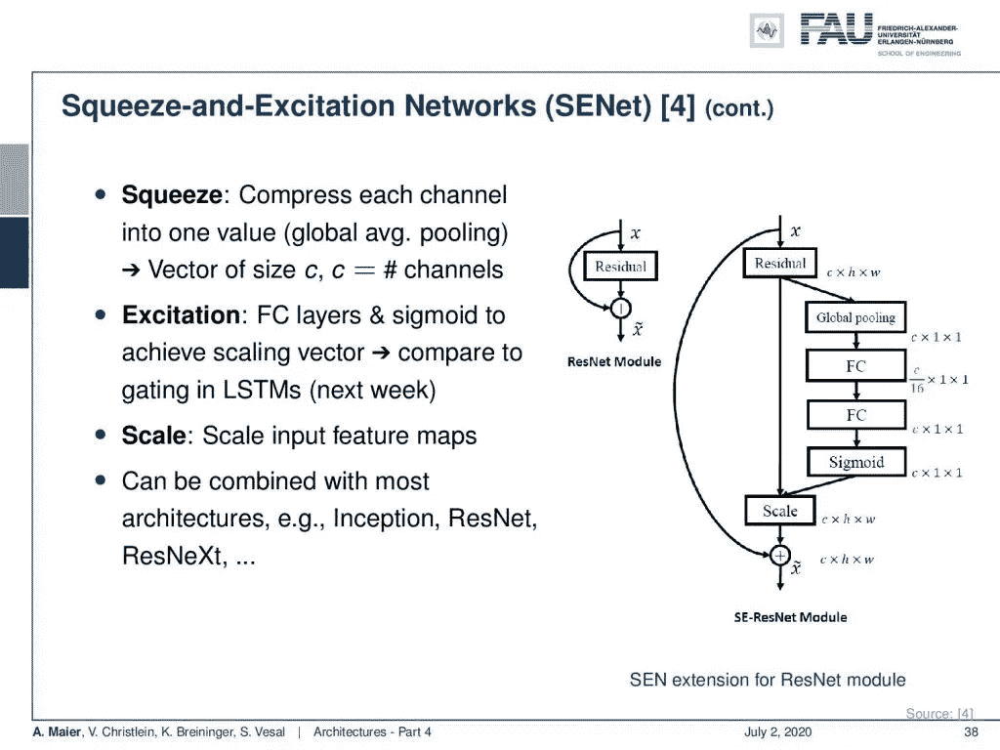
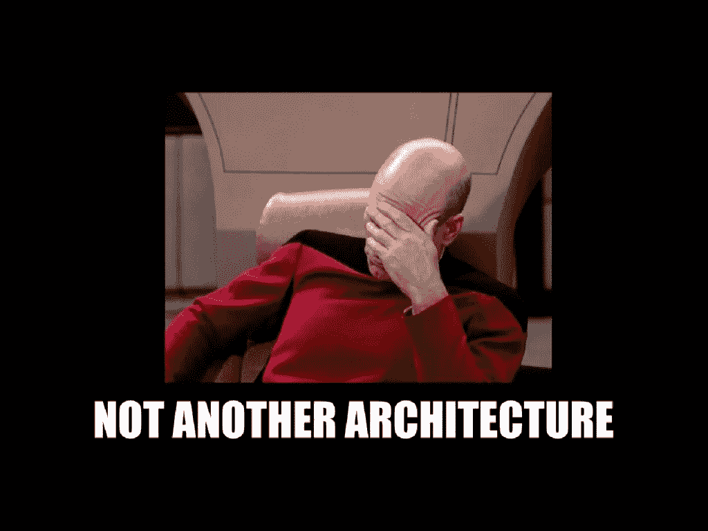

# 架构—第 4 部分

> 原文：<https://towardsdatascience.com/architectures-part-4-a56f1b70f12f?source=collection_archive---------40----------------------->

## [FAU 讲座笔记](https://towardsdatascience.com/tagged/fau-lecture-notes)关于深度学习

## 剩余连接的兴起

FAU 大学的深度学习。下图 [CC BY 4.0](https://creativecommons.org/licenses/by/4.0/) 来自[深度学习讲座](https://www.youtube.com/watch?v=p-_Stl0t3kU&list=PLpOGQvPCDQzvgpD3S0vTy7bJe2pf_yJFj&index=1)

**这些是 FAU 的 YouTube 讲座** [**深度学习**](https://www.youtube.com/watch?v=p-_Stl0t3kU&list=PLpOGQvPCDQzvgpD3S0vTy7bJe2pf_yJFj&index=1) **的讲义。这是与幻灯片匹配的讲座视频&的完整抄本。我们希望，你喜欢这个视频一样多。当然，这份抄本是用深度学习技术在很大程度上自动创建的，只进行了少量的手动修改。如果你发现了错误，请告诉我们！**

# 航行

[**上一讲**](/architectures-part-3-34dcfd979344) **/** [**观看本视频**](https://youtu.be/SbBYPIxvNFE) **/** [**顶级**](/all-you-want-to-know-about-deep-learning-8d68dcffc258) **/** [**下一讲**](/architectures-part-5-7224dd8fcf39)

剩余连接与 inception 块的组合导致了 Inception-ResNet。 [CC 下的图片来自](https://creativecommons.org/licenses/by/4.0/)[深度学习讲座](https://www.youtube.com/watch?v=p-_Stl0t3kU&list=PLpOGQvPCDQzvgpD3S0vTy7bJe2pf_yJFj&index=1)的 4.0 。

欢迎回到深度学习！正如上一个视频中所承诺的，我们想继续讨论比之前视频中看到的残余网络更复杂的架构。好吧，我有什么给你？当然，我们也可以将这个剩余连接的配方用于我们的盗梦空间网络，然后这导致了盗梦空间网络。您可以看到，剩余连接的概念非常简单，您可以很容易地将其合并到许多其他体系结构中。这也是我们在这里展示这两种架构的原因。它们是构建真正深度网络的重要基石。

不同架构在精度、参数和触发器方面的比较。 [CC 下的图片来自](https://creativecommons.org/licenses/by/4.0/)[深度学习讲座](https://www.youtube.com/watch?v=p-_Stl0t3kU&list=PLpOGQvPCDQzvgpD3S0vTy7bJe2pf_yJFj&index=1)的 4.0 。

您可以在这里看到，inception 和 ResNet 架构确实也有助于您构建非常强大的网络。我很喜欢这个情节，因为你可以从中学到很多东西。y 轴表示最高精度的性能。你可以在 x 轴上看到手术次数。这是以千兆次浮点运算为单位的。此外，您还可以看到由圆的直径表示的模型参数的数量。在这里，你可以看到 VGG-16 和 VGG-19，它们在最右边。因此，它们的计算量很大，性能也不错，但不如我们在课堂上看到的其他模型。你也看到 AlexNet 在左下方。所以它没有太多的计算。此外，就参数而言，它相当大，但性能并不太好。现在，你看，如果你做批量标准化和网络中的网络，你会变得更好。此外，GoogleNet 和 ResNet-18 的顶级精确度也有所提高。我们看到，我们现在可以继续构建更深入的模型，但不会获得太多的新参数。这有助于我们建立更有效、更高效的网络。当然，一段时间后，我们也开始增加参数空间，您可以看到，最佳性能是通过 inception V3 或 inception V4 网络或 Resnet-100 获得的。

宽残余块与窄残余块。来自[深度学习讲座](https://www.youtube.com/watch?v=p-_Stl0t3kU&list=PLpOGQvPCDQzvgpD3S0vTy7bJe2pf_yJFj&index=1)的 [CC BY 4.0](https://creativecommons.org/licenses/by/4.0/) 下的图片。

那么，还有哪些方法可以帮助你建立更好的模型呢？我们已经成功看到的一件事是增加剩余网络的宽度。因此，存在广泛的剩余网络。它们减少了深度，但是增加了剩余块的宽度。然后，您还可以在这些残差块中使用 dropout，您可以表明，具有类似参数数量的 16 层深度网络可以优于一千层深度网络。所以在这里，力量不是来自深度，而是来自剩余连接和引入的宽度。

ResNeXt 结合了我们到目前为止看到的许多方法。 [CC 下的图片来自](https://creativecommons.org/licenses/by/4.0/)[深度学习讲座](https://www.youtube.com/watch?v=p-_Stl0t3kU&list=PLpOGQvPCDQzvgpD3S0vTy7bJe2pf_yJFj&index=1)的 4.0 。

还有像 ResNeXt 这样的东西，所有以前的配方都是在这里一起构建的。它允许聚合残差变换。所以，你可以看到这实际上相当于早期的串联。所以，我们可以用早期的级联来代替它，然后一般的想法是你做群卷积。因此，您将输入和输出链分成组，然后在每个组中分别执行卷积。现在，这与 ResNet 瓶颈模块具有相似的 flops 和参数数量，但它更宽，是一个稀疏连接的模块。所以这个挺受欢迎的。

ResNet 中的 ResNet。来自[深度学习讲座](https://www.youtube.com/watch?v=p-_Stl0t3kU&list=PLpOGQvPCDQzvgpD3S0vTy7bJe2pf_yJFj&index=1)的 [CC BY 4.0](https://creativecommons.org/licenses/by/4.0/) 下的图片。

然后，当然你可以把这个和其他想法结合起来。在 ResNet-of-ResNet 中，您甚至可以在网络中建立更多的剩余连接。

DenseNet。 [CC 下的图片来自](https://creativecommons.org/licenses/by/4.0/)[深度学习讲座](https://www.youtube.com/watch?v=p-_Stl0t3kU&list=PLpOGQvPCDQzvgpD3S0vTy7bJe2pf_yJFj&index=1)的 4.0 。

有了 DenseNets，你可以尝试将几乎所有的东西与所有的东西连接起来。你有密集连接的卷积神经网络。它具有特征传播和特征重用。它还极大地缓解了消失梯度问题，由于过渡层使用 1x1 卷积，因此在多达 264 层的情况下，与 ResNet 相比，实际上需要的参数减少了三分之一。

挤压和激励网络。来自[深度学习讲座](https://www.youtube.com/watch?v=p-_Stl0t3kU&list=PLpOGQvPCDQzvgpD3S0vTy7bJe2pf_yJFj&index=1)的 4.0CC 下的图片。

此外，我想向大家展示的一个非常有趣的想法是挤压和激励网络，这是 2017 年 ImageNet 挑战赛的获胜者，它有 2.3%的前 5 名错误。这个想法是显式地建模渠道的相互依赖性，这基本上意味着你有一些更相关的渠道取决于内容。如果你有狗的特征，当你试图观察汽车时，它们不会很有趣。

挤压和激励网络的关键思想是:将上下文信息压缩到一个通道，并使用它来缩放不同的特征图。 [CC 下的图片来自](https://creativecommons.org/licenses/by/4.0/)[深度学习讲座](https://www.youtube.com/watch?v=p-_Stl0t3kU&list=PLpOGQvPCDQzvgpD3S0vTy7bJe2pf_yJFj&index=1)的 4.0 。

那么，这是如何实现的呢？嗯，我们添加了一个可训练的模块，允许根据输入重新调整通道。所以，我们有这里显示的特征地图。然后，我们有一个仅向下映射到一个维度的分支。然后将该一维乘以不同的特征图，允许根据输入抑制一些特征图，并根据输入放大其他特征图。我们本质上是挤压，即通过全局平均池将每个通道压缩为一个值。这就是我们如何构建特征重要性，然后在需要的地方激发。我们在 sigmoid 函数中使用完全连接的层，以便只激发重要的层。顺便说一下，这与我们在长短期记忆细胞中所做的事情非常相似，我们可能会在下周的[视频](https://youtu.be/vZQxwDHvuug)中谈到。然后我们缩放，因此我们用输出来缩放输入映射。

我们在这里讨论了大部分关键概念，现在不得不停止列举更多的架构。来自[深度学习讲座](https://www.youtube.com/watch?v=p-_Stl0t3kU&list=PLpOGQvPCDQzvgpD3S0vTy7bJe2pf_yJFj&index=1)的 4.0CC 下的图片。

当然，我们可以将它与大多数其他架构相结合:与初始模块、与 ResNet、与 ResNeXt 等等。所以，我们有很多不同的选择。说实话，我不想在这里展示另一种架构。

在这个深度学习讲座中，更多令人兴奋的事情即将到来。 [CC 下的图片来自](https://creativecommons.org/licenses/by/4.0/)[深度学习讲座](https://www.youtube.com/watch?v=p-_Stl0t3kU&list=PLpOGQvPCDQzvgpD3S0vTy7bJe2pf_yJFj&index=1)的 4.0 。

下一次我们将讨论学习网络架构。所以，有一些方法可以自动确定。那不是效率更高吗？好了，请继续关注，我将在下一个视频中告诉你！

如果你喜欢这篇文章，你可以在这里找到[更多的文章](https://medium.com/@akmaier)，在这里找到更多关于机器学习的教育材料[，或者看看我们的](https://lme.tf.fau.de/teaching/free-deep-learning-resources/)[深度](https://www.youtube.com/watch?v=p-_Stl0t3kU&list=PLpOGQvPCDQzvgpD3S0vTy7bJe2pf_yJFj) [学习](https://www.youtube.com/watch?v=p-_Stl0t3kU&list=PLpOGQvPCDQzvgpD3S0vTy7bJe2pf_yJFj&index=1) [讲座](https://www.youtube.com/watch?v=p-_Stl0t3kU&list=PLpOGQvPCDQzvgpD3S0vTy7bJe2pf_yJFj)。如果你想在未来了解更多的文章、视频和研究，我也会很感激关注 YouTube、Twitter、脸书、LinkedIn 或 T21。本文以 [Creative Commons 4.0 归属许可](https://creativecommons.org/licenses/by/4.0/deed.de)发布，如果引用，可以转载和修改。

# 参考

[1] Klaus Greff、Rupesh K. Srivastava 和 Jürgen Schmidhuber。“高速公路和残差网络学习展开的迭代估计”。年:学习代表国际会议(ICLR)。土伦，2017 年 4 月。arXiv: 1612.07771。
[2]何，，，任，等.“深度残差学习用于图像识别”。In: 2016 年 IEEE 计算机视觉与模式识别大会(CVPR)。拉斯维加斯，2016 年 6 月，第 770–778 页。arXiv: 1512.03385。
[3]何，，，，任等.“深剩余网络中的身份映射”。载于:计算机视觉— ECCV 2016:第 14 届欧洲会议，荷兰阿姆斯特丹，2016 年，第 630–645 页。arXiv: 1603.05027。
[4]胡经昌、沈立群、孙广昌。“挤压和激励网络”。载于:ArXiv 电子版(2017 年 9 月)。arXiv: 1709.01507 [cs。简历】。
[5]黄高，孙玉，刘庄等，“具有随机深度的深度网络”。载于:计算机视觉-ECCV 2016，会议录，第四部分。湛:施普林格国际出版公司，2016 年，第 646–661 页。
[6]黄高、刘庄和基利安·q·温伯格。“密集连接的卷积网络”。In: 2017 年 IEEE 计算机视觉与模式识别大会(CVPR)。檀香山，2017 年 7 月。arXiv: 1608.06993。亚历克斯·克里热夫斯基、伊利亚·苏茨基弗和杰弗里·E·辛顿。“使用深度卷积神经网络的 ImageNet 分类”。神经信息处理系统进展 25。柯伦咨询公司，2012 年，第 1097-1105 页。arXiv: 1102.0183。
[8] Yann A LeCun，Léon Bottou，Genevieve B Orr 等著《有效反向推进》。神经网络:交易技巧:第二版。第 75 卷。柏林，海德堡:施普林格柏林海德堡，2012 年，第 9-48 页。
【9】Y le Cun，L Bottou，Y Bengio 等，“基于梯度的学习应用于文档识别”。摘自:IEEE 86.11 会议录(1998 年 11 月)，第 2278-2324 页。arXiv: 1102.0183。
【10】、，与水城颜。“网络中的网络”。国际学习代表会议。加拿大班夫，2014 年 4 月。arXiv: 1102.0183。
[11] Olga Russakovsky，贾登，苏浩等，“ImageNet 大规模视觉识别挑战赛”。摘自:《国际计算机视觉杂志》115.3(2015 年 12 月)，第 211–252 页。
[12]卡伦·西蒙扬和安德鲁·齐塞曼。“用于大规模图像识别的非常深的卷积网络”。年:学习代表国际会议(ICLR)。2015 年 5 月，圣地亚哥。arXiv: 1409.1556。
[13]鲁佩什·库马尔·斯里瓦斯塔瓦，克劳斯·格雷夫，乌尔根·施密德胡伯等，《训练非常深的网络》。神经信息处理系统进展 28。柯伦咨询公司，2015 年，第 2377-2385 页。arXiv: 1507.06228。
[14]塞格迪、、、贾等著《用回旋深化》。In: 2015 年 IEEE 计算机视觉与模式识别会议(CVPR)。2015 年 6 月，第 1–9 页。
[15] C. Szegedy，V. Vanhoucke，S. Ioffe 等，“重新思考计算机视觉的初始架构”。In: 2016 年 IEEE 计算机视觉与模式识别大会(CVPR)。2016 年 6 月，第 2818–2826 页。
[16]克里斯蒂安·塞格迪、谢尔盖·约菲和文森特·万霍克。“Inception-v4，Inception-ResNet 和剩余连接对学习的影响”。In:第三十一届 AAAI 人工智能会议(AAAI-17) Inception-v4，三藩市，2017 年 2 月。arXiv: 1602.07261。
[17]安德烈亚斯·韦特、迈克尔·J·威尔伯和塞尔日·贝隆吉。“残差网络的行为类似于相对较浅的网络的集合”。神经信息处理系统进展 29。柯伦联合公司，2016 年，第 550–558 页。
【18】谢地、蒋雄、石梁浦。“你所需要的只是一个好的 Init:探索更好的解决方案来训练具有正交性和调制的极深度卷积神经网络”。In: 2017 年 IEEE 计算机视觉与模式识别大会(CVPR)。檀香山，2017 年 7 月。arXiv: 1703.01827。
[19]谢灵犀与。遗传 CNN。技术。众议员 2017。arXiv: 1703.01513。
[20]谢尔盖·扎戈鲁伊科和尼科斯·科莫达基斯。“广残网”。英国机器视觉会议(BMVC)会议录。BMVA 出版社，2016 年 9 月，第 87.1–87.12 页。
【21】K .张，M .孙，X .韩等《残差网络的残差网络:多级残差网络》。载于:IEEE 视频技术电路与系统汇刊第 99 页(2017)，第 1 页。
[22]巴雷特·佐夫，维贾伊·瓦苏德万，黄邦贤·施伦斯等人,《学习可扩展的可转移架构》