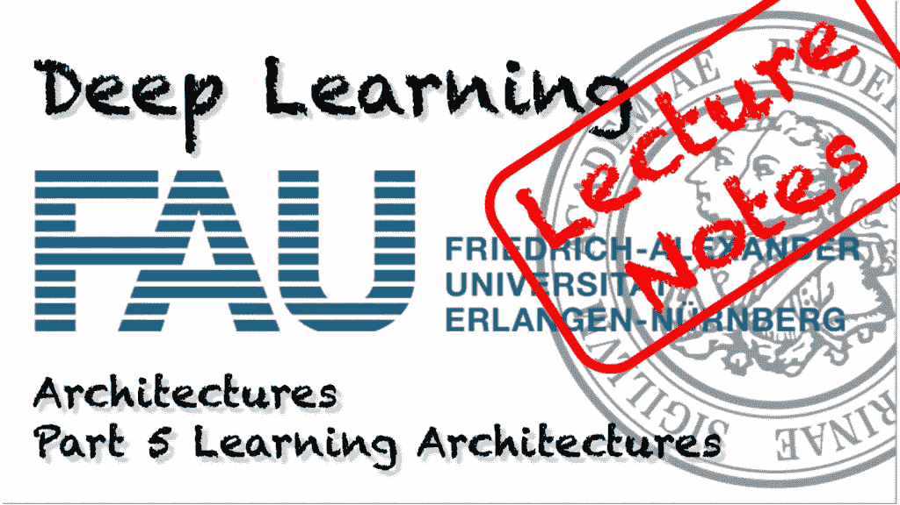
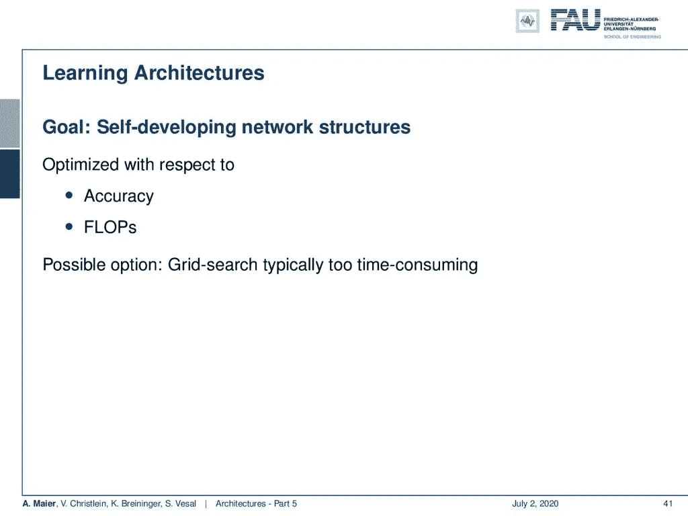
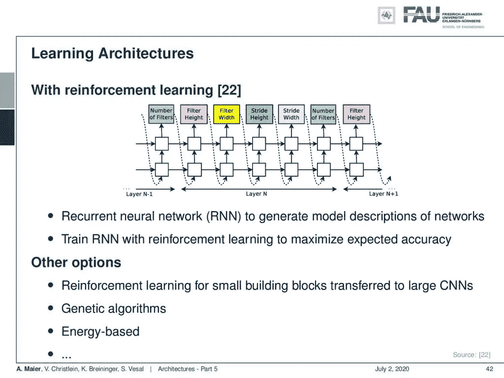
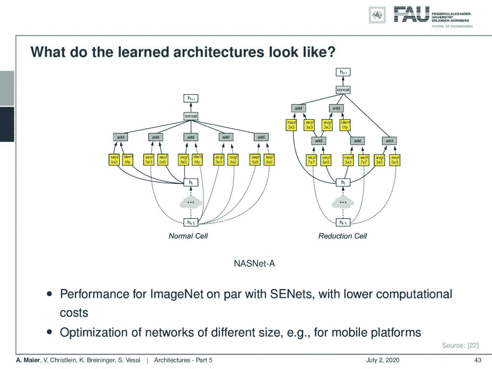
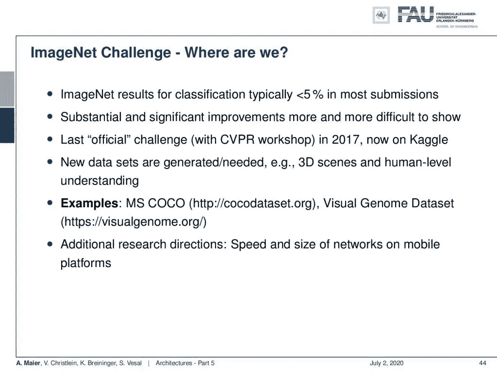
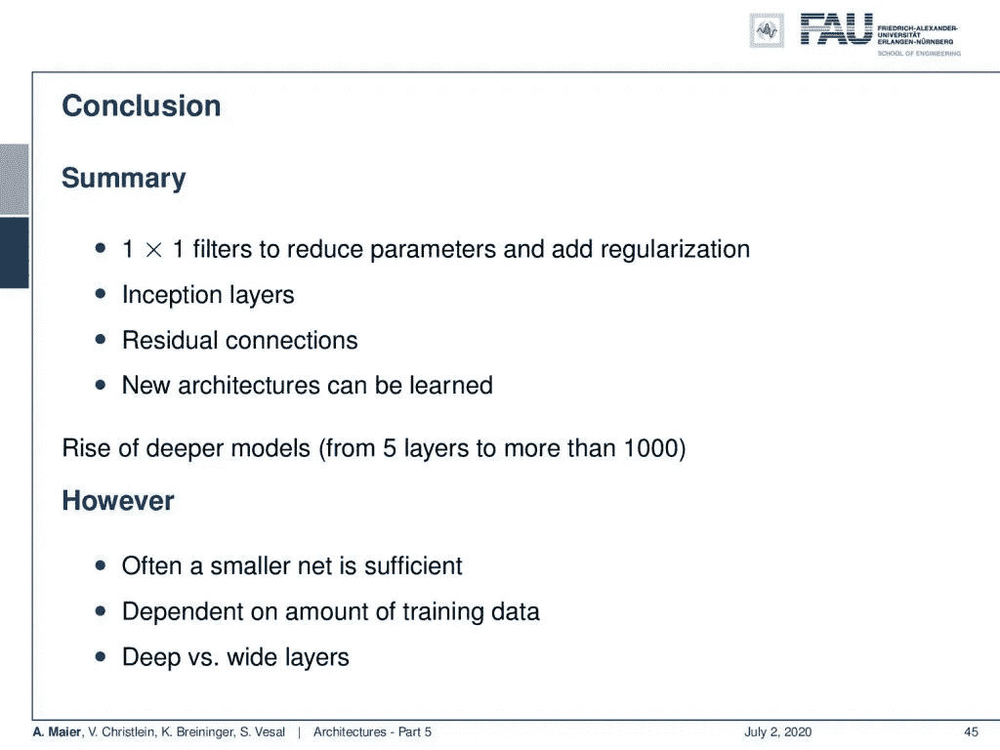
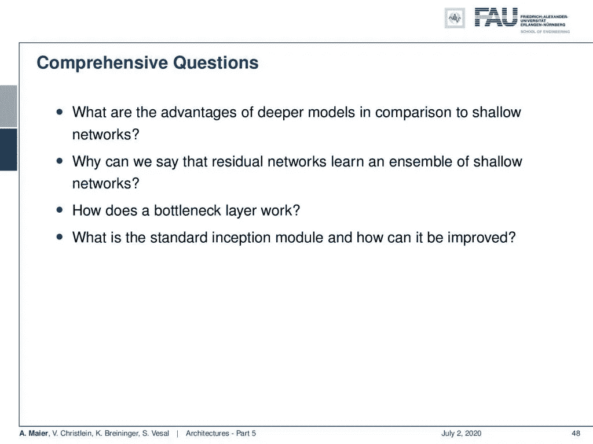

# 架构—第 5 部分

> 原文：<https://towardsdatascience.com/architectures-part-5-7224dd8fcf39?source=collection_archive---------57----------------------->

## [FAU 讲座笔记](https://towardsdatascience.com/tagged/fau-lecture-notes)关于深度学习

## 学习架构

FAU 大学的深度学习。下图 [CC BY 4.0](https://creativecommons.org/licenses/by/4.0/) 来自[深度学习讲座](https://www.youtube.com/watch?v=p-_Stl0t3kU&list=PLpOGQvPCDQzvgpD3S0vTy7bJe2pf_yJFj&index=1)

**这些是 FAU 的 YouTube 讲座** [**深度学习**](https://www.youtube.com/watch?v=p-_Stl0t3kU&list=PLpOGQvPCDQzvgpD3S0vTy7bJe2pf_yJFj&index=1) **的讲义。这是与幻灯片匹配的讲座视频&的完整抄本。我们希望，你喜欢这个视频一样多。当然，这份抄本是用深度学习技术在很大程度上自动创建的，只进行了少量的手动修改。如果你发现了错误，请告诉我们！**

# 航行

[**上一讲**](/architectures-part-4-a56f1b70f12f) **/** [**观看本视频**](https://youtu.be/nOzYIlt5AbY) **/** [**顶级**](/all-you-want-to-know-about-deep-learning-8d68dcffc258) **/** [**下一讲**](/recurrent-neural-networks-part-1-498230290534)

优化架构的可能标准。 [CC 下的图片来自](https://creativecommons.org/licenses/by/4.0/)[深度学习讲座](https://www.youtube.com/watch?v=p-_Stl0t3kU&list=PLpOGQvPCDQzvgpD3S0vTy7bJe2pf_yJFj&index=1)的 4.0 。

欢迎回到深度学习，今天我们想谈谈架构的最后一部分。特别是，我们想要研究学习架构。第 5 部分:学习架构。这里的想法是，我们希望拥有自我开发的网络结构，它们可以在精度或浮点运算方面进行优化。当然，你可以简单地用网格搜索来做。但是这通常太费时间了。

学习建筑的不同策略。 [CC 下的图片来自](https://creativecommons.org/licenses/by/4.0/)[深度学习讲座](https://www.youtube.com/watch?v=p-_Stl0t3kU&list=PLpOGQvPCDQzvgpD3S0vTy7bJe2pf_yJFj&index=1)的 4.0 。

因此，有几种方法可以做到这一点。[22]中的一个想法是使用强化学习。因此，你训练一个递归神经网络(RNN)来生成网络的模型描述，你用强化学习来训练这个 RNN，以最大化预期的准确性。当然，也有很多其他的选择。你可以对小积木进行强化学习，转移到大的细胞神经网络和遗传算法，基于能量的，实际上有很多想法你可以遵循。就培训时间而言，它们都非常昂贵，如果您想要研究这些方法，您真的必须拥有一个大型集群。否则，你就不能真正进行实验。所以，实际上现在世界上没有太多的团体能够做这样的研究。

两个建筑学习中出现的积木的例子。来自[深度学习讲座](https://www.youtube.com/watch?v=p-_Stl0t3kU&list=PLpOGQvPCDQzvgpD3S0vTy7bJe2pf_yJFj&index=1)的 [CC BY 4.0](https://creativecommons.org/licenses/by/4.0/) 下的图片。

因此，您可以看到，这里也出现了许多我们之前看到的元素。左手边有可分离的卷积和许多其他的方块。你可以看到这个正常的细胞看起来有点像启始块。如果你看右边，它看起来有点像早期版本的模块，在那里你有这些分离。它们以某种方式连接在一起，并使用剩余连接。这是由建筑搜索决定的。ImageNet 的性能与计算成本较低的挤压和激励网络相当。当然，也有可能针对不同的尺寸进行优化，例如针对移动平台。

ImageNet 似乎已经达到了极限。 [CC 下的图片来自](https://creativecommons.org/licenses/by/4.0/)[深度学习讲座](https://www.youtube.com/watch?v=p-_Stl0t3kU&list=PLpOGQvPCDQzvgpD3S0vTy7bJe2pf_yJFj&index=1)的 4.0 。

ImageNet —我们在哪里？嗯，我们看到，在大多数提交的内容中，ImageNet 分类现在已经下降到 5%以下。实质性的重大改进越来越难以在这个数据集上显示出来。上一次官方挑战是在 2017 年的 CVPR。它现在继续在卡格尔。有新的数据集正在产生和需要。例如，3d 场景、人类水平的理解以及那些数据集目前正在生成。例如，MS COCO 数据集或视觉基因组数据集已经取代 ImageNet 成为最先进的数据集。当然，也有不同的研究方向，如移动应用的速度和网络规模。在这些情况下，ImageNet 可能仍然是一个合适的挑战。

建筑讲座综述。 [CC 下的图片来自](https://creativecommons.org/licenses/by/4.0/)[深度学习讲座](https://www.youtube.com/watch?v=p-_Stl0t3kU&list=PLpOGQvPCDQzvgpD3S0vTy7bJe2pf_yJFj&index=1)的 4.0 。

所以，我们来得出一些结论。我们看到 1x1 滤波器减少了参数并增加了正则化。这是一种非常常见的技术。初始模块真的很好，因为它们允许你在卷积和池化之间找到正确的平衡。剩余连接是一种被反复使用的方法。我们还看到，一些新的架构实际上是可以学习的。因此，我们看到更深层次的模型从五层增加到一千层以上。然而，通常较小的网就足够了。当然，这取决于训练数据量。如果你有足够的数据，你只能训练那些真正大的网络。我们已经看到，有时构建更宽的层而不是更深的层也是有意义的。你记得，我们已经在普遍逼近定理中看到过。如果我们有无限宽的层，那么也许我们可以把所有的东西放进一层。

在这个深度学习讲座中，更多令人兴奋的事情即将到来。来自[深度学习讲座](https://www.youtube.com/watch?v=p-_Stl0t3kU&list=PLpOGQvPCDQzvgpD3S0vTy7bJe2pf_yJFj&index=1)的 [CC BY 4.0](https://creativecommons.org/licenses/by/4.0/) 下的图片。

好了，这让我们对接下来的几个视频有了展望。我们要讨论的是递归神经网络。我们将研究长短期记忆细胞，通过时间进行截短的反向传播，这是一个关键因素，以便能够训练这些循环网络，最后我们来看看长短期记忆细胞。Schmidthuber 和 Hochreiter 提出的一个重要观点是。Cho 提出的另一个想法是门控循环单位，它可以在某种程度上成为传统循环细胞和长短期记忆细胞之间的桥梁。

综合题可以帮助备考。 [CC 下的图片来自](https://creativecommons.org/licenses/by/4.0/)[深度学习讲座](https://www.youtube.com/watch?v=p-_Stl0t3kU&list=PLpOGQvPCDQzvgpD3S0vTy7bJe2pf_yJFj&index=1)的 4.0 。

好吧，我们来看一些综合问题:那么深度模型相比浅层网络有什么优势？为什么可以说残差网络学习的是浅层网络的系综？你记得，我在那张幻灯片上暗示过，如果你想准备考试，这是一个非常重要的概念。当然，你应该能够描述瓶颈层，或者标准的 inception 模块是什么，如何改进？我有很多进一步的阅读[双路径网络](http://papers.nips.cc/paper/7033-dual-path-networks)。所以你也可以看看[关于压缩和激发网络的论文](https://arxiv.org/abs/1709.01507)。还有更多有趣的作品可以在这里找到[在介质](https://medium.com/@karpathy/iclr-2017-vs-arxiv-sanity-d1488ac5c131)上当然还有[移动网](https://arxiv.org/abs/1704.04861)和其他无残留连接的深网[。这已经把我们带到了这节课的结尾，我希望你们玩得开心。期待在下一个视频中见到你，我们将在视频中讨论递归神经网络。我听说它们可以用五行代码写下来。所以下次见！](https://arxiv.org/abs/1706.00388)

如果你喜欢这篇文章，你可以在这里找到更多的文章，或者看看我们的讲座。如果你想在未来了解更多的文章、视频和研究，我也会很感激关注 [YouTube](https://www.youtube.com/c/AndreasMaierTV) 、 [Twitter](https://twitter.com/maier_ak) 、[脸书](https://www.facebook.com/andreas.maier.31337)或 [LinkedIn](https://www.linkedin.com/in/andreas-maier-a6870b1a6/) 。本文以 [Creative Commons 4.0 归属许可](https://creativecommons.org/licenses/by/4.0/deed.de)发布，如果引用，可以转载和修改。

# 参考

[1] Klaus Greff、Rupesh K. Srivastava 和 Jürgen Schmidhuber。“高速公路和残差网络学习展开的迭代估计”。年:学习代表国际会议(ICLR)。土伦，2017 年 4 月。arXiv: 1612.07771。
[2]何，，，任，等.“深度残差学习用于图像识别”。In: 2016 年 IEEE 计算机视觉与模式识别大会(CVPR)。拉斯维加斯，2016 年 6 月，第 770–778 页。arXiv: 1512.03385。
[3]何，，，，任等.“深剩余网络中的身份映射”。载于:计算机视觉— ECCV 2016:第 14 届欧洲会议，荷兰阿姆斯特丹，2016 年，第 630–645 页。arXiv: 1603.05027。
[4]胡经昌、沈立群、孙广昌。“挤压和激励网络”。载于:ArXiv 电子版(2017 年 9 月)。arXiv: 1709.01507 [cs。简历】。
[5]黄高，孙玉，刘庄等，“具有随机深度的深度网络”。载于:计算机视觉-ECCV 2016，会议录，第四部分。湛:施普林格国际出版公司，2016 年，第 646–661 页。
[6]黄高、刘庄和基利安·q·温伯格。“密集连接的卷积网络”。In: 2017 年 IEEE 计算机视觉与模式识别大会(CVPR)。檀香山，2017 年 7 月。arXiv: 1608.06993。亚历克斯·克里热夫斯基、伊利亚·苏茨基弗和杰弗里·E·辛顿。“使用深度卷积神经网络的 ImageNet 分类”。神经信息处理系统进展 25。柯伦咨询公司，2012 年，第 1097-1105 页。arXiv: 1102.0183。
[8] Yann A LeCun，Léon Bottou，Genevieve B Orr 等著《有效反向推进》。神经网络:交易技巧:第二版。第 75 卷。柏林，海德堡:施普林格柏林海德堡，2012 年，第 9-48 页。
【9】Y le Cun，L Bottou，Y Bengio 等，“基于梯度的学习应用于文档识别”。摘自:IEEE 86.11 会议录(1998 年 11 月)，第 2278-2324 页。arXiv: 1102.0183。
【10】、，与水城颜。“网络中的网络”。国际学习代表会议。加拿大班夫，2014 年 4 月。arXiv: 1102.0183。
[11] Olga Russakovsky，贾登，苏浩等，“ImageNet 大规模视觉识别挑战赛”。摘自:《国际计算机视觉杂志》115.3(2015 年 12 月)，第 211–252 页。
[12]卡伦·西蒙扬和安德鲁·齐塞曼。“用于大规模图像识别的非常深的卷积网络”。年:学习代表国际会议(ICLR)。2015 年 5 月，圣地亚哥。arXiv: 1409.1556。
[13]鲁佩什·库马尔·斯里瓦斯塔瓦，克劳斯·格雷夫，乌尔根·施密德胡伯等，《训练非常深的网络》。神经信息处理系统进展 28。柯伦咨询公司，2015 年，第 2377-2385 页。arXiv: 1507.06228。
[14]塞格迪、、、贾等著《用回旋深化》。In: 2015 年 IEEE 计算机视觉与模式识别会议(CVPR)。2015 年 6 月，第 1–9 页。
[15] C. Szegedy，V. Vanhoucke，S. Ioffe 等，“重新思考计算机视觉的初始架构”。In: 2016 年 IEEE 计算机视觉与模式识别大会(CVPR)。2016 年 6 月，第 2818–2826 页。
[16]克里斯蒂安·塞格迪、谢尔盖·约菲和文森特·万霍克。“Inception-v4，Inception-ResNet 和剩余连接对学习的影响”。In:第三十一届 AAAI 人工智能会议(AAAI-17) Inception-v4，三藩市，2017 年 2 月。arXiv: 1602.07261。
[17]安德烈亚斯·韦特、迈克尔·J·威尔伯和塞尔日·贝隆吉。“残差网络的行为类似于相对较浅的网络的集合”。神经信息处理系统进展 29。柯伦联合公司，2016 年，第 550–558 页。
【18】谢地、蒋雄、石梁浦。“你所需要的只是一个好的 Init:探索更好的解决方案来训练具有正交性和调制的极深度卷积神经网络”。In: 2017 年 IEEE 计算机视觉与模式识别大会(CVPR)。檀香山，2017 年 7 月。arXiv: 1703.01827。
[19]谢灵犀与。遗传 CNN。技术。众议员 2017。arXiv: 1703.01513。
[20]谢尔盖·扎戈鲁伊科和尼科斯·科莫达基斯。“广残网”。英国机器视觉会议(BMVC)会议录。BMVA 出版社，2016 年 9 月，第 87.1–87.12 页。
【21】K .张，M .孙，X .韩等《残差网络的残差网络:多级残差网络》。载于:IEEE 视频技术电路与系统汇刊第 99 页(2017)，第 1 页。
[22]巴雷特·佐夫，维贾伊·瓦苏德万，黄邦贤·施伦斯等人,《学习可扩展的可转移架构》