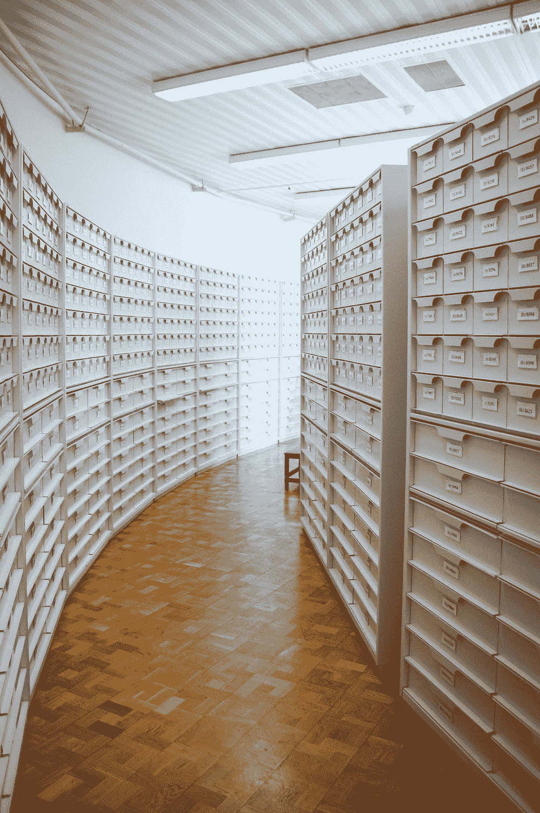
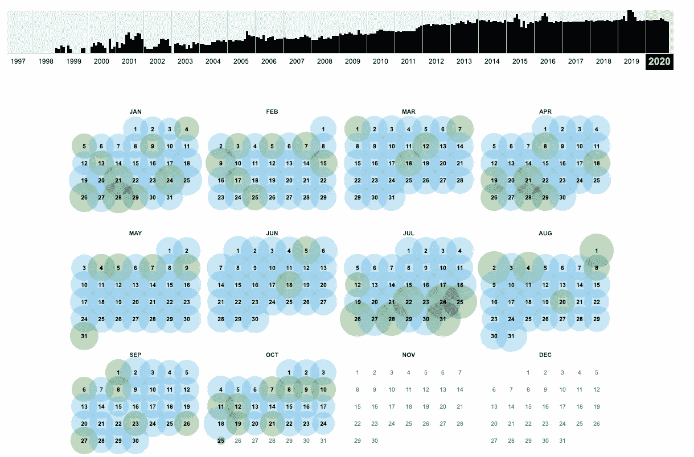
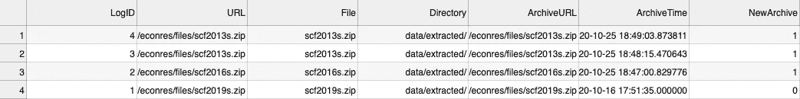

# 归档和记录您对公共数据的使用

> 原文：<https://towardsdatascience.com/archiving-and-logging-your-use-of-public-data-5c19a7ac360?source=collection_archive---------64----------------------->

## 处理公共数据集的不确定性



信用:[乌拉 Kuźma](https://unsplash.com/@ula_kuzma)

当我从网上下载数据集时，我总是担心它们的不稳定性。链接死了，数据变了，灰归灰，尘归尘。

这就是为什么我将[返程机](http://web.archive.org/)引入我的工作流程。但即使这样，也很难确定我是从一个存档网站还是从一个实时网站下载数据，也很难理解我过去做了什么。

我在[消费者金融调查](/linear-regressions-for-the-survey-of-consumer-finances-ed2c10b2670c?sk=fa2330fb7d48fd5cea3134d74d8c1778) (SCF)的工作中所做的是实现一个同时归档和记录我使用的数据的系统。下面是我所做工作的总结，但是如果你只是想看代码，请滚动到这篇文章的底部，查看我在 SCF 方面实现的功能的要点。

## WaybackPy 的建筑

我想在这个项目中完成的最重要的事情是确保我在下载数据时尽可能多地使用最近的 Wayback 档案。另外，对于没有存档的任何数据，我希望确保它在 Wayback 上存档以供将来使用。

我找到的最好的包是 [WaybackPy](https://pypi.org/project/waybackpy/) ，尽管我需要做一些修改来让它为我的目的工作。

首先，我需要实现允许我查看最新归档的年龄的属性。通过这种方式，我可以查看给定的`archive_age_limit`是否需要新的归档。

举例来说，如果你得到一个通过`[www.google.com](http://www.google.com)`的 WaybackPy Url 对象的`len()`，你会得到 0，或者是自上次存档以来的天数。

```
import waybackpyurl = “https://www.google.com/"waybackpy_url_obj = waybackpy.Url(url)print(len(waybackpy_url_obj))
```

考虑到几乎每天都会生成一个新的归档，这是有意义的。



Google.com 档案馆(作者截图)

## 归档和记录数据集

有了 WaybackPy，归档就变得简单了。只要确保为超过一定年龄的档案调用`save()`方法，存储一些关键数据，就可以开始了。

更难的部分是将关键数据添加到 CSV 中以供进一步检查。对于不能从 Wayback 机器上直接访问的新档案，尤其如此。

下面是一个实现的函数，它将您想要的数据所在的 URL 和数据本地保存的目标目录作为参数。它返回的是一个字典，包含最新存档的 URL 和时间戳。为了检查它的行为，让我们看看它是如何与 SCF 一起使用的。

## 使用 SCF 实现

在这篇文章的底部是一个完整的要点，展示了如何存档，记录和下载 SCF 数据。这个过程相对简单:

1.  提供您想要的 SCF 数据的年份、您想要的变量以及您想要存储数据的目标目录。
2.  使用最新的归档文件，或者如果最新的归档文件比您的限制旧，则创建新的归档文件。同时，记录正在使用的最新归档或新归档。
3.  尝试使用存档 URL 来检索您的数据，否则使用实时 URL。
4.  将您的数据转换为熊猫数据框。

日志本身的行为方式如下:

1.  如果最新存档在您的年龄限制内，它将记录其详细信息，如果您在年龄限制内再次尝试重新下载该数据，日志将不会重复记录。
2.  如果最新的存档超过了年龄限制，它将记录您保存的详细信息，如果您重新下载它。因为 Wayback 可能不会立即显示您的记录，所以您可能会在日志中有多个保存和记录，这比在 Wayback 不起作用时丢失保存的数据要好。

因此，如果您今天要下载 2019 年、2016 年和 2013 年的 SCF 数据，最后一个被下载两次，您会期望日志显示 4 个带有`archive_age_limit = 30`的记录，因为 2019 年的数据集是唯一一个在过去 30 天内存档的数据集。下面是一个例子，你会看到什么。



示例日志(作者截图)

## 最后的想法

我实现的日志对我的目的肯定是有用的，但是我还没有完全探索这段代码是如何被破坏的。很难找出如何最好地处理最近存档但没有立即更新的网站，但上面描述的“过度记录”行为总比没有好。

其他潜在的问题可能是不同的文件类型，但基本的归档行为应该保持不变。如果你想看的话，至少这段代码可以用于 SCF 的 zip 文件。