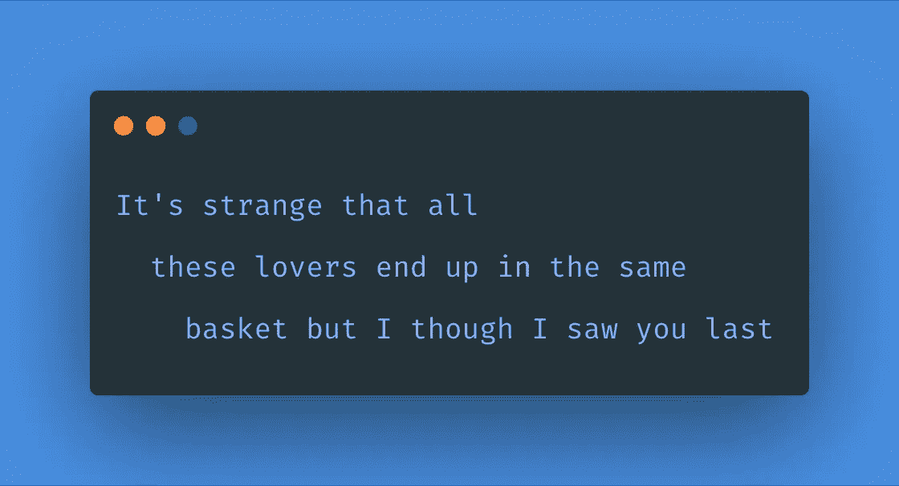
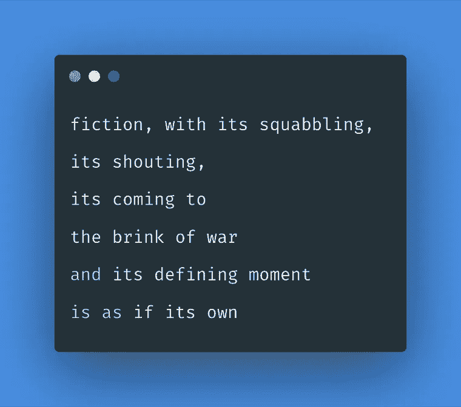
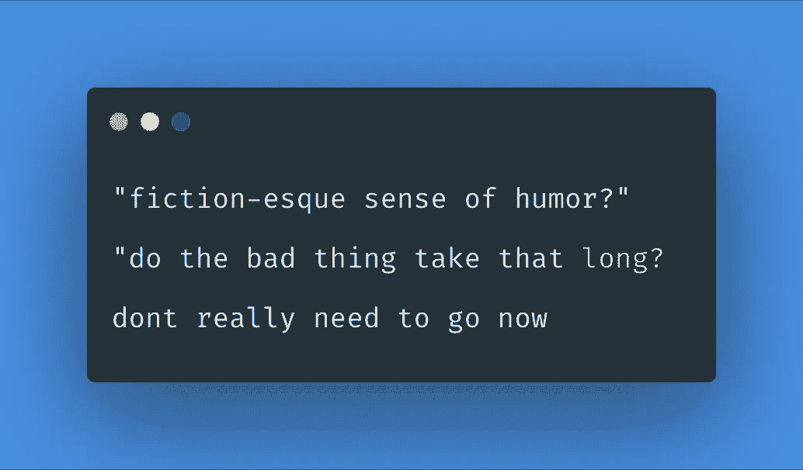

# 北极猴子歌词生成器|重访

> 原文：<https://towardsdatascience.com/arctic-monkeys-lyrics-generator-revisited-914bce61e013?source=collection_archive---------61----------------------->

## 我的模特认为我有一种虚构的幽默感

我必须给大家讲一个我一年前做的项目当时我在大三，为实习做准备，并且必须遵循这个面试前的日程表。在那之前，我是自然语言处理(NLP)的新手，至少对日历的结尾有所了解。当时有一个我认为极其令人畏惧的任务，“就你喜欢学习的任何话题写一篇博客？”

这让人望而生畏，因为这完全取决于我，当你真正拥有自主权时，它就没那么有趣了。我最后糊了两样我喜欢的东西，北极猴子和文本生成。它接受一个艺术家的名字，收集所有的歌词，输入到一个语言模型中，这个语言模型善于预测序列中的下一个单词，并按照你的艺术家的风格创作歌词。我用 [lyricsgenius](https://github.com/johnwmillr/LyricsGenius) 刮歌词。 [nlpaug](https://github.com/makcedward/nlpaug) 通过扩充来增加数据集。GPT-2 作为使用 [gpt2-simple](https://github.com/minimaxir/gpt-2-simple) 包训练的语言模型。

你可以在这里看到演讲[，如果你想看](https://www.youtube.com/watch?v=t4NFOIejZxQ&t=2330s)[幻灯片/笔记本](https://github.com/meghanabhange/Arctic-Monkeys-Lyrics-Generator)，你可以在这里看到。鉴于 NLP 中的所有东西都有几个月的有效期，并且我所有的代码都已经过时了，所以我不得不对笔记本做了很多修改。

以下是已经改变的事情，或者我应该说，是相同的事情，但我在一年后了解/发现

— -

*   GPT-2 代表生成式预训练变压器；是的，我以前不知道。
*   很多 Python 包都不擅长向后兼容。
*   不管你有多困，都不要忘记检查你的模特。
*   GPT-2 Simple 现在提供四种型号，小型(124 米)，中型(355 米)，大型(774 米)，超大型(774 米)。
*   Transformer 基于自我关注的概念(关注句子的不同部分以创建一个表示)，这使得并行估计成为可能，因为您不是一次一个单词地处理句子。
*   检查你的模型。
*   nlpaug 从 BERT aug 迁移到 ContextualWordEmbs，以合并所有更新的 BERT。
*   不要忘记检查你的模型。

**想自己试试吗？**

1.  通过更改本笔记本中的 API 键和艺术家姓名来获取您的数据。
2.  通过改变文本文件的名称来训练你的模型，以反映你的文件名[这里](https://github.com/meghanabhange/Arctic-Monkeys-Lyrics-Generator/blob/master/02.Training%20GPT2-Simple%20for%20AM.ipynb)
3.  [测试你的模型](https://github.com/meghanabhange/Arctic-Monkeys-Lyrics-Generator/blob/master/03.Generator.ipynb)

**我最喜欢的一些生成的歌词是:**

*最初发表于*[*https://meghana.substack.com*](https://meghana.substack.com/p/arctic-monkeys-lyrics-generator-revisited)*。*