# 在 NBA，三分球比两分球更重要吗？

> 原文：<https://towardsdatascience.com/are-3-pointers-more-important-than-2-pointers-in-the-nba-1fa8e1422c60?source=collection_archive---------17----------------------->

TJ·德拉戈塔在 [Unsplash](https://unsplash.com?utm_source=medium&utm_medium=referral) 上的照片

如果你是 NBA 的粉丝(或者稍微熟悉联盟)，你可能知道三分球正在上升。三分线在 1979-80 赛季首次引入 NBA，除了从 1994 年开始三分线缩短了 3 个赛季之外，它的使用逐年稳步增长。这种情况一直持续到 2000 年代末的几年，然后在 2011-12 赛季开始时急剧转向比以往任何时候都更陡峭的斜坡，并迅速增加到今天的水平。

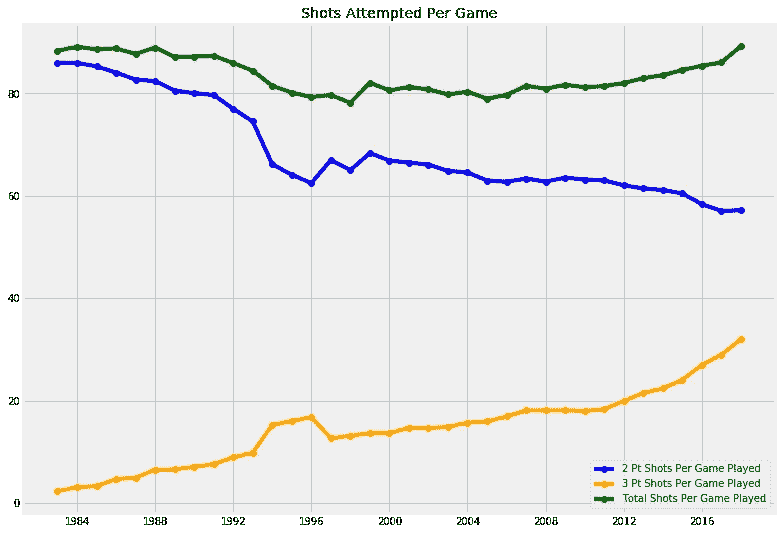

虽然三分球的崛起是明确而明显的，但对我来说，它回避了一个问题:这种趋势是正确的吗？三分球比两分球更能代表成功吗？

幸运的是，篮球和大多数其他运动一样，有丰富的数据收集，所以这些问题可以得到理想的答案！为了用 Python 完成这项任务，我设定了一个目标，即使用线性回归模型来预测球队在一个赛季中的胜利，使用逻辑回归分类模型来预测球队是否能进入季后赛。有了这些模型，我就能确定是 2 分投篮还是 3 分投篮对成功更重要，是线性模型赢的更多还是逻辑模型更有可能进入季后赛。

# 数据采集

使用三种不同的方法收集数据:

1.  **球员统计数据**——图书馆`basketball_reference_web_scraper`被用来从网站[https://www.basketball-reference.com/](https://www.basketball-reference.com/)收集数据，该网站收藏了自 20 世纪 40 年代以来的 NBA 统计数据。
2.  **球员工资** —库`selenium`用于从[https://hoopshype.com/salaries/players/](https://hoopshype.com/salaries/players/)中按年份抓取球员姓名和工资数据。(我有一篇关于如何使用`selenium`的分步文章，在这里使用这个确切的例子:[https://medium . com/@ Bryan . pfalzgraf/how-to-use-selenium-to-web-scrape-with-example-80 F9 b 23 a 843 a](https://medium.com/@bryan.pfalzgraf/how-to-use-selenium-to-web-scrape-with-example-80f9b23a843a))
3.  **球队统计** —库`nba_api`用于从 NBA 官方网站[https://stats.nba.com/](https://stats.nba.com/)中抓取数据。

我最终决定使用 1983-84 赛季以来的数据，因为那是第一个有 16 支球队进入季后赛的赛季。关于收集的数据，注意一些事情也很重要。

1.  我积累的所有数据都是赛季总数。我需要在每场比赛的基础上得到所有的东西，以使所有的东西都一样。一些球员因为受伤或休息等原因打了更少的比赛。至于球队总数，我的数据集中有两个赛季因为劳资纠纷导致停摆而缩短了。1998 赛季有 50 场常规赛，2011 赛季有 66 场常规赛。
2.  考虑到通货膨胀和 NBA 工资帽随时间的变化，我不得不通过使每个球员的工资占当年联盟总工资的百分比来标准化。这使得每个球员的正常工资可以逐年比较。

# 建模

*Wins 预测的线性回归*

1-第一次尝试是尝试看看仅仅使用进攻投篮统计数据是否能让一切都有条理。我建模使用:`FG2_PCT`、`FG3_PCT`、`FT_PCT`、`FG2A_PER_GP`、`FG3A_PER_GP`、`FG3A/FG2A`。

*   列车 R : 0.4028
*   测试 R : 0.2947
*   这些值似乎不够高，模型过度适合训练数据，所以我不想从中得出任何结论，因为我可以添加其他非拍摄统计数据的更多特征。

**2 —第二次尝试**包括:`FG2_PCT`，`FG3_PCT`，`FT_PCT`，`FG2M_PER_GP`，`FG2A_PER_GP`，`FG3M_PER_GP`，`FG3A_PER_GP`，`FTM_PER_GP`，`FTA_PER_GP`，`OREB_PER_GP`，`DREB_PER_GP`，`AST_PER_GP`，`PF_PER_GP`，`STL_PER_GP`，`TOV_PER_GP`，`BLK_PER_GP`。

*   列车 R : 0.8049
*   测试 R : 0.8293
*   这些值要高得多，代表一个强模型。
*   下图显示了此模型中每个要素的缩放系数，其 P 值也低于 0.05，表示要素的重要性。

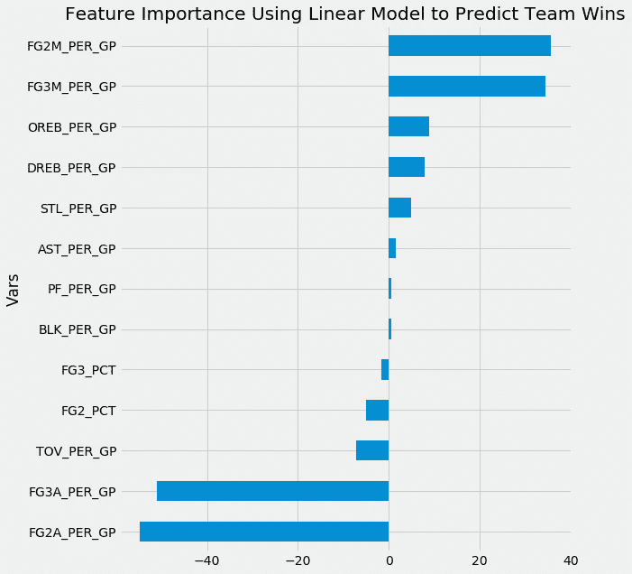

**3 —** **第三次尝试**包括:`FG2A_PER_GP`、`FG3A_PER_GP`、`FTA_PER_GP`、`OREB_PER_GP`、`DREB_PER_GP`、`AST_PER_GP`、`PF_PER_GP`、`STL_PER_GP`、`TOV_PER_GP`、`BLK_PER_GP`。

*   列车 R : 0.6248
*   测试 R : 0.6649
*   这些值低于之前的尝试，但更容易区分一个团队的 3 分投篮和 2 分投篮，并使特征重要性更容易解释，同时仍然是一个相对较强的模型。
*   下图显示了此模型中每个要素的缩放系数，其 P 值也低于 0.05，表示要素的重要性。

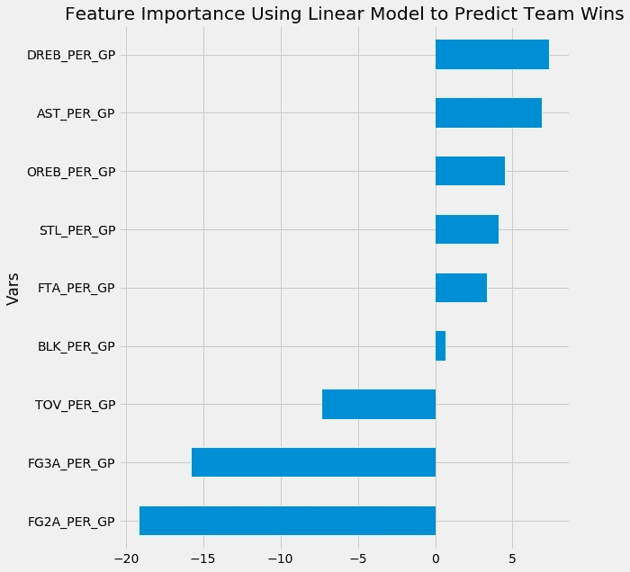

*季后赛分类的逻辑回归*

**1 —第一次尝试**是尝试对球队是否进入季后赛进行分类。特征包括:`FG2_PCT`、`FG3_PCT`、`FT_PCT`、`FG2M_PER_GP`、`FG2A_PER_GP`、`FG3M_PER_GP`、`FG3A_PER_GP`、`FTM_PER_GP`、`FTA_PER_GP`、`OREB_PER_GP`、`DREB_PER_GP`、`AST_PER_GP`、`PF_PER_GP`、`STL_PER_GP`、`TOV_PER_GP`、`BLK_PER_GP`。

*   训练精度:0.8459
*   测试精度:0.8307
*   良好的准确性，而且由于季后赛类别相对均匀(每个赛季 30 支球队中有 16 支进入季后赛)，准确性是一个很好的衡量标准。
*   下图显示了此模型中每个特征的缩放系数，其 P 值也低于 0.05，以表示特征选择。

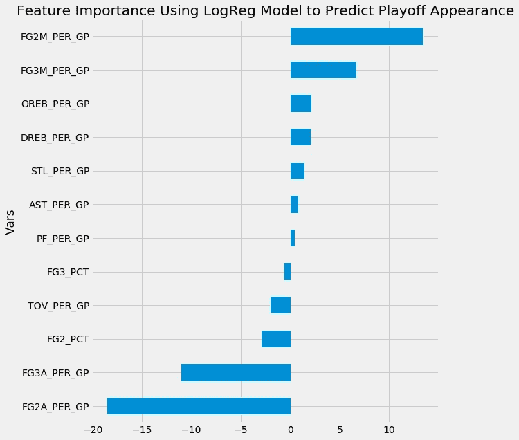

**2 —第二次尝试**试图对球队是否赢得了 NBA 总决赛进行分类，是否获得了当年最佳球队的桂冠。使用了与第一次尝试相同的功能。训练精度为 0.9657，这看起来不错，但在这种情况下不是一个成功模型的良好衡量标准，因为没有进入 NBA 总决赛的球队和进入总决赛的球队之间存在显著差异。

*   训练敏感度:0.0741
*   测试灵敏度:0.1111
*   灵敏度低，因此不是用于任何澄清的好模型。

**3 —第三次尝试**试图对球队是否进入 NBA 总决赛进行分类，这意味着他们赢得了各自的分区，并必须与其他分区的获胜者比赛才能赢得 NBA 总冠军。使用了与第一次尝试相同的功能。训练精度为 0.9315，这看起来不错，但在这种情况下不是一个成功模型的良好衡量标准，因为没有进入 NBA 总决赛的球队和进入总决赛的球队之间存在显著差异。

*   训练敏感度:0.0741
*   测试灵敏度:0.1111
*   不是一个用于任何澄清的好模型

**4 —第四次尝试**包括:`FG2A_PER_GP`、`FG3A_PER_GP`、`FTA_PER_GP`、`OREB_PER_GP`、`DREB_PER_GP`、`AST_PER_GP`、`PF_PER_GP`、`STL_PER_GP`、`TOV_PER_GP`、`BLK_PER_GP`。

*   训练精度:0.8142
*   测试精度:0.7717
*   这比第一次尝试的准确性低，但仍然准确，同时更容易解释，因为只有一个 3 点投篮变量和一个 2 点投篮变量。
*   下图显示了该模型中每个要素的缩放系数，其 P 值也低于 0.05

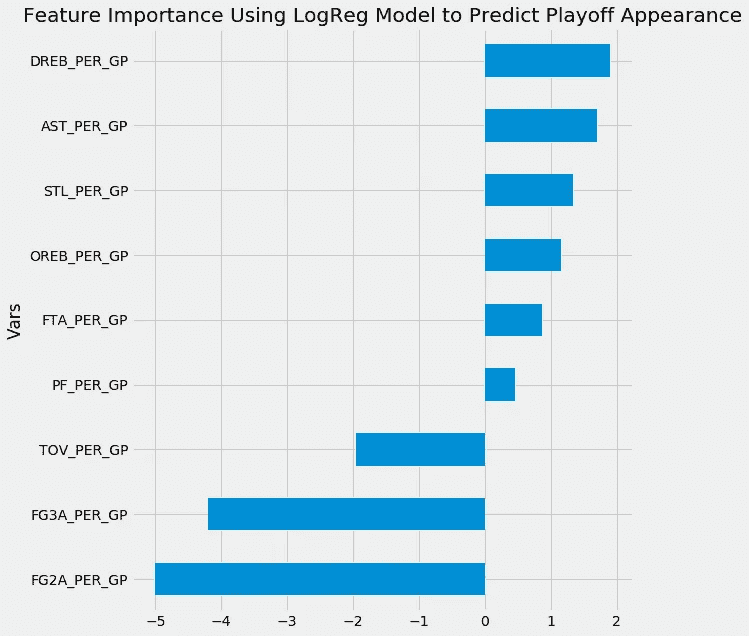

# 数据趋势

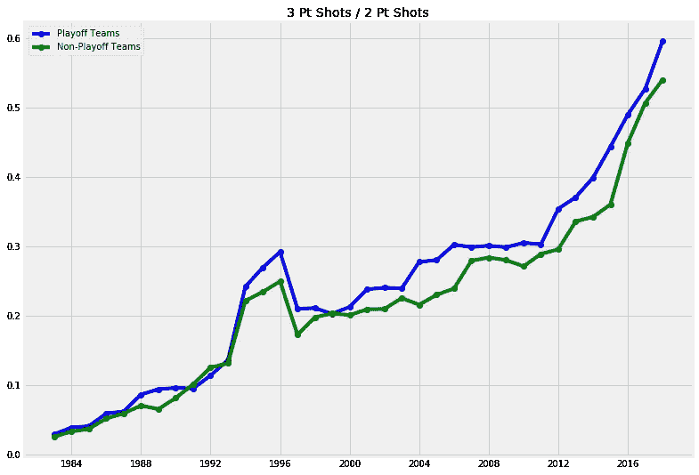

三分球与两分球的比例逐年稳步上升。NBA 球队正在以 2 分投篮为代价，寻找更多 3 分投篮的价值。注意季后赛球队几乎总是投更多的 3 分球，而不是 2 分球。

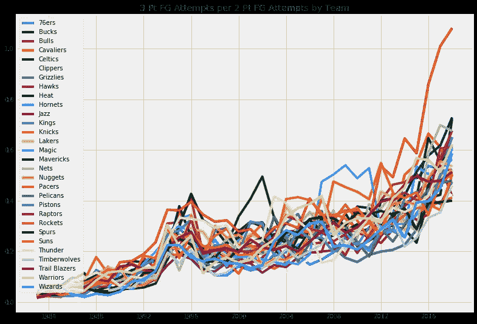

休斯顿火箭队的加速比联盟中的其他球队要快得多。他们是第一支在一个赛季中三分球比 2 分球更多的球队，他们在 2017-18 和 2018-19 赛季都完成了 2 分球。使用这种三点策略，他们获得了成功。

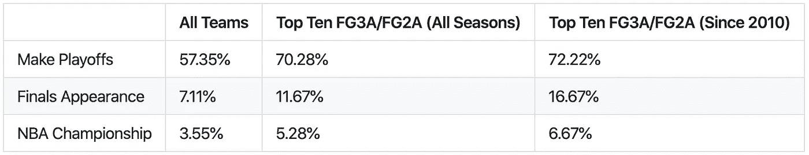

这显示了在那个赛季排名前十的球队是如何比联盟其他球队取得更多成功的。自 2010 年以来，随着联盟转向更多的 3 分投篮，这一点表现得更加明显。

# 结论和进一步的观点

解释每个成功模型的特征重要性是决定 3 点射击是否比 2 点射击更能代表成功的主要因素。查看包含线性回归和逻辑回归的大多数特征的最强模型，两个模型的两个最强的正面影响是`FG2M_PER_GP`和`FG3M_PER_GP`，而两个模型也共享两个最强的负面影响`FG2A_PER_GP`和`FG3A_PER_GP`，所有这些都是相同的顺序。仅从逻辑模型来看，`FG2M_PER_GP`似乎具有显著的优势。虽然这可能被解释为代表 2 分投篮更重要，但我相信这被`FG2A_PER_GP`的负面影响抵消了。这使得人们很难从观看它们中获得任何东西。

具有最好的准确性和可解释性组合的模型是逻辑回归尝试 4，尽管其结果也反映在其具有相同特征的线性回归对应物中。这些模型表明`FG2A_PER_GP`比`FG3A_PER_GP`对每个模型的负面影响更强。这让我相信三分球对成功更重要，因为更多的尝试不会像更多的 2 分尝试那样产生负面影响。我可以同意 NBA 实施更注重 3 分投篮的举措。从概念上讲，我会建议团队进一步推动他们的`FG3A/FG2A`，因为增加每个镜头之间的关系应该会有所帮助。这与上面数据趋势部分的图表是一致的。

在这种情况下，如果擅长三分球的人会更频繁地出现在 NBA，这将是有意义的，如下图所示。

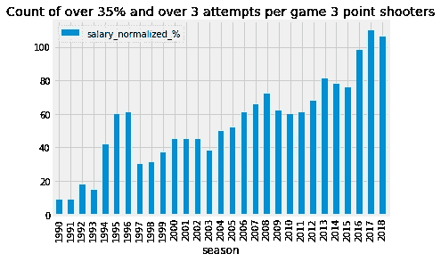

但是除了他们更频繁地出现，如果 NBA 球队更重视这些球员并给他们更高的薪水也是有意义的。下面的图表显示了两种不同的方式来划分 NBA 三分球射手，那些超过 35%的命中率和那些三分球前 20 的命中率。这两个人的工资似乎都没有大幅增长。随着时间的推移，我想这些球员的价值会更高。

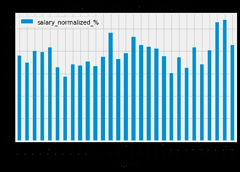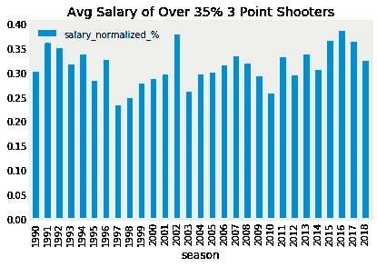

如果你想查看整个项目的代码，可以在我的 GitHub 上找到这个链接:[https://github.com/bgp09002/NBA](https://github.com/bgp09002/NBA)