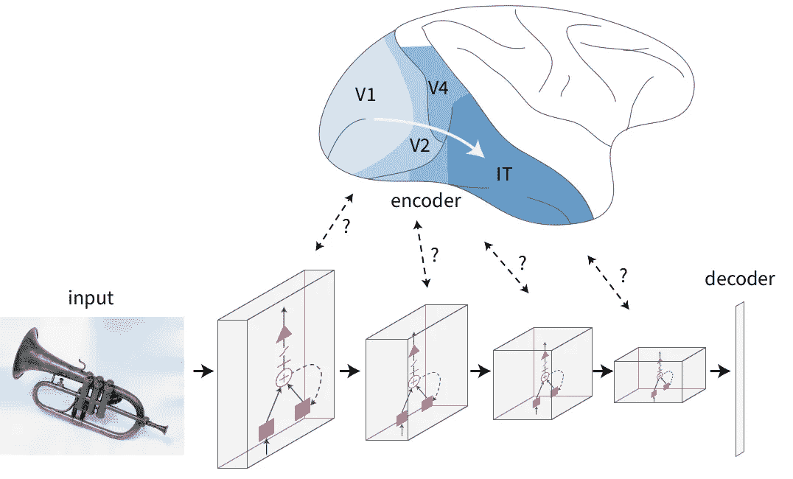

# 所有的 CNN 都是平等的吗？

> 原文：<https://towardsdatascience.com/are-all-cnns-created-equal-d13a33b0caf7?source=collection_archive---------40----------------------->

## 不考虑建筑，CNN 用相似的策略识别物体:但是人类使用一种非常不同的策略。

我们对卷积神经网络(CNN)知之甚多，却知之甚少。我们可以访问每一个模型参数，我们可以检查他们训练数据的每一个像素，并准确地知道架构是如何形成的——然而，理解他们识别物体的策略被证明是令人惊讶的挑战。

理解策略是至关重要的:如果我们理解 CNN 如何决策——也就是说，他们使用哪种策略，我们只能相信 CNN 从 X 射线扫描中识别癌症或驾驶自动驾驶汽车。

我们在这里引入*误差一致性*，一个简单的分析来衡量两个系统——例如两个 CNN，或者一个 CNN 和一个人——是否执行不同的策略。通过这种分析，我们研究了以下问题:

*   **所有的 CNN 都是“平等的”(实施相似的策略)吗？**
*   **循环 CNN 的策略不同于前馈 CNN 吗？**
*   人类使用和 CNN 一样的策略吗？

# 动机:犯错就是告诉别人

所以你想训练一个神经网络来区分小狗和人。也许你想训练一个系统，当你的小狗到来时打开门，但不让陌生人进入，或者你是一个[动物农场](https://en.wikipedia.org/wiki/Animal_Farm)的主人，你想确保只有人可以进入房子。

在任何情况下，你都可以用你最喜欢的 CNN(比如，ResNet-152 代表性能，AlexNet 代表美好的旧时光),用从网上搜集的小狗与人的数据集来训练它们。看到它们每个都达到了大约 96-98%的准确率，你就放心了。很可爱。但是相似的准确性是否意味着相似的策略呢？

嗯，不一定:即使非常不同的策略也可能导致非常相似的准确性。然而，网络出错的那 2 %- 4%携带了关于它们各自策略的大量信息。假设 AlexNet 和 ResNet 都在下面的图像上犯了一个错误，预测了“人”而不是“小狗”:

查尔斯·德鲁维奥在 [Unsplash](https://unsplash.com/s/photos/puppy-clothes?utm_source=unsplash&utm_medium=referral&utm_content=creditCopyText) 上拍摄的照片

现在犯这个错误就像这只狗看起来一样令人难过，特别是因为许多其他小狗都被很好地认出来了，就像这里的这些:

你大概知道小狗长什么样，但是它们不可爱吗？！照片由[巴拉蒂·坎南](https://unsplash.com/@bk010397?utm_source=medium&utm_medium=referral)在 [Unsplash](https://unsplash.com?utm_source=medium&utm_medium=referral) 上拍摄。

再看一些网络无法识别的图像，你开始产生怀疑:有没有可能两个网络都实施了分类策略“*穿衣服的就是人*”？你一直怀疑 AlexNet 有点像骗子——但你呢，ResNet？对一个有 152 层的人要求更多一点的人物深度是不是太多了？

更仔细的观察证实:相反，网络也错误地将一些人分类为“小狗”——如果模特的决策策略依赖于衣服的程度，我们让读者想象这些图像可能会是什么样子。

**出错很说明问题，**我们可以利用这一特性:如果两个系统(例如，两个不同的 CNN)实施相似的策略，它们应该在相同的单个输入图像上出错——不仅是相似数量的错误(通过准确度来衡量),而且是相同输入上的错误:相似的策略会产生相似的错误。这正是我们可以使用*误差一致性*来衡量的。

在我们最近的论文[中介绍的](https://arxiv.org/abs/2006.16736)，逐个试验的错误一致性评估两个系统是否在相同的输入(或试验，在心理学实验中称为试验)上系统地出错。如果你愿意，可以称之为基于试错的分析。

抛开假设的玩具数据集(小狗对人)，在一个大数据集(ImageNet)上训练的不同 CNN 的策略有多相似？它们与相同数据上的人为错误相似吗？我们只是去了动物，原谅，[模型农场](https://pytorch.org/docs/0.2.0/torchvision/models.html)并评估了所有 ImageNet 训练的 PyTorch 模型，以获得它们在数据集上的分类决策(正确答案与错误)，我们也有人类决策进行比较。这是我们的发现。

# 所有 CNN 都是平等的

当我们看下面的图时，可以看到 16 种不同的 CNN 具有大范围的 ImageNet 精度，范围从大约 78% (AlexNet，棕色，在左边)到大约 94% (ResNet-152，深蓝色，在右边)。如果两个系统犯的相同错误和我们偶然预料的一样多，我们会看到误差一致性为 0.0；较高的误差一致性表明策略相似(相同策略高达 1.0)。

CNN 与其他 CNN 相似，但不像人类:更高的误差一致性(高达 k=1.0)是对相似策略的指导。图片作者。

有趣的是，CNN 和人类之间的误差一致性(黑色虚线)非常接近于零:人类和 CNN 很可能实施不同的策略，并且这种差距不会随着更高的模型性能而缩小。另一方面，人类对人类(红色)是相当一致的:大多数人类会犯和其他人类相似的错误。然而，也许最令人惊讶的是，CNN 与其他 CNN(金色)的对比显示出异常高的一致性:CNN 与其他 CNN 犯了非常相似的错误。

所有的 CNN 都是平等的吗？自从 AlexNet 在 2012 年推出以来，我们已经看到了非常先进的神经网络架构。我们现在有了跳过连接、数百层、批量标准化等等:但是错误一致性分析表明我们所取得的是准确性的提高，而不是策略的改变。

在我们的分析中，记录的最高误差一致性甚至出现在两个非常不同的网络中:ResNet-18 与 DenseNet-121，这两个模型来自不同的模型系列，具有不同的深度(18 层与 121 层)和不同的连接性。在很大程度上不考虑架构，被调查的 CNN 似乎都执行非常相似的策略——不同于人类的策略。

# …但是有些 CNN 比其他的更平等吗？

你可能会指出，我们只测试了前馈网络，这似乎是不正确的，因为众所周知，人脑有丰富的循环计算。当然，我们不能将这些发现推广到所有 CNN，包括复发的 CNN。

这当然是真的，我们只能对我们测试的 CNN 做出明确的声明。为了找出一个循环网络是否不同(“比其他网络更平等”)，我们也分析了一个循环 CNN。而且不只是任何一个循环网络:CORnet-S，根据[大脑评分网站](http://www.brain-score.org/)的说法，这是世界上最像大脑的神经网络模型，CORnet-S 在 NeurIPS 2019 上发表了口头贡献，CORnet-S，“目前灵长类腹侧视觉流的最佳模型”，根据其作者的说法，执行“类脑物体识别”[。](https://papers.nips.cc/paper/9441-brain-like-object-recognition-with-high-performing-shallow-recurrent-anns.pdf)

CORnet-S 有四层，分别以大脑区域 V1、V2、V4 和 IT 命名。图鸣谢:[https://papers . nips . cc/paper/9441-brain-like-object-recognition-with-high-performance-shallow-recurrent-ANNs . pdf](https://papers.nips.cc/paper/9441-brain-like-object-recognition-with-high-performing-shallow-recurrent-anns.pdf)(裁剪自[https://github . com/dicarlolab/neur IPS 2019/blob/master/figures/fig 1 . pdf](https://github.com/dicarlolab/neurips2019/blob/master/figures/fig1.pdf)

CORnet-S 有四层，分别称为“V1”、“V2”、“V4”和“它”，分别对应于灵长类动物(包括人类)中负责物体识别的腹侧流脑区。当将 CORnet-S 与基线模型前馈 ResNet-50 进行比较时，我们发现:

递归 CORnet-S(橙色)会产生与前馈 ResNet-50(蓝色)类似的错误，但不会产生类似人类的错误(红色)。许多橙色和蓝色数据点甚至完全重叠。选择 x 轴是为了让我们可以看到灰色区域，如果模型只是因为偶然而表现出一致性，那么我们会期望模型出现在这个灰色区域。

这很奇怪。人类会犯与人类类似的错误(红色)，但递归 CORnet-S(橙色)会犯与前馈 ResNet-50(蓝色)几乎完全相同的错误:这两个网络似乎实施了非常相似的策略，但根据错误一致性分析，肯定不是“类似人类”的策略。(然而，请注意，它实际上取决于数据集和指标:例如，CORnet-S 在捕捉生物物体识别的循环动态方面显示了有希望的结果。)似乎循环计算——在 [挑战](https://www.pnas.org/content/115/35/8835) [任务](https://www.nature.com/articles/s41593-019-0392-5)中显得尤为重要的[——并不是什么灵丹妙药。虽然递归是](http://papers.nips.cc/paper/7300-learning-long-range-spatial-dependencies-with-horizontal-gated-recurrent-units.pdf)[通常](https://www.annualreviews.org/doi/full/10.1146/annurev-vision-082114-035447) [认为](https://www.frontiersin.org/articles/10.3389/fpsyg.2017.01551/full) [到](https://papers.nips.cc/paper/9441-brain-like-object-recognition-with-high-performing-shallow-recurrent-anns.pdf) [是](https://www.pnas.org/content/pnas/116/43/21854.full.pdf) [之一](https://www.annualreviews.org/doi/full/10.1146/annurev-vision-091718-014951) [的](https://arxiv.org/pdf/2003.12128.pdf) *关键*为了更好地解释生物视觉，递归网络不一定导致与纯前馈 CNN 不同的行为策略。

# 摘要

*   所有的 CNN 都是生来平等的:不管架构如何，所有 16 个被调查的 CNN 都会犯非常相似的错误。
*   **没有 CNN 比其他 CNN 更平等**:根据误差一致性分析，即使是被称为“灵长类腹侧视觉流的当前最佳模型”的递归 CORnet-S，其行为也像标准的前馈 ResNet-50(但两个网络都未能犯类似人类的错误)。
*   人类是不同的。人类和机器视觉使用的策略还是很不一样的。

量化行为差异可能最终会成为缩小人类和机器策略之间差距的有用指南，这样，在某个时间，某天我们可能会到达这样一个点，用乔治·奥威尔的话来说，以下内容已经成为现实:

> 他们从模型看向人，从人看向模型，再从模型看向人；但是很难说哪个是哪个…

## 参考

上述分析可在以下文件中找到:

R.Geirhos*、K. Meding*和 Felix A. Wichmann，[超越准确性:通过测量误差一致性量化 CNN 和人类的逐个试验行为](https://arxiv.org/abs/2006.16736) (2020)，arXiv:2006.16736

## 密码

 [## wich Mann-lab/误差一致性

### 误差一致性是衡量两个决策系统是否系统地做出决策的定量分析

github.com](https://github.com/wichmann-lab/error-consistency)