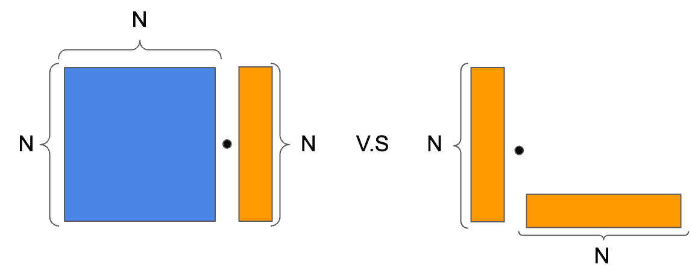
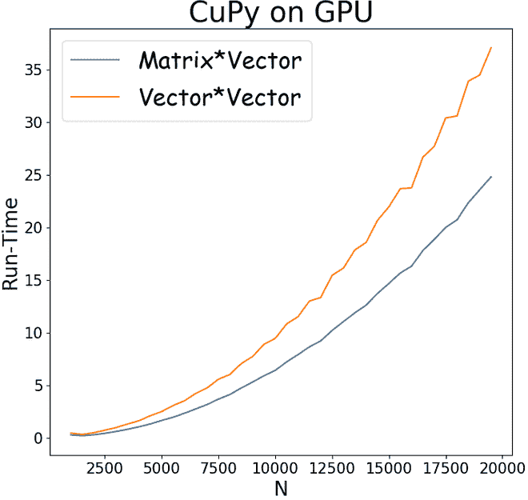
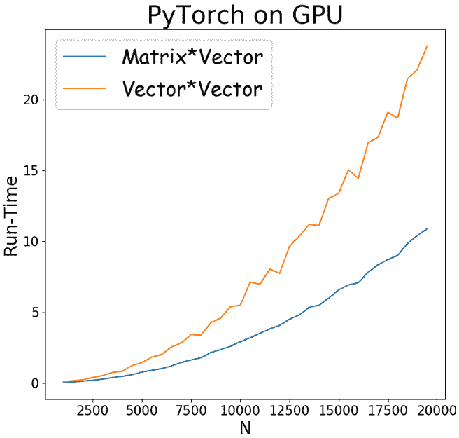
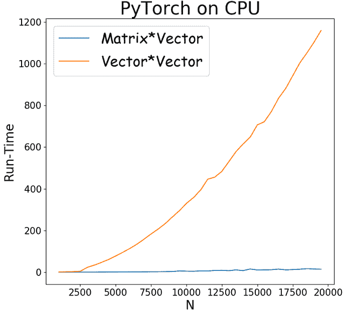
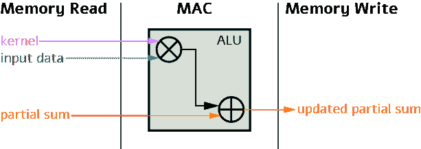
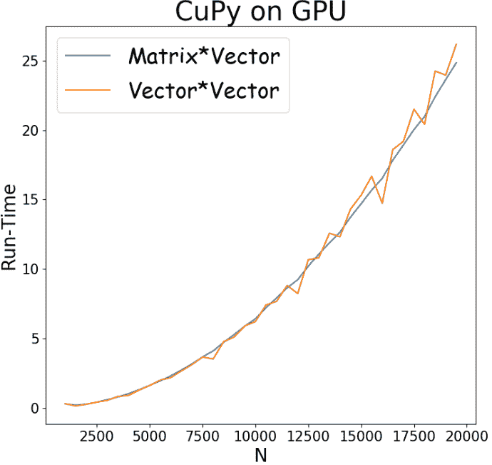

# 所有的翻牌都是一样的吗？

> 原文：<https://towardsdatascience.com/are-all-flops-created-equal-a-comparison-of-flops-vs-run-time-3cebb2dcb3da?source=collection_archive---------50----------------------->

## **FLOPs 与运行时间的比较**


最初发布于[https://deci . ai/are-all-flops-created-equal-a-comparison-of-flops-vs-run-time/](https://deci.ai/are-all-flops-created-equal-a-comparison-of-flops-vs-run-time/)

在深度学习时代的初期，我们的主要目标是达到新的准确性水平。事实上，深度学习的早期工作在各种任务和数据集上显示了显著的结果。然而，近年来，重点已经转移到最大限度地提高效率。如今，深度学习社区正在寻求推理效率提高的更准确的模型。深度学习推理中的效率概念取决于上下文。它可能指的是能耗、内存效率或运行时效率——这是本文的重点。

对近年来开始出现的高效模型的分析通常假设浮点运算(FLOPs)可以作为任何类型的效率(包括运行时间)的准确代理。在串行与并行计算的环境中，这种假设显然是错误的；当 N 个工人可用时，挖壕沟(一个完全并行的任务)比挖井(一个固有的串行任务)快 1/N。类似地，由于 GPU 的高并行化能力，可并行化的操作将比不可并行化的操作运行得更快。但是并行化考虑并不是一切，在这篇文章中，我们来看一个重要的例子，它表明 FLOPS 不足以衡量 GPU 计算环境中的运行时间。

在我们的数值示例中，我们使用标准的 CuPy 和 PyTorch 库在 GPU 和 CPU 上执行矩阵乘法。我们证明了相同数量的 FLOPs 会导致不同的运行时间。我们的示例模拟了网络一层中的操作，其中我们研究了两个矩阵乘法。第一个乘积是一个 NxN 矩阵乘以一个 Nx1 向量。第二个是两个向量的外积，即一个 Nx1 矩阵与一个 1xN 矩阵的积，结果得到一个 NxN 矩阵。然后，为了在两种情况下获得相同数量的触发器，在执行外积之后，我们对每列使用 N-1 次加法来对矩阵的每列求和。图 1 中的图表示意性地描述了这两个操作。



图 1:两个矩阵/矢量产品消耗相同的 FLOPs。左:矩阵*矢量积。右图:向量*向量外积，在外积之后，我们对每一列求和。

这些操作中的每一个都消耗 2 NxN-N 个触发器，这些触发器被分解成 NxN 个浮点(FP)乘法和 NxN-N 个 FP 加法。

我们现在考虑使用 GPU 加速这些计算(参见下面的 Python 代码)。图 2 中的图表描述了两种操作的运行时间与测得的触发器的关系。这些图是通过应用每种 N 值递增的产品，并在多次运行中求平均值而生成的。



图 2:运行时间(单位为秒)与矩阵乘法的 N(FLOPS = 2 nxn-N)和向量乘法及求和的函数关系。蓝色:矩阵*矢量；橙色:向量*向量(外积)。X 轴(N)是矢量/矩阵的大小。从左到右:GPU 上的 CuPy，GPU 上的 PyTorch，CPU 上的 PyTorch。

尽管每个场景中的 FLOPs 数量是相同的，但是它们的运行时间却有很大的不同。此外，随着 N(矩阵中条目的数量)的增加，差异变得更大。例如，在 CuPy 曲线中很明显，当向量/矩阵大小为 N=20，000 时，外积大约比矩阵乘法长 1.5 倍。使用 PyTorch，当 N=20，000 时，差异变得超过 2 倍长。

对于观察到的操作运行时间的巨大差异，以下是一些常见的解释。

# GPU 计算的底层视图

为了理解什么可以区分 FLOPs 和运行时，我们需要首先理解 GPU 如何执行计算。在幕后，当计算深度神经网络中的层的值时，有两种操作:

乘法和累加(MAC) —此操作需要三个输入:内核(或关于内核的信息)、输入数据和从上一次迭代计算的部分和。这三个输入通过算术逻辑单元(ALU)传输，该单元执行乘法和加法的逐位运算。运算的输出是存储在单独的存储器单元中的部分和。



内存访问—此操作获取为每个 MAC 操作计算的部分和，并根据其大小将其存储在指定的内存单元中。粗略地说，有四种(有时更多)类型的存储单元:寄存器文件(RF)存储器，存储少量数据(最多 1Kb)；处理引擎(PE ),存储更多的数据；缓冲单元；还有那杯酒。随着存储单元大小的增加，该单元的时间消耗也增加。在最糟糕的情况下，读取和写入 DRAM 的成本非常高，运行时间是存储在 RF 上的 200 多倍。

当我们计算失败次数时，我们实际上并不区分 MAC 和内存访问操作。然而，这些可能与运行时间有很大不同。一系列需要大量 DRAM 存储的 MAC 比同样数量的完全不使用 DRAM 的 MAC 花费的时间要多得多。

并行操作的能力是影响最终运行时间的另一个因素。与由几个为顺序串行处理而优化的内核组成的 CPU 相比，GPU 由包含数千个较小内核的大规模并行架构组成。这为可以并行运行的网络结构提供了优势。例如，GPU 的结构要求在一定的规模下，较宽较浅的网络在 GPU 上的运行速度要快于较深较细的网络。这是因为如果更广泛的网络的操作占用更多的 GPU 核心，则可以以并行方式进行计算，而更深入的网络的计算需要以更顺序的方式进行。操作的并行化取决于所使用的特定硬件和算法操作。

回到我们的数字示例，可以将运行时间的差异归因于两个因素:并行性和内存访问。也就是说，自定义实现可以减少运行时间的差异；因此，这种差异很大程度上取决于所用框架的具体实现。我们能够使用名为 Nsight system 的 NVIDIA 工具来识别特定的内存访问和并行性瓶颈。我们将在以后的文章中讨论这个话题。

# 注重记忆的编程可以加快计算速度

尽管我们在图 2 中观察到明显的差距，我们还是想举例说明该框架对结果的影响。使用高级框架时(例如 CuPy、PyTorch、TensorFlow 等。)，我们实际上是在使用一个预定义的算法。在不同的用例中，不同的算法表现出不同的性能。例如，2D 数组的 CuPy 实现是通过重新索引 1D 数组的条目来实现的。这意味着当试图从 2D 数组中弹出元素时，一行中的相邻元素将比一列中的相邻元素更快地被检索到。由于这个原因，我们可以期待一个通用算法在行上比在列上更快地执行求和。回想一下，在图 2 的结果中，我们用 CuPy 对列进行了求和。我们现在表明，通过改变求和的维数，我们可以(几乎)使两个操作的运行时间相等。这可以从图 3 中看出:



图 3:矩阵乘法与向量乘法和求和的运行时间(秒)与触发器。蓝色:矩阵*矢量；橙色:向量*向量(外积)。X 轴对应于矩阵中条目的数量。这个实现使用了 CuPy，其中对行执行外积后的求和。

尽管在这个具体的例子中，我们能够通过改变一行代码来改善结果，但是当使用更高级别的框架时，这并不总是可能的。例如，如果我们用 PyTorch 尝试同样的技巧，结果不会有明显的改善。此外，当涉及到真正的深度网络时，减少运行时间需要非常高的专业知识。

# 结论

通过一个矩阵/向量乘积的具体例子，我们证明了在运行时，FLOPs 不能作为效率的通用代理。这一事实经常被忽视，甚至在某些学术论文中也是如此。我们使用 CuPy 和 PyTorch 演示了两个矩阵/向量乘法，它们消耗完全相同的触发器数量，却可以有完全不同的运行时间。我们还简要讨论了这些差异的原因。

**CuPy 代码**

```
import cupy as cp
import time
import os
import numpy as np
import matplotlib.pyplot as plt
from cupy import cuda
import pickle

def cp_Matmul(x, y, iterations):
    for i in range(iterations): 
      q = cp.matmul(x, y, out=None)   
    return q

def cp_Vecmul(x,y,iterations):
    for i in range(iterations):
        q = cp.matmul(x,y,out=None)
        q = cp.sum(q,axis=1)      
    return q

xmin = 1000
xmax = 20000
jump = 500
lim = range(xmin,xmax,jump)

Matrix_result = []
Vector_result = []
iterations = 1000

for k in lim:
    N = k

    vec_outer_1 = cp.random.rand(N,1)
    vec_outer_2 = cp.random.rand(1,N)

    matrix = cp.random.rand(N,N)
    vec_matrix = cp.random.rand(N,1)

    start_event = cp.cuda.stream.Event()
    stop_event = cp.cuda.stream.Event()
    start_event.record()
    q = cp_Vecmul(vec_outer_1,vec_outer_2,iterations)
    stop_event.record()
    stop_event.synchronize()
    Vector_time = cp.cuda.get_elapsed_time(start_event, stop_event)/1000
Matrix_result.append(Matrix_time)
print('Total run time matrices', Matrix_time)
```

**PyTorch 代码**

```
import os
import numpy as np
import matplotlib.pyplot as plt
import torch
import pickle

def tr_Matmul(a, b, iterations):
    for i in range(iterations):
        q = torch.mm(a, b, out=None).to(device=cuda0)
    return q

def tr_Vecmul(a,b,iterations):
    for i in range(iterations):
        q = torch.mm(a,b,out=None).to(device=cuda0)
        q = torch.sum(q,dim=0).to(device=cuda0)
    return q

xmin = 1000
xmax = 20000
jump = 500
lim = range(xmin,xmax,jump)

Matrix_result = []
Vector_result = []
iterations = 1000

for k in lim:
    N = k
    cuda0 = torch.device(device='cuda')

    vec_outer_1 = torch.rand(N,1).to(device=cuda0)
    vec_outer_2 = torch.rand(1,N).to(device=cuda0)

    matrix = torch.rand(N,N).to(device=cuda0)
    vec_matrix = torch.rand(N,1).to(device=cuda0)

    start_event = torch.cuda.Event(enable_timing=True)
    stop_event = torch.cuda.Event(enable_timing=True)
    start_event.record()

    q = tr_Vecmul(vec_outer_1,vec_outer_2,iterations)
    stop_event.record()
    torch.cuda.synchronize()
    Vector_time = start_event.elapsed_time( stop_event)/1000
    Vector_result.append(Vector_time)
    print('Total run time vectors',Vector_time)

    start_event = torch.cuda.Event(enable_timing=True)
    stop_event = torch.cuda.Event(enable_timing=True)
    start_event.record()

    q = tr_Matmul(matrix, vec_matrix, iterations)
    stop_event.record()
    torch.cuda.synchronize()
    Matrix_time =  start_event.elapsed_time( stop_event)/1000
    Matrix_result.append(Matrix_time)
    print('Total run time matrices', Matrix_time)
```