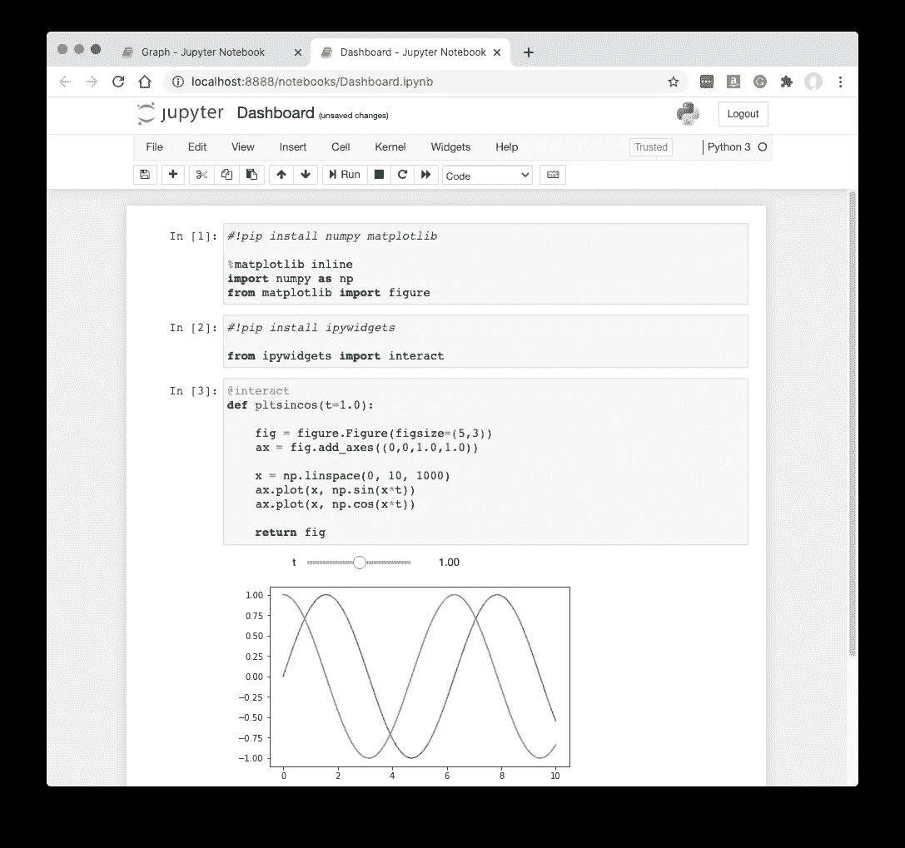
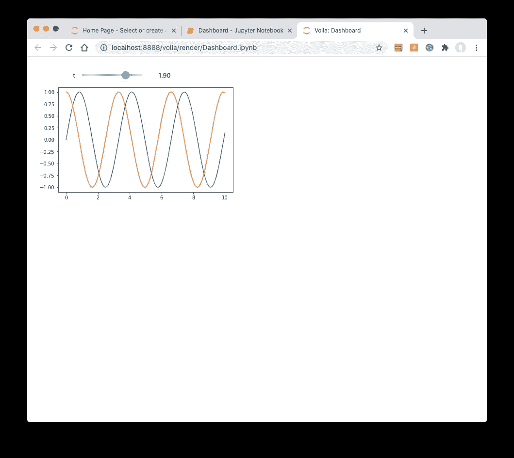
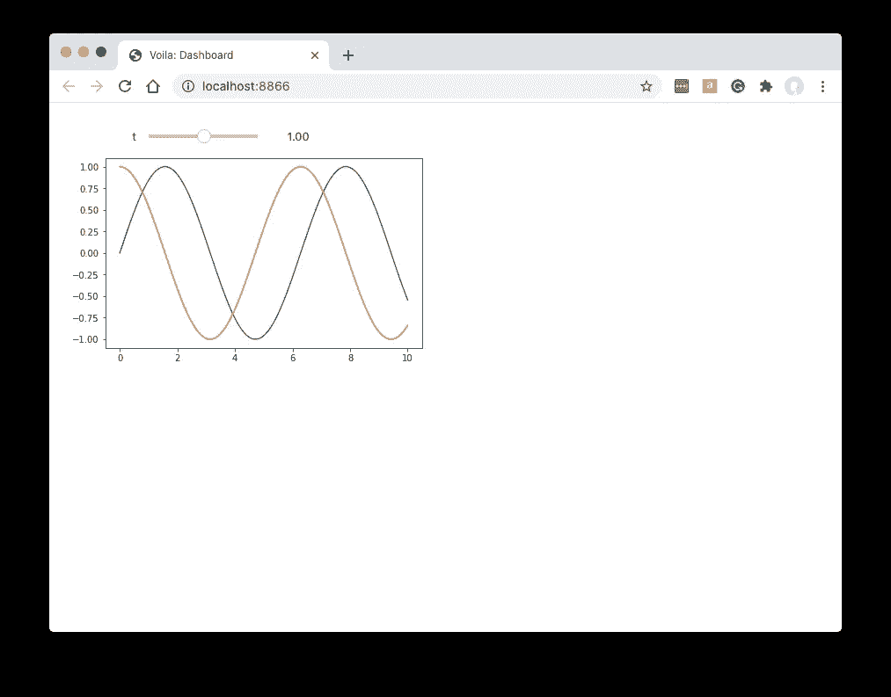
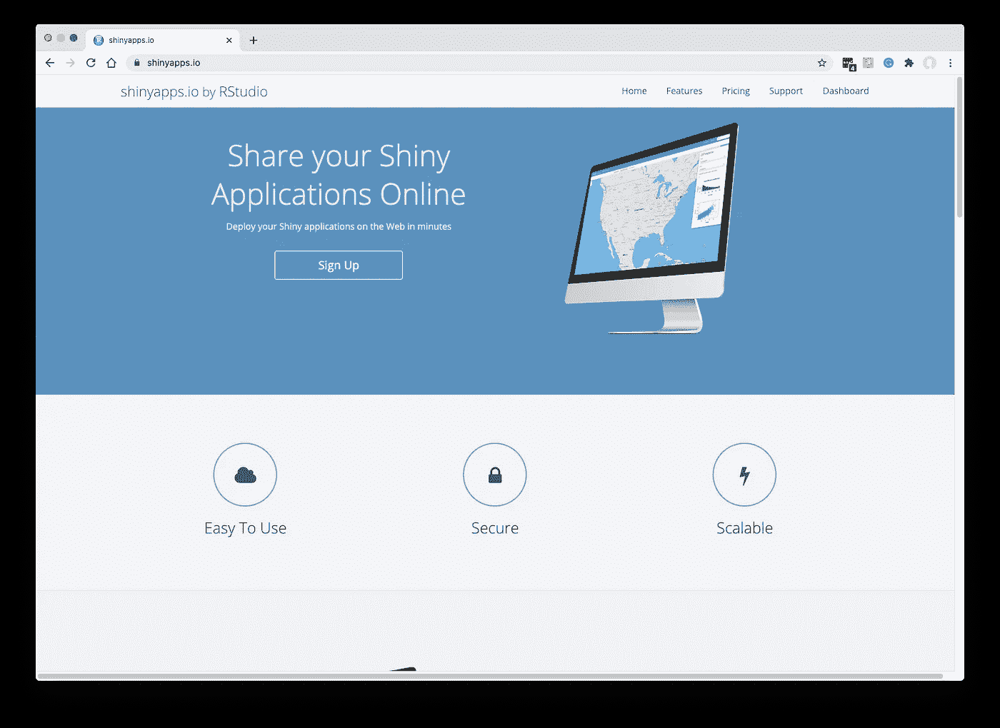
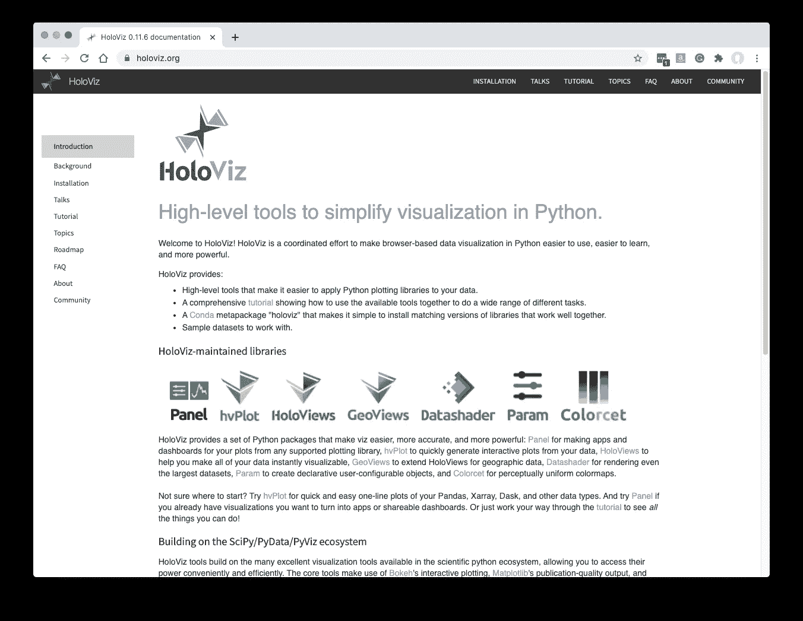

# 仪表板是给我的吗？

> 原文：<https://towardsdatascience.com/are-dashboards-for-me-7f66502986b1?source=collection_archive---------26----------------------->

## 了解您的 Jupyter 笔记本作为交互式仪表盘是否更有用

作为一名数据科学家或分析师，您经常在 Jupyter 笔记本上为自己创建数据可视化，将图表复制到电子邮件和演示文稿中。你的朋友谈论他们为同事制作的最新“交互式仪表板”，但这听起来工作量很大，可能会让你的客户感到困惑。

本文不是一个深入教授您如何构建仪表板的教程。它将带您构建和部署基于 Jupyter 笔记本的最简单的仪表板，但只是向您展示这个概念。到本文结束时，您将知道您的仪表板朋友在谈论什么，并且您将处于一个更好的位置来决定交互式仪表板是否是您想要进一步追求的东西。

我将讨论托管仪表板的选择，并概述流行的仪表板框架。

卢克·切瑟在 [Unsplash](https://unsplash.com?utm_source=medium&utm_medium=referral) 上的照片

## 开源可视化的兴起

长期以来，商业智能工具一直用于根据公司内部数据创建图表。想想谷歌分析报告，也许被营销部门用来了解他们活动的有效性和指导他们未来的努力。

这些仪表板被植入到整体的 BI 软件套件中，通常使用拖放界面组装在一起。

作为一名数据科学家或定量开发人员，您在 Jupyter 中分析一组不同的数据，并且您没有任何类似的工具来围绕您的数据构建仪表板。听起来你需要构建一个完整的 web 应用程序，包括前端 Javascript 来引入类似的东西。

在过去的几年中，出现了一些优秀的开源框架。它们允许您轻松地将 Python(或 R etc)分析转换成交互式 web 应用程序，而完全不必考虑前端。你所选择的语言就是你所需要的，来指导框架为你处理用户界面。

这些框架将为最终用户引入小部件(滑块、复选框、下拉框等)来输入参数，它们还可能提供交互式图形或表格功能——能够放大图表，或者选择数据范围来更新相关图表组件中的图形。

稍后我将更多地讨论可用的框架，但是首先我将描述已经让您想到一定有更好的方法的那种 dataviz 场景。

# 你就是那个小部件

当你在 Jupyter 笔记本上工作时，在你尝试的时候自己更新参数是有意义的。

这是你对图表的第一次尝试:

t = 1.0 的图形

在第二个单元格中，您已经手动输入了 t=1.0。你把图表复制到电子邮件中，然后你的客户回来问如果你把 t 改成 2.0 会发生什么。

所以你换了牢房又跑了一次。

很多时候这没什么大不了的，如果客户和你在一起，这就很容易了。但是在某些时候，后退一步，看看是否可以自动化这个过程可能是有意义的。我们假设您不会要求您的非技术客户自己在笔记本上按 shift+enter 键。

# 在朱庇特的家里

我保证这不会是一个可视化框架的深入教程，所以我将选择最简单的方法来把我们的笔记本变成交互式的东西。

在第一个实例中，我们将向笔记本本身添加一个小部件，这样您就可以在 Jupyter 中滑动滑块(而不是更新代码单元格中的 *t* 参数)。

尽管对于我们的非技术客户来说，这仍然不够用户友好，他们不想看到代码单元。因此，下一步将是在所谓的“瞧”服务器上运行笔记本电脑，而不是在 Jupyter 服务器上。它非常类似于 Jupyter 服务器，但是它没有让用户在代码单元格中按 shift+enter 键，而是隐藏代码单元格，从上到下运行所有内容——只显示输出组件，包括我们的 slider 小部件。

## 互动

Jupyter 有一个重要的扩展包叫做 [ipywidgets](https://ipywidgets.readthedocs.io/en/latest/user_install.html) 。您可能需要先安装它(在 Jupyter 单元中运行`!pip install ipywidgets`，然后重启并重新加载笔记本)。

然后，我们需要做的就是将我们的图形绘制代码单元重构为一个函数，并应用“interact”装饰器:

使用 ipywidgets 中的 interact

“interact”函数自动检测到我们的函数有一个浮点参数(t ),并自动提供一个滑块。您可以滑动滑块，立即看到基于新输入 *t* 的不同图表。

太好了！接下来，我们将使它完全用户友好。

## 在 Voilà中查看

使用与 Conda 类似的`pip install voila`或[安装](https://voila.readthedocs.io/en/stable/install.html) [Voila](https://voila.readthedocs.io/) python 包。你需要重启你的 Jupyter 服务器来处理这个问题。当您重新加载笔记本页面时，您现在会在工具栏中看到一个按钮:

Jupyter 工具栏中的 Voila 预览按钮

点击它，你将跳转到一个新的页面，显示 Voila 预览:

瞧，笔记本的预览

正如承诺的那样，代码单元是隐藏的，所以我们只剩下交互组件了。添加一些 markdown 单元格作为介绍——也许改变默认的模板——然后你就有了一个功能完整的 web 应用程序！

到目前为止，我们看到的 Voila 预览是一个有用的扩展，可以直接进入我们的新仪表板，但它是在 Jupyter 服务器上附带的，任何可以访问 Voila 预览的人都可以更改 URL 并返回到笔记本视图。

因此，为了安全运行我们的笔记本电脑，我们可以直接使用 voila 服务器，而以前我们使用 Jupyter 服务器。

之前运行`jupyter notebook`来运行 Jupyter 的地方，用 Ctrl+C 停止，改为运行`voila ./Dashboard.ipynb`(或者提供笔记本文件的正确路径)。

这一次，您可以看到我们的仪表板位于该 voila-only 服务器的根(也是唯一的)URL:

瞧，仪表板

# 共享您的仪表板

激动人心！你已经可以想象你的客户和同事相信你一夜之间变成了一个全栈的 web 开发人员。那么，你如何与你的非技术观众分享你的 web 应用呢？

不幸的是，这可能是你面临的一个障碍。明确地说，托管 Voila(或类似的)仪表板在技术上没有什么特别复杂的。但是不管怎样，你(或者你亲近的人)将不得不维持或者购买某种形式的托管服务。

在一些服务中，有一些免费选项，用于可以是公共的仪表板，或者用于低使用率层。

如果您的组织已经在运行一个 JupyterHub(或者想要运行),那么我自己的 ContainDS Dashboards 项目将允许您在您的 JupyterHub 中自动托管您的仪表板，安全地供经过身份验证的用户使用。

一般来说，有两个重要方面需要考虑:

*   托管将在哪里存在
*   如何认证用户

让我们假设我们仍然使用 Voila 来运行我们的仪表板——但是大多数关于托管的建议适用于任何开源框架。

## 自己做

当然，您可以在任何虚拟机或物理服务器上运行 voila 服务器。

这可能是在云服务上，如 AWS、Google Cloud、Heroku 或 Azure。通常，大型云提供商会要求您配置自己的服务器，当然，当您添加了 HTTPS 证书时，您将需要在 nginx 或 apache 等标准 web 服务器后面运行您的 dashboard 服务器，即 web 流量到达 nginx，然后反向代理到 voila 服务器。

Heroku 和 Google App Engine 让事情变得简单一些，因为一切都是基于配置的，HTTPS 通常是默认的。

然而，认证是一个巨大的问题。您如何确保只有您的目标用户可以访问仪表板？您的 web 服务器可以配置一个密码，甚至可能是一个允许的用户名/密码列表，但是更新起来很麻烦。

同样，这在技术上并不困难，但是它需要您可能希望 it 部门长期管理的细节，尤其是对于任何敏感的东西。

同样，在“自己动手”类别中，只是在你自己的计算机上运行 voila 服务器，就像你在自己的试验中所做的那样，为你的用户打开一个“隧道”。同样，没有身份验证，您需要打开笔记本电脑！对于非敏感数据的快速共享，这仍然很有用——参见 Voila 文档的 [ngrok 部分](https://voila.readthedocs.io/en/stable/deploy.html#sharing-voila-applications-with-ngrok)。

## JupyterHub 和 Binder

在你的仪表板可以公开的地方，有一个名为 MyBinder.org[的免费服务，它将基于 Git 回购的内容推出一个 Jupyter 笔记本(加上通过其自己的 URL 访问 Voila)。当然，这需要您更新 Git repo，并且在新的提交后第一次启动时，需要一段时间来构建环境。你可以给你的客户发送一个直接链接，启动程序，然后直接跳转到 Voila URL——但是 Jupyter 服务器也会运行在一个不同的 URL 上，如果他们知道如何输入的话，就像我们之前尝试 Voila 预览一样。MyBinder 本质上是开源的 JupyterHub 项目(一个为多个用户提供 Jupyter 笔记本环境的网站)的一个公共开放部署。](https://mybinder.org/)

尤其是如果你的组织已经在运行自己的 JupyterHub，我自己的[包含仪表板](https://cdsdashboards.readthedocs.io/)扩展非常适合。因为 JupyterHub 已经在运行了(对于常规的 Jupyter 笔记本服务器)，所以根本不需要额外的基础设施。JupyterHub 具有高度可配置的认证模块，因此，例如，您可以要求通过您的公司电子邮件单点登录来登录。

ContainDS Dashboards 为 JupyterHub 增加了一个额外的“Dashboards”菜单。您只需指定笔记本或脚本的路径，并选择您正在使用的框架(如“瞧”、“streamlit”等，稍后将讨论)。任何通过 JupyterHub 认证的用户都可以直接访问您的仪表板。

包含仪表板

如果您的组织目前没有运行 JupyterHub，那么创建一个就足够容易了，而且它非常受欢迎，可以为一系列不同的安装场景提供帮助。

## 托管服务

部署仪表板的最简单方法是通过托管服务，而不需要您自己的任何基础架构。这些通常与特定的框架相关联。

如果你的仪表盘使用 R Shiny 框架(稍后描述)，那么对于一次性部署来说， [shinyapps.io](https://www.shinyapps.io/) 云服务是一个简单的选择。一旦你在 R 环境中配置了一个访问令牌，你只需要运行`deployApp()`来自动上传你的应用。

在免费和基本计划中，仪表板是公开的。对于标准计划及以上(每月 99 美元或更高)，包括认证。在 shinyapps.io 网站上，您可以输入电子邮件地址以邀请加入您的应用程序。他们可以使用 GitHub 或 Google 单点登录登录，或者只需基于该电子邮件地址设置一个 shinyapps 帐户。

shinyapps.io

类似的服务存在于 [Plotly Dash](https://plotly.com/dash/) 框架(R 或 Python)中。Dash Enterprise 允许您连接一个 Git repo，这样提交就会自动部署到这个云服务。他们有更广泛的认证方法，同样包括基本的电子邮件登录。

Streamlit(一个 Python 框架)也在开发一个团队产品。

这些托管服务中的大多数都是“部落式”的——只适合于它们所围绕的框架。但是他们肯定会负责托管和认证！

一个名为 [Datapane](https://datapane.com/teams/) 的新服务试图与框架无关，尽管需要你直接在脚本中添加一些额外的部署 Python 代码。发布的报告出现在 Datapane 自己风格的 web 界面中，通常最终用户需要理解他们必须运行报告。他们看起来不像对 Voila 那样直接进入它。团队内部的定期分享值得一看。

## 离线部署

我自己的 ContainDS 套件的另一个组件是桌面产品。这是一个桌面应用程序，您和您的客户端都可以在本地安装。然后，您可以将您的整个 Jupyter 环境导出为一个单一的平面文件，发送到您的客户端，客户端可以导入该文件并看到它按照预期运行。

这对于非常敏感的情况，或者您根本不想涉及服务器的情况非常有用。但是，双方都需要运行 Docker 或 VirtualBox，所以入门会有一些开销…

原则是，这比试图让您的客户机安装 Conda 和 Python 环境要可靠得多！

# 框架概述

你可能已经注意到,“分享你的仪表板”部分并不完全是结论性的。部署仍然是一个棘手的问题——再说一次，在技术上并非不可克服，但它总是需要基础设施到位。

如果这破坏了您最初对构建自己的仪表板的兴趣，我深表歉意！但是我认为告诉你真相是很重要的…

如果您仍然相信仪表板可以改变您的数据讲述能力，这里有一些流行的开源仪表板框架的简要概述。

我认为它们可以大致分为:支持的语言；可视化特征；和易用性与 UI 控制。

## 细流

Streamlit 是一个有趣的新框架，基于简单的 Python 声明式脚本。使用 Python 脚本中的窗口小部件(例如滑块和下拉菜单)很容易创建漂亮的 web 应用程序，这对于开发人员来说有直观的意义，而不必担心“事件”——当某个东西被点击时代码应该如何反应。

其他框架可能要求您自己考虑用户流并连接事件，而 Streamlit 默认会为您处理这个逻辑。只要您已经声明了 UI 组件，当用户与它交互时，Streamlit 将负责重新运行脚本的适当部分。

当然，这种简单的范式会使一些事情变得更加复杂——例如，如果太多的代码过于频繁地运行，就必须添加缓存装饰器。

Streamlit 脚本必须通过`streamlit run`命令运行。

由[克里斯蒂安·沃纳](https://twitter.com/CWerner76/status/1236777905893576704)开发的 Streamlit 中的数据浏览器

## 阴谋破折号

[Plotly Dash](https://plotly.com/dash/) 是一个“全栈”框架，通过它，你不仅可以使用 Python、R 或 Julia 来控制后端数据处理，还可以控制前端 UI。与 Streamlit 相比，您更经常需要考虑用户界面流的工作方式，连接事件。这并不一定是一件坏事，最终会让你在早期获得更多的控制权。

同样，对于如何将 Plotly Dash 应用程序作为子应用程序集成到更大的应用程序中，您有更多的选择。底层服务器机制更加清晰地暴露出来。

## 散景和面板

Bokeh 由 Anaconda Inc(虚拟环境公司)发展而来，并由 NumFOCUS 非营利组织支持，该组织还支持 Jupyter 和许多其他科学计算包，如 NumPy。

这是一个 Python 框架，它的优势在于对交互式图形的详细控制。

作为直接比较，大多数人说他们发现 Plotly Dash 更容易上手，并最终提供了类似的控制水平。但是散景可以更深入地进行更复杂的可视化。

在 Bokeh 上有非常广泛的开源组件。

Panel 有时被视为一个独立的可视化框架，但至少最初它扩展了散景。它提供了一个更加灵活的窗口小部件系统，而不仅仅是关注图形。它的设计目标是能够在 Jupyter 笔记本上运行，就像作为一个独立的应用程序一样。

Panel 允许您轻松地将其他开源可视化组件集成到您的应用程序中。它本身是简化 Python 中数据可视化的更广泛的 [HoloViz](https://holoviz.org/) 努力的一部分。

将 Panel 和 HoloViz 区分开来的是将多个图形连接在一起的能力，以便与其中一个图形交互(例如选择一系列点)以相应的方式更新其他图形。

有些学术领域围绕全息视图建立了专门的生态系统，例如地理；以及用于处理大型数据集可视化的工具集。

我的感觉是，如果你有一个不寻常的或详细的可视化类型，使用 Bokeh / HoloViz 堆栈比其他框架更有可能实现。

[HoloViz 网站](https://holoviz.org/)

## r 闪亮服务器

如果你是一个 R 语言的爱好者，你应该已经知道用于交互式应用的[闪亮框架](https://shiny.rstudio.com/)…如果你是一个坚定的 python 主义者，你现在不会改变！

闪亮的用户界面可以完全使用 R 语言构建，也可以直接用 HTML、CSS 和 JavaScript 编写，以获得更大的灵活性。

如果你只是构建一个仪表板，而 R 非常适合你的分析，那么 Shiny 也应该非常适合你的 UI。但值得记住的是，如果您的代码将来要开发成一个更大的 web 应用程序，您可能最终会错过像 Python 这样更通用的语言所带来的数据库和通用软件工程能力。

Shiny 是 RStudio 为您带来的强大的数据科学家工具套件的一部分。

注意，Voila 当然支持 R 笔记本。如果你有一个用 R 写的简单的 Jupyter 笔记本，那么瞧，这可能是使它具有交互性的最快方法。

## 瞧

我们之前已经演示过了。它的优势在于“Jupyter native”。Jupyter 支持的任何语言也可以使用 Voilà。本机提供的交互式小部件是基本的，但这是一种从笔记本到 web 应用程序的简单方法。

你也不需要局限于 Jupyter 的小部件。使用面板组件来构建笔记本是完全可能的，并且这可以通过 Voilà(以及直接使用 Bokeh/Panel)来部署。

要了解 ipywidgets 是如何工作的，这里有一个[优秀教程](/bring-your-jupyter-notebook-to-life-with-interactive-widgets-bc12e03f0916)。

# 摘要

也许你的客户只想要 PDF。把你的分析变成一个交互式的仪表板并不总是有意义的，但是希望我已经给了你一些想法来帮助你认识到什么时候与你的客户来回的电子邮件交流可以上升一个层次。

对于数据科学家或分析师来说，有趣的部分无疑是使用框架来构建令人满意的用户界面。我希望对开源框架的概述能帮助你找到一个合适的框架来尝试。

然而，托管和认证通常是一个症结。我已经向您概述了那里的挑战，以节省您在学习仪表板框架方面的投资时间，但却意识到您没有资源或授权将您的仪表板送到您的客户或同事手中。