# 网络越深越好吗？案例研究

> 原文：<https://towardsdatascience.com/are-deeper-networks-better-a-case-study-6ee9bcb0725b?source=collection_archive---------41----------------------->


约书亚·牛顿在 [Unsplash](https://unsplash.com?utm_source=medium&utm_medium=referral) 上拍摄的照片

# 介绍

你有没有想过建立更深层次的关系网会有什么影响，会带来什么变化？

我知道我有。

我说的是在你的模型中增加额外的层，并仔细检查下游发生了什么变化。

其他条件不变:

1.  额外的层对你的训练/验证损失曲线有什么影响(如果有的话)？
2.  一个额外的层在多大程度上影响你的下游预测结果？
3.  输入要素的数量与模型的复杂性之间有什么关系？
4.  这里面有什么取舍吗？

> **在这篇文章中，我将分享一系列实验和它们各自的结果来回答这些问题。**

我们言归正传吧！

# 实验设置

在我们开始之前，我需要解释一下所涉及的实验装置。

该设置由 3 部分组成:

1.  使用的训练数据集
2.  为实验构建的模型架构
3.  实验方法

## 训练数据

实验所用的数据集来自一场卡格尔竞赛；[推文情感提取](https://www.kaggle.com/c/tweet-sentiment-extraction/overview)。

目标？

提取出支持特定观点的短语。

以下是训练数据的一瞥:


推特情感提取训练数据([来源](https://www.kaggle.com/c/tweet-sentiment-extraction/overview))

我不会深入研究数据准备方法，因为我将在另一篇文章中讲述 Kaggle 的经历。

本质上，我们按照[高音手套方法](https://nlp.stanford.edu/projects/glove/)清理了文本，并为下游命名实体识别(NER)任务创建了自己的标签。

一旦我们有了建模就绪的数据集，我就开始构建一个基线 seq2seq 模型。

## 模型架构

模型架构由 3 个主要部分组成:

1.  预先注意双 LSTM
2.  多头自关注编码器堆栈
3.  关注 LSTM

该模型从前置注意双 LSTM 开始，其输出被馈入编码器堆栈。

来自这些编码器堆栈的输出然后被馈送到后注意 LSTM，以生成手头的 NER 任务的顺序预测。

为什么选择编码器堆栈？

使用编码器堆栈的灵感来自 Vaswani 等人的论文“[注意力是你所需要的全部](https://arxiv.org/pdf/1706.03762.pdf)”。艾尔。

本文详细介绍了变压器模型的外观。

简而言之，变压器模型由 6 个编码器堆栈和 6 个解码器堆栈组成。我不会深入这篇论文的细节，但如果你想知道《变形金刚》 (BERT)中著名的[双向编码器表示背后的架构。我推荐阅读。](https://arxiv.org/pdf/1810.04805.pdf)

总之，编码器堆栈是这样的:

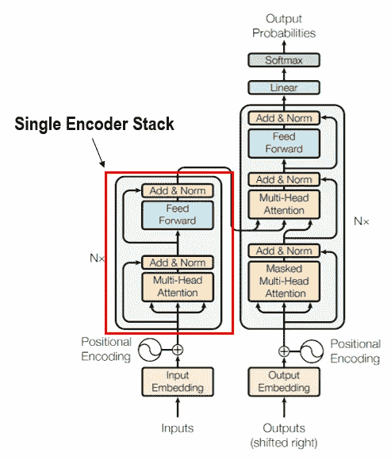

Vaswani 等人的编码器堆栈示例。艾尔([来源](https://arxiv.org/pdf/1706.03762.pdf)

如您所见，每个编码器堆栈由两个子层组成。

第一个是多头自关注机制，第二个是完全连接的前馈网络。

在每个子层周围，使用残差连接，然后进行层归一化。这是有意义的，因为剩余连接将预先注意双 LSTM 输出与多头自我注意层学习的上下文相加。

那么我们得到的模型架构看起来是什么样的呢？

如果我把它画出来，它会是这样的:

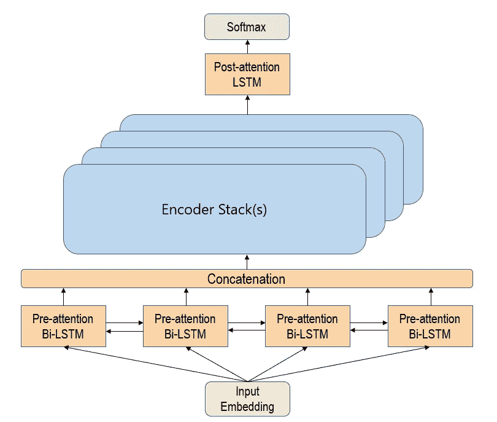

用于实验的模型架构

作为一个**基线**，该架构仅从一个**单编码器堆栈**开始。

以下是实验中使用的保持不变的层参数:

```
**Pre-attention Bi-LSTM:** preatn_forward={type="recurrent", n=64, act='tanh', init='xavier', rnnType='LSTM',outputType='samelength', reversed=False, dropout=0.3}preatn_backward={type="recurrent", n=64, act='tanh', init='xavier', rnnType='LSTM',outputType='samelength', reversed=True, dropout=0.3}concatenation_layer={type="concat"}
```

```
**Encoder Stack:**
attention_layer={type="mhattention", n=128, act='gelu', init='xavier', nAttnHeads=16}residual_layer1={type="residual"}
norm_layer1=layer={type="layernorm"}fully_connected_layer={type="fc", n=128, act='relu', init='xavier', dropout=0.3}residual_layer2={type="residual"}
norm_layer2=layer={type="layernorm"}
```

```
**Post-attention LSTM:**
postatn_forward={type="recurrent", n=128, act='tanh', init='xavier', rnnType='LSTM',reversed=False, dropout=0.3};
```

## 实验方法

使用的方法如下。在实验案例中，我需要一种方法来:

1.  模拟深层网络的模型复杂性
2.  模拟不同的输入要素
3.  使用标准评估指标来衡量预测结果

**模拟模型复杂度**

为了系统地增加模型的复杂性，我在模型架构中添加了一个编码器堆栈，同时保持每个实验的所有其他超参数不变。

例如，高音扬声器手套 25d 的单个实验组将具有 4 种不同的架构。

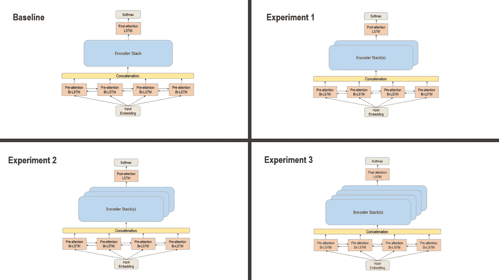

实验中使用的不同布局配置

> 请注意每次实验中编码器堆栈的数量是如何系统地增加的。

使用的超参数也始终保持不变:

```
**Optimizer hyper-parameters:**
miniBatchSize=32
stagnation = 10
algorithm = {method = ‘adam’, gamma = 0.9, beta1 = 0.9, beta2 = 0.999, learningRate = 0.001, clipGradMax = 100, clipGradMin = -100, lrPolicy = ‘step’, stepSize=10}
regL2 = 0.0007
maxEpochs = 10
dropout=0.3
```

**模拟输入特性**

为了测试功能丰富的输入数据是否对结果有任何影响，我通过高音手套 25d、50d、100d 和 200d 运行了该模型。

这意味着**对于每个手套尺寸**，我将运行 4 组实验并分别记录它们的结果。

*   基线模型
*   实验 1:基线+ 1 个附加编码器堆栈
*   实验 2:基线+ 2 个附加编码器堆栈
*   实验 3:基线+ 3 个附加编码器堆栈

因此，总共运行了 16 种(4 种架构* 4 种不同的手套尺寸组)不同的模型配置。

**标准化评估指标**

最后，我决定使用 F1 分数作为比较的标准，因为它是精确度和召回率之间的调和平均值。

> 如果你需要复习精确度，回忆一下 F1 分数。我在上面找到了一个很好的视频。

解释精度、召回和 F1 的 Youtube 视频

# 实验结果

对于这一部分，我将首先分享在每个高音手套尺寸范围内的实验结果**。然后，我将分享每个实验**在**高音手套尺寸上的结果。**

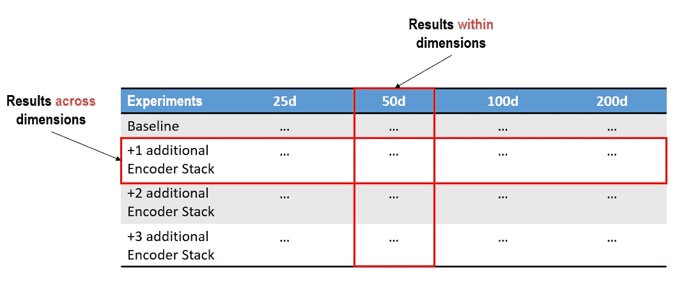

维度内和跨维度的结果示例

从现在开始，我将以图像的形式显示一系列结果输出，并添加我认为合适的注释。

对于每个结果输出，记下精确度、召回率、F1 分数以及损失曲线的样子。

**记住，实验中唯一的变化是增加了一个编码器堆栈。**

> 在你进行的过程中，一定要花些时间自己解释这些结果。:)

## 高音扬声器手套 25D 的结果(在范围内)

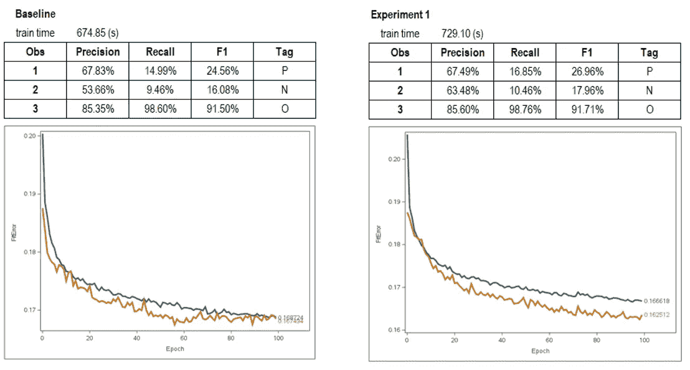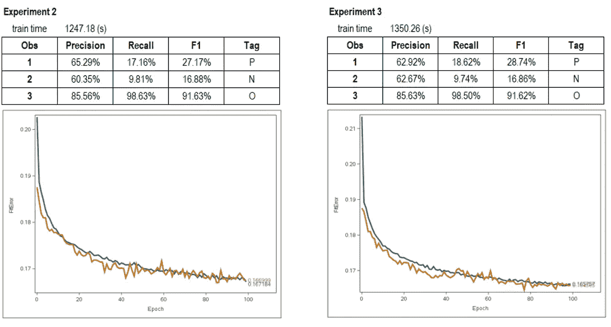

对于这个结果集，在实验中很难看到更深层次网络的影响。

我确实对正在发生的事情有一个想法和感觉，但在模式变得更清晰之前，我不会发表评论。

> 注意:在下一个结果集中会变得更清楚:)

话虽如此，在正标签(P)的 F1-分数中有一个有趣的模式。

随着模型变得越来越复杂，阳性标记(P)的 F1 分数似乎在每次实验中都在缓慢增加。

我怀疑这与更深层次的网络学习和更复杂的关系有关。

例如共同引用、长期依赖等。

现在让我们将特征的数量从 25D 增加到 50D，以便更好地了解随着模型的深入会发生什么。

## 使用高音手套 50D 的结果(在范围内)

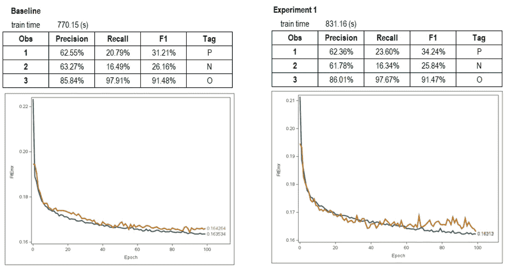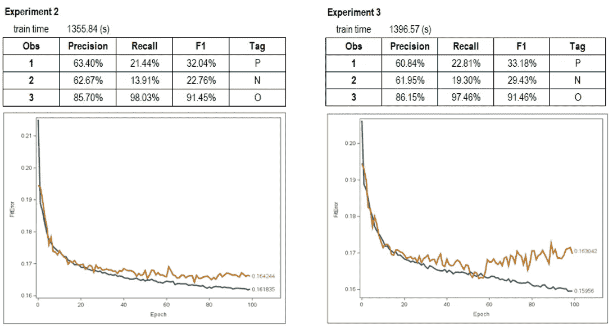

与上一个结果集相比，这无疑是一个更好的结果集。

首先，注意随着模型的深入，验证损失是如何开始偏离训练损失曲线的？

> 你觉得为什么会这样？

和前面的结果集类似(虽然*很*微妙)，但是**这和机器学习中的** [**偏差-方差权衡**](/examples-of-bias-variance-tradeoff-in-deep-learning-6420476a20bd) **有关系。**

总之，随着模型复杂性的增加，模型开始更好地学习训练数据，导致偏差减少。

这从实验中训练损失(蓝线)略微下降的结果中可以明显看出。

> 注意:训练更大的网络是降低偏差的标准缓解措施。这个结果清楚地显示了更大的网络是如何减少偏差的。

然而…

随着模型开始过度拟合训练数据，它变得不可概括，导致方差增加。

注意验证损失曲线在不同实验中的变化。

为了得到一个更具体的例子，只需看看实验 2 和实验 3。

请注意，当验证误差开始出现峰值时，训练损失如何从 0.1618 下降到 0.1595。即偏差减少，方差增加

现在开始下一个发现！

下一个发现来自于所有实验的 F1 分数。

**与之前的结果集相比，F1 的所有分数都有所提高。**

f1-阳性标记(P)的平均分数约为 32%,而阴性标记(N)的平均分数约为 27%。

与之前的结果相比，阳性标签(P)的最大 F1 分数约为 28%,而阴性标签(N)仅为 18%。

记住，这里唯一的变化是使用了更丰富的输入集。即高音手套 25D 换成了 50D。

其他一切都保持不变。

> **这说明了输入特征的数量与预测结果之间的关系。**

**在这种情况下，使用更丰富的功能集提高了模型的整体性能。**

那么，将功能从 50D 增加到 100D，我们会看到什么呢？

## 使用高音手套 100D 的结果(在范围内)

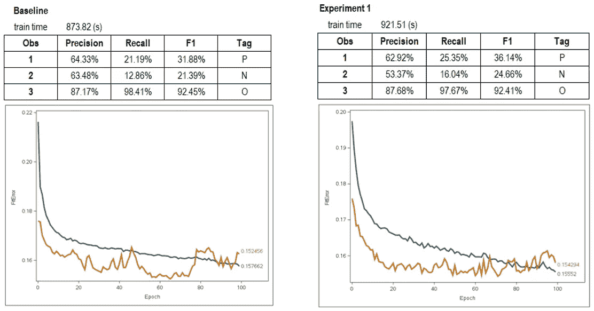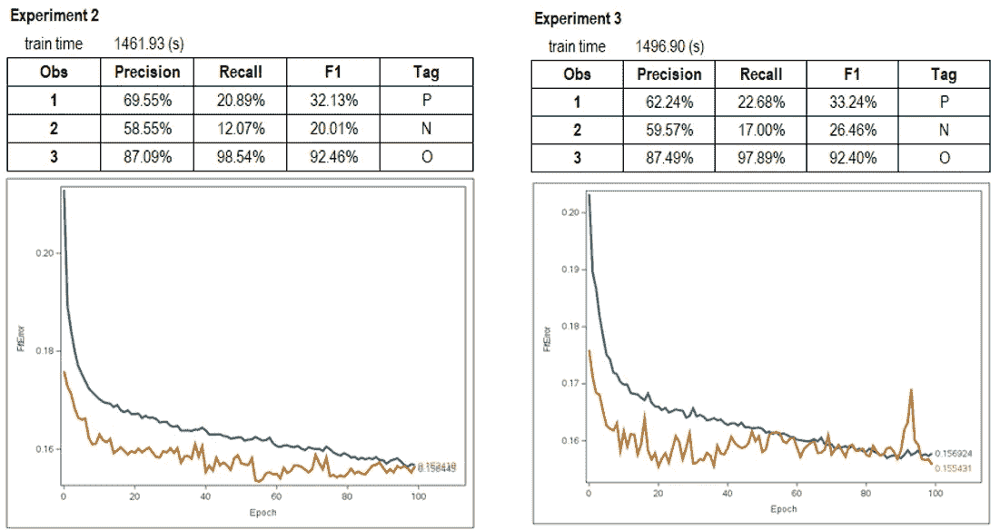

该结果集实际上验证了我们之前关于输入要素和预测结果之间关系的观点。

**但是..不是你想的那样。**

在这种情况下，该模型在预测**阳性标记(P)** 方面略胜一筹；f1-实验得分比之前的结果高**。**

**然而，看起来这个模型在预测**负标签(N)** 方面做得不是很好；与之前的结果相比，f1-实验得分**下降**。**

**可能的是，添加的特征 50D 至 100D 可能允许模型更好地学习正面标签(P ),但是在学习负面标签(N)时却添加了噪声。**

**这可能是我认为与之前的结果相比，我们在实验中看到 F1 分数下降的原因之一。**

**另一个原因(可能更有道理)是，由于模型失去了普遍性，F1 分数在波动。**

**注意验证损失曲线是多么不稳定。**

**为了获得更好的结果，我们可能需要在再次查看 F1 分数之前调整其他超参数。**

**然而，这个实验的目的只是通过增加更多的层来改变模型架构，并注意下游的变化，因此我不会在这里做任何超参数调整。**

**下一个发现很明显。**

> **提示:这与验证损失曲线有关。**

**请注意，验证损失通常低于实验中的训练损失。**

**这是一种不常见的模式，但确实会发生。**

**关于这个点，下一个逻辑问题是……**

> **为什么？**

****为什么验证损失低于培训损失？****

**几个原因:**

1.  **这可能与培训过程中如何计算验证损失有关。对于每个时期，在训练损失之后**计算验证损失。即，在模型更新了权重之后，计算验证损失。****
2.  **我在训练集中使用了辍学层。缺失图层具有正则化效果。这意味着它对权重进行了惩罚，以使预测更具普遍性。在验证计算期间，禁用辍学。**

**现在我们完成了 100D，让我们看看 200D 会发生什么！**

**精神食粮。**

> **功能太多会是个问题吗？**

**让我们找出答案，好吗？**

## **使用高音手套 200D 的结果(在范围内)**

**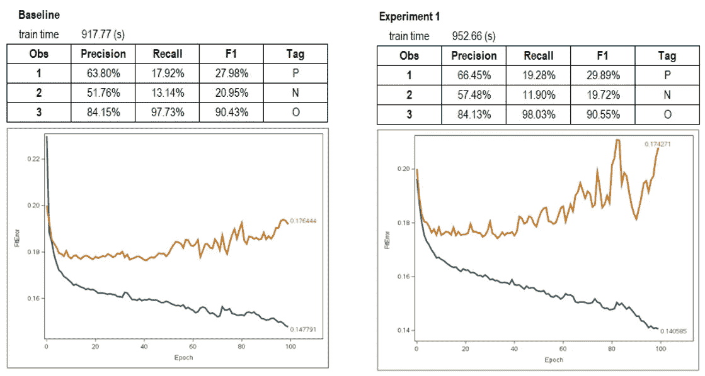****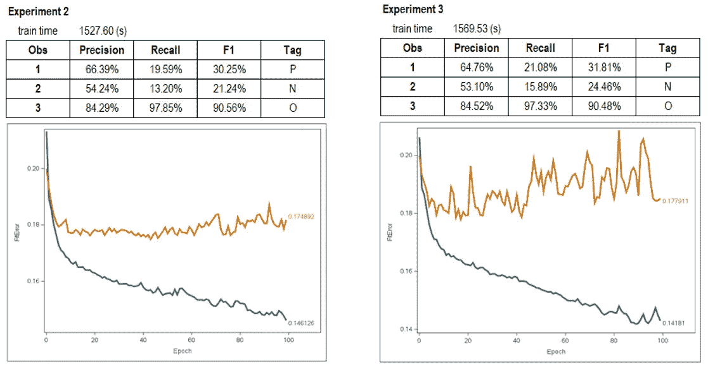**

****显然可以！****

**看起来 200D 导致模型在实验中过度拟合。**

**让我们退一步想一想。**

> **这里发生了什么？**

**唯一的变化是使用了功能更加丰富的输入集。即 100D 到 200D 的特征。**

> **拥有更多功能不应该给我们带来更好的结果吗？**

****不完全是。****

**拥有一组扩展的特性可能会不可避免地给模型带来更多的**噪声**。**

**这从我们看到的过度拟合中可以明显看出。**

**这是我认为正在发生的事情。**

**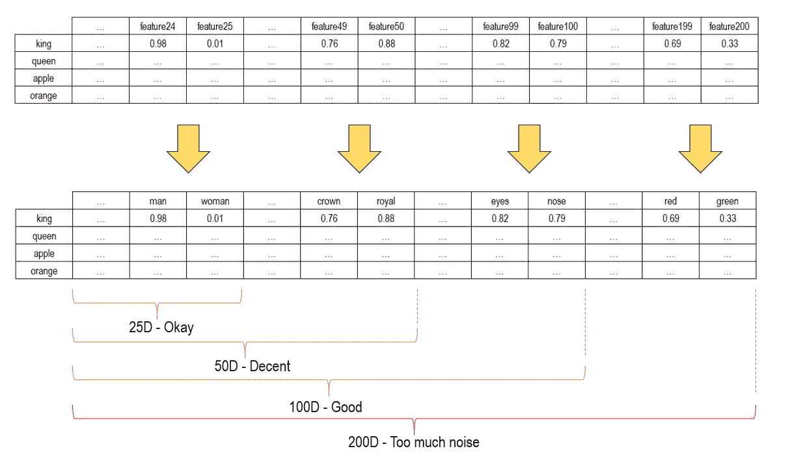**

**单词嵌入示例**

**每个输入特征都可以映射到其他概念，如“男人”、“女人”、“皇冠”、“皇家”等。**

**每个特征(那些数字)的学习嵌入反映了输入术语是否满足那些特征的标准。这通常在[-1，1]的范围内。**

**例如，对于输入术语“国王”。**

***国王是男人吗？***

**是的。因此，所学习的嵌入对于特征“人”具有 0.98 的分数。**

***国王是女人吗？***

**没有。因此，对于特征“女人”,学习嵌入的得分为 0.01。**

**如此等等。**

**我认为在 200D，有太多的功能导致太多的噪音。**

**例如，像“红色”或“绿色”这样的特征可能只是模型的噪声。**

**那么我们能从中学到什么呢？**

> **添加更多输入要素并不能保证更好的模型或更好的结果。有时，拥有更多功能意味着你的模型开始学习噪音。**

**我还注意到，在所有 16 个实验中，该模型在负标签(N)上总是表现不佳。**

**看看 25D、50D、100D 和 200D 的 F1 分数。**

**负标签(N)的 F1 值总是低于正标签(P)的 F1 值。**

> **为什么会这样呢？**

**我认为正标签(P)训练示例可能比负标签(N)训练示例更容易学习。**

**也许学习否定或某些否定短语对这个模型来说很难。这就解释了为什么(N)看起来没有得到太多的性能提升。**

**好吧！我们已经到达每个输入维度内的结果**的末尾。****

**在这篇文章的最后一部分，我想让你看一看个实验的结果。**

**这会让你对结果有不同的看法。**

****只要注意曲线是如何随着输入特征的增加而变化的。****

**记住，其他一切都是不变的。这里唯一的变化是输入特性。**

> **我会让你自己查看结果，没有任何评论。**

## **跨输入要素的基线结果**

**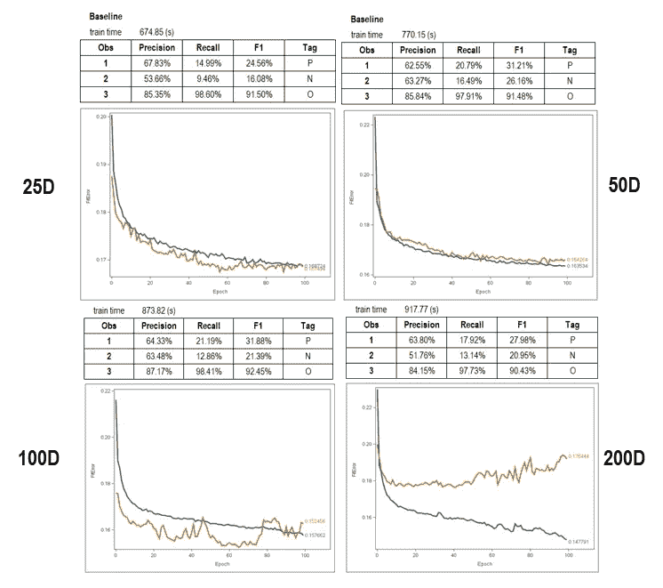**

**不同输入维度的基线结果**

## **实验 1 跨输入特征的结果**

**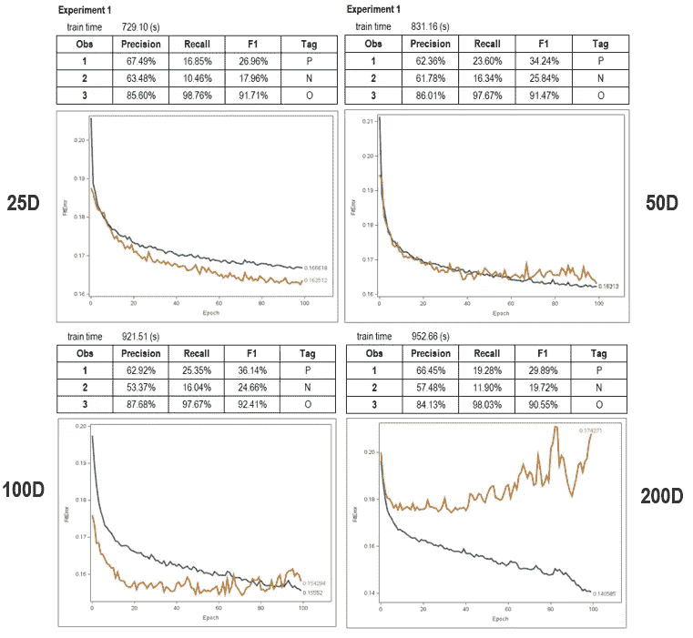**

**实验 1 不同输入维度的结果**

## **实验 2 跨输入特征的结果**

**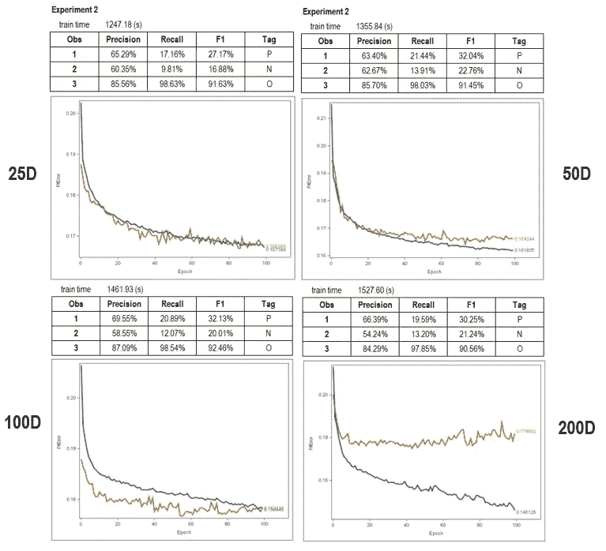**

**实验 2 不同输入维度的结果**

## **实验 3 跨输入特征的结果**

**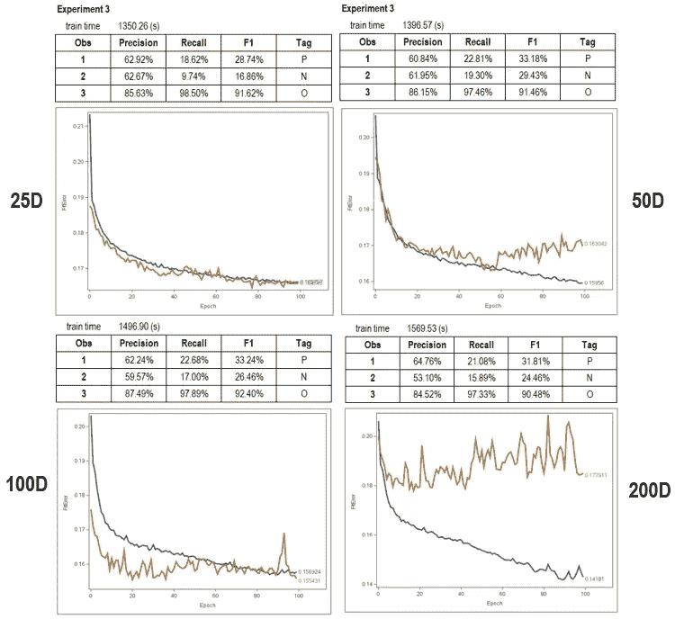**

**实验 3 不同输入维度的结果**

# **摘要**

**在我结束这篇文章之前，我想我应该总结一下这个实验的一些收获。**

1.  **深度学习中仍然存在[偏差-方差权衡](/examples-of-bias-variance-tradeoff-in-deep-learning-6420476a20bd)。如果你积极地通过应用链接帖子中提到的缓解措施来减少偏差和差异，它是可以被缓解的。**
2.  **一般来说，更深的网络会减少偏差，但如果其他因素保持不变，差异就会增加。随着网络构建得越深入，最好是迭代并应用正则化/添加更多的训练数据。**
3.  **有时，验证损失可能低于培训损失。不要被这个结果吓到。**
4.  **添加更多输入要素并不能保证模型或结果会更好。与 100D 的结果相比，200D 在训练集中引入了更多的噪声，导致了更差的结果。**

**所以在回顾了这个实验的结果之后…**

> **网络越深越好吗？**

**看情况。**

**似乎有一个**最佳深度**，它与你必须开始的训练数据量相关联。**

**在这个具有 27，481 行的 tweeter 数据集的情况下，看起来具有 100D 输入特征的**实验 1 的模型架构是最佳的。****

**为了便于参考，实验 1 的架构看起来像这样，有 2 个编码器堆栈。**

**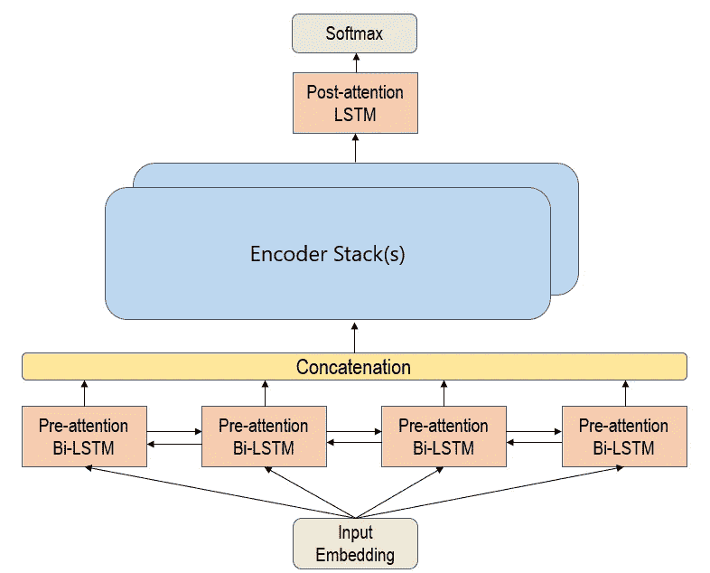**

**实验 1 模型架构**

# **结尾注释**

**嗯，那就这样吧！**

**写这篇文章确实花了一些时间来运行所有的实验。**

**希望你觉得这篇文章很有见地！**

**如果是的话，让我知道，这样我就知道该继续写什么类型的文章了。:)**

**直到下一个帖子…**

**再见了。**

**LinkedIn 简介:[蒂莫西·谭](https://www.linkedin.com/in/timothy-tan-97587190/)**