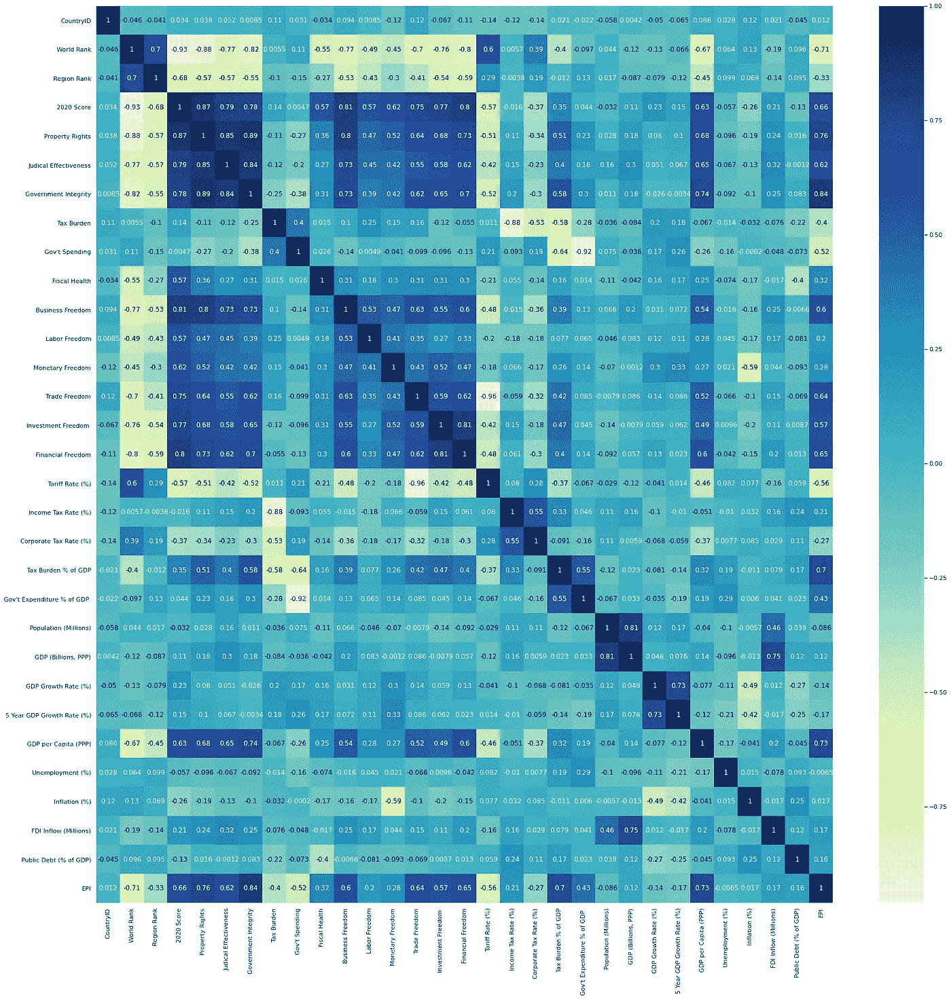

# 多元线性回归分析资本主义与环境

> 原文：<https://towardsdatascience.com/are-free-markets-wrecking-the-environment-f88fbdc88bf1?source=collection_archive---------42----------------------->

## 分析哪些经济变量最有帮助

照片由 [Nextvoyage](https://www.pexels.com/@nextvoyage?utm_content=attributionCopyText&utm_medium=referral&utm_source=pexels) 发自 [Pexels](https://www.pexels.com/photo/architecture-buildings-canada-city-457937/?utm_content=attributionCopyText&utm_medium=referral&utm_source=pexels)

关于大多数资本主义国家的所作所为以及他们如何保护环境，有很多批评和争议。其中一些想法是被误导的，或者带有固有的偏见。其他一些人则专注于特定问题，如二氧化碳排放或以中央为基础的政策如何有助于实现更大的成功因素，而忽略了大局。

但是，要考虑到财产权。每个污染空气的人都有权利生活在更清洁的环境中，在某些情况下，这是我们的共同财产。应该注意的是，总是有一些利益相关者保护他们居住的地方，从他们的私人空间和他们的财产开始。即使已经简要评论过，“[公地的悲剧](https://en.wikipedia.org/wiki/Tragedy_of_the_commons)”也超出了本文的范围。

另一方面，对于我们人类来说，寻求每天过得更好的方式，提高我们的标准和发展因素是很自然的。这个简单的事实表明了与环境的交换，发展总是与生态保护相冲突。只有富裕的国家(和个人)倾向于消费对自然影响较小的商品，因为根据这个标准，他们可以很容易地多花一些钱……或者他们试图节省每一分钱？让我们找出它。

## 将环境与自由市场经济联系起来

耶鲁大学每年都会发布[环境绩效指数](https://epi.yale.edu/epi-results/2020/component/epi) (EPI)，它提供了一份基于数据的全球可持续发展状况总结。EPI 使用 11 个问题类别的 32 个绩效指标，对 180 个国家的环境健康和生态系统活力进行了排名。这些指标在国家范围内提供了一个衡量标准，用以衡量各国与既定环境政策目标的接近程度。

与此同时，传统基金会提供了一份经济自由度排名，基于 186 个国家的 12 项自由——从财产权到财务自由。推动人类进步的经济自由原则在经济自由指数中得到衡量，旨在提供有益的见解，以促进发展进程并在全球范围内保持这一进程。

让我们来看看这两个指数是如何相互关联的。

自由市场与环境绩效正相关|作者图片

经济自由对环境的积极影响是显而易见的。在散射分布中可以观察到 J 或(复选标记)形状。通常情况下，极低的开发速度会带来相对较高的环境性能。然而，一旦这种强度加大，表现就会下降:优先考虑的是经济增长率，而不是环境。最后，当国家(和个人)达到一定的发展水平时，他们试图寻求更好的环境质量，为更健康的生活环境付出更多。在这些条件下，环境表现为一种[奢侈品](https://en.wikipedia.org/wiki/Luxury_goods)，结果是随着个人收入的增加，环境受益超过比例。

下表描述了先前关联的技术因素。即使曲线的斜率为正，相关性也不够强。

相关性能因素|作者图片

这个结果可能是反直觉的，但为了有更深入的理解，我们应该讨论一些特定的因素，并深入了解哪些方面在经济自由指数(EFI)中的权重更大。

## 哪些 EFI 因素最相关？

为了有一个更清晰的图像，最好是找到构成 EFI 的变量，它与环境性能指数最相关。不幸的是，这是一幅相当大的画面，它涉及到许多因素，不可能一目了然。深蓝色代表较高的正相关性，而黄色代表负相关性。较浅的蓝色代表中间没有相关性的所有值。你可以在这里看到全分辨率图片[。](https://i.ibb.co/34mGvBJ/heatmap.png)

每个经济自由度指标和 EPI |图像的相关矩阵(按作者)

从所有这些，我们感兴趣的是它们如何与 EPI 相关联。总体电喷性能将被用作一个阈值，一些因素，这是在附近也选择了。因此，影响更大的变量是:

*   财产权
*   政府诚信
*   贸易自由
*   财务自由
*   税负占国内生产总值的百分比
*   人均国内生产总值

所有这些变量都与 EPI 正相关，因此，它们增加得越多，环境指数就越高。下一个大问题是:如果我们考虑一个只包含这些变量的模型，那么每个变量的权重是多少才能达到最佳拟合？

## 包含最相关因素的模型

为了首先比较变量，我们必须将它们标准化。通过这种方式，我们可以并排对比人均国内生产总值和贸易自由度，它们的范围在显著不同的区间内，例如，[标准化过程](https://en.wikipedia.org/wiki/Standard_score#Calculation)均衡样本偏差并消除偏差，将值集中到平均值。变量之间的相互依赖超出了本文的范围。

每个重要预测因子的权重|按作者分类的图像

应用多变量线性回归来收集每个系数的权重。具有较高系数的变量或预测值是对 EPI 增加更多的变量或预测值。左侧的条形图描述了系数结果。

下表比较了仅使用整体 EFI 性能的第一个模型的结果和仅考虑与 EPI 最相关的因素的结果。我们的新模型与选定的变量，显示了显着的性能提高，在环境指数预测。

一元线性回归与多元线性回归|作者图片

## 讨论

单位国内生产总值的相对税收负担似乎是最重要的因素。这让我们认为，更高的政府存在有助于我们实现一个更健康的环境。然而，如果我们分析用于构建税收负担 EFI 指标的方法，我们将看到与 EPI 呈-0.4 的轻微负相关。完整的税负指标考虑了以下同等权重的预测因素:

*   个人收入的最高边际税率。
*   公司收入的最高边际税率。
*   总税收负担占 GDP 的百分比。

考虑不同政府如何征税和花费这些资源来帮助保护环境将是有益的。这就是，哪些政策对拯救地球帮助最大，比如那些与二氧化碳排放相关的政策。

如前所述，人均国内生产总值给了我们一个很好的估计，每个人都愿意多花一些钱来帮助保护环境。通过这种方式，他们的偏好转向了那些拥有更环保政策、减少其活动影响的公司，代价是付出更多。

 [## 10 家环保公司采取了惊人的环保举措

### 世界各地的公司比以往任何时候都更加重视可持续发展。从试图减少垃圾填埋垃圾…

blueandgreentomorrow.com](https://blueandgreentomorrow.com/magazines/10-green-companies-with-amazing-environmental-initiatives/) 

腐败通过在产权中引入不安全和胁迫来侵蚀环境指标。最令人担忧的是政府机构和决策的系统性腐败，如贿赂、勒索、裙带关系、任人唯亲、赞助、贪污和受贿。这种做法造成的政府诚信缺失降低了公众信任和环境活力。政府诚信得分同等重视以下因素:

*   违规支付和贿赂。
*   政府决策的透明度。
*   没有腐败。
*   对腐败的看法。
*   政府和公务员的透明度。

另一个重要因素是贸易和金融自由。一个实施许多贸易壁垒并阻止其居民以有竞争力的价格获得环境友好型商品的政府，不仅在经济上伤害了其公民，同时也侵蚀了他们的栖息地。另一方面，如果金融部门受到政府干预，这可能导致效率低下或高度集中的部门，这可能会对绿色倡议产生负面影响，我们可以从结果中观察到这一点。

尽管产权在等式中不占太大比重，但它们的定义至关重要:它们必须是可衡量的，以便日后进行交易。法治应该由一个与腐败高度隔离的政府来实施。它还应建立法律框架来限制或允许上述权利。它还必须惩罚对环境的破坏，保证合同得到遵守和实施。这样，对栖息地的照顾将被认为是一种可交易的资产，而不是被动的。

## 结论

自由市场可以更好地保护环境，事实证明，发达国家并没有破坏环境。事实上，他们拥有更多的资源:他们的公民、公司和政府考虑在更环保的解决方案上投入更多的资金。有几个因素是非常重要的，如税收负担、政府诚信和产权，这些因素促进了一个国家的环境绩效。除了税收负担之外，检查税收是如何用于居家护理也很重要。这是另一篇文章的良好开端。

如果你对帖子中的图片和更多细节感兴趣，请访问 github [库](https://github.com/francomanca93/liberalismo-y-medioambiente/tree/augusto)。