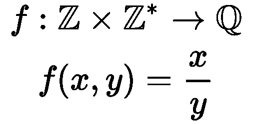

# 编程中的函数真的是函数吗？

> 原文：<https://towardsdatascience.com/are-functions-from-programming-really-functions-e306fc2d509d?source=collection_archive---------42----------------------->

## …以及它们为什么应该如此


背景图片由[在](https://pixabay.com/ro/users/congerdesign-509903/?utm_source=link-attribution&utm_medium=referral&utm_campaign=image&utm_content=514998)[像素箱](https://pixabay.com/ro/?utm_source=link-attribution&utm_medium=referral&utm_campaign=image&utm_content=514998)上设计

如果你正在读这篇文章，那么很可能你已经非常了解编程中的函数。函数是一种非常常见和广泛的编程结构，几乎出现在所有的编程语言中。

通常，函数是一段代码，它从外部获取一些参数，执行一些可能会用到这些参数的操作，然后返回一个输出值。实际上，在许多编程语言中，函数可以不返回某个值，或者返回多个值，而不仅仅是一个值。但是为了一般性，这些情况也可以表示为只有一个值。对于“不返回”的情况，我们可以使用一个特殊值来表示(在 Python 中，这个特殊值是 None 每当你没有从一个函数中返回一些东西，它就返回 None)。对于更多值的情况，我们可以使用多个值的向量作为单个对象。

例如，在 Python 中，函数定义如下:

```
def **func_name**(param1, param2, ...): *# do some stuff with input parameters* return output_value
```

现在，我想问的问题是:这些来自编程的函数是真正的数学函数吗？

嗯……，我们先回忆一下什么是数学函数。

在数学中，函数只是从集合 A 到集合 B 的映射，其中来自 A 的任何元素在 B 中只有一个关联元素。

以下是 math 中的一个函数示例，它有 2 个整数作为输入，并输出一个有理数:



数学函数的一个关键属性是，每个给定的输入值对只产生一个特定的输出，或者换句话说，不可能用相同的参数对同一个函数求值两次并得到两个不同的输出。

如果我们考虑这个属性，就不难意识到这对于编程中的函数并不成立。

在编程中，我们可以有这样的函数，即使输入参数是相同的，它也会为不同的函数调用返回不同的结果。

例如，考虑以下 Python 代码:

```
i = 0def **f**(x): global i i += 1 return x+i
```

如果我们调用 f(10)我们将得到 11 作为输出值；我是说第一次我们称之为。如果我们第二次调用 f(10)，我们将得到 12，然后是 13，以此类推。变量 I 在每次函数调用时递增。

所以，我们上面写的不是一个数学意义上的函数(或者一个纯函数，就像他们经常被称为的那样)。

这里的问题是，我们的函数 f 不仅仅依赖于它的输入值；它也依赖于一个全局变量并改变它。这种行为是该“函数”在其输出值中不一致的原因。

到目前为止，我们确定了“功能”行为不一致的原因:**依赖于外部世界**。

这是唯一的问题吗？

让我们稍微想象一下，我们定义了另一个 Python 函数，这次它只依赖于它的输入参数，没有全局变量。在继续阅读之前想一想这个问题。这次是不是数学函数？


图片由 [Carlos Alvarenga](https://pixabay.com/ro/users/carlosalvarenga-2116392/?utm_source=link-attribution&utm_medium=referral&utm_campaign=image&utm_content=1276384) 在 [Pixabay](https://pixabay.com/ro/?utm_source=link-attribution&utm_medium=referral&utm_campaign=image&utm_content=1276384) 上拍摄

答案是否定的。那么，还有什么可能出错呢？

另一个问题是**会导致副作用**。也就是说，除了从输入获得输出的过程之外，仍然有可能做影响程序其他部分的事情，因此可以确定函数具有不一致的输出。

例如，假设我们有两个函数 f 和 g，它们都接受一个整数列表作为输入。函数 f 给列表中的第一个整数加 1 并返回，g 给第一个整数加 2 也返回。但是在许多编程语言(包括 Python)中，列表是通过引用传递给函数的。这意味着如果我们在一个函数中改变列表，这个改变会自动在其他地方生效。在我们的例子中，如果我们用输入列表[1，2，3]同时调用 f 和 g，f 中的加法可能会在 g 中的加法之前执行，它们可能会分别返回 2 和 4，而不是我们预期的 2 和 3。所以，f 中发生的事情可能会改变 g 的输出或者相反。因此，f 和 g 不仅仅依赖于它们的输入，它们也不是一个纯函数。

好吧。所以，我们看到了编程中的函数不一定是纯函数，我们也看到了这一事实的原因是什么:依赖于变量而不是输入参数，并导致副作用。但是，这有什么问题呢？我们为什么要担心这些编程结构不是纯函数呢？

原来非纯函数，由于它们的副作用，会产生很多问题。引起大量副作用会使程序的流程变得更加难以预测。它们会产生一些意想不到的结果。

不出所料，数学函数在数学中得到了广泛的研究，与具有副作用的函数相比，我们对它们以及它们的性质了解得更多，而具有副作用的函数更难用数学建模和预测它们的行为。

这就是一种新的编程范式诞生的一些主要原因:**函数式编程。**


图片来自 [Flickr](https://www.flickr.com/) 上的 [juicy salif](https://www.flickr.com/photos/55381507@N03/15093919796/)

*这种函数式编程的范例旨在使用最纯粹的函数，并使那些函数成为它的主要特征。通过只使用纯函数，程序应该有更少的错误，更容易调试、测试和证明它们的正确性。*

许多现代编程语言提供了程序员能够编写功能代码所需的东西。举几个例子:Python，C++，Java，JavaScript。这些语言被称为*不纯函数语言*。它们不纯，因为它们不“强迫”程序员写功能代码，它们只是提供所需的工具；由程序员决定是只使用纯函数，还是使用副作用。

也有所谓的纯函数式语言，如 Haskell、Lean 或 PureScript。与不纯的语言相反，这些语言确实迫使程序员只使用纯函数来编写整个程序。纯函数式语言不是很受欢迎，可能是因为许多人不喜欢数学，并且由于这样一个事实，即尽管理论上有好处，但只使用纯函数创建复杂的程序在实践中可能很麻烦。

纯函数在效率方面也有一些缺点。假设我们有一个很大的数字列表(比如 100 万)，我们想把它作为一个参数传递给一个纯函数，这个函数只需要对一个特定的项做一点点改变，然后返回结果列表。这样的功能不允许直接在现有的数字列表中进行更改，因为这将是一个副作用。因此，这个函数应该首先将原始数据(这 100 万个数字)复制到另一个内存位置，在该副本中进行所需的更改，然后返回这个新列表作为结果，并保持原始列表不变。与非纯函数相比，这是非常低效的。

因此，在我看来，如果一个人想要利用函数式编程范式及其好处，最好的方法是使用不纯的函数式语言，这允许程序员可以采用更自由的风格，并且只要合理就尽量使用纯函数。如果在某种程度上，你认为为了更有效或更容易实现而牺牲一个纯粹的函数是值得的，我认为这没问题。

我希望这些信息对您有用，感谢您的阅读！

这篇文章也贴在我自己的网站[这里](https://www.nablasquared.com/are-functions-from-programming-really-functions/)。随便看看吧！