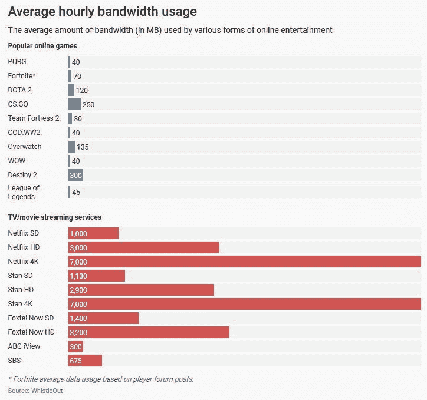

# 游戏玩家在隔离期间会断网吗？

> 原文：<https://towardsdatascience.com/are-gamers-breaking-the-internet-during-quarantine-176fed9fa83d?source=collection_archive---------18----------------------->

## 视频游戏使用的带宽比你想象的要多

安德烈·谭在 [Unsplash](https://unsplash.com?utm_source=medium&utm_medium=referral) 上的照片

这是我今天看到的:

…许多游戏玩家对此感到愤怒。我同意他们中的大多数人。这种说法的问题是建议“在合理的时间玩”。

在不同的时间玩不会有什么帮助，为了证明这一点，我们要看看为什么在线玩只是游戏所需带宽的一小部分。

该推文的大多数回复都引用了这张图表来为游戏辩护:

*来源:*[*https://www . ABC . net . au/news/2018-06-06/online-gamers-nbn-bandwidth/9836186*](https://www.abc.net.au/news/2018-06-06/online-gamers-nbn-bandwidth/9836186)

这个问题是这个图表比较了苹果和橘子。流视频时，您使用的唯一带宽是加载网页和流视频内容。不像视频游戏，你可以下载:

*   游戏客户端(如 Steam、Origin 或独立的启动器)
*   游戏客户端的更新
*   游戏
*   游戏的更新

然后，为了玩游戏，你有时会完全离线(完全不使用带宽)，或者在其他时候你可能会:

*   流式传输你的游戏(这比在网飞上流式传输使用更多的带宽)
*   在游戏中或通过其他应用程序使用语音和文本聊天
*   使用带宽与服务器或其他在线玩家同步进行在线游戏

上图显示了视频游戏在互联网消费中可能是最小的部分。

# 堡垒之夜 vs 网飞，估算消费

我们将使用堡垒之夜作为我们的游戏示例，因为数据很容易在其周围找到，但由于其受欢迎程度，它的消耗比大多数游戏大得多。

我们必须考虑的另一件事是，这些因素中的大多数不会每小时发生一次，因此我将把指标累计到每月一次，使它们与网飞更具可比性。

这两种写法都会降低数据的准确性，所以请记住，我的观点纯粹是粗略的概括。

# 新用户消费

在撰写本文时(2020 年 3 月 22 日)，史诗游戏客户端下载量为 41.8MB，全新安装的堡垒之夜下载量为 35.3GB。这些只供新玩家下载，现有玩家只需不断下载最新更新。

那么有多少新玩家呢？[根据 Statista](https://www.statista.com/statistics/746230/fortnite-players/) 的数据，仅 2019 年 3 月就有约 5000 万新堡垒之夜玩家加入。

一旦开始玩，上面贴的原始图表说堡垒之夜在线玩的时候每小时消耗 70MB，玩家平均每周 6-10 小时。为了简单起见，我们将把它四舍五入到每月 30 小时。

为了比较:

> 在 2019 年的最后一个季度，网飞在全球范围内拥有超过 1.67 亿付费流媒体用户，以及超过 460 万免费试用客户。— [统计局](https://www.statista.com/statistics/250934/quarterly-number-of-netflix-streaming-subscribers-worldwide/)

因此，堡垒之夜在 2019 年 3 月获得的月度新用户数量是网飞在 2019 年第四季度获得的近 11 倍(460 万对 5000 万)。

网飞用户平均每月 [47 小时](https://www.whistleout.com.au/Broadband/Guides/Netflix-data-usage-and-speed-requirements)或[每天 2 小时](https://variety.com/2019/tv/news/netflix-cindy-holland-subscribers-watch-average-two-hours-day-1203159868/)。许多消息来源不同意这一指标，但我们知道，它在 2019 年底[下降](https://www.emarketer.com/newsroom/index.php/us-netflix-grabs-the-most-attention-but-its-reign-will-be-challenged/)，现在很可能飙升(由于新冠肺炎检疫)。

在网飞上，每小时的视频流消耗大约 3GB 的高清数据，或者 7GB 的 4K 数据。

以下是我们对新用户每月互联网消费的估计:

*   **网飞每月新增用户**:47 小时 x3gb = 141 GB/月 x460 万新增用户=**6.486 亿 GB**
*   **堡垒之夜每月新增用户**:(30 小时 x 70MB/小时)+ 35GB 下载量=每用户 37GB x 5000 万新增用户=**18.5 亿 GB**

# 现有用户消费

最近一次堡垒之夜更新[大约是 3GB](https://games-guides.com/fortnite-patch-notes-2-62-update-12-20-is-live/) ，根据游戏百科，这些[更新通常发生在每周二](https://fortnite.gamepedia.com/Patch_Notes)。所以大约每周更新 3GB。

这些估计与上面的非常相似，用户基数在变化，堡垒之夜的初始下载被删除。

*   **网飞月刊:**47 小时 x 3GB = 141 GB/月 x 167M 亿现有用户=**235 亿 GB**
*   **堡垒之夜月刊:**30 小时 x 70MB/小时=每个用户 2GB x 2 亿现有用户= **4 亿 GB**

# 谁赢了？

尽管在游戏的其他领域也发现了大量的数据消耗，但网飞仍然以 10 倍于堡垒之夜的数据消耗量独占鳌头。

**网飞** : 648.6M + 23.5B = **每月 241 亿 GB**

**堡垒之夜** : 1.85B + 400M = **每月 22.5 亿 GB**

*免责声明:这些都是难以置信的粗略计算，几乎所有的数据都是从可靠或不可靠的新闻来源收集的。请半信半疑地接受这一切！*

如果你包括游戏流(在观看和广播方面)，语音/文本聊天，和多种其他视频游戏，那么你可能会看到一个更激烈的竞争。大多数游戏玩家拥有并玩多种游戏。

我倾向于认为堡垒之夜的巨大规模弥补了很多这些无法计算的因素。大多数其他游戏的月用户数只有堡垒之夜的一小部分，而且修补的频率也更低。

我想说的是，游戏占用的带宽比我们意识到的要多得多，网飞也是如此。

# 这对您的互联网有何影响

如果网飞是这里的罪魁祸首，是他们在损害你的网速吗？

不尽然，以下是本尼迪克特·埃文斯本周最新新闻简报的一段话:

> 欧盟要求网飞降低流质量以避免网络过载:它照办了，但大多数实际的电信公司表示，虽然流量上升了，但这并不是一个真正的问题，因为实际发生的是晚上的高峰现在延伸到了白天，而不是高峰更高。

他引用了[这个来源](https://newsroom.bt.com/the-facts-about-our-network-and-coronavirus/)说了下面的话，我自己强调了一下。

> 自本周二以来，随着人们开始更广泛地在家工作，我们已经看到**工作日白天的流量与固定网络上类似的日子相比增加了 35–60%**，峰值为 7.5Tb/s。
> 
> **这仍然只是平均晚高峰的一半左右，远未达到我们已经证明网络可以处理的 17.5 Tb/s。**

总而言之，白天交通流量的增加也减少了夜间交通高峰。我们仍然在这些网络的建设范围之内。

这不仅仅是在英国，如果你感兴趣，这里有更多的网络报道: [Cloudflare](https://ben-evans.us6.list-manage.com/track/click?u=b98e2de85f03865f1d38de74f&id=68a8ea7955&e=9a6198b55f) ，[诺基亚](https://ben-evans.us6.list-manage.com/track/click?u=b98e2de85f03865f1d38de74f&id=f57f2ccb2c&e=9a6198b55f)，[威瑞森](https://ben-evans.us6.list-manage.com/track/click?u=b98e2de85f03865f1d38de74f&id=613246b3ec&e=9a6198b55f)，[西班牙](https://ben-evans.us6.list-manage.com/track/click?u=b98e2de85f03865f1d38de74f&id=bf280fa4db&e=9a6198b55f)

如果你真的在家里看到了较慢的速度，很可能是你家里的路由器无法处理新增加的使用量。你可能要考虑升级。