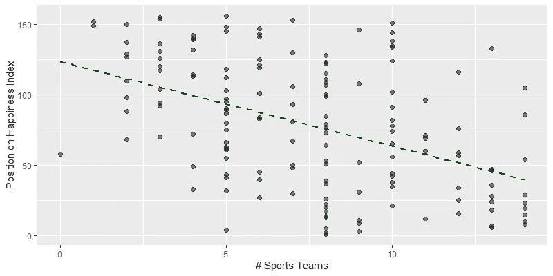
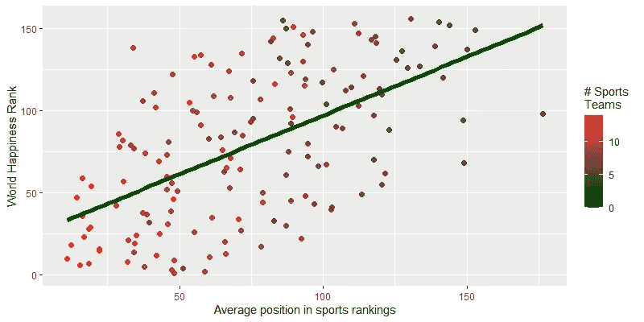
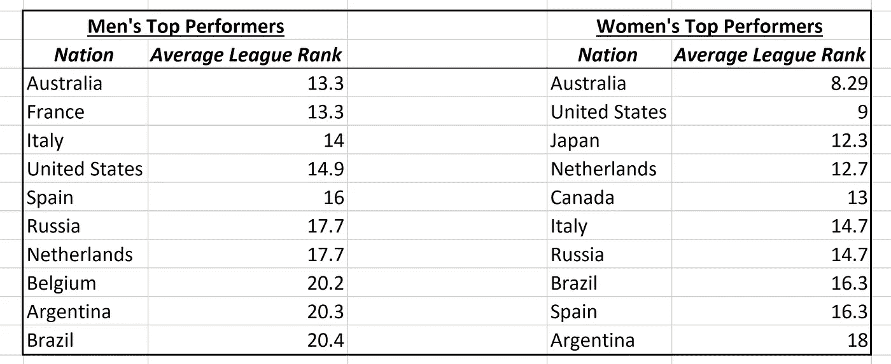

# 国际体育运动会导致全球不快乐吗？

> 原文：<https://towardsdatascience.com/are-international-sports-contributing-to-global-unhappiness-1ca44b188ea3?source=collection_archive---------45----------------------->

## 深入探究体育对一个国家幸福的影响。

在 [Unsplash](https://unsplash.com/s/photos/football?utm_source=unsplash&utm_medium=referral&utm_content=creditCopyText) 上由 [Fachry Zella Devandra](https://unsplash.com/@zelladun?utm_source=unsplash&utm_medium=referral&utm_content=creditCopyText) 拍摄的照片

# 介绍

对于世界上被隔离的观众来说，体育从未如此重要。毕竟，这只是新闻频道报道疫情统计数据的单调乏味中的一个喘息。

世界经济论坛最近在[发表的一篇文章展示了一些研究，声称**一场国际体育比赛的失败所带来的不快乐是一场胜利所带来的快乐的两倍。**例如，根据这项研究，克罗地亚在 2018 年世界杯上以 2 比 4 惨败给法国，这将极大地降低克罗地亚的幸福感——尽管他们在此之前赢了很多场比赛。](https://www.weforum.org/agenda/2018/07/u-k-economists-prove-it-sports-destroy-happiness/)

即使是联赛中最好的运动队赢的也不到输的两倍。例如，2018-2019 赛季休斯顿火箭队赢了 53 场比赛，输了 29 场。这是一个惊人的记录，但是如果失败带来的不快乐是胜利带来的快乐的两倍，那么这意味着火箭球迷在赛季结束时很大程度上是不快乐的。

文章声称，“运动让我们悲伤。”在国际层面上真的是这样吗？

> 运动真的和不快乐有关联吗？那些有很多运动队的国家(无论输球与否)会不开心吗？

# 方法学

为了验证这一说法，我用一个国家在世界幸福指数上的排名来量化一个国家到底有多幸福(排名越低越好)。这个数据集中有 139 个国家。我使用了以下国际体育联盟的数据:

*   男子 T20 板球(ESPN)，女子 T20 板球(维基百科)
*   男子和女子足球(国际足联)
*   男子橄榄球(世界橄榄球)、女子橄榄球(Scrum Queens)
*   男子和女子篮球(国际篮联)
*   男子和女子曲棍球(FIH)
*   男子和女子水球(FINA)
*   男子和女子排球(FIVB)

*注意:如果两个国家的幸福等级分别为 1 和 5，数字越小越好，因为该国排名第一，而后者排名第五。*

# 发现 1:有国家运动队的国家比没有国家运动队的国家更幸福。

我使用的数据给了我 0.36 的相关系数，这表明一个国家的运动队数量与其幸福感之间存在适度的正相关。

更多的运动队意味着幸福指数排名更低(即更接近第一)。

更令人信服的是，数据显示**至少有一支国家运动队的国家平均幸福指数为 75.72(第 76 位)，而没有国家运动队的国家平均幸福指数为 115.09(第 115 位)！**

# 发现#2:有女队和男队的国家比只有男队的国家更幸福。

让我们建立一个叫做*平等比率*的快速指标，它是一个国家的男队数量除以女队数量。

平等比例为 3.0 的国家的中位数位置是 71，而比例更高的国家(即男队是女队的三倍以上)的中位数位置大约是 120。从本质上讲，一个运动队性别平等的国家一定会更幸福。真的，这很容易。

# 发现 3:运动队表现较好的国家比运动队表现较差的国家更幸福。

这一点令人惊讶，因为它似乎证实了这篇文章的主张，即更多的国民损失与更差的国民幸福相关。这似乎是显而易见的，但有人可能会说，一支球队在锦标赛的每个阶段获得的累计快乐超过了他们输掉最后一场比赛时的失望。

拥有表现更好的国家运动队(并且有很多)的国家往往比那些表现更差的国家更幸福。

此外，这些国家在所有运动项目上的综合表现都名列前茅。在该表中，联赛排名越低越好(即，如果一个国家在国际篮球赛中排名第四，但在国际水球赛中排名第二，则他们的平均联赛排名将为第三)。

澳大利亚在男子国际体育联盟中平均排名第 13，在女子国际体育联盟中平均排名第 8。

# 结论

**一个快乐的国家是一个投资于体育运动的团结和振奋精神的能力的国家，而且不分性别，一视同仁。事实上，我认为世界幸福指数应该把体育运动作为全国幸福指数的代表。**

为了反驳世界经济论坛文章中的研究，体育运动确实能让人快乐。无论是玩家还是观众。

如果你想看我做这个项目用的代码或者数据，可以在这里 找到我的 GitHub [*。你也可以在 Medium 上关注我，了解更多类似的内容。感谢阅读！*](https://github.com/abhinavr2121/Sports_Happiness)