# 机器会取代程序员吗？

> 原文：<https://towardsdatascience.com/are-machines-going-to-replace-programmers-995072159365?source=collection_archive---------6----------------------->

## 或者软件如何创造其他软件

我最近开始做一些家庭烘焙。就像许多其他人一样，它始于疫情封锁期，那时我厌倦了每天从超市买同样的面包。老实说，我的面包还过得去，不是很漂亮，但能让家人满意，对我来说已经够好了。

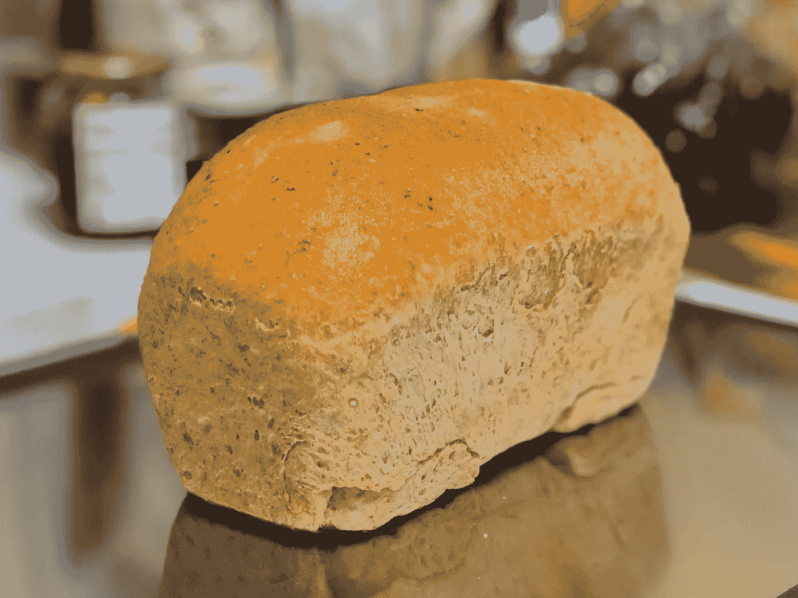

我早期的多谷物面包之一(张秀雄摄)

昨天，我无意中发现了 YouTube 上的一个视频，是关于一家工厂如何同步完美地制作面包的，这让我有点心碎。所有揉面的艰苦工作与旋转马达在一个机械化的巨大桶里翻滚相比，根本算不了什么。当我看着一排排的面团整齐划一地螺旋上升到发酵传送带上，然后慢慢地滚入一个不断发出嗡嗡声的巨大烤箱，变成行进中的面包时，我心中的某种东西死去了。

当面包被装进密封的袋子里，然后被扔进包装盒时，我告诉自己，他们没有用爱为家人做面包的人那样的手艺(在我看来)。

但是在我内心深处，我明白如果面包仅仅依赖于人类面包师，那将会更加昂贵，更多的人将会挨饿。自发明以来，自动化和生产线一直在满足大众的需求。与养活所有不断增长的人口相比，面包师的骄傲无关紧要。


格伦·卡斯滕斯-彼得斯在 [Unsplash](https://unsplash.com/?utm_source=unsplash&utm_medium=referral&utm_content=creditCopyText) 上拍摄的照片

幸运的是，我白天不烤东西。我在软件开发行业，这里的主要活动包括软件程序员(开发人员、工程师、编码人员——由你选择)编写代码来构建简单到复杂的软件系统，这些系统控制着当今世界的大部分地区(甚至面包工厂也由制造控制系统控制)。也是人类的程序员。程序员是非常受欢迎的工匠，他们的经验、天赋和创造力受到称赞。

就像面包师一样。

当然，这回避了一个问题——有没有像面包工厂一样由机器生产软件的软件工厂？它们今天存在吗？

# 生产线

另一个观点是，今天的软件开发已经是一条生产线，不同的软件开发团队负责整个系统的不同部分，最终在组织良好的流程中进行组装。

取代工厂工人的是程序员，取代主管的是团队领导，取代工厂经理的是工程经理。通过外包、离岸外包、承包以及各种人力补充方法的结合，公司也有可能加速软件开发。


软件工厂？Alex Kotliarskyi 在 [Unsplash](https://unsplash.com/s/photos/programming?utm_source=unsplash&utm_medium=referral&utm_content=creditCopyText) 上的照片

自然，没有一个程序员喜欢被称为工厂工人。事实上，我们大多数人更喜欢被称为[软件工匠](https://qz.com/work/1371151/what-happened-to-software-craftsmanship/)。但是不可否认的是，在一个大规模的环境中开发软件很像一个工厂。

今天，所有大规模的软件开发都是在团队中进行的(不管它叫什么，也不管它被赋予了多大的自主权)，并由一些过程指导。无论是敏捷的、迭代的、行为驱动的、瀑布式的还是任何混合的变体，大多数软件开发组织都有某种过程和方法。更大的组织甚至有专门的团队来实现过程和过程模型，例如 [CMMI(能力成熟度模型集成)](https://www.cio.com/article/2437864/process-improvement-capability-maturity-model-integration-cmmi-definition-and-solutions.html)和 [ISO/IEC 12207](https://www.iso.org/standard/43447.html) 。

其中一些流程模型可能会变得非常严重。例如，由卡耐基梅隆大学(CMU)和美国国防部开发的 CMMI 是许多美国政府软件开发合同中的[要求。](https://en.wikipedia.org/wiki/Capability_Maturity_Model_Integration)

虽然软件开发作为生产线的想法不是很吸引人，甚至与酷酷的技术创业开发的形象相反，但是一旦软件达到一定的规模，结构和过程就是生产的一部分。

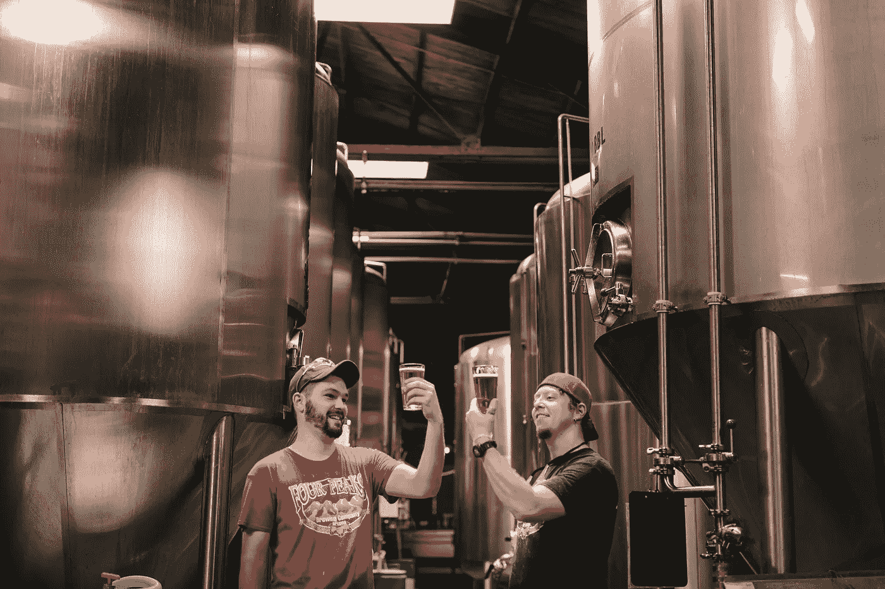

照片由[将](https://unsplash.com/@elevatebeer?utm_source=unsplash&utm_medium=referral&utm_content=creditCopyText)提升到[去飞溅](https://unsplash.com/s/photos/beer-factory?utm_source=unsplash&utm_medium=referral&utm_content=creditCopyText)

就像烤面包、酿造啤酒和许多其他工匠工作一样，制作伟大的软件是骄傲和快乐的源泉。但当涉及到规模和生产时，面向过程的方法对于确保质量至关重要，更重要的是一致性。

然而，尽管我们在流程中构建了很多东西，但这些仍然是由人类完成的，并且容易出现著名的 I [D-10T 错误](https://en.wikipedia.org/wiki/User_error)。这就是为什么随着时间的推移，我们已经转向持续的自动化集成、测试和部署。我们的想法是，通过使用自动化流程的脚本，在集成我们正在构建的系统的多个部分和组件时，尽可能地减少人为错误。

这非常有效，但显然仍然存在差距——系统是由人类设计的，不同的部分和组件是由人类编写的，甚至自动化脚本也是由人类编写的。系统的强健程度取决于最薄弱的一环，而我们就是那一环。

但是如果这个过程的每个部分都是自动化的呢？

# 自动化

在我最喜欢的一本书里， [*月亮是个苛刻的情妇*](https://archive.org/details/TheMoonIsAHarshMistress_201701)(1966 年出版)，迈克([的简称，](https://en.wikipedia.org/wiki/Mycroft_Holmes)，夏洛克的哥哥)是个“醒了”的 AI。迈克能理解经典的编程，但他也能理解 Loglan(这是一种真正的语言)和英语。mannie(Manuel 的简称)，叙述者和*电脑人*(这个名字多酷啊)，事实上主要是用英语和他交流。Mike 根据他们的交互编写自己的程序。想象一下。这是在 60 年代中期。

给计算机编程，你只需要告诉它你的问题，它就会创造出必要的软件来解决程序，这种想法令人疯狂地着迷。在 20 世纪 80 年代和 90 年代，出现了几个创造第四代和第五代语言的运动(4GL 和 5GL)，这些语言将完全做到这一点，并且它们被大量营销。

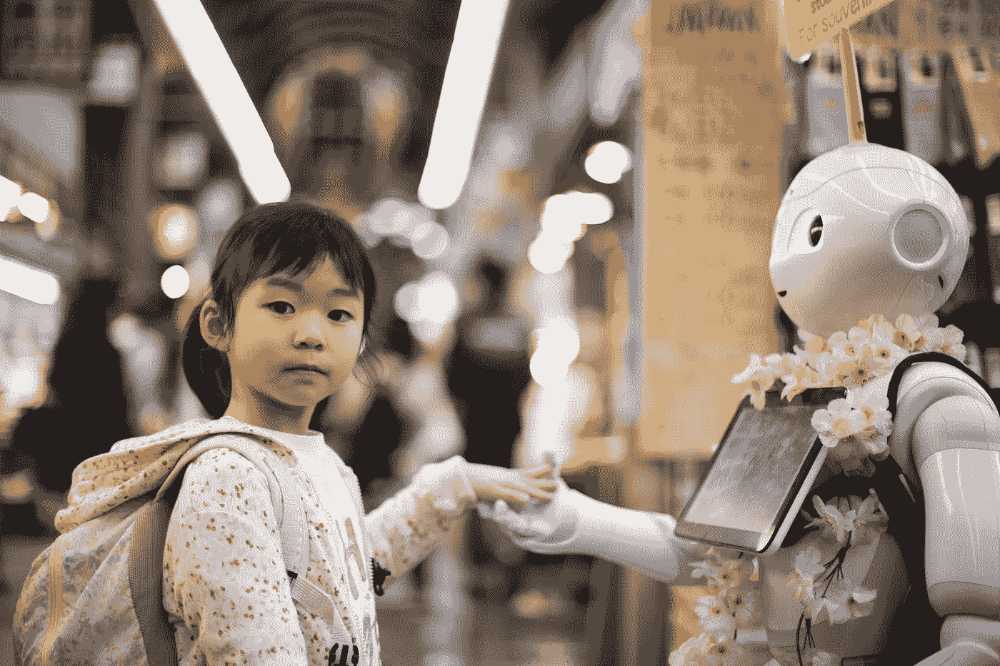

安迪·凯利在 [Unsplash](https://unsplash.com/collections/5238842/%F0%9F%A4%96-westworld?utm_source=unsplash&utm_medium=referral&utm_content=creditCopyText) 上拍摄的照片

其目的是最终，实际的编码是不必要的，所有需要做的是定义问题，代码将被生成来解决它。自然，焦点是以更精确的方式来定义问题，以便生成更好的代码。要做到这一点，你需要建立模型，并有一个用户友好的方式来描述问题，这样即使非软件工程师也可以创建软件。当时，我的公司(像当时的许多企业一样)完全相信了它。说实话，我也上当了。

它从来没有真正起飞，因为…编程语言已经在这样做了。要让一种编程语言适合非程序员，你需要让它不那么死板，更适合人类。但是这将导致它更加模糊和不精确。在这种情况下，它只能创建真正简单、明确的软件。要创建更复杂的软件，你需要一个不仅能定义问题，还能提出解决方案、编写代码、确保运行并根据需要更新代码的人，也就是说，你需要一个程序员。

并不是说 4GL/5GL 没有用，只是它对软件开发行业死亡的承诺被大大夸大了。我参与的项目崩溃了，损失了数百万美元(虽然我不能完全归咎于 4GL，但这也是部分原因，它夸大了能力，但最终却低估了结果)。

## 软件创建软件

4GL/5GL 不是答案，部分原因是等式中仍然有人类。如果我们深入下去，让软件去创造软件呢？过去几年人工智能的发展，特别是机器学习，重新提出了这个想法。如今，机器学习越来越多地被用于许多软件中。已经有机器学习软件正在击败职业围棋选手，分析市场，驾驶汽车，甚至通过向过去的大师学习来创造音乐和艺术。今天有人在创造一些机器学习软件来编写其他软件吗？

让我们来分析一下这是什么意思。

有几种类型的软件可以创建其他软件。首先，有自我复制，这真的意味着一个软件如何能够自我复制。这个想法并不新鲜，事实上，约翰·冯·诺依曼在 20 世纪 40 年代就提出了自我复制自动机的理论。

## 奎因斯

在源代码级别，有 [quines，这些程序不接受任何输入，生成自己源代码的副本作为唯一输出](https://en.wikipedia.org/wiki/Quine_(computing))。这里有一个相当令人印象深刻的奎因，叫做 [Qlobe](http://mamememo.blogspot.com/2010/09/qlobe.html) ，由 Ruby 核心成员 Yusuke Endoh 创建。

在命令行中运行:

```
curl -fSSl https://gist.githubusercontent.com/shime/f0ebe84ca42c33b51d42/raw/5e74315dc6b6fe572f8a457536ad7eb17ad3f1e4/qlobe.rb > qlobe.rb; while true; do ruby qlobe.rb | tee temp.rb; sleep 0.1; mv -f temp.rb qlobe.rb; done
```

你会看到一个旋转的代码球。

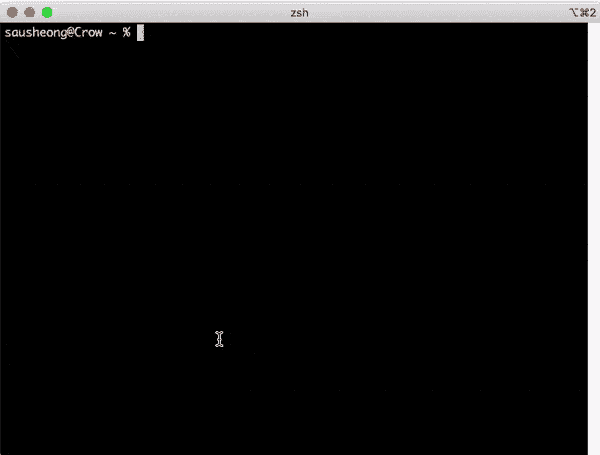

远藤佑介

## 沃尔姆斯

虽然奎因是无害的乐趣，但电脑蠕虫却不是。计算机蠕虫是独立的恶意软件程序，可以自我复制并在网络上传播。“蠕虫”一词首次出现在约翰·布鲁纳 1975 年的小说《T2》《T3》《冲击波骑士》《T4》中。最早的蠕虫之一是罗伯特·塔潘·莫里斯于 1988 年创建的莫里斯蠕虫。莫里斯蠕虫在一次致命的拒绝服务攻击中扰乱了互联网上近 10%的计算机(考虑到互联网的规模，这并不是一个很大的数字)。

最臭名昭著的蠕虫之一是 Stuxnet，它攻击工业 SCADA 系统，据信对伊朗核计划造成了重大破坏。它也被认为是美国和以色列联合建造的网络武器。过一会儿我会让它沉下去的。国家支持对核设施的网络攻击。

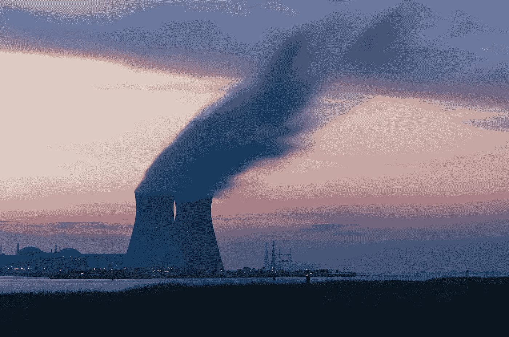

照片由[弗雷德里克·保罗森](https://unsplash.com/@fredography?utm_source=unsplash&utm_medium=referral&utm_content=creditCopyText)在 [Unsplash](https://unsplash.com/s/photos/nuclear?utm_source=unsplash&utm_medium=referral&utm_content=creditCopyText) 上拍摄

当然，自我复制只是一种机制，它的有效载荷才是恶意的。有效载荷也可能是良性的，尽管它们相对较少。比如 [Welchia 蠕虫](https://smartermsp.com/tech-time-warp-was-the-welchia-worm-well-intended/)感染电脑，对抗 [Blaster 蠕虫](https://www.computerworld.com/article/2571072/blaster-worm-spreading--experts-warn-of-attack.html)。它会自动下载 Windows 的 Microsoft 安全更新并重新启动计算机，尽管它没有任何权限。显然不是每个人都认为它友好。

## 遗传表演程序

我们之前说的是自我复制，基本上就是软件克隆一个自己的副本。在有机世界中，除了阿米巴原虫和其他单细胞动物，繁殖更像是生产后代，创造更新的一代。这在软件中也会发生！

[遗传编程(GP)](http://www.genetic-programming.org) 是软件可以产生其他软件的一种方式。GPs 是基于群体的元启发式算法，进化出能最好地解决特定问题的程序。

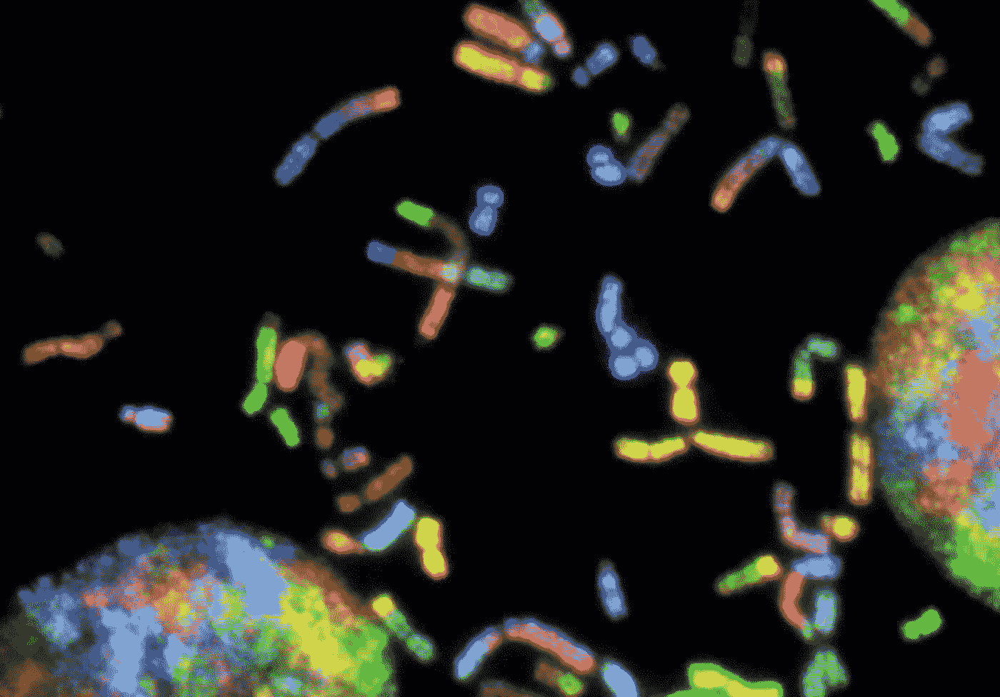

[国立癌症研究所](https://unsplash.com/@nci?utm_source=unsplash&utm_medium=referral&utm_content=creditCopyText)在 [Unsplash](https://unsplash.com/s/photos/genetic-code?utm_source=unsplash&utm_medium=referral&utm_content=creditCopyText) 上拍摄的照片

艾伦·图灵(Alan Turing)是第一个提出进化程序的人，他在 1950 年的论文 [*计算机器和智能*](https://www.cs.bham.ac.uk/~wbl/biblio/gp-html/oai_cogprints_soton_ac_uk_499.html) 。然而，GP 和一般意义上的进化算法领域是在霍兰德的经典著作《自然和人工系统中的[](https://mitpress.mit.edu/books/adaptation-natural-and-artificial-systems)*中首次提出的，该书于 1975 年首次出版。*

*GPs 一般遵循[自然选择的原则](https://www.nhm.ac.uk/discover/what-is-natural-selection.html)。以下是全科医生的基本步骤:*

1.  *随机生成初始程序群体(第一代)*
2.  *评估每个项目的适用性*
3.  *为下一代的繁衍选择最好的节目*
4.  *通过交叉和变异机制，从上一代最佳解决方案中复制下一代程序*
5.  *用下一代程序取代不太适合的程序*
6.  *重复步骤 2 到 5，直到满足终止条件，通常是在找到解决问题的合适程序时*

*在 GP 中，程序在内存中被表示为树结构，所以传统上 GP 倾向于使用自然使用树结构的编程语言。我已经在另一个故事中谈到了这种算法的另一种变体，叫做遗传算法。GP 和 GA 都是广为人知的领域[进化算法](/introduction-to-evolutionary-algorithms-a8594b484ac)的变体。虽然两者的概念非常相似，GP 的主要表示是程序，而 GA 的主要表示是原始数据(通常是字符串)。*

*GPs 是迷人的，不仅因为它是我们作为程序员没有编码的东西，而且是经过几代人进化而来的。这也是因为它是可以不断变化和适应环境的软件。软件不仅创造软件，而且实际上还产生了软件的后代。*

## *深度神经网络*

*[深度神经网络(或称深度学习)](/a-laymans-guide-to-deep-neural-networks-ddcea24847fb)是一种基于人工神经网络的机器学习算法。“深度”一词指的是神经网络中的多个层。深度神经网络(DNN)近年来受到了很多关注，取得了惊人的结果，有时也有点炒作。我不会太深入地探究它是如何工作的，但我已经写了几个关于它的故事，包括一个展示如何从头开始建立一个神经网络的故事。*

*神经网络并不新鲜，其概念可以追溯到 20 世纪 50 年代，在 20 世纪 80 年代和 90 年代有许多突破。真正加速的是计算能力的突破和可用性以及数据的增长。用更通俗的话来说，云和大数据使 DNNs 成为可能。*

*2014 年，[英国人工智能公司](https://deepmind.com)deep mind 启动了一个名为 [AlphaGo](https://deepmind.com/research/case-studies/alphago-the-story-so-far) 的项目，旨在构建一个深度神经网络来参与围棋比赛。到 2016 年 3 月，它与世界上最好的围棋手之一 Lee Sedol 对弈，赢了 5 局 4 胜(使用 1920 个 CPU 和 280 个 GPU)。那 1 场失利是 AlphaGo 上一次在正式比赛中输给人类。*

*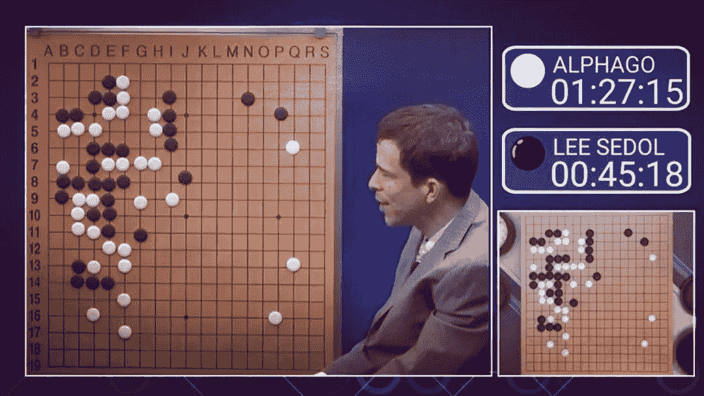*

*AlphaGo vs Lee Sedol。巴斯特·本森拍摄的照片*

*2017 年 5 月，AlphaGo 与世界排名第一的围棋选手柯洁进行了 3 场比赛，并赢得了全部 3 场比赛，之后它被中国围棋协会授予职业 9 段。*

*DNNs 已被用于许多其他领域，从图像和语音识别，到自然语言处理和金融欺诈检测。自动驾驶车辆(汽车、公共汽车、卡车)以及自主机器人(地面和无人机)都严重依赖 DNNs。癌症研究人员使用 DNNs 来检测癌细胞，DNNs 已被用于制作音乐和艺术，甚至黑白照片也使用 DNNs 重新着色。*

*但是 DNNs 可以用来创作软件吗？*

*有一些生成源代码的尝试，但我不认为这是真正必要的。我们想要的已经被 DNN 模特们完成了——DNN 模特*就是*软件。*

*让我解释一下我的意思。*

## *模型可能是软件*

*在[结构化编程](https://en.wikipedia.org/wiki/Structured_programming)中，我们使用序列、选择(if-then-else)和迭代(for，while)来描述处理数据以产生结果的规则。这些规则通常被捆绑到函数中，函数接受数据输入并产生结果。*

*DNN 模型使用多个 dnn 中的多个层(许多 dnn 由不同类型的神经网络组装而成)来做同样的事情。DNNs 使用大量数据训练模型，一旦这些模型被训练，它们可以被用于预测结果，给定新数据。这意味着 DNN 模型也是接受数据输入和产品结果的函数。事实上，DNN 模型可以近似和模仿任何函数！*

*不同之处在于，虽然结构化代码可以被跟踪和遵循，但是很难通过 DNN 模型的不同层来跟踪数据流。这是因为有太多的参数需要合理地遍历。比如[LeNet-5](http://yann.lecun.com/exdb/publis/pdf/lecun-98.pdf)(1998 年出版)，最简单的卷积神经网络(CNN)之一，[大约有 6 万个参数](/illustrated-10-cnn-architectures-95d78ace614d)。VGG-16(2014 年出版)，一个更近的 CNN 有大约 1.38 亿个参数！*

*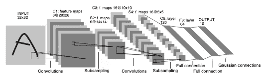*

*LeNet-5 的架构(作者:Y. LeCun，L. Bottou，Y. Bengio 和 P. Haffner:基于梯度的学习应用于文档识别，*智能信号处理，306–351，IEEE 出版社)**

*此外，训练模型的过程是随机的，因此即使我们使用相同的训练数据，层内各种节点的参数值也可能不同！*

*当然，在训练之后，dnn 是确定性的，这意味着如果你每次传递相同的数据，将会再现相同的结果。然而，许多 dnn 被设计成返回概率结果。*

*这可能会令人困惑，所以让我给你举个例子。比方说，我们设计了一个 DNN，并用大量的猫照片训练它，这样它就可以识别给定的照片中是否有猫。*

**

*这张照片里有一只猫吗？照片由 [Unsplash](https://unsplash.com/s/photos/cat?utm_source=unsplash&utm_medium=referral&utm_content=creditCopyText) 上的 [Sereja Ris](https://unsplash.com/@kimtheris?utm_source=unsplash&utm_medium=referral&utm_content=creditCopyText) 拍摄*

*接下来我们给它一张图片。DNN 模式的回报是什么？照片里有没有猫会是一个概率。*

*那么我们如何确定模型的准确性呢？我们用一大堆我们(作为人类)认为是猫的照片再次测试，看看有多少是正确的或错误的。回应的正确性再次由我们决定。我们可以说，如果概率> 80%(或者任何数字，真的)它有一只猫。*

*假设我们用 1000 多张猫的照片进行测试，这个模型有 90%的正确率。这到底意味着什么？那么，我们可以降低正确阈值，如果概率结果> 70%，这意味着它是一只猫，然后突然模型变得 95%正确。或者，如果我们用更多的照片再次训练模型，模型的正确率达到 97%。或者 85%正确，取决于照片。或者如果我们用另外一组 1000 张猫的照片，准确率是 88%。*

*我们真的不知道。结果是概率性的，尽管模型是确定性的。*

## *它是怎么做到的？*

*等等，还不止这些。我们知道像 DNN 模型这样的机器学习模型可以预测结果。但实际上我们并不知道它是如何做到的。在训练一个模型后，我们知道它会产生一定的结果，但我们不知道具体的原因。它是一个黑盒子。*

*但是如果它是确定性的，我们应该知道，对吗？*

*让我们从一个简单的例子开始。假设我们有一个数学函数`f(x,y)`，其中`x = 1`和`y = 2`接受两个数字`1`和`2`，并返回第三个数字`3`。*

*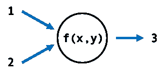*

*立即想到的函数是一个简单的加法，我们取`1`加`2`，得到`3`。但这是唯一的功能吗？实际上不是，我们不知道函数中还会发生什么，所以如果函数取`1`并加上`100`，然后加上`2`，然后减去`100`，函数仍然返回`3`。出于各种目的，我们无法区分这两者。而且这样的函数可以有无限个，只要我们接受`1`和`2`并返回`3`。*

*现在让我们假设有一个数学函数`f(d)`可以接受照片作为输入，并产生一个概率，其中是否有一只猫。就像我们前面的例子一样，可以有任意数量的这样的函数来做这件事。*

*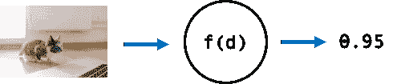*

*我们上面描述的 DNN 模型通过接受相同的输入并产生相同的输出来近似`f(d)`，但是我们实际上不知道它实际上近似哪个函数。我们也不能肯定它能复制任何功能，除非我们提供并测试有限的数据集。但是如果我们这样做了，我们就不再需要 DNN 模式了，不是吗？*

*因此，我们最终得到的是结果和规则不再确定的生成软件。这听起来完全没用，除非 DNN 模型可以逼近任何函数，并预测任何给定合适的算法，大量的处理能力和足够的数据。*

*这就是它的超能力。*

# *这一切意味着什么？*

*现在我们已经参观了一点，让我们回到我们最初的问题——机器会取代程序员吗，我们会失去工作吗？*

*据我所知，还没有任何东西取代程序员的工作。如果说有什么不同的话，那就是它加剧了对更多更好的程序员的需求。但是需要什么样的程序员呢？那不是一个直截了当的回答。*

*当前结构化和确定性的编程范例已经伴随我们很长时间了，并且在可预见的未来还将继续伴随我们。但许多新的令人兴奋的工作将在创建新的机器学习算法、管理数据管道、训练和培育模型的领域进行。*

*新的角色将会出现来处理新的概率编程范例。例如，在软件开发中，质量控制活动是整个过程的关键部分。但是你如何确保一个概率函数总是按照需要执行呢？我们如何确保照片中不会漏掉一只猫？或者说没有猫的地方有猫？*

*遗传程序和 DNN 模型是生成软件。DNN 模型是在没有源代码的情况下生成的，我们不一定理解它的规则和逻辑。这导致了我们还不知道如何解决的问题。例如，如果软件运行时出现错误，谁负责？我们如何保证它不会再次发生？这不是假设。[特斯拉的半自动自动驾驶功能被发现对致命事故负有部分责任](https://www.vox.com/recode/2020/2/26/21154502/tesla-autopilot-fatal-crashes)。*

*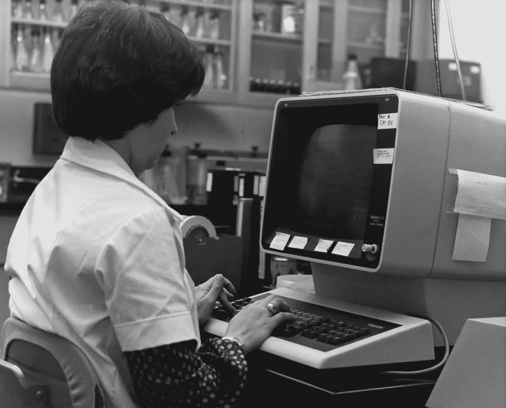*

*这张具有历史意义的 1980 年的照片拍摄于国家传染病中心(NCDC)流感检测实验室，描绘了实验室人员 Penny Gentry 坐在计算机工作站上，将数据输入流感专用数据库。[疾控中心](https://unsplash.com/@cdc?utm_source=unsplash&utm_medium=referral&utm_content=creditCopyText)在 [Unsplash](https://unsplash.com/s/photos/programming?utm_source=unsplash&utm_medium=referral&utm_content=creditCopyText) 上拍摄的照片。*

*作为程序员，我们需要导航这个新的景观并适应它。但是作为程序员，我们可能会。毕竟，我们的行业就是不断变化的。*