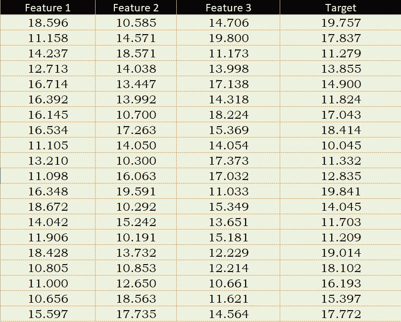
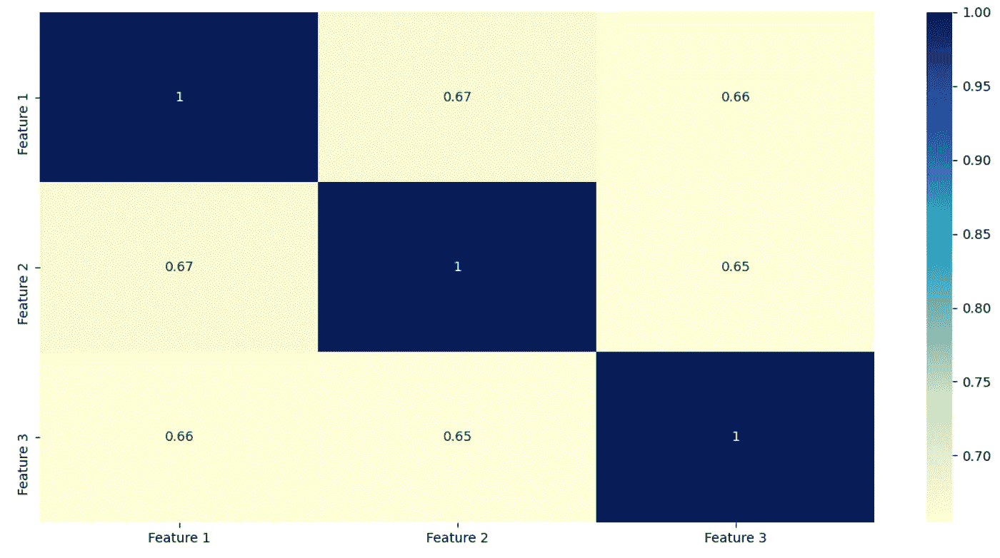
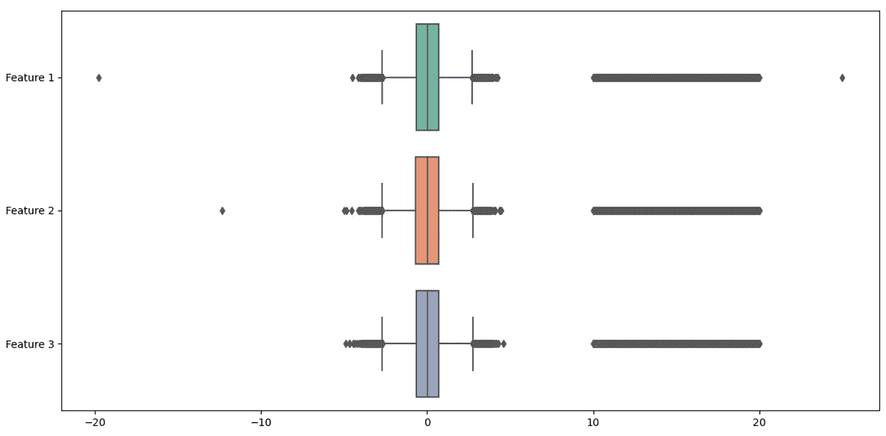
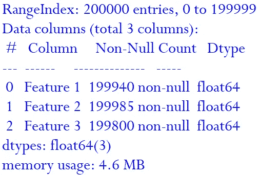
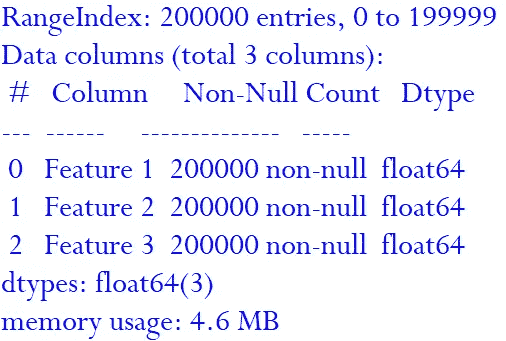
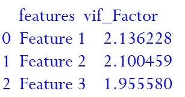
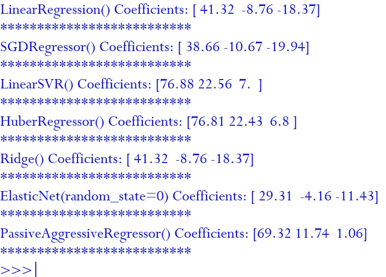
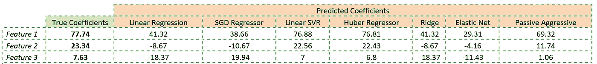

# 离群值会破坏你的机器学习预测吗？寻找最佳解决方案

> 原文：<https://towardsdatascience.com/are-outliers-ruining-your-machine-learning-predictions-search-for-an-optimal-solution-c81313e994ca?source=collection_archive---------33----------------------->

## 内部人工智能

## 在现实生活中，我们很少有正态分布数据。它是倾斜的，缺少数据点或有异常值。HuberRegressor 在 Scikit-learn 银弹吗？


威尔·梅尔斯在 [Unsplash](https://unsplash.com?utm_source=medium&utm_medium=referral) 上拍照

在数据的世界里，我们都爱高斯分布(也称为正态分布)。在现实生活中，我们很少有正态分布数据。它是倾斜的，缺少数据点或有异常值。

正如我在之前的文章中提到的，Scikit-learn 的优势无意中对其不利。机器学习开发者。经验相对较少的人在没有掌握特定算法的显著特征和局限性的情况下实现不适当的预测算法。我们已经在前面的[中看到了](/decisiontreeregressor-stop-using-for-future-projections-e27104537f6a)我们不应该使用决策树回归算法来推断数据的原因。

任何机器学习建模的成功总是始于理解将在其上训练模型的现有数据集。在开始任何建模之前，必须充分理解数据。我甚至会走到一个程度说，模型的预测精度和我们对数据的了解程度成正比。

***目标***

在本文中，我们将看到异常值对 **Scikit-learn、**中可用的各种回归算法的影响，并了解在这种情况下最适合应用的回归算法。我们将从一些理解数据的技术开始，然后用这些数据训练一些 Sklearn 算法。最后，我们将比较算法的训练结果，并学习在异常值的情况下应用的潜在最佳算法。

***训练数据集***

训练数据由 3 个特征(自变量)和 1 个目标值(因变量)的 200，000 条记录组成。特征 1、特征 2 和特征 3 的真实系数分别为 77.74、23.34 和 7.63。



训练数据— 3 个自变量和 1 个因变量

***步骤 1-*** *首先，w* e 将导入数据分析和回归所需的包。

我们将比较 HuberRegressor、LinearRegression、Ridge、SGDRegressor、ElasticNet、PassiveAggressiveRegressor 和线性支持向量回归(SVR)，因此我们将导入各自的包。

大多数时候，训练数据中很少有数据点丢失。在这种情况下，如果任何特定的要素具有高比例的空值，那么最好不要考虑该要素。否则，如果某个特征缺少一些数据点，那么要么可以从训练数据中删除这些特定的记录，要么我们可以用平均值、中值或常数值替换那些缺少的值。我们将导入 SimpleImputer 来填充缺失的值。

我们将导入方差膨胀因子来确定要素间多重共线性的严重程度。我们将需要 Matplotlib 和 seaborn 来绘制各种分析图。

```
from sklearn.linear_model import HuberRegressor,LinearRegression ,Ridge,SGDRegressor,ElasticNet,PassiveAggressiveRegressorfrom sklearn.svm import LinearSVRimport pandas as pd
from sklearn.impute import SimpleImputer
from statsmodels.stats.outliers_influence import variance_inflation_factor
import numpy as np
import matplotlib.pyplot as plt
import seaborn as sns
```

***步骤 2-*** 在下面的代码中 ***，*** 包含 200.000 条记录的训练数据从 excel 文件读入到名为“RawData”的 PandasDataframe 中。独立变量被保存到新的数据帧中。

```
RawData=pd.read_excel("Outlier Regression.xlsx")
Data=RawData.drop(["Target"], axis=1)
```

***第 3 步-*** 现在我们将开始对训练数据有所了解和理解。在我看来，热图是了解不同功能之间关系的一个很好的选择。

```
sns.heatmap(Data.corr(), cmap="YlGnBu", annot=True)
plt.show()
```

它表明，没有一个自变量(特征)是彼此密切相关的。如果你想了解更多关于回归算法的独立变量的方法和选择标准，那么请阅读我之前的文章。

[*机器学习监督算法如何识别正确的自变量？*](/how-to-identify-the-right-independent-variables-for-machine-learning-supervised-algorithms-439986562d32)



***步骤 4-*** 了解了训练数据中特征之间的相关性后，接下来我们将研究最小值、最大值、中值等。每个特征值范围的。这将有助于我们确定训练数据中是否存在任何异常值及其程度。下面的代码指示绘制所有特征的箱线图。

```
sns.boxplot(data=Data, orient="h",palette="Set2")
plt.show()
```

如果你不知道阅读盒子情节，那么请参考维基百科了解更多。特征值分布在很大的范围内，与中值有很大的差异。这证实了训练数据集中异常值的存在。



***第 5 步-*** 我们将检查训练数据中是否有空值，并在建模之前采取任何必要的措施。

```
print (Data.info())
```

在这里，我们可以看到在训练数据中总共有 200，000 条记录，并且所有三个特征都几乎没有丢失值。例如，要素 1 缺少 60 个值(200000–199940)。



***第 6 步-*** 我们使用简单估算器，用一个特征的其他记录的平均值来填充缺失值。在下面的代码中，我们同样使用了 strategy= "mean"。 **Scikit-learn** 提供不同的策略，即均值、中值、最频繁值和常数值来替换缺失值。我建议您作为学习练习，自我探索每种策略对培训模式的影响。

在下面的代码中，我们使用策略“Mean”创建了一个 SimpleImputer 实例，然后将训练数据放入其中，以计算每个特征的平均值。变换方法用于用平均值填充缺失值。

```
imputer = SimpleImputer(strategy="mean")
imputer.fit(Data)
TransformData = imputer.transform(Data)
X=pd.DataFrame(TransformData, columns=Data.columns)
```

***第 7 步-*** 在替换缺失值后，最好再次检查特征，以确保我们的训练数据集中没有任何空值。

```
print (X.info())
```

我们可以看到，现在所有特征都具有非空值，即 200，000 条记录的非空值。



***步骤 8-*** 在我们开始训练算法之前，让我们检查一下自变量中的**方差膨胀因子** ( **VIF** )。VIF 在普通最小二乘回归分析中量化了多重共线性的严重程度。它提供了一个指标来衡量估计回归系数的方差(估计值的标准差的平方)因共线性而增加的程度。我鼓励大家阅读维基百科上关于[方差膨胀因子](https://en.wikipedia.org/wiki/Variance_inflation_factor)的页面，以便更好地理解它。

```
vif = pd.DataFrame()
vif["features"] = X.columns
vif["vif_Factor"] = [variance_inflation_factor(X.values, i) for i in range(X.shape[1])]
print(vif)
```



在上面的代码中，我们计算每个自变量的 VIF 并打印出来。一般来说，我们的目标应该是自变量的 VIF 小于 10。我们在之前的热图中已经看到，没有一个变量是高度相关的，同样的情况也反映在特征的 VIF 指数中。

***第 9 步-*** 我们将从 RawData 数据帧中提取目标即因变量的值，并保存在一个数据序列中。

```
y=RawData["Target"].copy()
```

***第 10 步-*** 我们将评估各种回归因素的表现，即 HuberRegressor，LinearRegression，Ridge 和其他异常数据集。在下面的代码中，我们创建了各种回归变量的实例。

```
Huber = HuberRegressor()
Linear = LinearRegression()
SGD= SGDRegressor()
Ridge=Ridge()
SVR=LinearSVR()
Elastic=ElasticNet(random_state=0)
PassiveAggressiveRegressor= PassiveAggressiveRegressor()
```

***步骤 11-*** 我们声明了一个带有回归实例的列表，以便在以后的循环中按顺序传递它。

```
estimators = [Linear,SGD,SVR,Huber, Ridge, Elastic,PassiveAggressiveRegressor]
```

***第 12 步-*** 最后，我们会用训练数据集依次训练模型，并打印模型计算出的特征的系数。

```
for i in estimators:
    reg= i.fit(X,y)
    print(str(i)+" Coefficients:", np.round(i.coef_,2))
    print("**************************")
```



我们可以观察到不同模型根据其优化和正则化因子计算出的各种系数。特征 1 系数计算系数从 29.31 到 76.88 不等。

由于训练数据集中的一些异常值，一些模型(如线性和岭回归)预测的系数与真实系数相差甚远。Huber 回归器对异常值非常稳健，确保损失函数不会受到异常值的严重影响，同时不会像 elsen 回归器和 RANSAC 回归器那样完全忽略它们的影响。线性 SVR 在罚函数和损失函数的选择上也有更多的选择，表现优于其他模型。



***为你学习行动-*** 我们用包含离群值的训练数据集训练不同的模型，然后将预测系数与实际系数进行比较。我鼓励你们都遵循同样的方法，比较预测指标，即。用离群数据集训练的不同模型的 R2 评分、均方误差(MSE)、RMSE。

*提示* —与我们在本文中看到的系数预测准确性相比，您可能会惊讶地看到模型的 R(决定系数)回归得分函数。如果你偶然发现了什么，请随时联系我。

**关键外卖**

正如我在之前的[文章](/decisiontreeregressor-stop-using-for-future-projections-e27104537f6a)中提到的，我一直强调我们机器学习从业者的主要焦点是在开始建模之前考虑数据、预测目标、算法的优势和局限性。我们在理解训练数据上多花的每一分钟，都可以通过正确的算法直接转化为预测的准确性。我们不想用锤子拧开，用螺丝刀钉入墙壁。

如果你想了解更多关于识别机器学习监督算法的正确独立变量的结构化方法，请参考我关于这个主题的文章。

```
"""Full Code"""from sklearn.linear_model import HuberRegressor, LinearRegression ,Ridge ,SGDRegressor,  ElasticNet, PassiveAggressiveRegressor
from sklearn.svm import LinearSVR
import pandas as pd
import matplotlib.pyplot as plt
import seaborn as sns
from sklearn.impute import SimpleImputer
from sklearn.preprocessing import StandardScaler
from statsmodels.stats.outliers_influence import variance_inflation_factor
import numpy as npRawData=pd.read_excel("Outlier Regression.xlsx")
Data=RawData.drop(["Target"], axis=1)sns.heatmap(Data.corr(), cmap="YlGnBu", annot=True)
plt.show()sns.boxplot(data=Data, orient="h",palette="Set2")
plt.show()print (Data.info())print(Data.describe())imputer = SimpleImputer(strategy="mean")
imputer.fit(Data)
TransformData = imputer.transform(Data)
X=pd.DataFrame(TransformData, columns=Data.columns)
print (X.info())vif = pd.DataFrame()
vif["features"] = X.columns
vif["vif_Factor"] = [variance_inflation_factor(X.values, i) for i in range(X.shape[1])]
print(vif)
y=RawData["Target"].copy()Huber = HuberRegressor()
Linear = LinearRegression()
SGD= SGDRegressor()
Ridge=Ridge()
SVR=LinearSVR()
Elastic=ElasticNet(random_state=0)
PassiveAggressiveRegressor= PassiveAggressiveRegressor()estimators = [Linear,SGD,SVR,Huber, Ridge, Elastic,PassiveAggressiveRegressor]for i in estimators:
    reg= i.fit(X,y)
    print(str(i)+" Coefficients:", np.round(i.coef_,2))
    print("**************************")
```